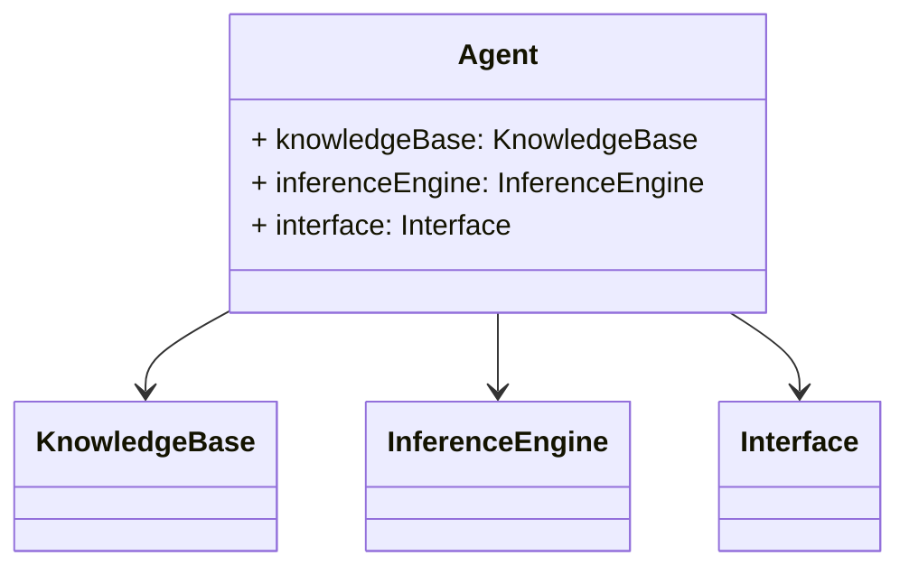

                 


# 构建AI Agent的技术栈选择指南

> 关键词：AI Agent，技术栈，系统架构，算法，项目实战

> 摘要：构建AI Agent需要选择合适的技术栈，涵盖算法、系统架构、交互设计和优化部署。本文从背景、核心概念、算法原理、系统架构、项目实战、优化与部署等方面详细探讨技术栈的选择与实现。

---

# 第一部分：AI Agent概述与背景

## 第1章：AI Agent的基本概念

### 1.1 AI Agent的定义
- AI Agent是一个能够感知环境、自主决策并执行任务的智能体。
- 典型场景包括智能助手、推荐系统、游戏AI、自动驾驶等。

### 1.2 AI Agent的核心特点
- 智能性：基于数据和算法进行推理和决策。
- 交互性：与用户或系统进行自然交互。
- 自主性：无需人工干预，自动完成任务。

### 1.3 AI Agent的应用场景
- 智能助手（如Siri、Alexa）。
- 推荐系统（如 Netflix、Amazon）。
- 游戏AI（如NPC行为控制）。
- 自动驾驶（如Tesla）。

---

## 第2章：技术栈选择的重要性

### 2.1 技术栈选择的背景
- AI Agent的复杂性要求选择合适的技术栈。
- 技术栈的选择直接影响系统的性能、可扩展性和开发效率。

### 2.2 技术栈选择的影响因素
- 任务类型：NLP、CV、推理等。
- 数据规模：结构化、非结构化。
- 性能要求：实时性、响应速度。
- 开发团队的技术栈偏好。

### 2.3 技术栈选择的挑战与机遇
- 挑战：技术栈的兼容性、性能瓶颈、维护成本。
- 机遇：开源工具、云服务、AI框架的丰富性。

---

# 第二部分：技术栈核心概念与联系

## 第3章：技术栈核心概念

### 3.1 知识库与数据源
- 知识库是AI Agent的“记忆”。
- 数据源包括结构化数据（数据库）、非结构化数据（文本、图像）。

### 3.2 推理引擎与算法
- 推理引擎负责逻辑推理。
- 算法包括基于规则的推理和基于模型的推理。

### 3.3 交互界面与用户反馈
- 交互界面是AI Agent与用户沟通的桥梁。
- 用户反馈用于优化AI Agent的行为。

### 3.4 核心概念对比表格

| 组件   | 描述                       | 示例                 |
|--------|----------------------------|----------------------|
| 知识库  | 数据存储结构               | 数据库、知识图谱       |
| 推理引擎| 负责逻辑推理               | 基于规则的推理、机器学习模型 |
| 交互界面| 用户与AI Agent的交互界面   | 自然语言、图形界面     |

### 3.5 实体关系图（ER图）
```mermaid
er
  actor(Agent)
  actor(KnowledgeBase)
  actor(ReasoningEngine)
  actor(UserInterface)
  relation(使用)
```

---

# 第三部分：算法原理讲解

## 第4章：自然语言处理算法

### 4.1 分词算法
- 基于规则的分词：使用正则表达式分割文本。
- 基于统计的分词：使用词频和上下文信息进行分词。

### 4.2 词性标注
- 使用统计模型（如HMM）或深度学习模型（如LSTM）进行词性标注。

### 4.3 句法分析
- 基于依存句法树的分析，例如使用Stanford NLP工具。

## 第5章：计算机视觉算法

### 5.1 图像识别
- 使用卷积神经网络（CNN）进行图像分类。

### 5.2 目标检测
- 使用YOLO、Faster R-CNN等目标检测算法。

### 5.3 图像分割
- 使用U-Net等模型进行图像分割。

---

# 第四部分：系统架构设计

## 第6章：系统功能设计

### 6.1 系统功能模块
- 知识库模块：负责数据的存储和检索。
- 推理引擎模块：负责逻辑推理和决策。
- 交互界面模块：负责用户与AI Agent的交互。

### 6.2 系统架构图


---

# 第五部分：项目实战

## 第7章：AI Agent项目实战

### 7.1 智能客服系统
- **项目背景**：构建一个能够处理用户咨询的智能客服。
- **环境安装**：安装Python、TensorFlow、Keras等工具。
- **核心实现**：
  1. 数据预处理：清洗和标注客服对话数据。
  2. 模型训练：使用RNN或Transformer进行文本匹配。
  3. 接口设计：RESTful API实现与前端交互。
- **代码示例**：
  ```python
  import tensorflow as tf
  model = tf.keras.Sequential([
      tf.keras.layers.Embedding(input_dim=10000, output_dim=100),
      tf.keras.layers.LSTM(64),
      tf.keras.layers.Dense(1, activation='sigmoid')
  ])
  model.compile(optimizer='adam', loss='binary_crossentropy', metrics=['accuracy'])
  model.fit(x_train, y_train, epochs=10, batch_size=32)
  ```

### 7.2 案例分析
- **问题分析**：识别用户意图，进行上下文理解。
- **解决方案**：基于预训练模型（如BERT）进行意图分类。
- **优化建议**：结合规则和模型输出，提升准确率。

---

# 第六部分：优化与部署

## 第8章：系统优化与部署

### 8.1 性能优化
- 使用缓存技术（如Redis）优化数据访问。
- 优化算法模型，降低计算复杂度。

### 8.2 系统部署
- 使用容器化技术（如Docker）部署AI Agent。
- 采用微服务架构，提升系统的可扩展性。

---

# 第七部分：总结与展望

## 第9章：总结与展望

### 9.1 总结
- 构建AI Agent需要综合考虑算法、系统架构和交互设计。
- 合适的技术栈选择能够提升系统的性能和用户体验。

### 9.2 最佳实践
- 根据任务需求选择合适的技术栈。
- 使用开源工具和框架，降低开发成本。
- 定期优化系统，提升性能和可扩展性。

### 9.3 未来展望
- 更多AI技术（如AGI）的发展将推动AI Agent的进步。
- 多模态交互将成为主流趋势。

---

# 作者

作者：AI天才研究院/AI Genius Institute  
联系邮箱：contact@aicreativity.com  
个人博客：https://blog.aicreativity.com

