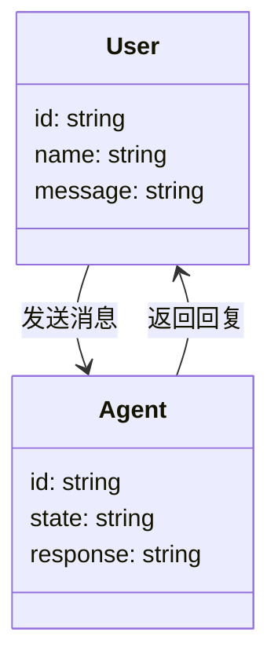
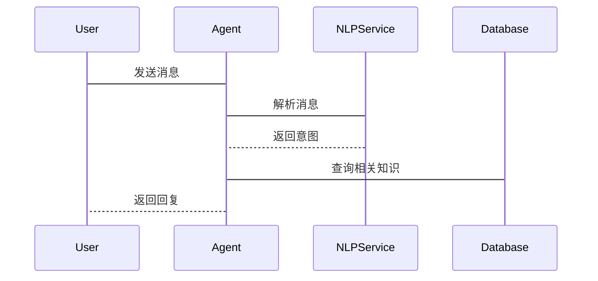

                 


# 构建AI Agent的技术栈选择：权衡与决策

## 关键词：AI Agent，技术栈选择，权衡，决策，系统架构，算法原理，项目实战

## 摘要：  
在AI技术迅速发展的今天，构建一个高效的AI Agent需要做出许多技术栈选择。本文将从AI Agent的基本概念出发，分析其核心模块与技术原理，探讨算法的选择与优化，设计系统的架构方案，并通过实际案例展示技术栈的选择与实现。通过本文，读者可以全面了解AI Agent的技术栈选择过程，并掌握如何在实际项目中进行权衡与决策。

---

# 第一部分: 构建AI Agent的技术栈选择概述

# 第1章: AI Agent的基本概念与问题背景

## 1.1 AI Agent的定义与核心概念

### 1.1.1 AI Agent的定义  
AI Agent（人工智能代理）是指能够感知环境、自主决策并执行任务的智能实体。它通过与环境交互，完成特定目标，例如问题求解、数据分析、自动化操作等。

### 1.1.2 AI Agent的核心属性与特征  
- **自主性**：能够自主决策，无需外部干预。  
- **反应性**：能够实时感知环境并做出反应。  
- **目标导向性**：基于目标驱动行为。  
- **学习能力**：能够通过经验改进性能。  

### 1.1.3 AI Agent的分类与应用场景  
- **简单反射型Agent**：基于规则直接响应输入。  
- **基于模型的反射型Agent**：通过内部模型推理决策。  
- **目标驱动型Agent**：根据目标选择最优行动。  
- **效用驱动型Agent**：通过最大化效用来做出决策。  

### 1.1.4 AI Agent的边界与外延  
AI Agent的核心是“智能”，其边界包括感知、决策和执行三个模块，外延则涉及数据源、环境接口和用户交互。

---

## 1.2 AI Agent技术栈选择的背景与问题

### 1.2.1 当前AI技术发展的现状  
- AI技术快速发展，算法种类繁多。  
- 计算能力的提升使得复杂模型得以实现。  
- 企业级AI应用需求日益增长。  

### 1.2.2 AI Agent技术栈选择的挑战  
- 算法选择：强化学习 vs 监督学习 vs 贝叶斯推理。  
- 数据处理：结构化数据 vs 非结构化数据。  
- 系统架构：单体架构 vs 微服务架构。  

### 1.2.3 企业级AI Agent开发的痛点与需求  
- 开发效率：快速迭代与部署。  
- 系统性能：高并发与低延迟。  
- 可扩展性：适应业务需求的变化。  

---

## 1.3 技术栈选择的核心问题

### 1.3.1 技术栈选择的关键因素  
- **算法性能**：算法的准确性和效率。  
- **数据处理能力**：数据量和数据类型的支持。  
- **系统架构**：模块化设计和扩展性。  

### 1.3.2 技术栈选择的决策模型  
- 基于性能的决策模型：优先选择性能最优的技术。  
- 基于成本的决策模型：权衡性能与开发成本。  

### 1.3.3 技术栈选择的权衡策略  
- **性能优先**：选择高效的算法和工具。  
- **成本优先**：选择易用且免费的开源工具。  
- **扩展性优先**：选择模块化设计的技术栈。  

---

## 1.4 本章小结  
本章介绍了AI Agent的基本概念，分析了技术栈选择的背景与挑战，并提出了技术栈选择的核心问题和权衡策略。下一章将深入探讨AI Agent的核心模块与技术原理。

---

# 第二部分: AI Agent的核心概念与技术原理

# 第2章: AI Agent的核心模块与技术原理

## 2.1 AI Agent的感知模块

### 2.1.1 感知模块的功能与实现  
感知模块负责从环境中获取信息，通常包括数据采集、数据预处理和特征提取。  

#### 2.1.1.1 数据采集  
- 数据源：数据库、API、传感器等。  
- 数据类型：结构化数据、文本、图像、语音等。  

#### 2.1.1.2 数据预处理  
- 数据清洗：去噪、去重、填充缺失值。  
- 数据转换：归一化、标准化、分词等。  

#### 2.1.1.3 特征提取  
- 使用PCA（主成分分析）降低维度。  
- 使用词袋模型或TF-IDF提取文本特征。  

---

### 2.1.2 感知模块的算法选择  
- **监督学习**：适用于分类和回归任务。  
- **无监督学习**：适用于聚类和降维任务。  
- **强化学习**：适用于动态环境中的决策任务。  

---

## 2.2 AI Agent的决策模块

### 2.2.1 决策模块的功能与实现  
决策模块基于感知到的信息，通过算法选择最优行动。  

#### 2.2.1.1 决策算法  
- **强化学习**：通过试错学习最优策略。  
- **监督学习**：基于历史数据预测最优行动。  
- **贝叶斯推理**：基于概率计算做出决策。  

#### 2.2.1.2 决策流程  
1. 状态识别：分析当前环境状态。  
2. 行动选择：基于算法计算出最优行动。  
3. 行动验证：评估行动的可行性。  

---

## 2.3 AI Agent的执行模块

### 2.3.1 执行模块的功能与实现  
执行模块负责将决策转化为实际操作，通常包括任务调度和结果反馈。  

#### 2.3.1.1 任务调度  
- 使用队列或任务队列管理执行任务。  
- 支持并行执行以提高效率。  

#### 2.3.1.2 结果反馈  
- 收集执行结果并反馈给感知模块。  
- 根据结果调整后续决策。  

---

## 2.4 核心模块之间的关系与协作

### 2.4.1 感知、决策、执行模块的协作流程  
1. 感知模块采集环境数据并进行预处理。  
2. 决策模块基于预处理后的数据做出决策。  
3. 执行模块根据决策执行任务并反馈结果。  

---

## 2.5 本章小结  
本章详细介绍了AI Agent的核心模块，包括感知、决策和执行模块的功能、实现和技术原理。下一章将探讨AI Agent的算法原理与系统架构设计。

---

# 第三部分: AI Agent的算法原理与系统架构

# 第3章: AI Agent的算法原理

## 3.1 强化学习算法

### 3.1.1 Q-Learning算法

#### 3.1.1.1 算法流程  
1. 初始化Q表，所有状态-动作对的Q值初始化为0。  
2. 进入初始状态s。  
3. 选择动作a（探索或利用）。  
4. 执行动作a，观察新状态s'和奖励r。  
5. 更新Q表：$Q(s,a) = Q(s,a) + \alpha (r + \gamma \max Q(s',a'))$。  

#### 3.1.1.2 算法优缺点  
- 优点：适用于离线学习，简单易实现。  
- 缺点：需要大量试验，可能陷入局部最优。  

---

## 3.2 监督学习算法

### 3.2.1 线性回归算法

#### 3.2.1.1 算法流程  
1. 收集训练数据，包括特征和标签。  
2. 初始化模型参数。  
3. 训练模型：最小化预测值与真实值的误差。  
4. 预测新数据。  

---

## 3.3 贝叶斯推理算法

### 3.3.1 贝叶斯网络

#### 3.3.1.1 算法流程  
1. 构建贝叶斯网络的结构。  
2. 训练网络参数。  
3. 推理概率分布。  

---

## 3.4 本章小结  
本章介绍了AI Agent中常用的算法，包括强化学习、监督学习和贝叶斯推理。下一章将探讨AI Agent的系统架构设计。

---

# 第四部分: AI Agent的系统架构与实现

# 第4章: AI Agent的系统架构设计

## 4.1 项目背景与目标

### 4.1.1 项目背景  
- 开发一个智能客服AI Agent，用于处理用户咨询。  
- 系统需求：实时响应、多轮对话、意图识别。  

---

## 4.2 系统功能设计

### 4.2.1 领域模型设计  


---

## 4.3 系统架构设计

### 4.3.1 分层架构  


---

## 4.4 系统接口设计

### 4.4.1 API接口设计  
- `/api/v1/agent/message`：接收用户消息，返回Agent回复。  
- `/api/v1/agent/state`：获取Agent当前状态。  

---

## 4.5 系统交互设计

### 4.5.1 交互流程  



---

## 4.6 本章小结  
本章详细设计了AI Agent的系统架构，包括项目背景、功能设计、架构设计和接口设计。下一章将通过实际案例展示技术栈的选择与实现。

---

# 第五部分: AI Agent的项目实战

# 第5章: AI Agent的项目实战

## 5.1 项目环境安装

### 5.1.1 安装Python环境  
```bash
python --version
pip install --upgrade pip
```

### 5.1.2 安装依赖包  
```bash
pip install numpy pandas scikit-learn
```

---

## 5.2 系统核心实现

### 5.2.1 NLPService实现  
```python
class NLPService:
    def __init__(self):
        self.model = self._load_model()

    def _load_model(self):
        # 加载预训练模型
        pass

    def process_message(self, message):
        # 处理用户消息，返回意图
        pass
```

### 5.2.2 Agent实现  
```python
class Agent:
    def __init__(self):
        self.state = "idle"
        self.nlp_service = NLPService()

    def handle_message(self, message):
        intent = self.nlp_service.process_message(message)
        self.state = "processing"
        # 根据意图执行相应操作
        pass
```

---

## 5.3 代码实现与分析

### 5.3.1 环境数据采集  
```python
import pandas as pd

def load_data():
    data = pd.read_csv("messages.csv")
    return data
```

### 5.3.2 模型训练  
```python
from sklearn.linear_model import LogisticRegression

def train_model(X, y):
    model = LogisticRegression()
    model.fit(X, y)
    return model
```

---

## 5.4 项目小结  
本章通过实际案例展示了AI Agent的技术栈选择与实现，包括环境安装、核心代码实现和案例分析。读者可以通过本章掌握AI Agent的开发流程。

---

# 第六部分: 总结与展望

# 第6章: 最佳实践与小结

## 6.1 最佳实践

### 6.1.1 技术选择  
- 根据需求选择合适的算法。  
- 使用开源库提高开发效率。  

### 6.1.2 系统设计  
- 模块化设计便于维护。  
- 使用异步处理提高性能。  

---

## 6.2 小结  
本文从AI Agent的基本概念出发，分析了其核心模块与技术原理，探讨了算法的选择与优化，设计了系统的架构方案，并通过实际案例展示了技术栈的选择与实现。读者通过本文可以全面了解AI Agent的技术栈选择过程，并掌握如何在实际项目中进行权衡与决策。

---

## 6.3 注意事项

### 6.3.1 数据安全  
处理用户数据时，需遵守相关法律法规，保护用户隐私。  

### 6.3.2 系统性能  
优化算法和架构设计，确保系统高效运行。  

---

## 6.4 拓展阅读

### 6.4.1 推荐书籍  
- 《机器学习实战》  
- 《深入理解深度学习》  

### 6.4.2 推荐博客  
- Medium上的AI技术分享  
- Towards Data Science的AI文章  

---

## 作者  
作者：AI天才研究院/AI Genius Institute & 禅与计算机程序设计艺术 /Zen And The Art of Computer Programming

