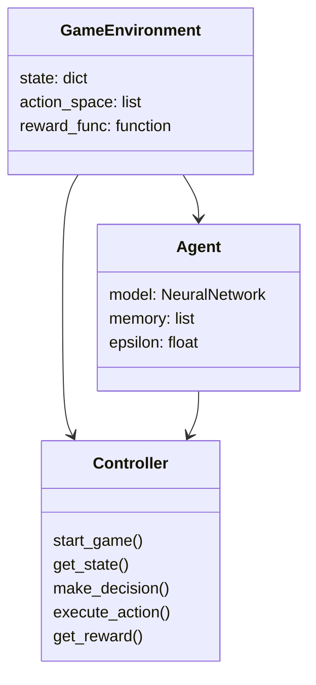
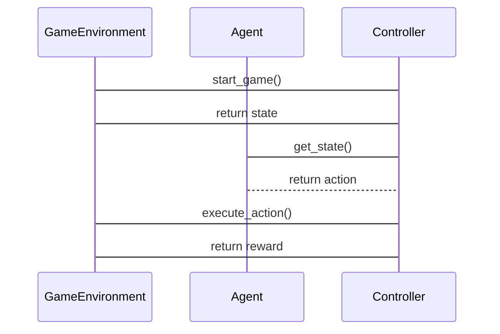

                 


# 构建AI Agent的敏捷开发流程

## 关键词：AI Agent，敏捷开发，人工智能，软件开发，系统架构

## 摘要：本文深入探讨了在AI Agent开发中应用敏捷开发流程的方法。通过分析AI Agent的核心概念、算法原理、系统架构和项目实战，本文展示了如何在AI Agent的构建过程中采用敏捷开发策略，以提高开发效率和产品质量。文章还提供了详细的代码示例、系统设计图和实际案例，帮助读者更好地理解和应用这些方法。

---

# 第一部分：AI Agent与敏捷开发概述

## 第1章：AI Agent与敏捷开发概述

### 1.1 AI Agent的基本概念

#### 1.1.1 AI Agent的定义与核心要素
AI Agent（人工智能代理）是一种能够感知环境并采取行动以实现特定目标的智能实体。它通常由以下几个核心要素组成：
1. **感知能力**：通过传感器或其他输入方式获取环境信息。
2. **推理能力**：基于获取的信息进行分析和推理，得出行动方案。
3. **决策能力**：根据推理结果选择最优或合适的行为。
4. **执行能力**：通过执行机构或接口将决策转化为实际行动。

#### 1.1.2 AI Agent的类型与应用场景
AI Agent可以分为以下几种类型：
1. **简单反射型**：基于预定义规则直接响应输入。
2. **基于模型的反应型**：利用环境模型进行推理和决策。
3. **目标驱动型**：根据目标选择行动。
4. **实用驱动型**：根据效用函数优化决策。

应用场景包括：
- 自动化交易
- 智能客服
- 自动驾驶
- 游戏AI

#### 1.1.3 敏捷开发的基本概念与特点
敏捷开发是一种以迭代、增量的方式进行软件开发的方法，强调快速响应变化、持续交付价值和团队协作。其特点包括：
- 迭代开发：分阶段交付，逐步完善。
- 用户参与：与客户密切合作，确保需求符合预期。
- 自我调整：根据反馈快速调整开发方向。

### 1.2 敏捷开发在AI Agent中的重要性
#### 1.2.1 敏捷开发与传统开发的对比
传统开发方法通常采用瀑布模型，需求明确后按部就班地进行设计、开发和测试。而敏捷开发更注重灵活性和快速响应，适用于需求频繁变化的场景，如AI Agent开发。

#### 1.2.2 AI Agent开发中的敏捷方法
在AI Agent开发中，敏捷方法体现在以下几个方面：
1. **迭代开发**：分阶段开发，逐步优化模型。
2. **持续集成**：频繁集成代码，及时发现并修复问题。
3. **持续交付**：定期向用户交付可用的版本。

#### 1.2.3 敏捷开发对AI Agent效率的提升
通过敏捷开发，AI Agent团队可以更快地响应用户反馈，及时调整模型，缩短开发周期，提高产品质量。

### 1.3 当前AI Agent开发的现状与挑战
#### 1.3.1 现有AI Agent开发的主要问题
1. **需求不明确**：AI Agent的目标可能模糊，导致开发方向错误。
2. **复杂性高**：涉及多领域知识，开发难度大。
3. **数据依赖**：高度依赖数据质量，数据不足时性能受限。

#### 1.3.2 敏捷开发在AI Agent中的应用现状
目前，部分AI Agent项目已经开始采用敏捷方法，但整体应用仍不广泛，主要原因是团队对敏捷方法的理解不足和传统开发惯性。

#### 1.3.3 未来AI Agent开发的趋势与方向
未来，随着AI技术的发展和敏捷方法的推广，AI Agent开发将更加注重灵活性和快速响应，更多项目将采用敏捷开发模式。

### 1.4 本章小结
本章介绍了AI Agent的基本概念、类型、应用场景以及敏捷开发的基本概念和重要性，分析了当前AI Agent开发的现状与挑战，并展望了未来的发展趋势。

---

# 第二部分：AI Agent的核心概念与技术

## 第2章：AI Agent的核心原理

### 2.1 AI Agent的核心原理
#### 2.1.1 AI Agent的基本工作原理
AI Agent通过感知环境、分析信息、制定决策并执行行动来实现目标。其工作流程如下：
1. **感知环境**：获取环境数据。
2. **分析信息**：通过算法处理数据，识别模式。
3. **制定决策**：基于分析结果选择行动。
4. **执行行动**：将决策转化为具体行动。

#### 2.1.2 AI Agent的感知与决策机制
AI Agent的感知机制包括传感器和API接口，决策机制则基于机器学习模型和规则引擎。

#### 2.1.3 AI Agent的执行与反馈循环
AI Agent在执行行动后，会根据反馈调整后续行为，形成一个闭环系统。

### 2.2 AI Agent的关键技术
#### 2.2.1 机器学习在AI Agent中的应用
机器学习用于训练AI Agent的决策模型，如分类、回归和聚类。

#### 2.2.2 自然语言处理在AI Agent中的应用
NLP技术用于处理和理解文本，如智能客服中的语义理解。

#### 2.2.3 强化学习在AI Agent中的应用
强化学习用于训练AI Agent在复杂环境中的决策能力，如游戏AI和自动驾驶。

### 2.3 AI Agent与相关技术的对比
#### 2.3.1 AI Agent与传统自动化系统的对比
| 特性 | AI Agent | 传统自动化系统 |
|------|-----------|----------------|
| 决策能力 | 强大 | 有限 |
| 学习能力 | 有 | 无 |

#### 2.3.2 AI Agent与规则引擎的对比
AI Agent可以根据环境动态调整行为，而规则引擎基于固定的规则执行操作。

#### 2.3.3 AI Agent与专家系统的对比
AI Agent能够处理实时信息并采取行动，而专家系统主要用于知识推理。

### 2.4 本章小结
本章详细讲解了AI Agent的核心原理和关键技术，分析了其与相关技术的区别。

---

# 第三部分：敏捷开发流程中的AI Agent构建

## 第3章：敏捷开发方法在AI Agent中的应用

### 3.1 敏捷开发方法的核心原则
#### 3.1.1 用户故事与需求优先级
将需求转化为用户故事，并根据优先级排序。

#### 3.1.2 迭代开发与持续交付
采用迭代开发模式，每轮交付一个可用的版本。

#### 3.1.3 团队协作与持续反馈
强调团队协作，通过持续反馈优化开发过程。

### 3.2 AI Agent开发中的敏捷实践
#### 3.2.1 敏捷方法在AI Agent需求分析中的应用
通过用户故事和优先级排序明确需求。

#### 3.2.2 敏捷方法在AI Agent设计中的应用
采用增量设计，逐步完善系统架构。

#### 3.2.3 敏捷方法在AI Agent测试中的应用
实施持续集成和自动化测试，确保代码质量。

### 3.3 系统架构设计与实现

#### 3.3.1 项目介绍
项目目标是开发一个基于强化学习的棋类AI Agent。

#### 3.3.2 系统功能设计（领域模型）


#### 3.3.3 系统架构设计


#### 3.3.4 系统接口设计
- **start_game()**: 初始化游戏。
- **get_state()**: 获取当前状态。
- **make_decision()**: 生成决策。
- **execute_action()**: 执行动作。
- **get_reward()**: 获取奖励。

#### 3.3.5 系统交互设计


### 3.4 项目实战

#### 3.4.1 环境安装
安装Python和必要的库：
```bash
pip install numpy tensorflow matplotlib
```

#### 3.4.2 核心代码实现
```python
import numpy as np
import tensorflow as tf

class DQN:
    def __init__(self, state_dim, action_dim, learning_rate):
        self.state_dim = state_dim
        self.action_dim = action_dim
        self.lr = learning_rate
        self.model = self.build_model()
    
    def build_model(self):
        model = tf.keras.Sequential([
            tf.keras.layers.Dense(64, activation='relu', input_dim=self.state_dim),
            tf.keras.layers.Dense(self.action_dim)
        ])
        model.compile(optimizer=tf.keras.optimizers.Adam(self.lr), loss='mse')
        return model
    
    def predict(self, state):
        return self.model.predict(state)
    
    def train(self, states, targets):
        self.model.fit(states, targets, epochs=1, verbose=0)
```

#### 3.4.3 案例分析与代码解读
- **DQN类**：实现深度Q网络，用于训练AI Agent。
- **predict方法**：根据当前状态预测行动。
- **train方法**：利用经验回放训练模型。

#### 3.4.4 项目小结
本项目展示了敏捷开发在AI Agent中的应用，通过迭代开发和持续集成，快速实现了一个简单的棋类AI Agent。

### 3.5 最佳实践与注意事项
1. **持续集成**：频繁集成代码，及时发现和修复问题。
2. **自动化测试**：确保代码质量，减少人工测试成本。
3. **团队协作**：强调沟通与合作，确保开发方向一致。

### 3.6 本章小结
本章详细讲解了敏捷开发方法在AI Agent中的具体应用，通过案例分析展示了敏捷开发的优势和实际效果。

---

# 第四部分：最佳实践与小结

## 第4章：总结与展望

### 4.1 全文总结
本文探讨了AI Agent的核心概念、算法原理和敏捷开发流程，展示了如何在AI Agent开发中应用敏捷方法，以提高开发效率和产品质量。

### 4.2 最佳实践 tips
- **需求优先级排序**：明确需求优先级，避免资源浪费。
- **持续集成**：采用持续集成和自动化测试，确保代码质量。
- **团队协作**：加强团队协作，确保开发方向一致。

### 4.3 展望未来
随着AI技术的发展和敏捷方法的推广，AI Agent开发将更加注重灵活性和快速响应，更多项目将采用敏捷开发模式。

### 4.4 小结
敏捷开发在AI Agent开发中具有重要意义，通过本文的分析和案例，读者可以更好地理解和应用这些方法。

---

# 作者
作者：AI天才研究院 & 禅与计算机程序设计艺术

---

以上是文章的详细目录和部分章节内容。接下来，我将根据这个大纲撰写完整的技术博客文章。

