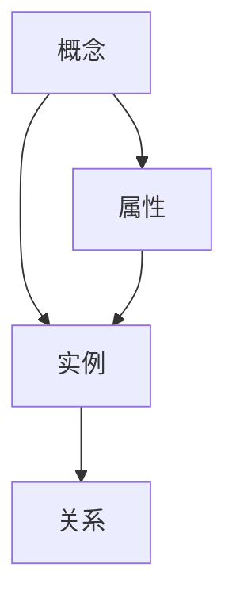
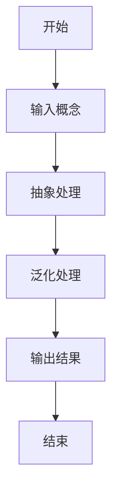
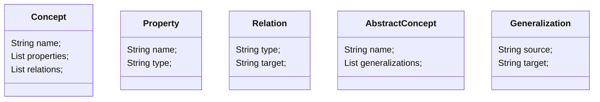
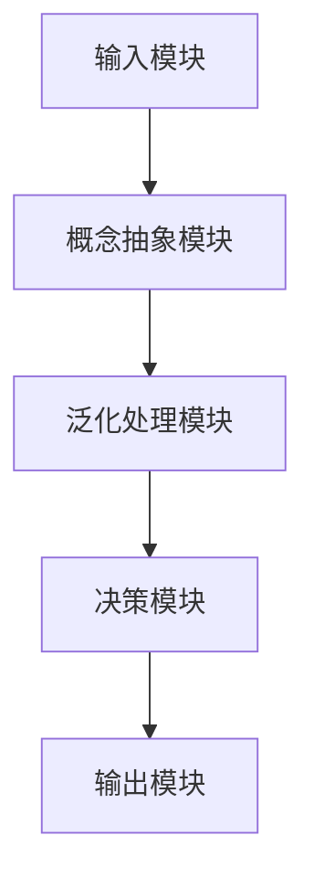
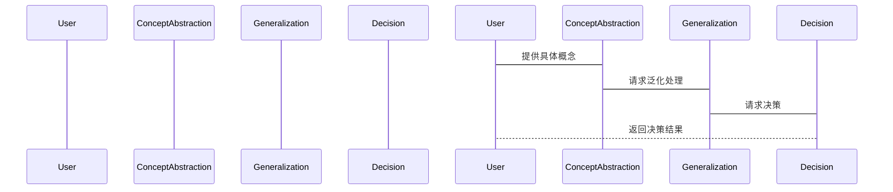

                 


# 《构建AI Agent的概念抽象与泛化能力》

---

## 关键词：
- AI Agent
- 概念抽象
- 泛化能力
- 系统架构
- 项目实战
- 算法原理
- 人工智能

---

## 摘要：
本文旨在深入探讨AI Agent的概念抽象与泛化能力的核心原理，通过系统化的分析与实践，揭示AI Agent在不同场景中的应用价值。文章从AI Agent的背景与概念出发，详细解析其核心算法原理，结合实际项目案例，展示如何通过系统架构设计与代码实现，构建具备强大概念抽象与泛化能力的AI Agent。最后，本文总结了AI Agent构建的关键要点，并提出了未来研究与实践的方向。

---

# 第1章: AI Agent的背景与概念

## 1.1 问题背景与描述
### 1.1.1 人工智能与智能体的基本概念
- AI Agent的定义与分类
- 智能体在AI系统中的角色与作用

### 1.1.2 当前AI Agent应用的现状与挑战
- AI Agent在各个领域的应用实例
- 概念抽象与泛化能力的重要性

### 1.1.3 概念抽象与泛化能力的边界与范围
- 概念抽象的定义与实现方式
- 泛化能力的定义与衡量标准

## 1.2 AI Agent的核心问题与目标
### 1.2.1 AI Agent的核心问题
- 如何实现概念的抽象与表达
- 如何提升AI Agent的泛化能力

### 1.2.2 概念结构与核心要素
- 概念的层次化特征
- 概念的可扩展性特征
- 概念的关联性特征

## 1.3 本章小结
- 本章总结了AI Agent的背景与核心概念
- 强调了概念抽象与泛化能力的重要性

---

# 第2章: AI Agent的核心概念与联系

## 2.1 核心概念的原理分析
### 2.1.1 概念抽象的基本原理
- 从具体实例中提取抽象概念的方法
- 概念层次化与可扩展性的实现机制

### 2.1.2 泛化能力的实现机制
- 泛化的定义与实现方式
- 泛化能力与概念抽象的关系

### 2.1.3 AI Agent的感知与决策过程
- 感知层的概念提取
- 决策层的概念应用

## 2.2 概念属性特征对比
### 2.2.1 概念的层次化特征
- 概念的层次化结构与分类
- 概念层次化在AI Agent中的应用

### 2.2.2 概念的可扩展性特征
- 概念扩展的方法与实现
- 可扩展性对AI Agent泛化能力的影响

### 2.2.3 概念的关联性特征
- 概念之间的关联关系
- 关联性对AI Agent决策的影响

## 2.3 ER实体关系图架构


## 2.4 本章小结
- 本章详细分析了AI Agent的核心概念与联系
- 展示了概念层次化、可扩展性与关联性对AI Agent泛化能力的影响

---

# 第3章: AI Agent的算法原理

## 3.1 算法原理概述
### 3.1.1 概念抽象的算法选择
- 基于层次化的概念提取算法
- 基于图结构的概念关联算法

### 3.1.2 泛化能力的算法实现
- 基于逻辑推理的泛化算法
- 基于机器学习的泛化算法

### 3.1.3 AI Agent的核心算法框架
- 概念抽象与泛化的整体框架
- 算法的输入与输出定义

## 3.2 算法实现的数学模型
### 3.2.1 概念抽象的数学表达
$$C = \{c_1, c_2, ..., c_n\}$$
- 每个$c_i$表示一个抽象概念

### 3.2.2 泛化能力的数学模型
$$G = f(C)$$
- $G$表示泛化结果，$f$表示泛化函数

### 3.2.3 AI Agent决策的数学公式
$$D = argmax_{a}(P(a|C))$$
- $D$表示最优决策，$P(a|C)$表示在概念$C$下的决策概率

## 3.3 算法实现的Python代码
```python
def abstract_concept(concepts):
    # 概念抽象算法实现
    abstracted_concepts = []
    for concept in concepts:
        # 假设我们使用层次化方法提取抽象概念
        abstracted_concepts.append(concept['abstract'])
    return abstracted_concepts

def generalize(concept):
    # 泛化能力算法实现
    # 假设我们使用逻辑推理方法进行泛化
    generalized_concept = concept['generalized']
    return generalized_concept
```

## 3.4 算法流程图


## 3.5 本章小结
- 本章详细讲解了AI Agent的核心算法原理
- 展示了概念抽象与泛化能力的数学模型与实现方法

---

# 第4章: AI Agent的系统分析与架构设计

## 4.1 问题场景介绍
### 4.1.1 项目背景
- 项目目标与范围
- 项目需求分析

### 4.1.2 项目介绍
- 项目名称
- 项目目标
- 项目团队

## 4.2 系统功能设计
### 4.2.1 领域模型设计


### 4.2.2 系统架构设计


### 4.2.3 接口设计
- 概念输入接口
- 概念输出接口
- 泛化结果接口

### 4.2.4 交互序列图


## 4.3 本章小结
- 本章通过系统分析与架构设计，展示了AI Agent的概念抽象与泛化能力在实际系统中的实现
- 展示了系统架构的各个模块及其交互关系

---

# 第5章: 项目实战

## 5.1 环境安装
### 5.1.1 开发环境要求
- Python 3.8+
- Mermaid图库
- Python机器学习库（如scikit-learn）

### 5.1.2 依赖安装
```bash
pip install mermaid-docker
pip install scikit-learn
```

## 5.2 系统核心实现
### 5.2.1 概念抽象模块实现
```python
from sklearn.feature_extraction.text import TfidfVectorizer
from sklearn.cluster import KMeans

def abstract_concept(texts):
    vectorizer = TfidfVectorizer()
    X = vectorizer.fit_transform(texts)
    km = KMeans(n_clusters=3)
    km.fit(X)
    return km.labels_
```

### 5.2.2 泛化能力模块实现
```python
from sklearn.linear_model import LogisticRegression

def generalize(concepts, labels):
    model = LogisticRegression()
    model.fit(concepts, labels)
    return model.predict(concepts)
```

## 5.3 代码应用解读与分析
### 5.3.1 概念抽象模块解读
- 使用TF-IDF进行文本向量化
- 使用K-means进行概念聚类

### 5.3.2 泛化能力模块解读
- 使用逻辑回归进行概念分类
- 泛化能力的实现与评估

## 5.4 案例分析与详细讲解
### 5.4.1 案例背景
- 假设我们有一个电商领域的概念库
- 包括商品、用户、订单等具体概念

### 5.4.2 案例分析
- 使用TF-IDF提取商品概念的特征
- 使用K-means进行商品概念的聚类
- 使用逻辑回归进行商品概念的泛化分类

## 5.5 项目总结
- 本项目展示了AI Agent的概念抽象与泛化能力的实现过程
- 展示了如何通过机器学习算法实现概念的抽象与泛化

---

# 第6章: 最佳实践与小结

## 6.1 本章小结
- 本文详细讲解了AI Agent的概念抽象与泛化能力
- 展示了如何通过系统架构设计与代码实现，构建具备强大概念抽象与泛化能力的AI Agent

## 6.2 最佳实践 tips
- 在概念抽象过程中，建议使用层次化方法与关联分析
- 在泛化能力实现中，推荐使用逻辑回归与决策树算法
- 在系统架构设计中，建议采用模块化设计与松耦合架构

## 6.3 注意事项
- 概念抽象与泛化能力的实现需要结合具体场景进行调整
- 系统架构设计需要充分考虑可扩展性与可维护性
- 项目实施过程中需要注重数据质量与算法性能

## 6.4 拓展阅读
- 推荐阅读《机器学习实战》
- 推荐阅读《人工智能：一种现代方法》

---

# 作者：
AI天才研究院/AI Genius Institute  
禅与计算机程序设计艺术 /Zen And The Art of Computer Programming

