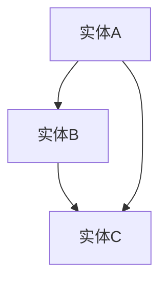
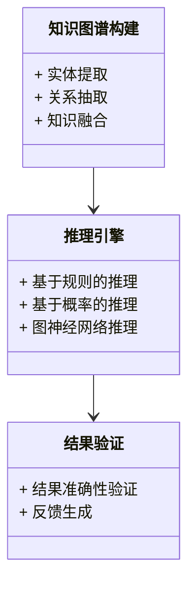

                 


# 构建AI Agent的知识图谱推理引擎优化

## 关键词：知识图谱、AI Agent、推理引擎、优化、图神经网络

## 摘要：  
本文详细探讨了构建AI Agent的知识图谱推理引擎优化的关键技术。首先，介绍了知识图谱和AI Agent的基本概念及其重要性。接着，分析了知识图谱推理引擎的核心概念、算法原理和系统架构设计。然后，通过实际项目实战展示了如何优化推理引擎的性能。最后，总结了最佳实践和未来发展方向，为读者提供了一套完整的优化方案。

---

# 第一部分: 知识图谱与AI Agent概述

## 第1章: 知识图谱与AI Agent基础

### 1.1 知识图谱的定义与特点  
知识图谱是一种用于表示实体及其关系的结构化数据模型。它通过将实体和关系显式地表示出来，形成一个巨大的网络，能够帮助AI系统理解和推理复杂的信息。  

#### 知识图谱的核心特点：
- **结构化**：实体和关系以结构化的方式组织，便于计算机处理。
- **语义丰富**：通过关系描述，可以表达复杂的语义信息。
- **可扩展性**：支持大规模数据的构建和扩展。

### 1.2 AI Agent的基本概念  
AI Agent是一种智能体，能够感知环境、自主决策并执行任务。它广泛应用于推荐系统、问答系统、自动驾驶等领域。  

#### AI Agent的核心功能：
- **感知**：通过传感器或数据源获取信息。
- **推理**：基于知识图谱进行逻辑推理。
- **决策**：根据推理结果做出最优决策。

### 1.3 知识图谱推理引擎的定义与作用  
知识图谱推理引擎是AI Agent的核心组件，负责根据知识图谱中的实体和关系进行推理，为智能决策提供支持。

#### 推理引擎的优化目标：
- **效率**：提高推理速度，降低计算资源消耗。
- **准确性**：确保推理结果的正确性。
- **可扩展性**：支持大规模数据和复杂查询。

---

# 第二部分: 知识图谱推理引擎的核心概念

## 第2章: 知识图谱与AI Agent的核心概念

### 2.1 知识图谱的实体与关系  
知识图谱中的实体可以是人、地点、组织等，而关系则是连接实体之间的纽带。

#### 实体关系的Mermaid图：


#### 实体关系的属性对比表：
| 实体 | 关系 | 属性 |
|------|------|------|
| A    | B    | 类型：1对多 |
| B    | C    | 类型：1对1 |

### 2.2 AI Agent的知识需求  
AI Agent需要知识图谱提供语义信息，以便进行推理和决策。

#### 知识图谱在AI Agent中的应用：
- **问答系统**：基于知识图谱提供准确的答案。
- **推荐系统**：根据实体关系推荐相关内容。
- **对话系统**：通过推理生成连贯的对话。

### 2.3 知识图谱推理引擎的核心功能  
推理引擎需要支持多种推理方式，包括基于规则、概率推理和图神经网络。

---

# 第三部分: 知识图谱推理算法原理

## 第3章: 知识图谱推理算法概述

### 3.1 基于规则的推理算法  
基于规则的推理通过预定义的规则进行推理，简单易懂但灵活性较低。

#### 基于规则的推理实现：
1. 定义规则：例如，如果A是B的父亲，且B是C的父亲，则A是C的祖父。
2. 应用规则：在知识图谱中查找满足规则的实例。

### 3.2 基于概率的推理算法  
基于概率的推理考虑实体关系的概率分布，能够处理不确定性问题。

#### 基于概率的推理原理：
- 使用概率论计算实体关系的概率。
- 例如，使用贝叶斯网络进行推理。

### 3.3 基于图神经网络的推理算法  
图神经网络通过学习图结构中的特征，能够捕捉复杂的语义信息。

#### 图神经网络的推理实现：
1. 将知识图谱转化为图结构。
2. 使用图神经网络进行特征学习和推理。

---

# 第四部分: 系统分析与架构设计

## 第4章: 系统架构设计

### 4.1 问题场景介绍  
AI Agent需要在大规模知识图谱上进行高效的推理。

### 4.2 系统功能设计  
- **知识图谱构建**：包括实体提取、关系抽取和知识融合。
- **推理引擎优化**：包括算法优化和性能调优。
- **结果验证与反馈**：验证推理结果的准确性并提供反馈。

#### 系统功能的Mermaid类图：


### 4.3 系统架构设计  
- **分层架构**：包括数据层、计算层和应用层。
- **可扩展性设计**：支持大规模数据和复杂查询。

#### 系统架构的Mermaid架构图：


---

# 第五部分: 项目实战

## 第5章: 知识图谱推理引擎优化实战

### 5.1 环境安装  
- 安装必要的依赖：例如，图数据库、推理算法库等。

### 5.2 核心代码实现  
以下是基于规则的推理算法实现示例：

#### Python代码示例：
```python
def rule_based_reasoning(knowledge_graph, query):
    result = []
    for entity in knowledge_graph.entities:
        if satisfies_rule(entity, query):
            result.append(entity)
    return result
```

### 5.3 案例分析  
通过实际案例分析推理引擎的优化效果，例如在问答系统中的应用。

### 5.4 项目总结  
总结项目实施过程中的经验教训，提出改进建议。

---

# 第六部分: 最佳实践与总结

## 第6章: 最佳实践与未来展望

### 6.1 小结  
总结知识图谱推理引擎优化的核心内容和关键点。

### 6.2 注意事项  
在优化过程中需要注意的问题，例如数据质量、算法选择等。

### 6.3 拓展阅读  
推荐相关的技术书籍和论文，供读者进一步学习。

---

作者：AI天才研究院  
联系邮箱：contact@aicourse.com  
公众号：AI课程

