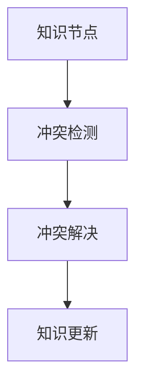
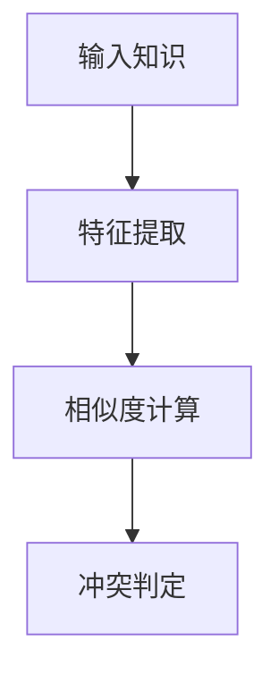
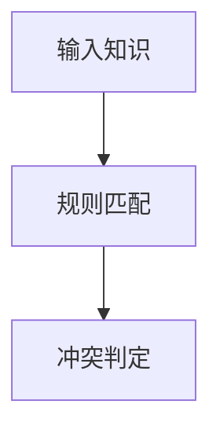
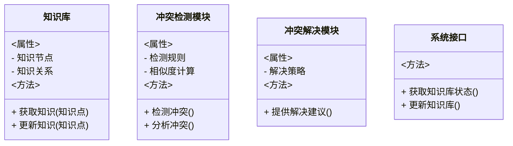
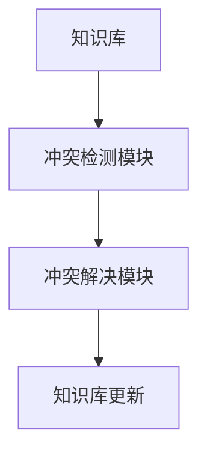

                 


# 构建AI Agent的知识库冲突检测与解决机制

## 关键词：知识库，AI Agent，冲突检测，冲突解决，算法，系统架构

## 摘要：  
在AI Agent的构建过程中，知识库作为其智能决策的核心支撑，面临着知识冲突的挑战。知识库冲突检测与解决机制是确保AI Agent高效、准确运行的关键。本文从知识库冲突的背景出发，详细分析了冲突检测的核心概念、算法原理、系统架构，并通过实际案例展示了如何构建一个高效的冲突检测与解决系统。最后，本文提出了最佳实践和未来的研究方向。

---

# 1. 知识库与AI Agent概述

## 1.1 知识库的基本概念

### 1.1.1 知识库的定义与特点  
知识库（Knowledge Base）是一个结构化的数据集合，用于存储和管理领域内的知识。它通常以形式化的表示方式存储数据，如关系数据库、图数据库或语义网络。知识库的特点包括：  
1. 结构化：数据以明确的关系和属性表示。  
2. 可扩展性：支持新增知识的动态更新。  
3. 一致性：确保知识的准确性和完整性。  

### 1.1.2 知识库在AI Agent中的作用  
AI Agent（智能体）通过知识库获取信息，进行推理和决策。知识库为AI Agent提供了“知识基础”，使其能够理解和处理复杂任务。例如，在医疗AI Agent中，知识库可以存储疾病症状、治疗方法等信息，帮助AI Agent进行诊断推理。  

### 1.1.3 知识库的构建与管理  
知识库的构建需要经过数据收集、数据清洗、知识抽取、知识表示等步骤。知识库的管理则需要考虑数据的一致性、冗余性和可维护性。  

---

## 1.2 AI Agent的基本原理

### 1.2.1 AI Agent的定义与分类  
AI Agent是一种具有感知环境、自主决策和执行任务能力的智能系统。根据功能和应用场景，AI Agent可以分为：  
1. **简单反射型AI Agent**：基于简单的规则进行决策。  
2. **基于模型的AI Agent**：通过内部模型进行推理和决策。  
3. **目标驱动型AI Agent**：以目标为导向进行规划和执行。  

### 1.2.2 AI Agent的知识表示方法  
知识表示是AI Agent的核心技术之一。常见的知识表示方法包括：  
1. **谓词逻辑**：通过谓词和逻辑推理表达知识。  
2. **语义网络**：通过节点和边表示概念及其关系。  
3. **规则引擎**：通过规则库进行知识表达和推理。  

### 1.2.3 AI Agent的决策机制  
AI Agent的决策机制包括：  
1. **基于知识的决策**：利用知识库中的信息进行推理和决策。  
2. **基于学习的决策**：通过机器学习模型进行预测和决策。  
3. **混合型决策**：结合知识和学习的混合方法。  

---

## 1.3 知识库冲突的背景与问题描述

### 1.3.1 知识库冲突的定义  
知识库冲突是指知识库中存在矛盾或不一致的知识。例如，同一疾病在知识库中可能被描述为“可以治愈”和“无法治愈”。  

### 1.3.2 知识库冲突的常见场景  
1. **数据冗余**：同一事实被多次描述，导致重复或矛盾。  
2. **知识更新**：新知识的引入可能与现有知识冲突。  
3. **多源数据整合**：从多个来源整合数据时，可能引入冲突。  

### 1.3.3 知识库冲突对AI Agent的影响  
知识库冲突可能导致AI Agent的决策错误或推理失败。例如，在医疗AI Agent中，冲突的知识可能导致误诊或错误的治疗建议。  

---

# 2. 知识库冲突检测的核心概念与联系

## 2.1 知识库冲突检测的原理

### 2.1.1 知识库冲突检测的流程  
1. **数据预处理**：清洗和标准化数据。  
2. **冲突识别**：通过算法检测知识库中的冲突。  
3. **冲突分析**：分析冲突的原因和影响。  

### 2.1.2 知识库冲突检测的关键技术  
1. **基于相似度的冲突检测**：通过计算知识节点之间的相似度，判断是否存在冲突。  
2. **基于规则的冲突检测**：通过预定义规则，检测知识库中的矛盾。  
3. **基于上下文的冲突检测**：结合上下文信息，进行动态冲突检测。  

### 2.1.3 知识库冲突检测的评价指标  
| 指标 | 定义 |  
|------|------|  
| 精确率 | 正确检测到的冲突数量 / 总检测到的冲突数量 |  
| 召回率 | 正确检测到的冲突数量 / 总实际冲突数量 |  
| F1值 | 调和平均数（精确率和召回率的加权平均） |  

---

## 2.2 知识库冲突检测中的核心概念

### 2.2.1 冲突检测的实体关系图  


### 2.2.2 冲突检测的属性特征对比表  
| 属性 | 特征1（基于相似度） | 特征2（基于规则） | 特征3（基于上下文） |  
|------|---------------------|--------------------|-----------------------|  
| 检测方法 | 通过相似度计算冲突 | 通过预定义规则检测 | 结合上下文信息检测 |  
| 优缺点 | 无偏见，但计算复杂 | 简单高效，但依赖规则 | 精准，但依赖上下文 |  

---

## 2.3 知识库冲突检测的算法原理

### 2.3.1 基于相似度的冲突检测算法  


公式：  
$$ \text{相似度} = \frac{\vec{A} \cdot \vec{B}}{|\vec{A}| |\vec{B}|} $$  
其中，$\vec{A}$和$\vec{B}$分别是两个知识节点的向量表示。  

### 2.3.2 基于规则的冲突检测算法  


---

# 3. 知识库冲突检测的算法原理与数学模型

## 3.1 基于相似度的冲突检测

### 3.1.1 余弦相似度公式  
$$ \text{相似度} = \frac{\vec{A} \cdot \vec{B}}{|\vec{A}| |\vec{B}|} $$  

**举例说明**：  
假设知识节点A的向量表示为$[1, 2, 3]$，知识节点B的向量表示为$[2, 3, 4]$，则它们的余弦相似度为：  
$$ \text{相似度} = \frac{1 \times 2 + 2 \times 3 + 3 \times 4}{\sqrt{1^2 + 2^2 + 3^2} \times \sqrt{2^2 + 3^2 + 4^2}} = \frac{2 + 6 + 12}{\sqrt{14} \times \sqrt{29}} $$  

---

## 3.2 基于规则的冲突检测

### 3.2.1 冲突解决的推荐算法  
公式：  
$$ \text{推荐度} = \sum_{i=1}^{n} w_i \times s_i $$  
其中，$w_i$是规则的权重，$s_i$是规则匹配的相似度。  

---

# 4. 知识库冲突解决的系统架构与实现

## 4.1 系统架构设计

### 4.1.1 系统功能设计  


### 4.1.2 系统架构设计  


---

## 4.2 项目实战：医疗知识库冲突检测与解决

### 4.2.1 项目背景  
医疗知识库通常包含疾病症状、治疗方法等信息。由于数据来源多样，知识库中可能引入冲突。例如，同一疾病可能被描述为“可以治愈”和“无法治愈”。  

### 4.2.2 系统实现  
1. **环境配置**：使用Python 3.8及以上版本，安装必要的库（如networkx、scikit-learn）。  
2. **代码实现**：实现冲突检测和解决模块。  

```python
# 知识库表示
class KnowledgeNode:
    def __init__(self, id, properties):
        self.id = id
        self.properties = properties  # 包含属性和关系

# 冲突检测模块
class ConflictDetection:
    def __init__(self, knowledge_base):
        self.knowledge_base = knowledge_base

    def detect_conflicts(self):
        # 检测知识库中的冲突
        pass

# 冲突解决模块
class ConflictResolution:
    def __init__(self, knowledge_base):
        self.knowledge_base = knowledge_base

    def resolve_conflicts(self, conflicts):
        # 提供冲突解决建议
        pass
```

### 4.2.3 测试与结果  
通过测试用例验证系统的冲突检测和解决能力。例如，测试系统能否检测到“同一疾病可以治愈和无法治愈”的冲突，并提供合理的解决建议。

---

## 5. 最佳实践与总结

### 5.1 最佳实践  
1. **数据预处理**：在知识库构建阶段，尽量消除冗余和不一致的数据。  
2. **规则优化**：根据具体场景，优化冲突检测规则，提高检测效率和准确性。  
3. **动态更新**：定期更新知识库，确保知识的准确性和一致性。  

### 5.2 本章小结  
本文详细介绍了知识库冲突检测与解决机制的核心概念、算法原理和系统架构。通过实际案例展示了如何构建一个高效的冲突检测与解决系统，并提出了最佳实践和未来的研究方向。

---

# 作者：AI天才研究院/AI Genius Institute & 禅与计算机程序设计艺术 /Zen And The Art of Computer Programming

