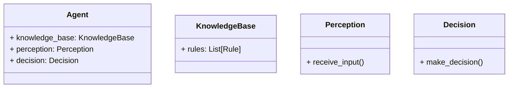
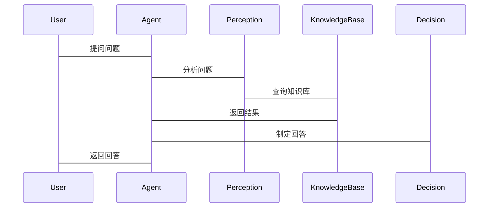

                 


# 《构建AI Agent的认知架构设计》

---

## 关键词：AI Agent, 认知架构, 人工智能, 决策推理, 系统设计

---

## 摘要：  
本文详细探讨构建AI Agent的认知架构设计，涵盖AI Agent的基本概念、认知架构的核心要素、算法原理、系统架构设计及项目实战。通过理论分析和实际案例，帮助读者理解如何设计和实现具备感知、推理和决策能力的AI Agent。

---

# 第1章: AI Agent与认知架构概述

## 1.1 AI Agent的基本概念

### 1.1.1 AI Agent的定义与特征  
AI Agent（人工智能代理）是一种能够感知环境、自主决策并采取行动的智能实体。其核心特征包括：  
1. **自主性**：无需外部干预，自主完成任务。  
2. **反应性**：能够实时感知环境并做出反应。  
3. **主动性**：主动采取行动以实现目标。  
4. **社会性**：能够与人类或其他智能体进行交互协作。  

AI Agent的目标是通过认知架构实现类似人类的思考和决策能力。

---

### 1.1.2 认知架构的基本概念  
认知架构是AI Agent的核心，负责实现感知、推理、决策和学习等功能。常见的认知架构包括符号逻辑推理、基于规则的推理、基于知识的推理和基于神经网络的推理等。

---

### 1.1.3 AI Agent与传统AI的区别  
AI Agent的核心是认知架构，它不仅能够处理数据，还能根据环境动态调整行为。与传统AI（如专家系统）相比，AI Agent更注重自主性和适应性。

---

## 1.2 认知架构的发展历程

### 1.2.1 从符号AI到连接主义的演变  
早期的符号AI依赖于预定义的规则和知识库，而连接主义（如神经网络）则通过数据驱动的方式学习特征。认知架构的发展是两者结合的过程。

### 1.2.2 现代认知架构的研究现状  
现代认知架构结合了符号推理和神经网络的优势，如知识图谱与深度学习的结合，使得AI Agent能够处理复杂任务。

### 1.2.3 未来AI Agent的发展趋势  
未来的AI Agent将更加注重人机协作、多模态交互和自适应学习能力。

---

## 1.3 本章小结  
本章介绍了AI Agent的基本概念、认知架构的发展历程及未来趋势，为后续章节奠定了基础。

---

# 第2章: 认知架构的核心概念与联系

## 2.1 认知架构的核心要素

### 2.1.1 感知与理解  
感知模块负责接收环境输入，如视觉、听觉等。理解模块则对输入进行语义分析，提取有用信息。  
**示例**：通过摄像头捕捉图像，利用计算机视觉技术识别物体。

### 2.1.2 推理与决策  
推理模块基于感知信息进行逻辑推理，决策模块根据推理结果制定行动方案。  
**示例**：在自动驾驶中，AI Agent根据环境信息推理出可能的危险情况并做出避让决策。

### 2.1.3 学习与适应  
学习模块通过强化学习等方法优化认知架构的性能，使其能够适应动态环境。  
**示例**：在游戏AI中，通过强化学习不断优化游戏策略。

---

## 2.2 核心概念的属性特征对比

| 核心概念 | 特征描述 |
|----------|----------|
| 感知     | 数据采集、特征提取、语义理解 |
| 推理     | 逻辑推理、概率推理、知识推理 |
| 决策     | 行为选择、风险评估、目标优化 |

---

## 2.3 ER实体关系图架构

```mermaid
er
actor(Agent, "具有认知能力的实体")
```

---

## 2.4 本章小结  
本章详细讲解了认知架构的核心要素及其属性特征，并通过ER实体关系图展示了各部分的联系。

---

# 第3章: AI Agent认知架构的算法原理

## 3.1 算法原理概述

### 3.1.1 基于强化学习的决策算法  
强化学习通过奖励机制优化决策策略。  
**公式**：  
$$ Q(s, a) = r(s, a) + \gamma \max_{a'} Q(s', a') $$  
其中，$s$是状态，$a$是动作，$\gamma$是折扣因子。

### 3.1.2 基于图神经网络的推理算法  
图神经网络适合处理复杂的知识图谱推理任务。  
**公式**：  
$$ Z = G \cdot X + b $$  
其中，$G$是图的邻接矩阵，$X$是输入特征矩阵，$b$是偏置项。

### 3.1.3 基于符号逻辑的推理算法  
符号逻辑推理依赖于预定义的知识库，通过规则进行推理。  
**公式**：  
$$ \theta = \theta' \land \phi $$  
其中，$\theta'$和$\phi$是两个逻辑表达式。

---

## 3.2 算法原理的数学模型

### 3.2.1 强化学习的数学模型  
$$ V(s) = \max_{a} [ r(s,a) + \gamma V(s') ] $$  
其中，$V(s)$是状态价值函数，$r(s,a)$是奖励函数，$\gamma$是折扣因子，$s'$是下一状态。

### 3.2.2 图神经网络的数学模型  
$$ Z = G \cdot X + b $$  
其中，$G$是图的邻接矩阵，$X$是输入特征矩阵，$b$是偏置项。

### 3.2.3 符号逻辑推理的数学模型  
$$ \theta = \theta' \land \phi $$  
其中，$\theta'$和$\phi$是两个逻辑表达式，$\land$表示逻辑与。

---

## 3.3 算法实现示例

### 3.3.1 强化学习实现
```python
import numpy as np

class Agent:
    def __init__(self, state_space, action_space):
        self.state_space = state_space
        self.action_space = action_space
        self.Q = np.zeros((state_space, action_space))

    def act(self, state):
        return np.argmax(self.Q[state])

    def update(self, state, action, reward, next_state):
        self.Q[state, action] = reward + self.gamma * np.max(self.Q[next_state])
```

### 3.3.2 图神经网络实现
```python
import tensorflow as tf

class GraphNN:
    def __init__(self, input_dim):
        self.model = tf.keras.Sequential([
            tf.keras.layers.Dense(64, activation='relu', input_dim=input_dim),
            tf.keras.layers.Dense(1, activation='sigmoid')
        ])

    def call(self, inputs):
        return self.model(inputs)
```

---

## 3.4 本章小结  
本章通过数学公式和代码示例，详细讲解了AI Agent认知架构中的核心算法原理。

---

# 第4章: 系统分析与架构设计方案

## 4.1 问题场景介绍  
以智能客服系统为例，AI Agent需要实现用户咨询、问题分类、意图识别等功能。

---

## 4.2 系统功能设计

### 4.2.1 领域模型设计  


### 4.2.2 系统架构设计  


### 4.2.3 系统接口设计  
- 输入接口：接收用户输入  
- 输出接口：返回响应结果  
- 事件接口：处理用户行为事件

---

## 4.3 系统交互设计



---

## 4.4 本章小结  
本章通过系统设计图和交互图，详细讲解了AI Agent的系统架构和实现过程。

---

# 第5章: 项目实战——智能客服系统

## 5.1 环境安装与配置  
- 安装Python、TensorFlow、Keras等依赖库  
- 配置开发环境（如PyCharm）

---

## 5.2 系统核心实现

### 5.2.1 知识库构建  
```python
class KnowledgeBase:
    def __init__(self):
        self.rules = []

    def add_rule(self, rule):
        self.rules.append(rule)

    def query(self, question):
        for rule in self.rules:
            if rule.matches(question):
                return rule.answer
        return "抱歉，我无法回答这个问题。"
```

### 5.2.2 交互模块实现  
```python
class Agent:
    def __init__(self, knowledge_base):
        self.knowledge_base = knowledge_base

    def interact(self, user_input):
        return self.knowledge_base.query(user_input)
```

---

## 5.3 实际案例分析  
通过智能客服系统的实际运行，验证认知架构的设计是否合理，并根据用户反馈优化系统性能。

---

## 5.4 本章小结  
本章通过智能客服系统的实战，详细讲解了AI Agent认知架构的实现过程。

---

# 第6章: 最佳实践与小结

## 6.1 最佳实践 tips  
- **模块化设计**：将认知架构划分为感知、推理、决策等模块，便于维护和扩展。  
- **数据多样性**：确保训练数据的多样性和代表性，以提高模型的泛化能力。  
- **持续优化**：通过在线学习和反馈机制，不断提升AI Agent的性能。

---

## 6.2 小结  
本文详细探讨了AI Agent的认知架构设计，从理论到实践，全面分析了实现过程中的关键问题，并通过实际案例展示了设计方法。

---

# 作者：AI天才研究院 & 禅与计算机程序设计艺术

---

**本文是基于《构建AI Agent的认知架构设计》一书的目录大纲和部分内容的解析，完整内容请参考书籍。**

