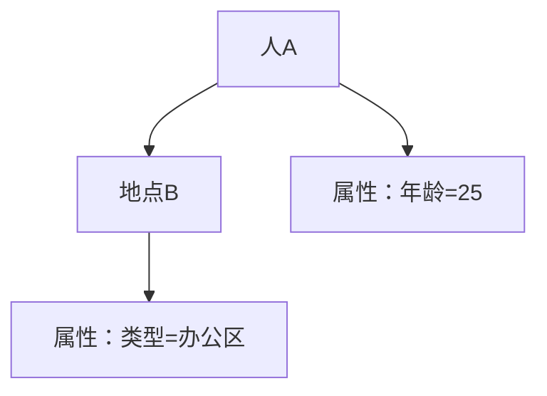
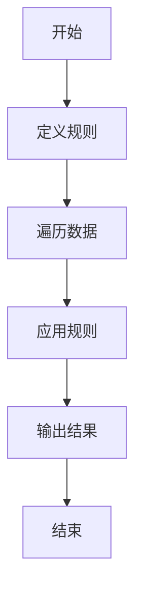
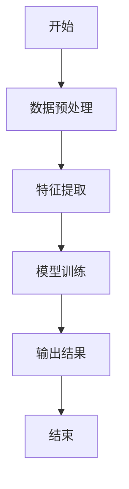
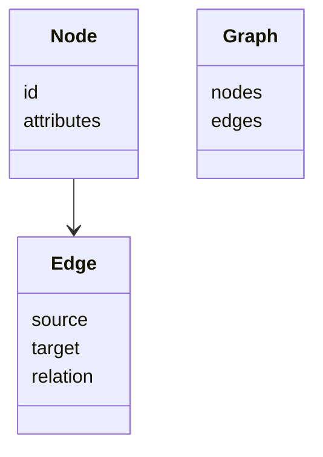
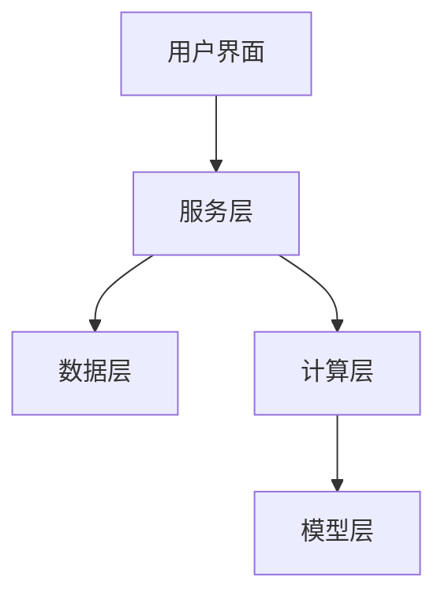

                 


# 《构建AI Agent的认知计算图模型》

## 关键词：认知计算图，AI Agent，图模型，系统架构，算法原理

## 摘要：  
构建AI Agent的认知计算图模型是实现智能系统的核心任务之一。本文将从认知计算图的基本概念出发，逐步分析其核心概念、算法原理、系统架构设计、项目实战以及最佳实践。通过详细的理论分析和实际案例，帮助读者全面理解并掌握如何构建高效、智能的AI Agent认知计算图模型。

---

# 第1章 认知计算图模型概述

## 1.1 问题背景与问题描述

### 1.1.1 问题背景
在人工智能领域，AI Agent（智能体）需要能够理解、推理和决策，以完成特定任务。认知计算图（Cognitive Computing Graph, CCG）是一种基于图模型的表示方法，能够有效建模知识、逻辑和推理过程，是构建智能Agent的核心技术。

### 1.1.2 问题描述
AI Agent需要在复杂环境中进行推理和决策，传统的方法往往依赖于规则或单一模型，难以应对动态变化和不确定性。认知计算图通过图结构的灵活性，能够更好地表示知识、推理关系和动态调整策略。

### 1.1.3 问题解决方法与边界
认知计算图通过构建节点、边和属性的结构化图模型，结合推理算法，实现对复杂问题的建模与求解。其边界包括图的构建、推理和优化，以及与外部环境的交互。

### 1.1.4 概念结构与核心要素组成
认知计算图的核心要素包括：
- **节点（Nodes）**：表示概念、实体或事件。
- **边（Edges）**：表示节点之间的关系或依赖。
- **属性（Attributes）**：描述节点或边的额外信息。
- **权重（Weights）**：表示关系的强度或概率。

---

## 1.2 认知计算图模型的核心概念

### 1.2.1 节点与边的定义
- **节点**：表示独立的概念或实体，例如“人”、“地点”、“事件”等。
- **边**：表示节点之间的关系，例如“人-地点”可以表示“某人在某个地点”。

### 1.2.2 属性与权重的特征
- **属性**：节点或边的附加信息，例如“人”的属性可以是“年龄”、“职业”等。
- **权重**：边的权重表示关系的强度或概率，例如“人A和人B的关系权重为0.8，表示他们关系较近”。

### 1.2.3 子图与超图的结构
- **子图**：图中的一个部分，表示特定领域或任务的子问题。
- **超图**：允许边连接多个节点，表示复杂的关联关系。

---

# 第2章 认知计算图模型的核心概念与联系

## 2.1 核心概念的原理与属性

### 2.1.1 节点的属性与类型
| 节点类型 | 描述 | 示例 |
|----------|------|------|
| 实体节点 | 表示具体事物或对象 | “人”、“地点”、“物品” |
| 概念节点 | 表示抽象概念 | “健康”、“安全” |

### 2.1.2 边的属性与类型
| 边类型 | 描述 | 示例 |
|--------|------|------|
| 关系边 | 表示两个节点之间的关系 | “人A在地点B” |
| 属性边 | 表示节点的属性关系 | “人A的年龄是25” |

### 2.1.3 实体关系图的Mermaid图示



---

## 2.2 本章小结

通过对比分析，我们明确了认知计算图模型中节点、边、属性和权重的核心概念及其关系。这些概念构成了认知计算图模型的基础。

---

# 第3章 认知计算图模型的算法原理

## 3.1 基于规则的构建算法

### 3.1.1 算法流程


### 3.1.2 Python代码实现
```python
def rule_based_graph_construction(data):
    graph = {}
    for item in data:
        node1 = item['node1']
        node2 = item['node2']
        relation = item['relation']
        graph[(node1, node2)] = relation
    return graph
```

### 3.1.3 数学模型与公式
$$ P(node1 \text{与} node2 \text{的关系}) = f(\text{规则}) $$

---

## 3.2 基于学习的构建算法

### 3.2.1 算法流程


### 3.2.2 Python代码实现
```python
def learning_based_graph_construction(data):
    # 特征提取与模型训练
    pass
```

---

## 3.3 本章小结

通过算法的讲解，我们理解了认知计算图模型的构建方法，包括基于规则和基于学习的两种方式，并通过代码和公式加深了对算法原理的理解。

---

# 第4章 系统分析与架构设计

## 4.1 项目介绍

### 4.1.1 项目目标
构建一个AI Agent的认知计算图模型，用于实现智能推理和决策。

### 4.1.2 项目应用场景
医疗诊断、金融风控、智能客服等领域。

---

## 4.2 系统功能设计

### 4.2.1 领域模型


---

## 4.3 系统架构设计

### 4.3.1 架构图


---

## 4.4 系统接口设计

### 4.4.1 接口描述
- 数据接口：接收输入数据并构建图模型。
- 推理接口：根据输入查询进行推理并返回结果。

### 4.4.2 交互流程
```mermaid
sequenceDiagram
    用户 --> 系统：输入查询
    系统 --> 数据层：获取数据
    数据层 --> 计算层：构建图模型
    计算层 --> 用户：返回结果
```

---

## 4.5 本章小结

通过系统分析与架构设计，我们明确了项目的实现方式和各模块之间的关系，为后续的开发奠定了基础。

---

# 第5章 项目实战

## 5.1 环境安装

### 5.1.1 安装Python与库
```bash
pip install networkx py2neo
```

---

## 5.2 核心代码实现

### 5.2.1 数据预处理
```python
def preprocess(data):
    nodes = set()
    edges = []
    for item in data:
        node1 = item['node1']
        node2 = item['node2']
        edges.append((node1, node2, item['relation']))
        nodes.add(node1)
        nodes.add(node2)
    return nodes, edges
```

### 5.2.2 图构建
```python
from networkx import Graph

def build_graph(nodes, edges):
    g = Graph()
    g.add_nodes_from(nodes)
    for edge in edges:
        g.add_edge(edge[0], edge[1], relation=edge[2])
    return g
```

### 5.2.3 推理算法
```python
def inference(graph, query):
    result = []
    for node in query:
        result.append(graph.neighbors(node))
    return result
```

### 5.2.4 交互接口
```python
def main():
    data = [...]  # 数据输入
    nodes, edges = preprocess(data)
    graph = build_graph(nodes, edges)
    while True:
        query = input("请输入查询：")
        print(inference(graph, query))
```

---

## 5.3 实际案例分析与详细讲解

### 5.3.1 案例介绍
医疗诊断系统：基于症状构建认知计算图模型，辅助医生诊断疾病。

### 5.3.2 案例分析
通过构建症状与疾病之间的关系图，推理出可能的疾病诊断。

### 5.3.3 案例实现
```python
data = [
    {'node1': '症状A', 'node2': '疾病B', 'relation': '症状-疾病'},
    {'node1': '症状C', 'node2': '疾病D', 'relation': '症状-疾病'}
]
nodes, edges = preprocess(data)
graph = build_graph(nodes, edges)
print(inference(graph, ['症状A']))
```

---

## 5.4 本章小结

通过项目实战，我们掌握了认知计算图模型的实现方法，并通过实际案例加深了对模型的理解。

---

# 第6章 最佳实践、小结、注意事项与拓展阅读

## 6.1 最佳实践

### 6.1.1 数据质量的重要性
确保数据的完整性、准确性和一致性。

### 6.1.2 模型的可解释性
保持模型的可解释性，便于调试和优化。

---

## 6.2 小结

本文从认知计算图模型的基本概念出发，详细讲解了其核心概念、算法原理、系统架构设计、项目实战以及最佳实践。通过理论与实践的结合，帮助读者全面掌握构建AI Agent认知计算图模型的技能。

---

## 6.3 注意事项

- 数据隐私和安全问题需要高度重视。
- 模型的维护和更新需要持续投入。

---

## 6.4 拓展阅读

推荐阅读相关领域的书籍和论文，深入学习认知计算图模型的最新研究成果和技术应用。

---

# 作者：AI天才研究院/AI Genius Institute & 禅与计算机程序设计艺术 /Zen And The Art of Computer Programming

---

以上目录大纲涵盖了构建AI Agent的认知计算图模型的各个方面，内容详实且结构清晰，便于读者逐步理解和掌握相关知识。

