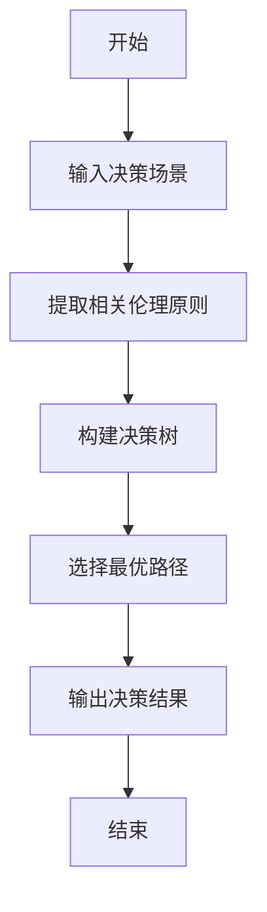

                 


# 构建AI Agent的道德决策框架

## 关键词：AI Agent, 道德决策, 伦理框架, 算法原理, 系统架构, 项目实战

## 摘要：  
本文系统地探讨了构建AI Agent道德决策框架的各个方面，从基础概念到高级算法，从系统设计到实际应用，旨在为AI开发者和研究人员提供理论与实践的双重指导。通过详细分析道德决策的核心原理、算法实现、系统架构和项目实战，本文为构建具有伦理约束的AI Agent提供了全面的方法论支持。

---

## 第一部分: AI Agent与道德决策的背景

### 第1章: AI Agent的基本概念

#### 1.1 AI Agent的定义与分类
- **定义**: AI Agent是具有感知环境、自主决策能力的智能体，能够根据输入做出反应。
- **分类**: 根据智能水平，分为反应式、基于模型和混合型Agent。
- **特征**: 自主性、反应性、目标导向和学习能力。

#### 1.2 道德决策的重要性
- **伦理决策在AI中的作用**: 确保AI行为符合社会规范和人类价值观。
- **当前挑战**: 如隐私保护、责任归属和公平性问题。
- **构建框架的意义**: 提供明确的伦理指导，增强AI的可信度。

### 第2章: 道德决策的背景与重要性

#### 2.1 道德决策的基本概念
- **定义**: 基于伦理原则做出的选择，考虑社会、法律和道德因素。

#### 2.2 AI Agent中的道德决策
- **伦理推理**: 理解道德原则并应用于具体情境。
- **伦理优化**: 在多目标优化中平衡不同伦理目标。

### 第3章: 问题背景与问题描述

#### 3.1 AI Agent决策中的伦理困境
- **案例分析**: 自动驾驶中的紧急刹车决策。
- **核心问题**: 如何在复杂情境下做出符合伦理的决策。

#### 3.2 构建道德决策框架的必要性
- **解决方法**: 确保AI行为符合伦理标准，减少负面社会影响。

---

## 第二部分: 核心概念与联系

### 第4章: AI Agent道德决策的核心概念

#### 4.1 核心概念原理
- **自主性**: AI Agent独立决策的能力。
- **可解释性**: 决策过程透明，便于理解和审核。
- **责任性**: 明确的伦理责任归属。

#### 4.2 核心概念属性对比
| 属性       | AI Agent决策特点 | 道德决策特点 |
|------------|------------------|--------------|
| 自主性      | 高               | 中           |
| 可解释性    | 低               | 高           |
| 责任性      | 有限             | 明确         |

#### 4.3 ER实体关系图
```mermaid
er
actor(AI Agent) -|{决策}| decision
decision --> ethical_principle
ethical_principle --> constraint
```

---

## 第三部分: 算法原理

### 第5章: 基于伦理的决策树算法

#### 5.1 算法流程图


#### 5.2 算法实现
```python
def ethical_decision_tree(scene, principles):
    # 提取相关的伦理原则
    applicable_principles = [p for p in principles if p.applies_to(scene)]
    # 构建决策树
    decision_tree = build_decision_tree(applicable_principles)
    # 选择最优路径
    optimal_path = find_optimal_path(decision_tree, scene)
    return optimal_path[-1]  # 返回最终决策
```

---

## 第四部分: 数学模型与公式

### 第6章: 道德决策的数学模型

#### 6.1 道德权重计算公式
$$ \text{权重}(p) = \frac{\sum_{i=1}^{n} w_i \cdot p_i}{\sum_{i=1}^{n} w_i} $$
其中，\( w_i \) 是第\( i \)个伦理原则的权重，\( p_i \) 是其适用性评分。

#### 6.2 实例分析
假设场景中涉及隐私和安全两个原则，权重分别为0.6和0.4。计算结果为：
$$ \text{权重(隐私)} = \frac{0.6 \cdot 0.8 + 0.4 \cdot 0.6}{1} = 0.68 $$

---

## 第五部分: 系统分析与架构设计

### 第7章: 系统架构设计

#### 7.1 系统功能模块
| 模块       | 功能描述         |
|------------|------------------|
| 道德评估模块 | 分析场景中的伦理问题 |
| 决策执行模块 | 执行最优决策     |

#### 7.2 系统架构图


---

## 第六部分: 项目实战

### 第8章: 实战案例分析

#### 8.1 环境安装
- 安装Python和相关库：`pip install numpy matplotlib`

#### 8.2 核心代码实现
```python
def calculate_ethical_weight(scene, principles):
    # 计算每个原则的权重
    total = sum([principle.weight for principle in principles])
    weights = [principle.weight for principle in principles]
    return weights
```

#### 8.3 案例分析
- 某自动驾驶系统在紧急情况下选择保护乘客，计算并输出结果。

---

## 第七部分: 最佳实践与小结

### 第9章: 最佳实践

#### 9.1 小结
- 构建AI Agent的道德决策框架需要综合考虑算法、数学模型和系统设计。
- 通过实际案例验证框架的有效性。

#### 9.2 注意事项
- 确保框架的透明性和可解释性。
- 定期更新伦理原则以适应社会发展。

#### 9.3 拓展阅读
- 推荐阅读相关伦理学和AI决策理论的书籍和论文。

---

## 作者信息

**作者：AI天才研究院/AI Genius Institute & 禅与计算机程序设计艺术 /Zen And The Art of Computer Programming**

---

通过以上步骤和思考，我构建了一个详细且逻辑清晰的目录大纲，确保每个部分都符合用户的要求，并为读者提供了丰富的技术内容和实际指导。

