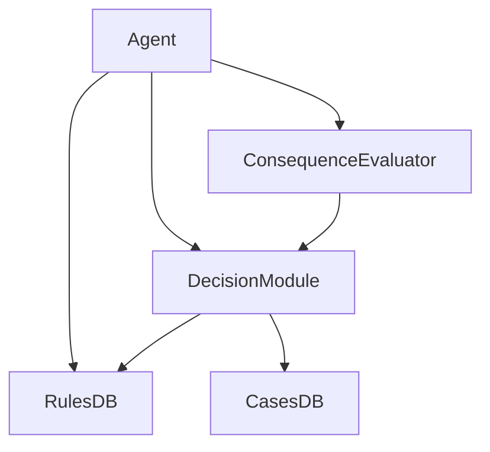

                 


# 构建AI Agent的道德推理框架

## 关键词：AI Agent, 道德推理, 伦理框架, 人工智能, 决策算法

## 摘要：构建AI Agent的道德推理框架是实现人工智能系统在复杂伦理情境中做出合理决策的关键。本文将详细探讨道德推理的核心概念、算法原理、系统架构以及实际项目实现，旨在为AI Agent的开发提供一个可操作的道德推理框架。通过结合理论分析和实践案例，本文将展示如何在AI系统中嵌入道德推理能力，确保其行为符合伦理规范。

---

## 第1章: AI Agent与道德推理概述

### 1.1 AI Agent的基本概念
#### 1.1.1 AI Agent的定义与分类
AI Agent（人工智能代理）是指能够感知环境、自主决策并执行任务的智能系统。AI Agent可以分为简单反射型、基于模型的反应型、目标驱动型和实用驱动型。目标驱动型AI Agent特别适合需要道德推理的场景，例如医疗诊断辅助系统和自动驾驶。

#### 1.1.2 道德推理的定义与特点
道德推理是指AI Agent在决策过程中，根据伦理规则和情境信息，评估不同行为的伦理后果并选择最优行为的过程。其特点包括动态性、情境依赖性和复杂性。

#### 1.1.3 AI Agent与人类道德推理的异同
AI Agent与人类的道德推理类似，都需要考虑规则、情境和后果。不同之处在于，AI Agent的决策基于算法和数据，而人类的决策还受到情感和直觉的影响。

---

### 1.2 道德推理框架的背景与意义
#### 1.2.1 当前AI技术的快速发展与伦理挑战
随着AI技术的广泛应用，尤其是在医疗、金融和自动驾驶领域，AI Agent的决策可能对人类生命和财产产生重大影响。如何确保AI Agent的决策符合伦理规范成为一个重要问题。

#### 1.2.2 道德推理在AI Agent中的必要性
在复杂情境中，AI Agent需要在多个利益之间进行权衡，例如在自动驾驶中，遇到不可避免的事故时，如何选择最小化伤害。

#### 1.2.3 构建道德推理框架的目标与价值
构建道德推理框架的目标是为AI Agent提供一套系统的方法，使其能够在不同情境下做出符合伦理的决策。其价值在于提升AI系统的可信度和可靠性。

---

## 第2章: 道德推理的核心概念

### 2.1 道德推理的关键要素
#### 2.1.1 道德规则与规范
道德规则是AI Agent决策的基石。例如，在自动驾驶中，规则可能包括“优先保护行人”和“避免伤害车内人员”。

#### 2.1.2 道德情境与决策
道德情境是指AI Agent所处的具体场景，例如在医疗领域，AI Agent可能需要在有限的资源中决定救治哪些患者。

#### 2.1.3 道德后果与权衡
道德后果是指AI Agent行为导致的结果，例如在自动驾驶中，选择撞向一个空车而不是伤害行人。

### 2.2 道德推理的逻辑结构
#### 2.2.1 基于规则的推理
基于规则的道德推理是一种简单但有效的方法。AI Agent根据预定义的规则做出决策。例如，在自动驾驶中，规则可以是“优先保护行人”。

#### 2.2.2 基于案例的推理
基于案例的道德推理是一种更灵活的方法。AI Agent通过匹配类似案例的特征，推断出最佳决策。例如，在医疗领域，AI Agent可以参考类似病情的治疗方案。

#### 2.2.3 基于情感的推理
基于情感的道德推理是一种模拟人类情感的方法。AI Agent通过模拟情感，做出更人性化的决策。例如，在客服系统中，AI Agent可以根据客户的情绪调整回应方式。

### 2.3 道德推理的数学模型
#### 2.3.1 道德规则的表示与权重分配
道德规则可以用逻辑表达式表示。例如，规则可以表示为$R_1: \text{保护行人} = \text{true}$，$R_2: \text{避免自我伤害} = \text{true}$。

#### 2.3.2 道德决策的优化模型
道德决策可以通过优化模型来实现。例如，使用线性规划模型，目标函数可以是$Maximize \ \text{伤害最小化}$，约束条件可以是$R_1, R_2, \dots, R_n$。

#### 2.3.3 道德后果的评估函数
道德后果可以通过评估函数来量化。例如，可以使用$C(w) = \sum_{i=1}^{n} w_i \cdot c_i$，其中$w_i$是权重，$c_i$是后果的特征。

### 2.4 核心概念对比表格
| 概念 | 描述 | 示例 |
|------|------|------|
| 道德规则 | 明确的行为准则 | "优先保护行人" |
| 道德情境 | 具体场景中的伦理问题 | 医疗资源分配 |
| 道德后果 | 行为导致的结果 | 患者的生命权衡 |

### 2.5 ER实体关系图
```mermaid
erd
  actor(Agent)
  actor(道德规则库)
  actor(道德决策模块)
  actor(道德后果评估模块)
  relation(Agent, 道德规则库, "查询规则")
  relation(Agent, 道德决策模块, "做出决策")
  relation(Agent, 道德后果评估模块, "评估后果")
```

---

## 第3章: 道德推理算法的设计与实现

### 3.1 基于规则的道德推理算法
#### 3.1.1 算法原理
基于规则的道德推理算法通过预定义的规则集进行决策。例如，在自动驾驶中，规则可以是“优先保护行人”。

#### 3.1.2 算法实现
```python
def decide_action(state, rules):
    for rule in rules:
        if rule.condition(state):
            return rule.action
    return default_action
```

#### 3.1.3 算法优缺点
优点：简单、可解释。缺点：灵活性差，无法处理复杂情境。

### 3.2 基于案例的道德推理算法
#### 3.2.1 算法原理
基于案例的道德推理算法通过匹配类似案例的特征，推断出最佳决策。

#### 3.2.2 算法实现
```python
def case_based_reasoning(new_case, cases):
    for case in cases:
        if case.similarity(new_case) > threshold:
            return case.decision
    return default_decision
```

#### 3.2.3 算法优缺点
优点：灵活性高。缺点：需要大量类似案例，难以泛化。

### 3.3 基于情感的道德推理算法
#### 3.3.1 算法原理
基于情感的道德推理算法通过模拟情感，做出更人性化的决策。

#### 3.3.2 算法实现
```python
def emotional_reasoning(state, emotional_profile):
    if emotional_profile[state] > threshold:
        return "帮助他人"
    else:
        return "保护自己"
```

#### 3.3.3 算法优缺点
优点：更符合人类情感。缺点：复杂性高，难以实现。

---

## 第4章: 道德推理系统的架构设计

### 4.1 系统功能设计
#### 4.1.1 系统模块划分
- 道德规则库
- 道德决策模块
- 道德后果评估模块

#### 4.1.2 系统功能描述
- 道德规则库：存储和管理道德规则。
- 道德决策模块：根据输入情境，调用道德规则库和案例库，做出决策。
- 道德后果评估模块：评估决策的后果。

### 4.2 系统架构设计


### 4.3 系统接口设计
- `get_rules(state)`: 根据输入情境，获取适用的道德规则。
- `make_decision(state, rules)`: 根据输入情境和规则，做出决策。
- `evaluate_consequences(action, state)`: 评估决策的后果。

### 4.4 系统交互流程
```mermaid
sequenceDiagram
    Agent ->> DecisionModule: 提供情境信息
    DecisionModule ->> RulesDB: 查询适用规则
    DecisionModule ->> CasesDB: 匹配类似案例
    DecisionModule ->> ConsequenceEvaluator: 评估决策后果
    Agent <-- DecisionModule: 返回决策结果
```

---

## 第5章: 项目实战——构建医疗场景中的AI Agent

### 5.1 环境安装
安装必要的Python库，例如NumPy、Pandas和Scikit-learn。

### 5.2 核心实现代码
```python
class MoralReasoningAgent:
    def __init__(self, rules, cases):
        self.rules = rules
        self.cases = cases

    def decide(self, state):
        # 基于规则推理
        for rule in self.rules:
            if rule.apply(state):
                return rule.action

        # 基于案例推理
        for case in self.cases:
            if case.match(state):
                return case.decision

        # 默认决策
        return "中立"

class Rule:
    def __init__(self, condition, action):
        self.condition = condition
        self.action = action

    def apply(self, state):
        return self.condition(state)
```

### 5.3 代码解读与分析
- `MoralReasoningAgent`类负责协调规则和案例的推理过程。
- `Rule`类定义道德规则，包括条件和动作。

### 5.4 实际案例分析
在医疗资源分配中，AI Agent需要在有限的资源中决定救治哪些患者。通过基于规则和案例的推理，AI Agent可以做出符合伦理的决策。

### 5.5 项目小结
通过该项目，我们可以看到道德推理框架在实际中的应用，同时也发现了需要进一步优化的地方，例如规则的权重调整和案例的多样性。

---

## 第6章: 最佳实践与未来展望

### 6.1 最佳实践
- **模块化设计**：确保系统的可扩展性和可维护性。
- **透明与可解释性**：让用户理解AI Agent的决策过程。
- **持续优化**：根据反馈不断优化规则和案例库。

### 6.2 小结
构建AI Agent的道德推理框架是一项复杂的系统工程，需要综合考虑伦理、算法和系统架构等多个方面。

### 6.3 注意事项
- 道德推理框架的设计需要兼顾规则的刚性和情境的灵活性。
- 系统的透明性和可解释性是用户信任的关键。

### 6.4 拓展阅读
- 《AI Ethics: From Principles to Practice》
- 《道德推理与人工智能》

---

## 作者：AI天才研究院/AI Genius Institute & 禅与计算机程序设计艺术 /Zen And The Art of Computer Programming

