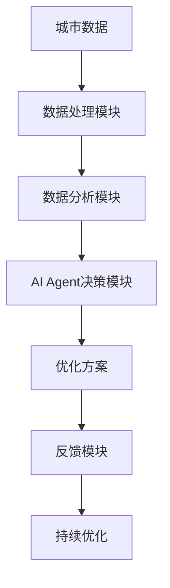
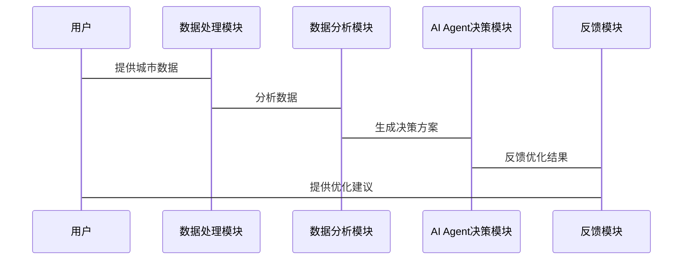

                 


# 构建AI Agent驱动的智能城市规划系统

---

## 关键词

AI Agent, 智能城市, 城市规划, 强化学习, 图神经网络, 系统架构

---

## 摘要

随着城市化进程的加速，城市规划的复杂性不断增加，传统的城市规划方法已难以应对日益增长的智能化需求。AI Agent（人工智能代理）作为一种具有自主决策和学习能力的智能体，为城市规划提供了新的解决方案。本文将深入探讨AI Agent在智能城市规划中的应用，从核心概念、算法原理到系统架构，再到项目实战，全面解析如何构建一个高效的AI Agent驱动的智能城市规划系统。通过本文，读者将了解AI Agent如何赋能城市规划，解决城市发展的痛点，并展望未来智能城市的发展方向。

---

# 第1章: 背景介绍与问题背景

## 1.1 AI Agent与智能城市规划的背景

### 1.1.1 AI Agent的基本概念与技术发展

AI Agent（人工智能代理）是一种能够感知环境、自主决策并执行任务的智能实体。它结合了人工智能、机器学习、自然语言处理等多种技术，能够在复杂环境中完成复杂的任务。近年来，随着深度学习和强化学习的快速发展，AI Agent在各个领域的应用日益广泛，尤其是在城市规划和智能城市建设中，AI Agent展现出巨大的潜力。

### 1.1.2 智慧城市建设的现状与挑战

随着全球城市化进程的加快，城市规模不断扩大，城市问题日益复杂。传统的城市规划方法依赖人工经验和数据统计，难以应对交通拥堵、资源分配不均、环境污染等问题。智慧城市建设的推进需要更加智能化的工具和方法，而AI Agent的引入为解决这些问题提供了新的可能性。

### 1.1.3 AI Agent在城市规划中的应用前景

AI Agent能够通过大数据分析、实时感知和自主决策，帮助城市规划者优化城市布局、提高资源利用效率、减少环境污染。例如，AI Agent可以用于交通流量优化、城市资源配置、灾害预警等领域，为城市规划提供科学的决策支持。

## 1.2 问题背景与问题描述

### 1.2.1 城市规划中的传统问题与痛点

传统的城市规划方法存在以下痛点：
1. 数据量大：城市规划需要处理大量的地理、人口、交通等数据，人工分析效率低下。
2. 复杂性高：城市系统是一个复杂的系统，各子系统之间相互影响，传统的线性思维难以应对。
3. 可持续性差：城市规划需要考虑长期的可持续性，而传统方法难以预测未来的变化。

### 1.2.2 AI Agent如何解决城市规划问题

AI Agent通过以下方式解决城市规划问题：
1. 数据处理能力强：AI Agent能够快速处理大量数据，帮助规划者发现数据中的规律。
2. 自主学习能力：AI Agent可以通过强化学习等技术，不断优化自己的决策策略。
3. 实时反馈：AI Agent能够根据实时数据调整规划方案，提高规划的动态适应性。

### 1.2.3 核心概念与问题解决

AI Agent驱动的城市规划系统通过以下步骤解决问题：
1. 数据采集：收集城市相关的各种数据，如交通流量、人口分布等。
2. 数据分析：利用机器学习算法对数据进行分析，发现潜在的规律和问题。
3. 决策制定：AI Agent根据分析结果制定优化方案。
4. 实施与反馈：将决策方案实施，并根据反馈不断优化。

## 1.3 核心概念与问题解决

### 1.3.1 AI Agent驱动城市规划的核心思想

AI Agent驱动的城市规划的核心思想是将城市视为一个动态的复杂系统，通过AI Agent的自主决策和学习能力，优化城市规划的各个环节。

### 1.3.2 问题解决的路径与方法

AI Agent驱动的城市规划的路径包括：
1. 数据采集与处理
2. 模型建立与训练
3. 决策制定与优化
4. 实施与反馈

### 1.3.3 核心概念的结构与核心要素组成

AI Agent驱动的城市规划系统的核心要素包括：
1. 数据采集模块
2. 数据分析模块
3. AI Agent决策模块
4. 优化与反馈模块

---

# 第2章: AI Agent的核心原理与特点

## 2.1 AI Agent的核心原理与特点

### 2.1.1 AI Agent的定义与核心原理

AI Agent是一种能够感知环境、自主决策并执行任务的智能实体。它通过感知环境、分析信息、制定决策并执行操作来实现目标。

### 2.1.2 AI Agent的特点

AI Agent具有以下特点：
1. 自主性：AI Agent能够自主决策，无需人工干预。
2. 反应性：AI Agent能够根据环境变化实时调整行为。
3. 学习性：AI Agent能够通过学习不断优化自己的决策策略。

### 2.1.3 AI Agent的分类与特点

AI Agent可以根据功能、智能水平、应用场景等进行分类。常见的分类包括：
1. 根据智能水平：反应式AI Agent、认知式AI Agent
2. 根据应用场景：服务型AI Agent、监控型AI Agent

---

# 第3章: AI Agent驱动城市规划的算法原理

## 3.1 AI Agent的核心算法与实现

### 3.1.1 强化学习算法在AI Agent中的应用

强化学习是一种通过试错机制优化决策策略的算法。在AI Agent中，强化学习常用于动态环境下的决策问题。

#### 3.1.1.1 Q-learning算法的实现与应用

Q-learning是一种经典的强化学习算法，通过维护Q表来记录状态-动作对的奖励值，从而找到最优策略。

```python
def q_learning():
    q_table = {}
    for episode in range(max_episodes):
        state = initial_state()
        while not done:
            action = choose_action(state)
            next_state, reward = step(state, action)
            q_table[(state, action)] = reward + discount * max(Q(next_state))
            state = next_state
```

#### 3.1.1.2 Deep Q-Network (DQN) 的实现与优化

DQN通过深度神经网络近似Q函数，解决高维状态空间的问题。

```python
class DQN:
    def __init__(self, state_space, action_space):
        self.state_space = state_space
        self.action_space = action_space
        self.model = self.build_model()

    def build_model(self):
        model = Sequential()
        model.add(Dense(64, input_dim=state_space, activation='relu'))
        model.add(Dense(32, activation='relu'))
        model.add(Dense(action_space, activation='linear'))
        model.compile(optimizer='adam', loss='mse')
        return model
```

### 3.1.2 图神经网络在城市规划中的应用

图神经网络适合处理城市中的网络结构，如交通网络、社交网络等。

#### 3.1.2.1 图神经网络的核心原理

图神经网络通过节点和边的特征，传播信息，最终得到节点的表示。

#### 3.1.2.2 图神经网络的实现

使用Graph Convolutional Network (GCN) 进行城市网络分析。

```python
class GCN:
    def __init__(self, input_dim, output_dim):
        self.W = np.random.randn(input_dim, output_dim)
        self.b = np.zeros(output_dim)

    def forward(self, X, A):
        normalized_A = A / (A.sum(axis=1) + 1e-8)
        H = np.dot(normalized_A, X)
        Y = np.dot(H, self.W) + self.b
        return Y
```

### 3.1.3 强化学习与图神经网络的结合

将强化学习应用于图结构数据，实现更加复杂的决策任务。

---

# 第4章: AI Agent驱动城市规划的系统设计

## 4.1 系统功能设计

### 4.1.1 城市数据采集模块

通过传感器、数据库等获取城市相关数据。

### 4.1.2 数据分析与建模模块

利用机器学习算法对数据进行分析和建模。

### 4.1.3 AI Agent决策模块

根据模型结果制定优化方案。

### 4.1.4 优化与反馈模块

根据反馈不断优化决策策略。

## 4.2 系统架构设计

### 4.2.1 系统架构图

使用Mermaid图展示系统架构。



## 4.3 系统接口与交互设计

### 4.3.1 接口设计

定义系统各个模块之间的接口。

### 4.3.2 交互设计

使用Mermaid序列图展示系统交互流程。



---

# 第5章: 项目实战与案例分析

## 5.1 项目环境搭建

### 5.1.1 环境安装

安装必要的依赖库，如TensorFlow、Keras、Scikit-learn等。

### 5.1.2 核心代码实现

实现AI Agent的核心算法，如Q-learning和DQN。

## 5.2 核心代码实现

### 5.2.1 数据处理代码

```python
import pandas as pd

def process_data(data):
    # 数据清洗与预处理
    data.dropna(inplace=True)
    data['timestamp'] = pd.to_datetime(data['timestamp'])
    return data
```

### 5.2.2 AI Agent实现代码

```python
class AI_Agent:
    def __init__(self, state_space, action_space):
        self.state_space = state_space
        self.action_space = action_space
        self.model = self.build_model()

    def build_model(self):
        # 构建AI Agent的模型
        pass

    def act(self, state):
        # 根据状态选择动作
        pass
```

## 5.3 案例分析与结果展示

### 5.3.1 案例分析

以某城市交通优化为例，展示AI Agent如何优化交通流量。

### 5.3.2 结果展示

展示优化前后的对比结果，如交通流量、拥堵情况等。

---

# 第6章: 最佳实践与未来展望

## 6.1 最佳实践

### 6.1.1 开发注意事项

注意数据质量、算法选择和模型调优。

### 6.1.2 系统优化建议

优化算法效率、减少计算资源消耗。

## 6.2 小结

回顾全文，总结AI Agent驱动智能城市规划系统的核心内容。

## 6.3 注意事项

提示读者在实际应用中需要注意的问题。

## 6.4 拓展阅读

推荐相关领域的书籍和论文，供读者深入学习。

---

# 作者

作者：AI天才研究院/AI Genius Institute & 禅与计算机程序设计艺术/Zen And The Art of Computer Programming

---

以上是一个详细的目录大纲，涵盖从背景到系统设计再到项目实战的各个方面。每一章都详细展开，确保读者能够全面理解AI Agent驱动的智能城市规划系统的构建过程。

