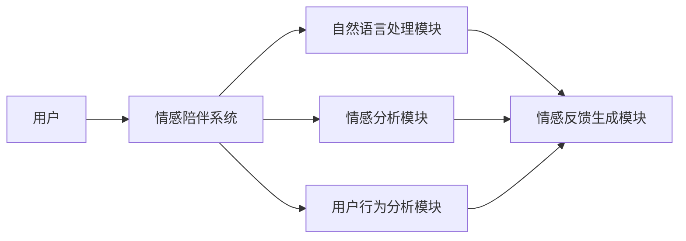
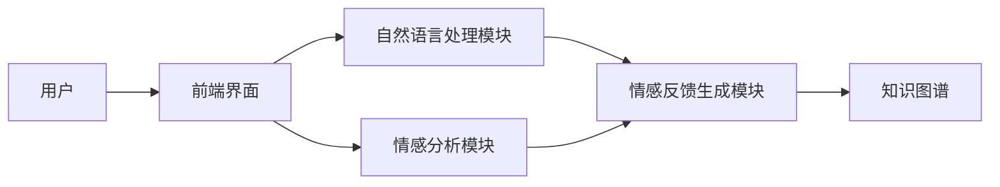
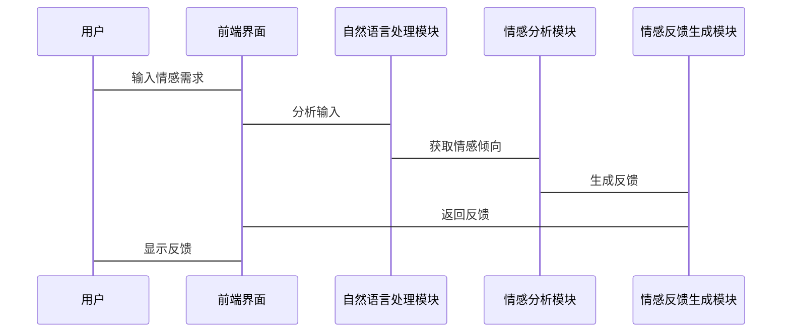

                 

# 构建AI Agent驱动的智能情感陪伴系统

## 关键词：
AI Agent, 情感陪伴系统, 自然语言处理, 情感计算, 多模态交互

## 摘要：
本文详细探讨了如何利用AI Agent技术构建智能情感陪伴系统，旨在解决传统情感陪伴系统在实时互动、情感理解和多模态交互等方面的局限性。通过分析核心概念、算法原理、系统架构，并结合项目实战，本文为读者提供了一套完整的解决方案，展示了如何利用自然语言处理和情感计算技术，打造一个能够理解和回应人类情感需求的智能系统。

---

# 目录

## 第一部分: AI Agent驱动的智能情感陪伴系统概述

### 第1章: 问题背景与需求分析

#### 1.1 情感陪伴系统的背景与现状
- 1.1.1 情感陪伴系统的定义与目标
- 1.1.2 当前情感陪伴系统的应用领域
- 1.1.3 传统情感陪伴系统的局限性

#### 1.2 AI Agent的核心概念与优势
- 1.2.1 AI Agent的基本概念与特点
- 1.2.2 AI Agent在情感陪伴中的应用潜力
- 1.2.3 AI Agent与传统情感陪伴系统的区别

#### 1.3 问题描述与解决方案
- 1.3.1 情感陪伴系统的核心问题
- 1.3.2 AI Agent驱动的解决方案
- 1.3.3 解决方案的边界与外延

### 第2章: 智能情感陪伴系统的核心要素

#### 2.1 情感计算与自然语言处理
- 2.1.1 情感计算的基本原理
- 2.1.2 自然语言处理在情感陪伴中的应用
- 2.1.3 情感分析算法的优缺点对比

#### 2.2 用户行为分析与情感建模
- 2.2.1 用户行为分析的基本方法
- 2.2.2 情感建模的核心要素
- 2.2.3 用户情感状态的动态变化模型

#### 2.3 AI Agent的多模态交互能力
- 2.3.1 多模态交互的定义与特点
- 2.3.2 文本、语音和视觉交互的结合
- 2.3.3 多模态数据融合的技术挑战

## 第二部分: AI Agent驱动的情感陪伴系统核心概念

### 第3章: AI Agent与情感陪伴系统的原理

#### 3.1 AI Agent的基本原理
- 3.1.1 AI Agent的感知与决策机制
- 3.1.2 基于知识图谱的情感推理
- 3.1.3 动态情感反馈的生成模型

#### 3.2 情感陪伴系统的实体关系图
- 图3-1: 情感陪伴系统的实体关系图

#### 3.3 核心概念对比表
| 概念 | 特性 | 优缺点 |
|------|------|--------|
| 情感陪伴系统 | 实时互动、情感理解 | 实时性不足、情感理解深度有限 |
| AI Agent | 智能决策、自主学习 | 开发复杂度高、需要大量数据支持 |

### 第4章: 情感分析与对话生成算法

#### 4.1 情感分析算法原理
- 4.1.1 基于规则的情感分析
- 4.1.2 基于机器学习的情感分析
- 4.1.3 深度学习模型（如LSTM、BERT）的应用

#### 4.2 对话生成算法
- 4.2.1 基于规则的对话生成
- 4.2.2 基于模板的对话生成
- 4.2.3 基于生成模型（如GPT）的对话生成

#### 4.3 情感反馈生成模型
- 4.3.1 基于情感强度的情感反馈生成
- 4.3.2 基于上下文的情感反馈生成
- 4.3.3 基于知识图谱的情感反馈生成

## 第三部分: 系统架构与实现

### 第5章: 系统架构设计

#### 5.1 问题场景介绍
- 情感陪伴系统的典型应用场景
- AI Agent在情感陪伴中的具体职责

#### 5.2 系统功能设计
- 领域模型设计
- 用户需求分析
- 功能模块划分

#### 5.3 系统架构设计
- 图5-1: 系统架构图

#### 5.4 系统接口设计
- API接口定义
- 数据交互格式
- 接口调用流程

#### 5.5 系统交互序列图
- 图5-2: 系统交互序列图

### 第6章: 项目实战

#### 6.1 环境安装与配置
- 开发工具安装
- 依赖库安装（如Python的NLTK、TensorFlow）

#### 6.2 核心代码实现
- 情感分析模块实现
- 对话生成模块实现
- 情感反馈生成模块实现

#### 6.3 代码解读与分析
- 关键代码段解读
- 代码实现细节分析
- 代码优化建议

#### 6.4 实际案例分析
- 案例一: 情感分析案例
- 案例二: 对话生成案例
- 案例三: 情感反馈生成案例

#### 6.5 项目总结
- 项目实现的关键点总结
- 项目中的常见问题及解决方案
- 项目经验与教训

## 第四部分: 最佳实践与拓展

### 第7章: 最佳实践

#### 7.1 小结
- 本章内容总结
- 关键点回顾

#### 7.2 注意事项
- 开发中的注意事项
- 项目部署中的注意事项
- 用户体验优化建议

#### 7.3 拓展阅读
- 相关领域书籍推荐
- 最新研究论文推荐
- 技术博客推荐

---

## 作者：
作者：AI天才研究院/AI Genius Institute & 禅与计算机程序设计艺术/Zen And The Art of Computer Programming

---

通过以上详细的目录设计，本文将系统地介绍构建AI Agent驱动的智能情感陪伴系统的各个方面，从理论到实践，帮助读者全面理解和掌握这一技术的核心内容。

