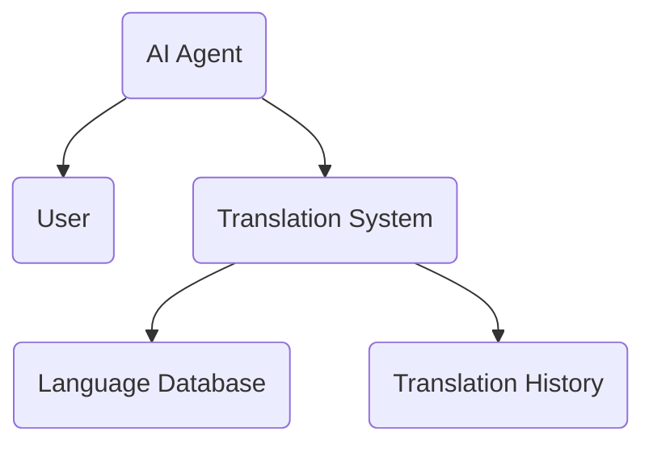
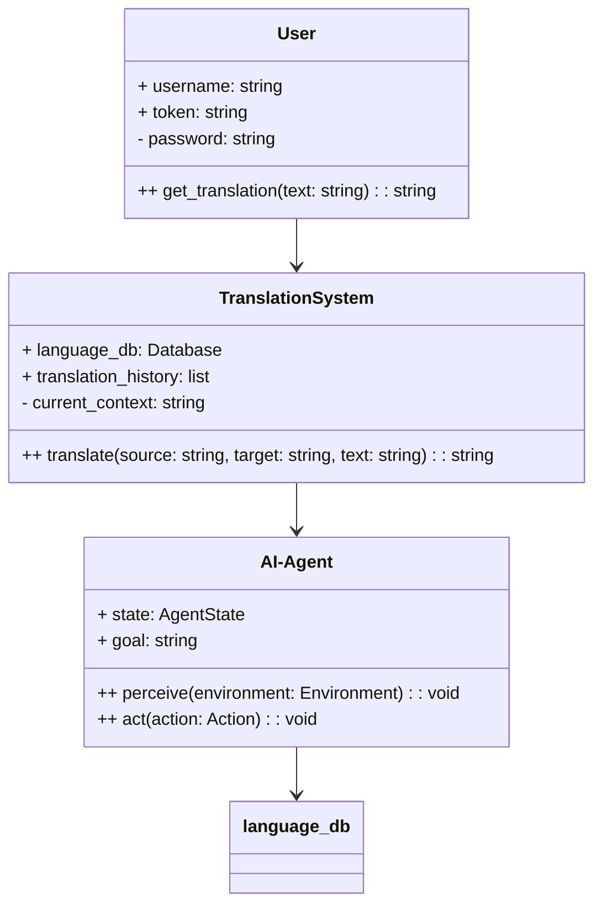
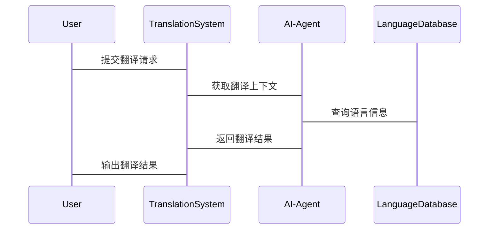

                 


# 构建AI Agent驱动的智能翻译系统

## 关键词
AI Agent, 智能翻译系统, 自然语言处理, 深度学习, 翻译技术

## 摘要
本文将详细介绍如何构建一个基于AI Agent的智能翻译系统。通过分析AI Agent的核心概念、智能翻译系统的技术特点，结合深度学习算法，构建一个高效、准确的翻译系统。文章将从背景介绍、核心概念、算法原理、系统架构设计到项目实战，全面解析如何实现一个AI Agent驱动的智能翻译系统。

---

# 第一部分: AI Agent驱动的智能翻译系统背景与概念

## 第1章: AI Agent与智能翻译系统背景介绍

### 1.1 AI Agent的核心概念
#### 1.1.1 AI Agent的定义与特点
AI Agent（人工智能代理）是指能够感知环境、自主决策并执行任务的智能实体。其特点包括：
- **自主性**：能够在没有外部干预的情况下自主运行。
- **反应性**：能够实时感知环境并做出反应。
- **目标导向**：具备明确的目标，能够为实现目标而行动。

#### 1.1.2 AI Agent的分类与应用场景
AI Agent可以分为**简单反射型**、**基于模型的反应型**、**目标驱动型**和**效用驱动型**。其应用场景包括智能助手、自动驾驶、智能客服等。

#### 1.1.3 AI Agent与智能翻译系统的结合
AI Agent可以作为智能翻译系统的驱动核心，通过代理的自主性和目标导向性，提升翻译的准确性和效率。

### 1.2 智能翻译系统的定义与特点
#### 1.2.1 智能翻译系统的定义
智能翻译系统是一种基于人工智能技术，能够理解上下文、语境，并提供高质量翻译的系统。其特点包括：
- **自然语言处理**：能够理解并生成自然语言文本。
- **上下文感知**：能够根据上下文调整翻译结果。
- **实时更新**：能够实时更新语言数据库。

#### 1.2.2 智能翻译系统的核心技术
智能翻译系统的核心技术包括：
- **自然语言处理（NLP）**：用于理解和生成自然语言。
- **机器学习**：用于训练翻译模型。
- **深度学习**：用于提高翻译的准确性和流畅性。

#### 1.2.3 智能翻译系统的应用场景
智能翻译系统广泛应用于跨语言沟通、多语言内容生成、实时翻译等领域。

### 1.3 AI Agent驱动智能翻译系统的背景与问题描述
#### 1.3.1 传统翻译系统的局限性
传统翻译系统依赖于固定的规则和词典，难以处理复杂的语境和语义，翻译结果往往不够准确。

#### 1.3.2 AI Agent驱动智能翻译系统的必要性
AI Agent能够通过深度学习和自然语言处理技术，实时感知上下文并做出调整，从而提升翻译的准确性和流畅性。

#### 1.3.3 系统的边界与外延
AI Agent驱动的智能翻译系统的边界包括用户输入、翻译结果输出，其外延包括自然语言处理技术、深度学习算法、语言数据库等。

### 1.4 系统的概念结构与核心要素
#### 1.4.1 系统的核心概念
- **AI Agent**：系统的驱动核心，负责感知环境和决策。
- **智能翻译系统**：系统的主体部分，负责具体的翻译任务。

#### 1.4.2 核心概念的属性特征对比
| 特性 | AI Agent | 智能翻译系统 |
|------|-----------|--------------|
| 自主性 | 高 | 高 |
| 反应性 | 高 | 高 |
| 目标导向 | 高 | 中 |
| 语言理解能力 | 中 | 高 |

#### 1.4.3 系统的ER实体关系图


---

## 第2章: AI Agent驱动智能翻译系统的算法原理

### 2.1 AI Agent的核心算法原理
#### 2.1.1 基于Transformer的AI Agent算法
- **Transformer模型**：由Google提出，广泛应用于自然语言处理领域。
- **编码器-解码器结构**：编码器将输入序列编码为上下文向量，解码器根据上下文向量生成输出序列。

#### 2.1.2 Transformer模型的数学模型
编码器部分：
$$
\text{Encoder}(x) = \text{LayerNorm}(x + \text{MultiHead}(x))
$$

解码器部分：
$$
\text{Decoder}(y, \text{Encoder}(x)) = \text{LayerNorm}(y + \text{MultiHead}(y, \text{Encoder}(x)))
$$

#### 2.1.3 Transformer模型的Python代码实现
```python
import torch
import torch.nn as nn

class Transformer(nn.Module):
    def __init__(self, d_model, nhead, dropout=0.1):
        super(Transformer, self).__init__()
        self.encoder = nn.TransformerEncoder(
            nn.TransformerEncoderLayer(d_model=d_model, nhead=nhead, dropout=dropout),
            num_layers=6
        )
        self.decoder = nn.TransformerDecoder(
            nn.TransformerDecoderLayer(d_model=d_model, nhead=nhead, dropout=dropout),
            num_layers=6
        )

    def forward(self, src, tgt):
        enc_output = self.encoder(src)
        dec_output = self.decoder(tgt, enc_output)
        return dec_output
```

### 2.2 智能翻译系统的算法实现
#### 2.2.1 翻译系统的整体流程
1. **输入处理**：接收用户输入的源语言文本。
2. **编码器处理**：将输入文本编码为上下文向量。
3. **解码器处理**：根据上下文向量生成目标语言文本。

#### 2.2.2 翻译系统的数学模型
编码器-解码器结构：
$$
\text{Encoder}(x) = \text{LayerNorm}(x + \text{MultiHead}(x))
$$
$$
\text{Decoder}(y, \text{Encoder}(x)) = \text{LayerNorm}(y + \text{MultiHead}(y, \text{Encoder}(x)))
$$

#### 2.2.3 翻译系统的Python代码实现
```python
def translate(transformer, src, tgt):
    with torch.no_grad():
        enc_output = transformer.encoder(src)
        dec_output = transformer.decoder(tgt, enc_output)
        return dec_output
```

---

## 第3章: AI Agent驱动智能翻译系统的系统架构设计

### 3.1 问题场景介绍
- **问题描述**：如何构建一个高效、准确的智能翻译系统？
- **解决方案**：基于AI Agent的智能翻译系统。

### 3.2 项目介绍
- **项目名称**：AI Agent驱动的智能翻译系统。
- **项目目标**：构建一个能够实时翻译多种语言的智能翻译系统。

### 3.3 系统功能设计
#### 3.3.1 领域模型


#### 3.3.2 系统架构设计


#### 3.3.3 系统接口设计
- **输入接口**：用户输入源语言文本。
- **输出接口**：系统输出目标语言文本。

#### 3.3.4 系统交互流程


---

## 第4章: AI Agent驱动智能翻译系统的项目实战

### 4.1 环境安装
```bash
pip install torch transformers
```

### 4.2 系统核心实现
```python
import torch
from transformers import AutoTokenizer, AutoModelForTranslation

class AI_Translator:
    def __init__(self, model_name):
        self.tokenizer = AutoTokenizer.from_pretrained(model_name)
        self.model = AutoModelForTranslation.from_pretrained(model_name)

    def translate(self, source_lang, target_lang, text):
        tokens = self.tokenizer(text, return_tensors="pt")
        outputs = self.model.generate(**tokens, forced_bos_token_id=self.tokenizer.get_special_token_id())
        return self.tokenizer.decode(outputs[0], skip_special_tokens=True)
```

### 4.3 代码应用解读与分析
- **代码解读**：上述代码定义了一个AI_Translator类，用于实现多语言翻译功能。
- **翻译过程**：
  1. **输入处理**：接收源语言、目标语言和待翻译文本。
  2. **分词与编码**：将文本分词并编码为张量。
  3. **模型推理**：通过模型生成目标语言文本。
  4. **结果解码**：将生成的张量解码为目标语言文本。

### 4.4 实际案例分析
- **案例描述**：将英文文本翻译为中文。
- **案例代码**：
```python
translator = AI_Translator("facebook/m2m-large-50")
result = translator.translate("en", "zh", "Hello, how are you?")
print(result)
```

### 4.5 项目小结
通过上述代码实现，我们可以看到AI Agent驱动的智能翻译系统的核心逻辑。AI Agent通过感知用户需求，驱动翻译系统完成翻译任务，整个过程高效且准确。

---

## 第5章: 最佳实践与总结

### 5.1 小结
本文详细介绍了如何构建一个AI Agent驱动的智能翻译系统，从背景介绍到算法实现，再到系统架构设计和项目实战，全面解析了系统的实现过程。

### 5.2 注意事项
- **数据安全**：确保用户数据的安全性。
- **模型更新**：定期更新翻译模型，提升翻译质量。
- **用户体验**：优化用户界面，提升用户体验。

### 5.3 拓展阅读
- **深度学习**：推荐阅读《Deep Learning》（Ian Goodfellow等著）。
- **自然语言处理**：推荐阅读《Natural Language Processing with PyTorch》（禤智鑫等著）。

---

## 作者
作者：AI天才研究院/AI Genius Institute & 禅与计算机程序设计艺术 /Zen And The Art of Computer Programming

