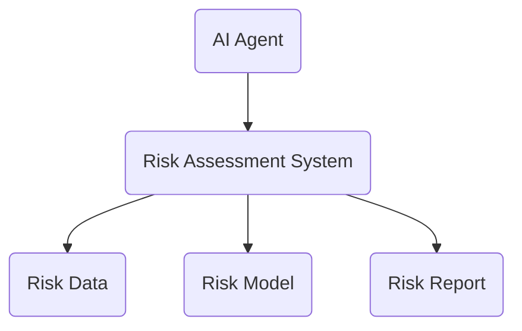
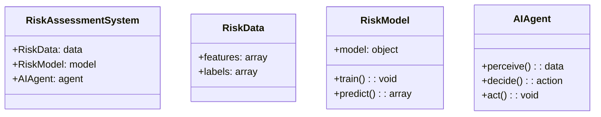
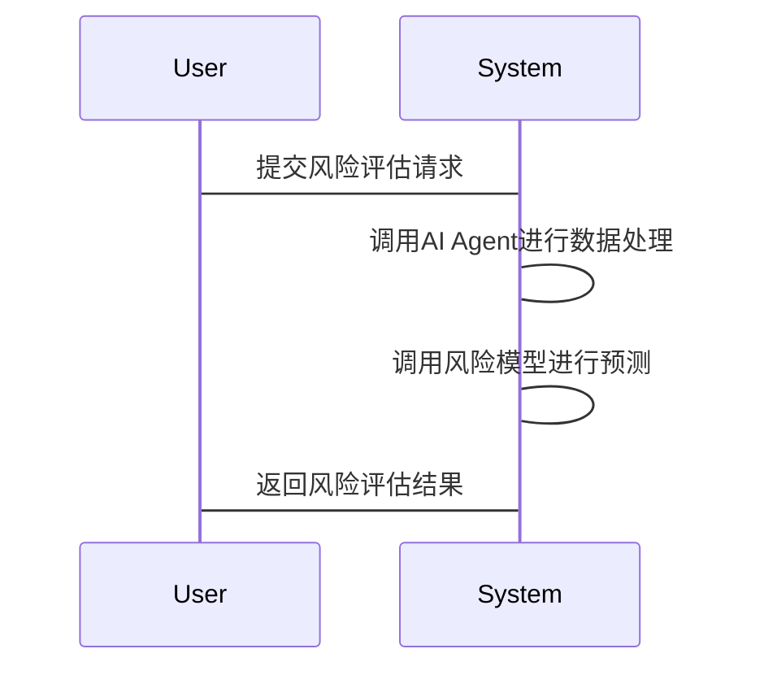

                 


# 构建AI Agent驱动的智能风险评估系统

> 关键词：AI Agent, 风险评估系统, 智能系统, 机器学习, 算法原理, 系统架构

> 摘要：本文深入探讨了如何利用AI Agent技术构建智能风险评估系统。文章首先介绍了AI Agent的基本概念及其在风险评估中的应用背景，然后详细阐述了AI Agent驱动的风险评估系统的核心概念与原理，包括算法实现、系统架构设计、项目实战等内容。通过理论与实践相结合的方式，本文为读者提供了一个全面的视角，帮助他们理解并掌握AI Agent驱动的智能风险评估系统的构建方法。

---

# 第一部分: AI Agent驱动的智能风险评估系统概述

# 第1章: AI Agent与风险评估系统概述

## 1.1 AI Agent的基本概念

### 1.1.1 什么是AI Agent
AI Agent（人工智能代理）是指能够感知环境、自主决策并采取行动的智能实体。它可以是一个软件程序、一个机器人或一个智能系统，其核心目标是通过感知和行动来优化特定目标的实现。

### 1.1.2 AI Agent的核心特征
- **自主性**：能够自主决策，无需人工干预。
- **反应性**：能够实时感知环境并做出反应。
- **目标导向性**：以明确的目标为导向进行行动。
- **学习能力**：能够通过数据和经验不断优化自身。

### 1.1.3 AI Agent的分类与应用场景
AI Agent可以分为**简单反射型**、**基于模型的反应型**、**目标驱动型**和**效用驱动型**。其应用场景包括智能客服、自动驾驶、智能助手、风险管理等领域。

## 1.2 风险评估系统的背景与意义

### 1.2.1 风险评估的基本概念
风险评估是指对潜在风险进行识别、量化和分析的过程，目的是为决策提供支持。传统风险评估方法通常依赖人工经验，存在效率低、精度差的问题。

### 1.2.2 传统风险评估的局限性
- **人工依赖性高**：依赖专家经验，效率低下。
- **动态性不足**：难以实时更新和调整。
- **数据处理能力有限**：难以处理大规模复杂数据。

### 1.2.3 AI Agent在风险评估中的优势
- **实时性**：能够快速响应环境变化。
- **智能性**：能够通过学习优化风险评估结果。
- **可扩展性**：适用于多种场景和数据规模。

## 1.3 AI Agent驱动的风险评估系统的特点

### 1.3.1 实时性与动态性
AI Agent能够实时感知环境变化，并动态调整风险评估模型。

### 1.3.2 智能性与自适应性
系统能够通过机器学习算法不断优化模型，适应新的数据和场景。

### 1.3.3 可扩展性与可定制性
系统架构设计灵活，能够根据需求进行扩展和定制。

## 1.4 本章小结

---

# 第二部分: AI Agent驱动的风险评估系统核心概念与原理

# 第2章: AI Agent与风险评估系统的关联

## 2.1 AI Agent在风险评估中的角色

### 2.1.1 数据采集与处理
AI Agent负责从多种数据源采集风险相关数据，并进行清洗和预处理。

### 2.1.2 风险分析与决策
通过机器学习算法，AI Agent对风险数据进行分析，生成风险评估结果，并提供决策建议。

### 2.1.3 结果反馈与优化
AI Agent根据反馈结果不断优化模型，提升风险评估的准确性。

## 2.2 风险评估系统的核心要素

### 2.2.1 数据源
包括历史数据、实时数据、外部数据等多种来源。

### 2.2.2 模型与算法
包括机器学习模型、概率模型、规则引擎等。

### 2.2.3 系统架构
包括数据处理层、模型计算层、结果展示层等。

## 2.3 AI Agent与风险评估系统的实体关系图



## 2.4 本章小结

---

# 第三部分: AI Agent驱动的风险评估系统算法原理

# 第3章: 基于概率的AI Agent风险评估算法

## 3.1 算法原理概述

### 3.1.1 概率论基础
概率论是风险评估的核心数学工具，用于量化风险的可能性和影响程度。

### 3.1.2 贝叶斯定理在风险评估中的应用
贝叶斯定理可以通过已知条件概率计算出目标事件的概率，广泛应用于风险分类和预测。

$$ P(A|B) = \frac{P(B|A) \cdot P(A)}{P(B)} $$

## 3.2 算法实现步骤

### 3.2.1 数据预处理
对原始数据进行清洗、归一化和特征提取。

### 3.2.2 模型训练
使用训练数据对机器学习模型进行训练，生成风险评估模型。

### 3.2.3 风险评估与结果输出
将待评估数据输入模型，计算风险概率并输出结果。

## 3.3 算法实现代码示例

```python
import numpy as np
from sklearn.naive_bayes import GaussianNB

# 示例数据
X = np.array([[2, 3], [5, 6], [7, 8]])
y = np.array([0, 1, 0])

# 模型训练
model = GaussianNB()
model.fit(X, y)

# 风险评估
new_data = np.array([[6, 7]])
predicted = model.predict(new_data)
print(predicted)
```

## 3.4 本章小结

---

# 第四部分: AI Agent驱动的风险评估系统架构设计

# 第4章: 系统分析与架构设计方案

## 4.1 项目背景与目标

### 4.1.1 项目背景
介绍AI Agent驱动的风险评估系统的应用场景和目标。

### 4.1.2 项目目标
实现一个能够实时感知、动态调整的智能风险评估系统。

## 4.2 系统功能设计

### 4.2.1 领域模型设计
通过Mermaid类图展示系统的功能模块和实体关系。



### 4.2.2 系统架构设计
通过Mermaid架构图展示系统的整体架构。


## 4.3 系统接口设计

### 4.3.1 数据接口
定义数据输入和输出的接口规范。

### 4.3.2 模型接口
定义模型训练和预测的接口规范。

## 4.4 系统交互设计

### 4.4.1 用户与系统交互流程
通过Mermaid序列图展示用户与系统的交互流程。



## 4.5 本章小结

---

# 第五部分: AI Agent驱动的风险评估系统项目实战

# 第5章: 项目实战

## 5.1 环境安装与配置

### 5.1.1 安装Python
安装Python 3.8及以上版本。

### 5.1.2 安装依赖库
安装numpy、scikit-learn等依赖库。

## 5.2 系统核心实现

### 5.2.1 数据处理模块
编写数据清洗和特征提取的代码。

```python
import pandas as pd
from sklearn.preprocessing import StandardScaler

# 数据加载
data = pd.read_csv('risk_data.csv')
# 数据清洗
data.dropna()
# 特征提取
X = data.drop('label', axis=1)
```

### 5.2.2 模型训练模块
使用机器学习算法训练风险评估模型。

```python
from sklearn.ensemble import RandomForestClassifier

# 模型训练
model = RandomForestClassifier()
model.fit(X, y)
```

### 5.2.3 系统交互模块
实现用户与系统的交互界面。

```python
def main():
    while True:
        user_input = input("请输入风险评估请求：")
        # 调用模型进行预测
        result = model.predict(user_input)
        print("风险评估结果：", result)

if __name__ == "__main__":
    main()
```

## 5.3 案例分析与结果解读

### 5.3.1 数据准备
准备一组测试数据，进行风险评估。

### 5.3.2 系统运行
运行系统，输入测试数据，观察输出结果。

### 5.3.3 结果分析
分析模型的预测结果，评估系统的准确性和可靠性。

## 5.4 本章小结

---

# 第六部分: 最佳实践与小结

# 第6章: 最佳实践与小结

## 6.1 最佳实践

### 6.1.1 数据质量管理
确保数据的准确性和完整性，避免噪声数据对模型的影响。

### 6.1.2 模型优化
通过超参数调优和特征选择优化模型性能。

### 6.1.3 系统维护
定期更新模型和优化系统架构，确保系统的稳定性和高效性。

## 6.2 小结

本文系统地介绍了AI Agent驱动的风险评估系统的构建过程，从核心概念到算法实现，从系统架构到项目实战，全面覆盖了构建智能风险评估系统的关键环节。通过本文的学习，读者可以掌握AI Agent在风险评估中的应用方法，并能够实际操作构建类似的智能系统。

## 6.3 注意事项

- 确保数据安全，避免数据泄露和滥用。
- 定期监控系统性能，及时发现和解决问题。
- 持续学习新技术，优化系统架构和算法模型。

## 6.4 拓展阅读

- 《机器学习实战》
- 《深入理解AI Agent》
- 《智能系统设计与实现》

---

# 作者：AI天才研究院 & 禅与计算机程序设计艺术

