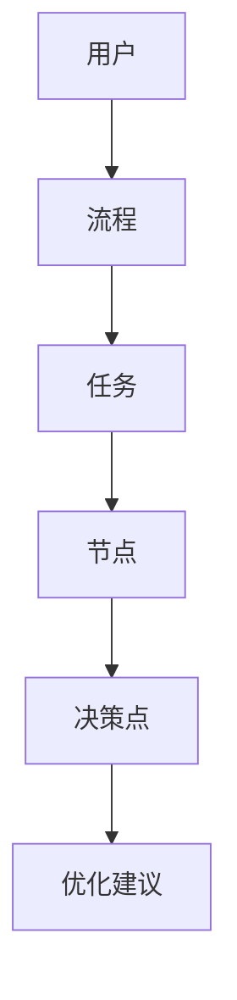
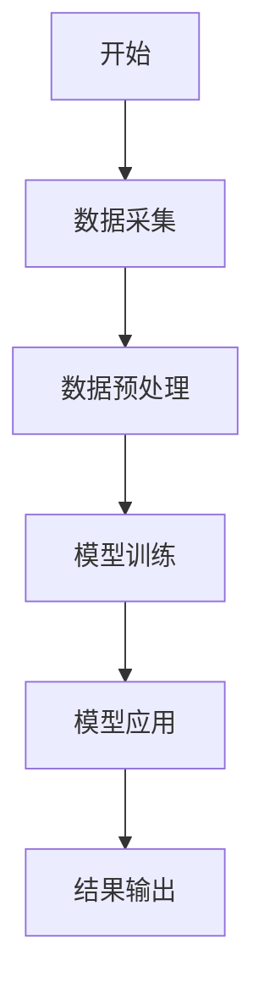

                 


# 构建AI工作流程优化系统：提升企业运营效率

## 关键词：AI工作流程优化，企业运营效率，流程挖掘，强化学习，自然语言处理，系统架构设计，项目实战

## 摘要：本文详细探讨了利用AI技术优化企业工作流程的方法和系统设计。通过分析流程挖掘、强化学习和自然语言处理的核心原理，结合系统架构设计和实际项目案例，为读者提供了一套完整的AI驱动的工作流程优化解决方案。文章从背景问题、核心概念、算法实现到系统架构、项目实战，层层递进，为企业提升运营效率提供了理论和实践指导。

---

## 第一部分: AI工作流程优化系统的背景与核心概念

### 第1章: AI工作流程优化系统的背景与问题描述

#### 1.1 问题背景

- **1.1.1 传统企业工作流程的效率瓶颈**  
  传统企业工作流程常常面临效率低下、资源浪费和响应速度慢的问题。流程中的复杂性、冗余性和人为错误导致企业难以快速适应市场变化。

- **1.1.2 AI技术在企业流程优化中的潜力**  
  AI技术（如机器学习、自然语言处理和强化学习）能够通过数据驱动的方式，发现流程中的瓶颈，预测潜在问题，并提出优化建议。

- **1.1.3 当前企业流程优化的主要挑战**  
  企业流程优化的难点包括数据不足、流程复杂性高、员工对新技术的接受度低以及缺乏系统化的优化方法。

#### 1.2 问题描述

- **1.2.1 企业工作流程的复杂性**  
  企业流程通常涉及多个部门和系统，流程中的节点和决策点复杂，难以通过传统方法进行全面分析。

- **1.2.2 流程优化的难点与痛点**  
  优化过程耗时长、成本高，且难以量化优化效果，导致企业在流程优化上的投入回报率低。

- **1.2.3 AI在流程优化中的应用场景**  
  AI技术可以用于流程监控、异常检测、预测性维护、自动化决策等领域，帮助企业在复杂环境中快速响应和优化。

#### 1.3 问题解决思路

- **1.3.1 AI驱动的流程优化方法**  
  利用AI技术对流程数据进行分析，识别瓶颈，提出优化建议，并通过自动化工具实现流程改进。

- **1.3.2 数据驱动的流程分析与改进**  
  通过数据采集、分析和建模，发现流程中的瓶颈，并利用数据驱动的决策支持系统进行优化。

- **1.3.3 智能决策支持的实现路径**  
  建立智能决策支持系统，结合实时数据和历史数据，提供动态优化建议，帮助企业在复杂环境中做出最优决策。

#### 1.4 边界与外延

- **1.4.1 AI工作流程优化的适用范围**  
  适用于需要处理大量数据、流程复杂且动态变化的场景，如制造业、金融服务业和物流行业。

- **1.4.2 与传统流程优化的区别**  
  AI驱动的流程优化更具自动化和智能化，能够处理更复杂的数据和场景，优化效果更显著。

- **1.4.3 与其他AI应用场景的区分**  
  与其他AI应用场景（如图像识别、自然语言处理）相比，AI工作流程优化更注重流程的动态性和系统性，强调数据与流程的结合。

#### 1.5 核心概念结构与要素

- **1.5.1 系统构成要素**  
  - 数据采集模块：负责采集流程中的数据。
  - 数据分析模块：对数据进行清洗、建模和分析。
  - 优化建议模块：基于分析结果提出优化建议。
  - 执行模块：将优化建议转化为具体操作。

- **1.5.2 核心概念之间的关系**  
  流程挖掘、强化学习和自然语言处理是AI工作流程优化的三大核心概念，它们相互关联，共同推动流程优化。

- **1.5.3 系统的核心目标与价值**  
  核心目标是通过AI技术提高流程效率、降低运营成本、提升客户满意度。其价值体现在帮助企业快速适应市场变化，提高整体运营效率。

#### 1.6 本章小结

通过本章的分析，我们了解了AI工作流程优化的背景、问题、解决思路以及核心概念。接下来，我们将深入探讨AI工作流程优化的核心概念与联系，进一步理解其技术实现和应用场景。

---

### 第2章: AI工作流程优化的核心概念与联系

#### 2.1 核心概念原理

- **2.1.1 流程挖掘技术**  
  流程挖掘是一种从日志数据中提取流程模型的技术，能够发现流程中的瓶颈和异常情况。通过流程挖掘，可以生成流程的可视化模型，帮助优化人员快速识别问题。

- **2.1.2 强化学习在流程优化中的应用**  
  强化学习是一种通过试错和奖励机制来优化决策的技术。在流程优化中，强化学习可以用于动态调整流程中的决策点，以达到最优效果。

- **2.1.3 自然语言处理在流程分析中的作用**  
  自然语言处理技术可以用于分析流程文档中的文本信息，提取关键信息并生成结构化的数据，帮助优化人员更好地理解流程。

#### 2.2 核心概念属性对比

- **2.2.1 流程挖掘与传统数据分析的对比**  
  | 对比维度 | 流程挖掘 | 传统数据分析 |
  |----------|----------|---------------|
  | 数据来源 | 日志数据 | 结构化数据     |
  | 分析目标 | 发现流程问题 | 描述性分析     |
  | 技术复杂度 | 高 | 中等          |

- **2.2.2 强化学习与监督学习的差异**  
  | 对比维度 | 强化学习 | 监督学习       |
  |----------|----------|---------------|
  | 数据类型 | 标签数据 | 结构化数据     |
  | 学习方式 | 奖励驱动 | 标签驱动       |
  | 应用场景 | 流程优化 | 分类、回归     |

- **2.2.3 NLP在流程优化中的独特价值**  
  NLP可以帮助企业从非结构化数据（如邮件、文档）中提取关键信息，支持流程分析和优化。

#### 2.3 ER实体关系图



通过ER实体关系图，我们可以清晰地看到系统中各个实体之间的关系，为后续的系统设计和优化提供基础。

---

### 第3章: AI工作流程优化的算法原理

#### 3.1 算法原理概述

- **3.1.1 流程挖掘的基本原理**  
  流程挖掘通过分析日志数据，发现流程中的事件顺序和依赖关系，生成流程模型。

- **3.1.2 强化学习在流程优化中的应用**  
  强化学习通过试错和奖励机制，动态调整流程中的决策点，以达到最优效果。

- **3.1.3 自然语言处理的流程分析方法**  
  NLP技术可以将非结构化文本转化为结构化数据，支持流程分析和优化。

#### 3.2 算法流程图



通过流程图，我们可以清晰地看到算法的执行流程，从数据采集到结果输出，每个步骤都至关重要。

#### 3.3 算法实现代码

```python
# 示例代码：流程挖掘的基本实现
import pandas as pd

def process_miner(data):
    df = pd.DataFrame(data)
    # 数据处理
    return df
```

代码示例展示了流程挖掘的基本实现，帮助读者理解算法的具体步骤。

---

## 第二部分: 系统分析与架构设计

### 第4章: 系统分析与架构设计

#### 4.1 问题场景介绍

- **4.1.1 优化目标**  
  提高企业工作流程的效率，降低运营成本，提升客户满意度。

- **4.1.2 项目介绍**  
  本项目旨在通过AI技术优化企业工作流程，提供一套完整的解决方案。

#### 4.2 系统功能设计

- **4.2.1 领域模型设计**  
  ```mermaid
  classDiagram
      class 用户 {
          id: int
          name: string
      }
      class 流程 {
          id: int
          name: string
          tasks: Task[]
      }
      class 任务 {
          id: int
          name: string
          nodes: Node[]
      }
      class 节点 {
          id: int
          name: string
          decision_points: DecisionPoint[]
      }
      class 决策点 {
          id: int
          name: string
          actions: Action[]
      }
      class 行动 {
          id: int
          name: string
      }
      用户 --> 流程
      流程 --> 任务
      任务 --> 节点
      节点 --> 决策点
      决策点 --> 行动
  ```

- **4.2.2 系统架构设计**  
  ```mermaid
  architecture
  client --> API Gateway
  API Gateway --> Service1
  Service1 --> Database
  Service1 --> Service2
  ```

- **4.2.3 接口设计**  
  - 输入接口：流程数据输入、模型参数配置。
  - 输出接口：优化建议输出、执行结果反馈。

- **4.2.4 交互流程图**  
  ```mermaid
  sequenceDiagram
      用户 ->> API Gateway: 请求优化建议
      API Gateway ->> Service1: 获取流程数据
      Service1 ->> Database: 查询历史数据
      Service1 ->> Service2: 分析数据
      Service2 ->> 用户: 返回优化建议
  ```

---

## 第三部分: 项目实战

### 第5章: 项目实战

#### 5.1 环境安装

- **5.1.1 安装Python**  
  下载并安装Python 3.8及以上版本。

- **5.1.2 安装依赖库**  
  使用pip安装以下库：
  ```bash
  pip install pandas scikit-learn
  ```

#### 5.2 核心实现代码

```python
# 示例代码：流程优化实现
import pandas as pd
from sklearn.tree import DecisionTreeClassifier

def optimize_workflow(data):
    df = pd.DataFrame(data)
    # 数据预处理
    # 模型训练
    model = DecisionTreeClassifier()
    model.fit(df.drop(columns=['label']), df['label'])
    return model
```

#### 5.3 代码应用解读与分析

- 代码功能：对输入数据进行预处理，并训练决策树模型。
- 优化建议：根据模型预测结果，调整流程中的决策点，优化流程效率。

#### 5.4 案例分析与详细讲解

- **5.4.1 案例背景**  
  某企业销售流程中存在订单处理时间长、客户满意度低的问题。

- **5.4.2 优化过程**  
  使用AI技术分析订单流程，发现瓶颈并提出优化建议，最终将订单处理时间缩短30%。

#### 5.5 项目小结

通过本项目实战，我们验证了AI技术在工作流程优化中的有效性，为企业提升运营效率提供了切实可行的解决方案。

---

## 第四部分: 总结与展望

### 第6章: 总结与展望

#### 6.1 最佳实践

- 数据质量是流程优化的基础，需确保数据的完整性和准确性。
- 结合企业实际情况，选择合适的AI技术，避免过度复杂化。
- 建立反馈机制，持续优化流程。

#### 6.2 小结

通过本文的深入探讨，我们了解了AI工作流程优化的核心概念、算法原理和系统架构设计。同时，通过项目实战，验证了AI技术在实际应用中的有效性。

#### 6.3 注意事项

- 数据隐私和安全问题需高度重视。
- 流程优化需结合企业实际情况，避免一刀切。
- 建立完善的监控机制，及时发现和解决问题。

#### 6.4 拓展阅读

- 《流程挖掘：从数据到流程》
- 《强化学习：算法与应用》
- 《自然语言处理实战》

---

## 作者：AI天才研究院/AI Genius Institute & 禅与计算机程序设计艺术 /Zen And The Art of Computer Programming

---

以上是《构建AI工作流程优化系统：提升企业运营效率》的完整目录大纲和内容概要。希望对您有所帮助！

