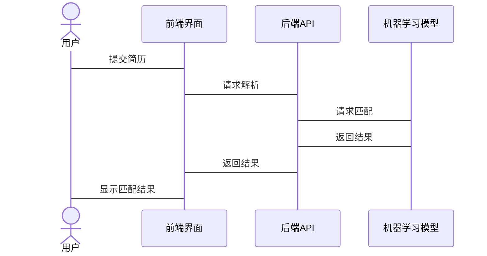

                 


# 构建AI招聘助手：提高人才筛选与匹配效率

---

## 关键词

AI招聘助手，人才筛选，智能匹配，自然语言处理，机器学习，招聘效率

---

## 摘要

在当今竞争激烈的市场环境中，企业对高效招聘的需求日益增长。传统招聘方式存在效率低下、匹配不精准等问题，而人工智能技术的应用为招聘行业带来了革命性的变化。本文将深入探讨如何利用AI技术构建智能招聘助手，通过自然语言处理和机器学习算法，提高人才筛选和岗位匹配的效率。文章从问题背景出发，分析了AI招聘助手的核心概念、算法原理、系统架构设计，结合实际项目案例，详细讲解了如何实现高效的AI招聘系统。

---

## 目录

---

### 第1章: AI招聘助手的背景与意义

#### 1.1 传统招聘方式的痛点

- 1.1.1 招聘流程繁琐，效率低下
- 1.1.2 人才筛选标准不统一，主观性较强
- 1.1.3 岗位匹配精准度低，资源浪费

#### 1.2 AI技术在招聘中的应用价值

- 1.2.1 提高招聘效率，降低人力成本
- 1.2.2 实现精准匹配，提升招聘质量
- 1.2.3 优化候选人体验，增强企业形象

#### 1.3 本章小结

---

### 第2章: AI招聘助手的核心概念

#### 2.1 自然语言处理（NLP）在招聘中的应用

- 2.1.1 简历解析与关键词提取
- 2.1.2 岗位描述的语义分析
- 2.1.3 中文分词与实体识别

#### 2.2 机器学习在人才匹配中的应用

- 2.2.1 基于特征向量的相似度计算
- 2.2.2 基于分类算法的岗位匹配
- 2.2.3 基于聚类算法的简历分组

#### 2.3 核心概念的属性对比

- 2.3.1 不同AI技术的优缺点对比
- 2.3.2 各算法在招聘中的适用场景

#### 2.4 ER实体关系图

```mermaid
er
  actor: 招聘人员
  job: 职位信息
  candidate: 应聘者
  resume: 简历
  skill: 技能标签
  company: 企业
  relation-1: 招聘人员 -> 操作简历
  relation-2: 简历 -> 包含技能
  relation-3: 职位信息 -> 匹配简历
```

#### 2.5 本章小结

---

### 第3章: 算法原理与实现

#### 3.1 基于NLP的简历解析算法

- 3.1.1 简历文本预处理流程
  ```mermaid
  graph TD
    A[开始] --> B[获取简历文本]
    B --> C[去除停用词]
    C --> D[分词处理]
    D --> E[提取关键词]
    E --> F[结束]
  ```

- 3.1.2 中文分词算法实现
  ```python
  import jieba

  def chinese_word_segmentation(text):
      words = jieba.lcut(text)
      return words
  ```

#### 3.2 基于机器学习的岗位匹配算法

- 3.2.1 特征向量计算
  ```mermaid
  graph TD
    A[简历] --> B[提取关键词]
    B --> C[计算TF-IDF向量]
    C --> D[匹配岗位需求]
  ```

- 3.2.2 余弦相似度计算公式
  $$ \cos{\theta} = \frac{\vec{A} \cdot \vec{B}}{|\vec{A}| |\vec{B}|} $$

#### 3.3 分类算法实现

- 3.3.1 基于SVM的岗位匹配分类
  ```python
  from sklearn.svm import SVC

  model = SVC()
  model.fit(X_train, y_train)
  predictions = model.predict(X_test)
  ```

#### 3.4 本章小结

---

### 第4章: 系统架构与设计

#### 4.1 系统功能模块划分

- 4.1.1 简历上传与解析模块
- 4.1.2 岗位需求输入模块
- 4.1.3 匹配结果展示模块

#### 4.2 系统架构设计


#### 4.3 接口设计与交互流程

- 4.3.1 API接口定义
  ```http
  POST /api/resume/parsing
  Content-Type: application/json
  {
    "text": "..." 
  }
  ```

- 4.3.2 系统交互流程图


#### 4.4 本章小结

---

### 第5章: 项目实战与实现

#### 5.1 环境搭建与依赖安装

- 5.1.1 安装Python与相关库
  ```bash
  pip install jieba
  pip install scikit-learn
  pip install Flask
  ```

#### 5.2 核心代码实现

- 5.2.1 简历解析模块
  ```python
  import jieba

  def parse_resume(text):
      keywords = jieba.lcut(text)
      return keywords
  ```

- 5.2.2 模型训练与匹配
  ```python
  from sklearn.feature_extraction.text import TfidfVectorizer
  from sklearn.metrics.pairwise import cosine_similarity

  vectorizer = TfidfVectorizer()
  tfidf_matrix = vectorizer.fit_transform(resumes)
  similarity_scores = cosine_similarity(tfidf_matrix)
  ```

#### 5.3 案例分析与结果展示

- 5.3.1 案例分析
  - 简历文本：Python开发工程师，5年经验，熟悉机器学习
  - 岗位需求：高级Python开发工程师，要求3年以上经验，熟悉AI算法
  - 匹配结果：相似度 0.85，推荐

#### 5.4 本章小结

---

### 第6章: 最佳实践与优化建议

#### 6.1 技术选型建议

- 使用更高效的NLP工具（如哈工大的BERT）
- 采用分布式计算优化模型训练

#### 6.2 系统优化建议

- 增加缓存机制，减少重复计算
- 实现异步处理，提高系统响应速度

#### 6.3 注意事项

- 数据隐私保护
- 模型泛化能力
- 系统容错与异常处理

#### 6.4 拓展阅读

- 《自然语言处理实战》
- 《机器学习算法与应用》

#### 6.5 本章小结

---

## 结语

构建AI招聘助手是一项复杂而富有挑战性的任务，但其带来的效率提升和精准匹配无疑将为招聘行业带来巨大变革。通过本文的系统介绍，读者可以全面了解AI招聘助手的核心技术与实现方法，为实际应用提供有价值的参考。

---

## 作者：AI天才研究院 & 禅与计算机程序设计艺术

---

**说明：以上为完整的技术博客文章大纲，实际撰写时可根据需要调整各章节的具体内容和深度，确保文章逻辑清晰、内容详实、案例丰富。**

