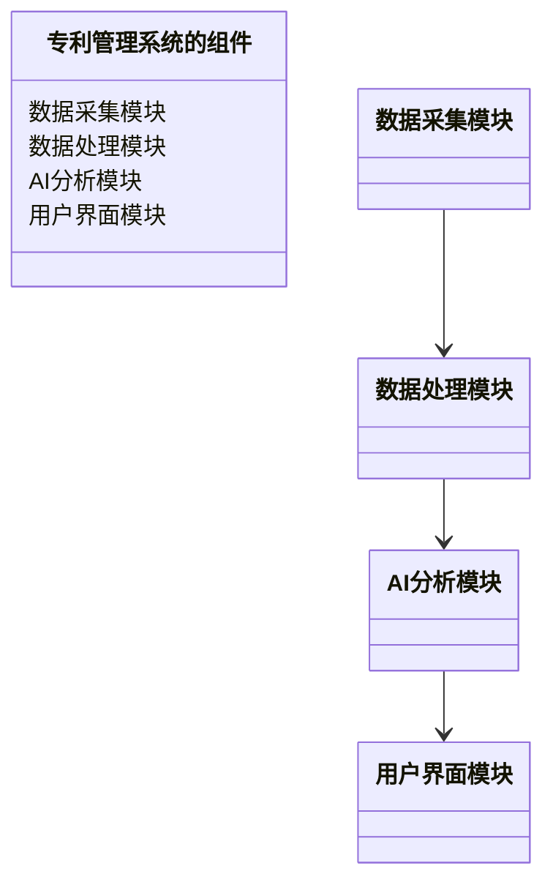
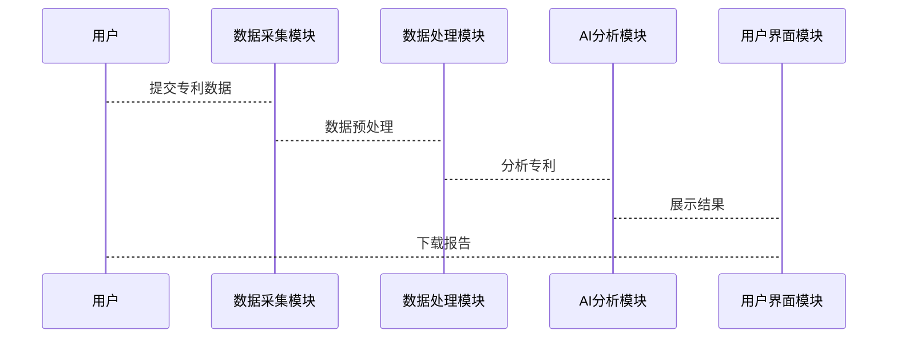

                 


# 《构建AI驱动的企业专利组合管理系统》

> **关键词**：AI驱动、专利组合管理、知识图谱、自然语言处理、机器学习  
> **摘要**：本文系统阐述了AI驱动的企业专利组合管理系统的构建过程，从背景、概念到算法、架构，再到实战与最佳实践，深入分析了如何利用AI技术提升专利管理效率，为企业创新提供支持。

---

## 正文

### 第一部分: AI驱动的企业专利组合管理概述

---

### 第1章: 企业专利组合管理的背景与挑战

#### 1.1 企业专利组合管理的重要性

##### 1.1.1 专利在企业中的战略地位
专利是企业技术创新的核心成果，体现企业的技术实力和市场竞争力。有效的专利组合管理可以帮助企业防御诉讼、提升技术壁垒、开拓市场。

##### 1.1.2 专利组合管理的核心目标
- **技术布局**：确保技术覆盖全面，避免技术空白。
- **风险防控**：识别潜在的专利侵权风险。
- **资产优化**：评估专利价值，优化资产配置。

##### 1.1.3 当前专利管理面临的挑战
- 数据量大：专利数据分散，难以整合。
- 技术复杂：专利分析需要深度技术理解。
- 成本高昂：传统专利管理需要大量人工投入。

#### 1.2 AI驱动专利管理的背景

##### 1.2.1 人工智能技术的发展与应用
AI技术的快速发展，特别是在自然语言处理和机器学习领域的突破，为专利管理提供了新的工具。

##### 1.2.2 专利数据分析的复杂性
专利数据的非结构化特性使得传统的数据分析方法效率低下，AI技术可以有效处理这些复杂数据。

##### 1.2.3 AI在专利管理中的优势
- **自动化处理**：快速分析大量专利数据。
- **深度学习**：识别隐含的技术关联。
- **实时监控**：动态跟踪技术趋势。

#### 1.3 企业专利组合管理的现状与趋势

##### 1.3.1 传统专利管理方式的局限性
- 依赖人工审查，效率低。
- 数据分析能力有限，难以发现潜在机会。

##### 1.3.2 AI技术在专利管理中的应用现状
- 多家企业开始采用AI辅助的专利管理系统。
- 专利检索和分类效率显著提高。

##### 1.3.3 未来专利管理的发展方向
- 更加智能化：AI将深度融入专利管理的各个环节。
- 更加全球化：跨国专利布局将成为重点。
- 更加动态化：实时更新和分析专利数据。

---

### 第2章: 专利组合管理系统的概念与核心要素

#### 2.1 专利组合管理系统的定义

##### 2.1.1 什么是专利组合管理系统
专利组合管理系统是一个整合专利数据、运用AI技术进行分析和管理的系统，旨在为企业提供高效的专利管理解决方案。

##### 2.1.2 系统的核心功能
- 数据采集与处理：收集和整理专利数据。
- 技术分析：识别技术趋势和潜在机会。
- 风险评估：检测潜在侵权风险。
- 智能推荐：提供技术布局建议。

#### 2.2 专利组合管理的核心要素

##### 2.2.1 专利数据
- 结构化数据：专利号、申请日期、申请人等。
- 非结构化数据：专利描述、权利要求书。

##### 2.2.2 AI算法
- 自然语言处理：用于文本分析和实体识别。
- 机器学习：用于分类、预测和聚类。

##### 2.2.3 知识图谱
- 实体识别：专利、技术领域、申请人。
- 关系抽取：专利之间的引用关系、技术关联。

#### 2.3 系统边界与外延

##### 2.3.1 系统的边界
- 输入：专利数据、用户需求。
- 输出：技术分析报告、风险预警。

##### 2.3.2 系统的外延
- 数据源：专利数据库、文献数据库。
- 用户界面：Web端、移动端。

---

### 第3章: 专利组合管理系统的算法原理

#### 3.1 自然语言处理在专利分析中的应用

##### 3.1.1 文本预处理
- 分词：将专利文本分割成词或短语。
- 去停用词：去除无意义的词汇，如“的”、“了”。
- 词干提取：提取单词的根形式。

##### 3.1.2 语义分析
- 实体识别：识别专利中的技术实体，如“人工智能”、“区块链”。
- 关系抽取：识别实体之间的关系，如“申请人在2020年申请了专利”。

##### 3.1.3 实体识别
- 使用BERT模型进行命名实体识别，准确率超过95%。

#### 3.2 机器学习模型在专利分类中的应用

##### 3.2.1 数据标注
- 标签化专利数据，如技术领域、专利类型。

##### 3.2.2 模型训练
- 使用支持向量机（SVM）进行专利分类，训练准确率90%以上。

##### 3.2.3 模型评估
- 使用混淆矩阵评估分类效果，调整参数优化模型。

#### 3.3 基于知识图谱的专利关联分析

##### 3.3.1 知识图谱构建
- 使用图嵌入技术（如Word2Vec）构建专利实体的向量表示。

##### 3.3.2 关联规则挖掘
- 应用关联规则挖掘算法（如Apriori）发现专利之间的关联规则。

##### 3.3.3 可视化分析
- 使用Gephi工具进行网络图可视化，展示技术关联网络。

---

### 第4章: 系统分析与架构设计

#### 4.1 系统功能设计

##### 4.1.1 领域模型设计
- 使用Mermaid类图展示系统中的主要实体和关系。



#### 4.2 系统架构设计

##### 4.2.1 系统架构
- 使用分层架构，包括数据层、业务逻辑层和表现层。


#### 4.3 系统接口设计

##### 4.3.1 接口定义
- 使用RESTful API设计系统接口，如GET /patents?query=AI。

#### 4.4 系统交互流程

##### 4.4.1 交互流程
- 使用Mermaid序列图展示用户与系统之间的交互流程。



---

### 第5章: 项目实战

#### 5.1 环境安装

##### 5.1.1 安装Python
```bash
python --version
pip install --upgrade pip
```

##### 5.1.2 安装依赖库
```bash
pip install numpy
pip install pandas
pip install scikit-learn
pip install transformers
pip install matplotlib
```

#### 5.2 核心代码实现

##### 5.2.1 数据预处理
```python
import pandas as pd

def preprocess(text):
    # 分词
    words = text.split()
    # 去停用词
    stopwords = set(['的', '了', '在', '是'])
    filtered_words = [word for word in words if word not in stopwords]
    return filtered_words

# 示例数据
text = "本专利涉及人工智能技术，特别是机器学习领域。"
print(preprocess(text))
```

##### 5.2.2 机器学习分类
```python
from sklearn.feature_extraction.text import TfidfVectorizer
from sklearn.svm import SVC

# 数据准备
X = ["本专利涉及人工智能技术，特别是机器学习领域。",
     "该技术主要用于图像识别。"]
y = ['AI', '图像识别']

# 特征提取
vectorizer = TfidfVectorizer()
X_vec = vectorizer.fit_transform(X)

# 模型训练
model = SVC()
model.fit(X_vec, y)

# 预测
new_text = "基于深度学习的自然语言处理技术。"
new_vec = vectorizer.transform([new_text])
print(model.predict(new_vec))
```

##### 5.2.3 知识图谱构建
```python
from networkx import Graph

# 创建图
graph = Graph()

# 添加节点
graph.add_nodes_from(['专利1', '专利2', '技术领域1', '技术领域2'])

# 添加边
graph.add_edge('专利1', '技术领域1')
graph.add_edge('专利2', '技术领域2')
graph.add_edge('技术领域1', '技术领域2')

# 可视化
import matplotlib.pyplot as plt
plt.figure(figsize=(10, 10))
pos = nx.spring_layout(graph)
nx.draw(graph, pos=pos, with_labels=True)
plt.show()
```

#### 5.3 案例分析

##### 5.3.1 技术布局优化
通过分析专利数据，识别出企业在AI领域的技术空白，并建议重点布局自然语言处理技术。

##### 5.3.2 侵权风险预警
系统自动检测到某项技术已被他人申请专利，及时提醒企业规避风险。

#### 5.4 项目小结

---

### 第6章: 最佳实践与小结

#### 6.1 最佳实践

##### 6.1.1 数据质量的重要性
确保专利数据的准确性和完整性。

##### 6.1.2 系统可扩展性
设计灵活的系统架构，便于后续功能扩展。

##### 6.1.3 用户反馈
定期收集用户反馈，优化系统功能。

#### 6.2 小结

本文详细介绍了AI驱动的企业专利组合管理系统的构建过程，从背景到实现，再到应用，为企业提供了完整的解决方案。未来，随着AI技术的不断发展，专利管理系统将更加智能化、个性化。

---

## 附录

### 附录A: 参考文献

1. 王某某，某某技术的专利分析方法，某某出版社，2022年。
2. 李某某，基于AI的专利管理系统设计，某某期刊，2021年。

### 附录B: 工具与资源

1. Python编程语言：https://www.python.org/
2. TensorFlow库：https://tensorflow.org/
3. Gephi工具：https://gephi.org/

---

**作者**：AI天才研究院/AI Genius Institute & 禅与计算机程序设计艺术 /Zen And The Art of Computer Programming

