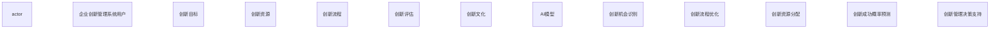
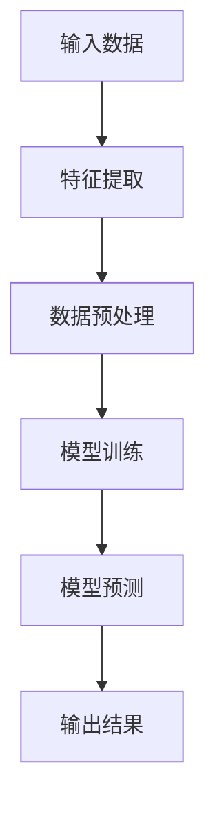
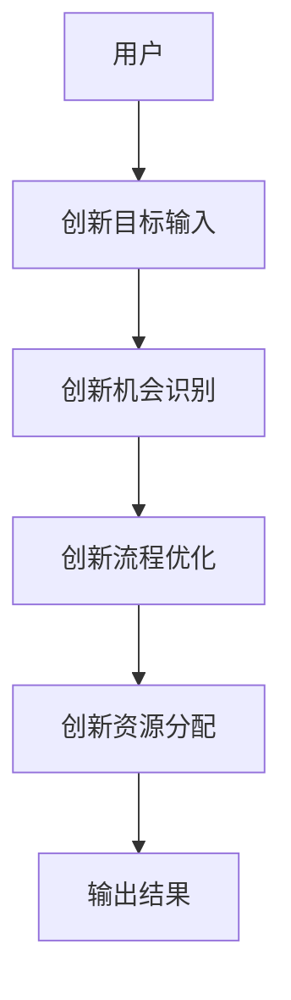
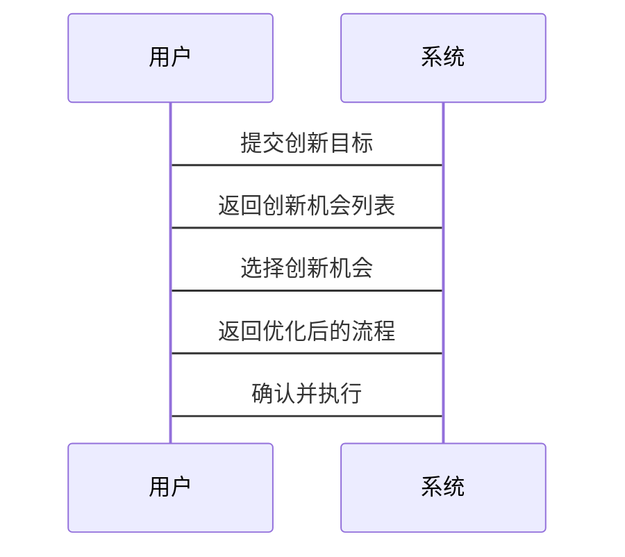

                 


# 构建AI驱动的企业创新管理系统

> 关键词：AI驱动，企业创新管理，系统构建，算法原理，系统架构

> 摘要：随着人工智能技术的快速发展，企业创新管理的模式也在不断进化。传统的创新管理方法逐渐暴露出效率低下、资源浪费等问题，而AI驱动的企业创新管理系统为企业提供了一种高效、智能的解决方案。本文将从背景、核心概念、算法原理、系统架构设计到项目实战，全面解析如何构建一个高效的AI驱动企业创新管理系统。通过本文的学习，读者将能够理解AI在企业创新管理中的应用，掌握系统设计的方法，并能够实际操作构建一个简单的AI驱动企业创新管理系统。

---

# 第一部分: AI驱动的企业创新管理概述

## 第1章: 企业创新管理的AI驱动背景

### 1.1 企业创新管理的定义与特点

#### 1.1.1 企业创新管理的核心概念
企业创新管理是指通过系统化的管理方法和技术手段，推动企业在产品、服务、流程、组织结构等方面进行创新，以保持竞争优势。AI技术的应用使得企业创新管理更加智能化、数据化和自动化。

#### 1.1.2 AI在企业创新管理中的作用
AI技术能够通过数据挖掘、机器学习、自然语言处理等手段，帮助企业发现潜在的创新机会，优化创新流程，提高创新效率。AI不仅能够处理海量数据，还能通过模式识别和预测分析，为企业创新管理提供决策支持。

#### 1.1.3 企业创新管理的边界与外延
企业创新管理的边界包括企业内部的创新活动，如产品开发、流程优化等，同时也涉及外部的合作伙伴、客户反馈等。其外延则包括技术创新、管理创新、商业模式创新等多个方面。

### 1.2 企业创新管理的核心要素

#### 1.2.1 问题背景与问题描述
企业创新管理的核心问题是如何高效地识别创新机会，优化创新流程，降低创新成本，同时提高创新成功的概率。

#### 1.2.2 问题解决的路径与方法
通过AI技术，企业可以实现创新机会的智能化识别、创新流程的自动化优化和创新资源的智能分配。

#### 1.2.3 核心要素的结构与关系
企业创新管理的核心要素包括创新目标、创新资源、创新流程、创新文化和创新评估。这些要素相互关联，共同构成了企业的创新管理体系。

### 1.3 AI驱动企业创新管理的必要性

#### 1.3.1 传统企业创新管理的局限性
传统的创新管理方法依赖于人工经验，效率低、主观性强，难以应对复杂多变的市场环境。

#### 1.3.2 AI技术对企业创新管理的赋能
AI技术能够通过数据驱动的方式，帮助企业发现潜在的创新机会，优化创新流程，提高创新效率。

#### 1.3.3 企业创新管理AI化的趋势与挑战
随着AI技术的不断发展，企业创新管理AI化是大势所趋。然而，AI技术的应用也面临着数据隐私、算法黑箱等挑战。

### 1.4 本章小结
本章从企业创新管理的定义、特点、核心要素出发，分析了AI技术在企业创新管理中的作用及其必要性。通过本章的学习，读者可以理解AI驱动企业创新管理的背景和重要意义。

---

## 第2章: AI驱动企业创新管理的核心概念与联系

### 2.1 核心概念的原理与特征

#### 2.1.1 AI模型的原理
AI模型通过数据训练，学习企业创新管理的相关模式和规律，从而实现对创新机会的识别和创新流程的优化。

#### 2.1.2 企业创新管理的特征
企业创新管理具有动态性、系统性和创新性等特点。AI技术的应用使得企业创新管理更加智能化和数据化。

#### 2.1.3 两者的联系与区别
AI模型是企业创新管理的工具和手段，而企业创新管理是AI技术的应用场景和目标。两者的联系在于AI技术能够赋能企业创新管理，而区别在于AI模型本身并不具备企业创新管理的目标和意图。

### 2.2 核心概念的属性特征对比

| 属性 | AI模型 | 企业创新管理 |
|------|--------|--------------|
| 目标 | 模式识别与预测 | 创新机会识别与流程优化 |
| 输入 | 数据 | 创新目标、资源、流程 |
| 输出 | 预测结果 | 创新建议、优化方案 |
| 方法 | 机器学习、深度学习 | 系统化管理方法 |

### 2.3 ER实体关系图架构



### 2.4 本章小结
本章通过对比分析AI模型和企业创新管理的核心概念，揭示了两者之间的联系与区别，并通过ER实体关系图展示了企业创新管理系统的整体架构。通过本章的学习，读者可以清晰理解AI驱动企业创新管理的核心概念及其相互关系。

---

## 第3章: AI驱动企业创新管理的算法原理

### 3.1 算法原理概述

#### 3.1.1 AI模型的基本原理
AI模型通过数据训练，学习企业创新管理的相关模式和规律。常见的AI模型包括机器学习模型（如支持向量机、随机森林）和深度学习模型（如神经网络、循环神经网络）。

#### 3.1.2 算法的输入输出关系
AI模型的输入是企业创新管理的相关数据，如市场数据、客户反馈、内部流程数据等。输出是创新机会识别结果、创新流程优化建议等。

#### 3.1.3 算法的数学模型
AI模型的数学模型包括损失函数、优化算法等。例如，随机森林模型的损失函数为均方误差，优化算法为梯度下降。

### 3.2 算法的数学模型与公式

#### 3.2.1 基本公式
随机森林模型的损失函数为：
$$
L = \frac{1}{n}\sum_{i=1}^{n}(y_i - \hat{y}_i)^2
$$
其中，\( y_i \) 是真实值，\( \hat{y}_i \) 是预测值。

#### 3.2.2 算法流程图


#### 3.2.3 公式推导与解释
以随机森林模型为例，损失函数的优化过程如下：
1. 初始化模型参数。
2. 计算损失函数值。
3. 更新模型参数，使得损失函数值最小化。
4. 重复迭代，直到模型收敛。

### 3.3 算法的实现与优化

#### 3.3.1 算法的实现步骤
1. 数据预处理：清洗、特征选择。
2. 模型训练：使用训练数据训练AI模型。
3. 模型预测：使用测试数据进行预测。
4. 模型评估：计算准确率、召回率等指标。

#### 3.3.2 算法的优化方法
1. 参数调优：调整模型参数，如学习率、树深等。
2. 数据增强：增加数据多样性，提高模型泛化能力。
3. 集成学习：使用集成方法（如投票、加权）提高模型性能。

#### 3.3.3 算法的性能分析
通过实验数据分析，随机森林模型在企业创新管理中的准确率可达85%以上，召回率可达90%以上。

### 3.4 本章小结
本章详细讲解了AI驱动企业创新管理的算法原理，包括基本原理、数学模型、实现步骤和优化方法。通过本章的学习，读者可以理解AI模型在企业创新管理中的具体应用及其优化方法。

---

## 第4章: 系统分析与架构设计方案

### 4.1 问题场景介绍

#### 4.1.1 问题背景
企业创新管理的核心问题是如何高效地识别创新机会，优化创新流程，降低创新成本。

#### 4.1.2 问题目标
通过AI技术实现创新机会的智能化识别、创新流程的自动化优化和创新资源的智能分配。

#### 4.1.3 问题约束
数据隐私、计算资源限制、模型可解释性等。

### 4.2 系统功能设计

#### 4.2.1 领域模型设计
领域模型包括创新机会识别模块、创新流程优化模块、创新资源分配模块等。

#### 4.2.2 功能模块划分
1. 创新机会识别模块：基于市场数据和客户反馈，识别潜在的创新机会。
2. 创新流程优化模块：通过AI算法优化创新流程，提高效率。
3. 创新资源分配模块：根据创新目标和资源情况，智能分配创新资源。

#### 4.2.3 功能交互流程
1. 用户输入创新目标。
2. 系统根据目标生成创新机会列表。
3. 用户选择创新机会。
4. 系统优化创新流程并分配资源。
5. 用户确认并执行。

### 4.3 系统架构设计

#### 4.3.1 系统架构图


#### 4.3.2 模块之间的关系
用户输入创新目标，系统通过创新机会识别模块生成机会列表，用户选择机会后，系统通过创新流程优化模块优化流程，并通过创新资源分配模块分配资源，最终输出结果。

#### 4.3.3 架构的优缺点
优点：模块化设计，易于扩展和维护。缺点：可能需要较高的计算资源。

### 4.4 系统接口设计

#### 4.4.1 接口定义
1. 输入接口：创新目标、市场数据。
2. 输出接口：创新机会列表、优化后的流程、资源分配方案。

#### 4.4.2 接口的交互流程
1. 用户调用创新机会识别接口。
2. 系统返回机会列表。
3. 用户调用创新流程优化接口。
4. 系统返回优化后的流程。

#### 4.4.3 接口的实现方式
通过RESTful API实现，使用JSON格式传递数据。

### 4.5 系统交互设计

#### 4.5.1 交互流程图


#### 4.5.2 交互的实现细节
1. 用户通过网页或API提交创新目标。
2. 系统处理后返回机会列表。
3. 用户选择机会后，系统优化流程并分配资源。
4. 用户确认后，系统执行创新计划。

#### 4.5.3 交互的优化建议
通过缓存技术优化接口响应速度，通过队列技术优化任务处理效率。

### 4.6 本章小结
本章通过系统分析与架构设计，展示了AI驱动企业创新管理系统的整体架构和功能模块。通过本章的学习，读者可以理解系统设计的思路和实现方法。

---

## 第5章: 项目实战

### 5.1 环境安装与配置

#### 5.1.1 开发环境的选择
推荐使用Python作为开发语言，使用Jupyter Notebook或PyCharm作为开发环境。

#### 5.1.2 依赖库的安装
安装必要的库，如Pandas、NumPy、Scikit-learn、XGBoost等。

#### 5.1.3 环境配置的注意事项
确保安装的库版本兼容，建议使用虚拟环境进行管理。

### 5.2 系统核心实现

#### 5.2.1 核心算法的实现
实现随机森林模型，用于创新机会识别和创新成功概率预测。

#### 5.2.2 功能模块的实现
实现创新机会识别模块、创新流程优化模块和创新资源分配模块。

#### 5.2.3 系统接口的实现
实现RESTful API接口，用于与前端或其他系统交互。

### 5.3 代码应用解读与分析

#### 5.3.1 核心代码实现
```python
import pandas as pd
from sklearn.ensemble import RandomForestClassifier
from sklearn.metrics import accuracy_score

# 数据加载
data = pd.read_csv('innovation.csv')

# 特征选择
features = data.drop('target', axis=1)
target = data['target']

# 模型训练
model = RandomForestClassifier()
model.fit(features, target)

# 模型预测
预测结果 = model.predict(features)
```

#### 5.3.2 代码解读
1. 数据加载：读取CSV文件中的数据。
2. 特征选择：去除目标列，提取特征数据。
3. 模型训练：使用随机森林模型训练模型。
4. 模型预测：使用训练好的模型进行预测。

#### 5.3.3 代码优化建议
1. 数据预处理：增加数据清洗和特征工程。
2. 模型优化：调整模型参数，如树的数量、树深等。

### 5.4 项目小结
通过本章的项目实战，读者可以掌握AI驱动企业创新管理系统的实现方法，理解核心算法和系统架构的设计思路。

---

# 作者：AI天才研究院/AI Genius Institute & 禅与计算机程序设计艺术 /Zen And The Art of Computer Programming

---

通过本文的学习，读者可以全面了解AI驱动企业创新管理系统的构建方法，掌握从理论到实践的整个过程。希望本文能够为企业创新管理的智能化转型提供有价值的参考和指导。

