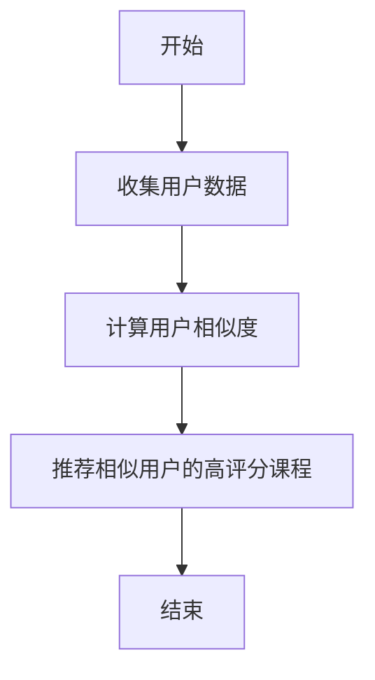
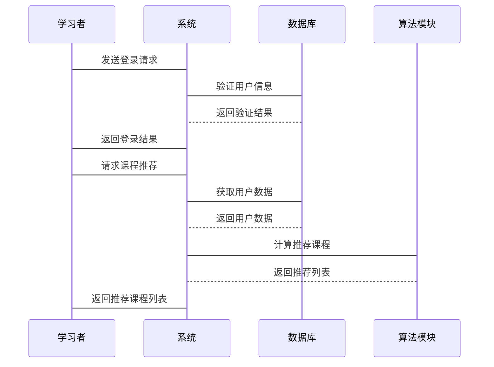

                 


# 构建AI驱动的企业学习管理系统(LMS)

## 关键词：AI驱动、企业学习管理系统、LMS、机器学习、个性化推荐

## 摘要：本文详细探讨了如何利用人工智能技术构建企业学习管理系统(LMS)，通过分析AI在LMS中的应用场景，结合算法原理和系统架构设计，提供了一个从理论到实践的全面指南。文章内容包括背景介绍、核心概念、算法实现、系统设计、项目实战及最佳实践，旨在帮助企业技术团队有效应用AI技术优化学习管理系统。

---

## 第一部分：AI驱动的LMS背景介绍

### 第1章：AI驱动的LMS背景概述

#### 1.1 AI驱动的LMS背景

随着企业对员工培训需求的增加，传统的学习管理系统（LMS）逐渐暴露出其局限性。传统LMS主要依赖手动管理学习内容和学员信息，缺乏个性化推荐和智能评估机制。而AI技术的引入，为LMS带来了新的可能性，能够通过数据驱动的方式优化学习体验，提高培训效果。

#### 1.2 问题背景

- **学习者需求多样化**：每个学习者的知识水平、学习习惯和兴趣点各不相同，传统LMS难以满足个性化需求。
- **企业培训效率低下**：传统LMS往往无法根据员工的具体情况推荐合适的学习内容，导致培训效果不佳。
- **内容更新与个性化推荐的挑战**：企业内部课程繁多，如何高效地更新和推荐合适的课程成为一大难题。

#### 1.3 问题解决

AI技术的应用能够显著改善这些问题。通过机器学习算法，AI可以分析学习者的行为数据，推荐适合的学习内容，并提供个性化的学习路径。此外，智能评估系统能够实时反馈学习效果，帮助企业优化培训策略。

#### 1.4 边界与外延

AI驱动的LMS不仅限于简单的推荐系统，还包括智能评估、自适应学习等多种功能。其边界主要集中在数据采集、个性化推荐和智能评估等领域，而外延则扩展到企业内部的知识管理和员工绩效提升。

#### 1.5 核心要素

- **数据采集与处理**：通过收集学习者的行为数据，如点击率、完成时间、测试成绩等，为AI算法提供输入。
- **个性化推荐系统**：基于学习者的数据，推荐适合的课程和学习资源。
- **智能评估与反馈**：通过算法分析学习效果，提供个性化的反馈和改进建议。

---

## 第二部分：核心概念与联系

### 第2章：AI与LMS的核心概念

#### 2.1 核心概念原理

AI驱动的LMS涉及多个核心概念，如机器学习、自然语言处理（NLP）、推荐系统等。机器学习用于分析学习者数据，NLP用于处理学习内容中的文本信息，推荐系统则根据分析结果为学习者推荐内容。

#### 2.2 概念对比分析

以下表格展示了AI和LMS核心概念的对比：

| 概念 | 数据需求 | 算法类型 | 应用场景 |
|------|----------|----------|----------|
| 机器学习 | 学习者行为数据 | 聚类、分类 | 个性化推荐 |
| 自然语言处理 | 课程内容文本 | 文本挖掘 | 内容分析 |
| 推荐系统 | 学习者行为数据 | 协同过滤 | 课程推荐 |

#### 2.3 ER实体关系图

以下是一个简单的ER实体关系图，展示了学习者、课程、评估和推荐系统之间的关系：

```mermaid
erd
  id: ID
  entity: 学习者
  attributes: 学号, 姓名, 邮箱
  entity: 课程
  attributes: 课程ID, 课程名称, 课程描述
  entity: 评估
  attributes: 评估ID, 评估分数, 评估时间
  entity: 推荐系统
  attributes: 推荐ID, 推荐课程ID, 推荐时间
  relationship: 学习者 -> 课程
  relationship: 学习者 -> 评估
  relationship: 课程 -> 推荐系统
```

---

## 第三部分：算法原理讲解

### 第3章：协同过滤算法

#### 3.1 算法概述

协同过滤是一种基于用户相似性推荐算法，常用于推荐系统中。其核心思想是通过找到与当前用户行为相似的其他用户，推荐这些用户喜欢的课程。

#### 3.2 算法实现步骤

1. 收集学习者的行为数据，如评分、点击率等。
2. 计算用户之间的相似度，常用余弦相似度。
3. 根据相似度高的用户，推荐他们评分高的课程。

#### 3.3 协同过滤流程图



#### 3.4 协同过滤代码示例

以下是一个基于余弦相似度的协同过滤算法的Python代码示例：

```python
import numpy as np

def cosine_similarity(user_profiles):
    # 计算余弦相似度矩阵
    user_profiles_matrix = np.array(user_profiles)
    dot_product = np.dot(user_profiles_matrix, user_profiles_matrix.T)
    norm = np.linalg.norm(user_profiles_matrix, axis=1)
    similarity = dot_product / (norm[:, np.newaxis] * norm[np.newaxis, :])
    return similarity

# 示例数据
user_profiles = [
    [1, 0, 1, 0],
    [0, 1, 0, 1],
    [1, 1, 1, 0],
    [0, 0, 1, 1]
]

similarity_matrix = cosine_similarity(user_profiles)
print(similarity_matrix)
```

#### 3.5 协同过滤数学公式

余弦相似度的计算公式为：

$$
\text{余弦相似度} = \frac{\vec{u} \cdot \vec{v}}{||\vec{u}|| \times ||\vec{v}||}
$$

其中，$\vec{u}$和$\vec{v}$分别表示两个用户的特征向量。

---

## 第四部分：系统分析与架构设计方案

### 第4章：问题场景介绍

#### 4.1 项目介绍

本项目旨在开发一个AI驱动的企业学习管理系统，通过机器学习和推荐算法，为学习者提供个性化的学习路径和内容推荐。

#### 4.2 系统功能设计

系统功能设计包括：

- **学习者管理**：注册、登录、个人信息管理。
- **课程管理**：课程发布、更新、分类。
- **个性化推荐**：基于学习者数据推荐课程。
- **学习效果评估**：评估学习者的学习效果并提供反馈。

#### 4.3 系统架构设计

分层架构包括：

- **前端**：网页或移动应用界面。
- **后端**：处理业务逻辑，如用户认证、课程推荐。
- **数据库**：存储用户数据、课程数据、评估数据。

#### 4.4 系统交互流程

以下是一个学习者登录和课程推荐的交互流程图：



---

## 第五部分：项目实战

### 第5章：环境安装与核心实现

#### 5.1 环境安装

需要安装以下工具和库：

- Python 3.8+
- TensorFlow 2.0+
- Flask 2.0+
- Scikit-learn 0.24+

安装命令示例：

```bash
pip install python==3.8
pip install tensorflow==2.0
pip install flask==2.0
pip install scikit-learn==0.24
```

#### 5.2 系统核心实现

以下是推荐系统的核心代码示例：

```python
from flask import Flask, request, jsonify
from sklearn.metrics.pairwise import cosine_similarity

app = Flask(__name__)

# 示例用户数据
user_profiles = [
    [1, 0, 1, 0],
    [0, 1, 0, 1],
    [1, 1, 1, 0],
    [0, 0, 1, 1]
]

@app.route('/recommend', methods=['POST'])
def recommend():
    data = request.json
    user_id = data['user_id']
    user_profile = user_profiles[user_id]
    similarity = cosine_similarity([user_profile], user_profiles)
    top_n = 3
    indices = np.argsort(similarity, axis=1)[0][:top_n]
    recommended_courses = [i for i in indices]
    return jsonify({'recommended_courses': recommended_courses})

if __name__ == '__main__':
    app.run(debug=True)
```

#### 5.3 案例分析

假设学习者A的行为数据为[1, 0, 1, 0]，协同过滤算法会计算其与其他用户的相似度，并推荐相似用户评分高的课程。具体来说，推荐课程ID为2和3。

#### 5.4 项目总结

通过以上实战，我们成功实现了基于协同过滤算法的课程推荐系统。但在实际应用中，可能需要考虑数据隐私、模型泛化能力等问题，建议在后续优化中加入数据加密和模型调优。

---

## 第六部分：最佳实践

### 第6章：AI驱动LMS的最佳实践

#### 6.1 小结

本文详细介绍了AI驱动的LMS的背景、核心概念、算法实现、系统架构设计及项目实战。通过理论与实践的结合，为读者提供了构建AI驱动LMS的全面指南。

#### 6.2 注意事项

- **数据隐私**：确保学习者数据的安全性和隐私性，遵守相关法律法规。
- **模型泛化能力**：在实际应用中，需要不断优化模型，提高其泛化能力，避免过拟合。
- **用户体验**：推荐系统不仅要准确，还要考虑用户体验，避免推荐过多或不相关的课程。

#### 6.3 拓展阅读

- 推荐阅读《机器学习实战》和《Python机器学习》等书籍，深入理解机器学习算法及其应用。

---

## 作者

作者：AI天才研究院/AI Genius Institute & 禅与计算机程序设计艺术 /Zen And The Art of Computer Programming

---

**感谢您的阅读！希望本文能为您提供有价值的见解和实践指导。**

