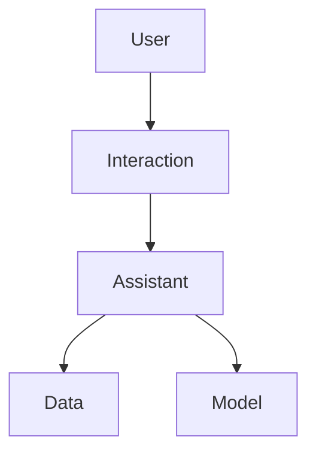
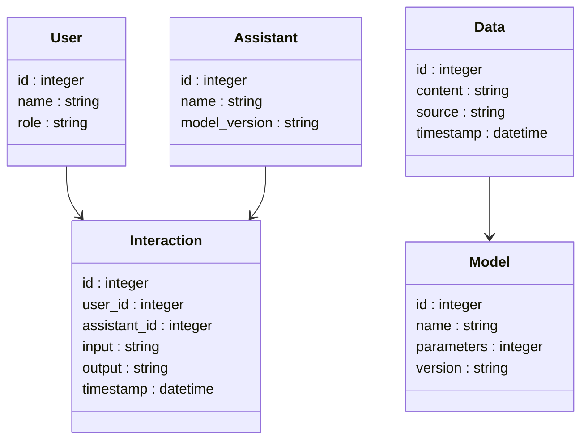
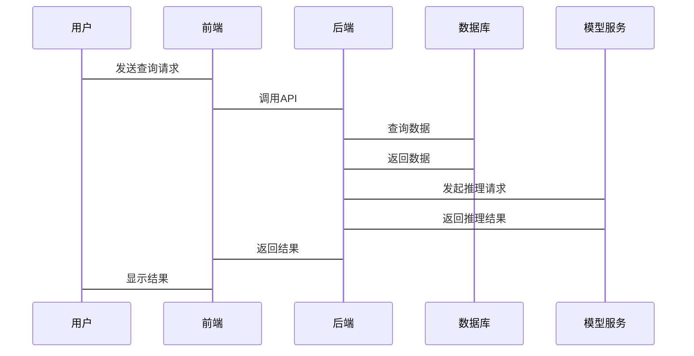

                 


# 构建AI驱动的企业智能助手：从概念到落地

## 关键词：AI, 企业智能助手, 大模型, 自然语言处理, 系统架构, 项目实战

## 摘要：  
本文详细探讨了构建AI驱动的企业智能助手的过程，从概念、原理到落地实施。首先介绍了企业智能助手的背景与核心概念，然后深入讲解了AI大模型的基本原理和算法，接着分析了系统的架构设计，最后通过实战案例展示了如何实现企业智能助手。本文旨在为技术人员和企业决策者提供全面的指导和实用的建议。

---

# 第一部分: 背景介绍与核心概念

## 第1章: 构建AI驱动的企业智能助手的背景与问题背景

### 1.1 问题背景

#### 1.1.1 传统企业助手的局限性
传统的企业助手通常依赖于预定义的规则和关键词匹配，无法处理复杂的语义理解和上下文推理。例如，当用户提出一个问题时，传统助手只能根据匹配的关键词提供固定的答案，无法根据上下文进行推理或生成自然语言的回复。

#### 1.1.2 AI驱动的潜力与优势
AI驱动的企业智能助手利用自然语言处理（NLP）和大模型技术，能够理解用户意图、上下文和复杂的问题，并生成自然流畅的回复。这种能力使得企业助手能够处理更广泛的任务，例如数据分析、决策支持和复杂问题的解答。

#### 1.1.3 企业智能助手的核心目标与价值
企业智能助手的核心目标是通过AI技术提高企业的效率和决策能力。其价值体现在以下几个方面：
1. 提供24/7的实时支持，提升用户体验。
2. 通过自动化处理任务，减少人工干预。
3. 提供智能化的决策支持，提高企业竞争力。

### 1.2 问题描述

#### 1.2.1 企业智能助手的定义与范围
企业智能助手是一种基于AI技术的企业级工具，能够通过自然语言处理和大模型技术，为企业提供智能化的助手服务。其范围包括但不限于信息检索、数据分析、任务处理和决策支持。

#### 1.2.2 问题的关键要素与边界
关键要素：
1. 用户需求：理解用户意图并提供相应的服务。
2. 数据处理：处理企业内部数据，提供实时信息。
3. 模型能力：利用大模型进行语义理解和生成。

边界：
1. 不涉及企业内部系统的核心业务逻辑。
2. 不处理涉及企业机密或敏感数据的任务。

#### 1.2.3 问题的复杂性与挑战
1. 数据隐私与安全：处理企业内部数据需要严格的数据保护措施。
2. 模型训练成本：大模型的训练需要大量的计算资源和时间。
3. 系统集成：与企业现有系统集成需要考虑兼容性和性能优化。

### 1.3 问题解决

#### 1.3.1 AI技术在企业助手中的应用
1. 自然语言处理（NLP）：用于理解和生成自然语言文本。
2. 大模型：用于语义理解和复杂任务的处理。

#### 1.3.2 企业智能助手的核心功能与模块
1. 用户交互模块：处理用户的输入并生成回复。
2. 数据处理模块：处理和分析企业数据。
3. 模型推理模块：利用大模型进行推理和生成。

#### 1.3.3 解决方案的可行性分析
1. 技术可行性：AI技术的成熟度和大模型的可用性。
2. 经济可行性：模型训练和系统集成的成本。
3. 时间可行性：项目实施的时间规划。

### 1.4 核心概念与联系

#### 1.4.1 实体关系图（ER图）分析
```mermaid
erDiagram
    user {
        User
        id : integer
        name : string
        role : string
    }
    assistant {
        Assistant
        id : integer
        name : string
        model_version : string
    }
    interaction {
        Interaction
        id : integer
        user_id : integer
        assistant_id : integer
        input : string
        output : string
        timestamp : datetime
    }
    user --> interaction
    assistant --> interaction
```

#### 1.4.2 核心概念属性对比表
| 概念       | 属性               | 描述                                             |
|------------|--------------------|--------------------------------------------------|
| 用户       | id, name, role     | 用户的基本信息                                   |
| 助手       | id, name, model_version | 助手的标识和模型版本                             |
| 交互       | id, user_id, assistant_id, input, output, timestamp | 用户与助手之间的交互记录                         |

#### 1.4.3 概念结构与核心要素组成


---

## 第2章: AI大模型的核心原理与技术基础

### 2.1 AI大模型的基本原理

#### 2.1.1 深度学习与大模型的原理
深度学习通过多层神经网络来学习数据的特征表示。大模型通过大量的参数和层次结构，能够捕捉复杂的语义信息。

#### 2.1.2 大模型的训练机制
大模型的训练通常采用监督学习和无监督学习的结合。监督学习用于任务特定的优化，无监督学习用于模型的预训练。

#### 2.1.3 模型的调优与优化
模型调优包括参数调整、优化算法选择和模型剪枝等技术，以提高模型的性能和效率。

### 2.2 AI大模型的核心技术

#### 2.2.1 自然语言处理（NLP）技术
NLP技术用于理解和生成自然语言文本，包括分词、句法分析和语义理解。

#### 2.2.2 大模型的推理机制
大模型通过上下文理解和生成推理结果，能够处理复杂的问题和任务。

#### 2.2.3 模型的可解释性与鲁棒性
可解释性是指模型决策过程的透明性，鲁棒性是指模型在面对噪声和异常输入时的稳定性和准确性。

### 2.3 大模型与传统AI的区别

#### 2.3.1 传统AI的局限性
传统AI依赖于规则和关键词匹配，无法处理复杂的语义理解和生成任务。

#### 2.3.2 大模型的优势与特点
1. 强大的语义理解能力。
2. 能够处理多种任务和场景。
3. 高度的灵活性和可扩展性。

#### 2.3.3 大模型的应用场景与边界
应用场景：
1. 客户服务：通过自然语言处理提供实时支持。
2. 信息检索：帮助企业快速获取所需信息。
3. 数据分析：通过生成报告和可视化提供决策支持。

边界：
1. 不涉及企业核心业务逻辑。
2. 不处理涉及机密或敏感数据的任务。

---

## 第3章: AI大模型的算法原理与数学模型

### 3.1 算法原理

#### 3.1.1 大模型的训练流程
1. 数据预处理：清洗、分词和标注。
2. 模型训练：使用预训练和微调技术。
3. 模型调优：优化参数和超参数。

#### 3.1.2 模型的输入与输出机制
输入：用户查询或指令。
输出：生成的回复或执行的任务。

#### 3.1.3 模型的推理与生成过程
模型通过解码器生成回复，采用贪心算法或贝叶斯推理。

### 3.2 数学模型与公式

#### 3.2.1 概率分布与损失函数
交叉熵损失函数：
$$
\text{Loss} = -\sum_{i=1}^{n} y_i \log p(y_i)
$$

#### 3.2.2 

---

# 第四部分: 项目实战与系统实现

## 第4章: 系统分析与架构设计

### 4.1 系统功能设计

#### 4.1.1 系统功能模块
1. 用户交互模块：处理用户输入和生成回复。
2. 数据处理模块：处理和分析企业数据。
3. 模型推理模块：利用大模型进行推理和生成。

#### 4.1.2 功能模块设计


### 4.2 系统架构设计

#### 4.2.1 系统架构图


### 4.3 系统接口设计

#### 4.3.1 API接口设计
1. 用户身份验证接口：`POST /auth`
2. 信息查询接口：`GET /data/{id}`
3. 模型推理接口：`POST /model/infer`

#### 4.3.2 系统交互流程


---

## 第5章: 项目实战与系统实现

### 5.1 项目环境安装

#### 5.1.1 安装Python和依赖
```bash
pip install python
pip install numpy
pip install tensorflow
pip install transformers
```

### 5.2 系统核心实现

#### 5.2.1 自然语言处理模块
```python
from transformers import AutoTokenizer, AutoModelForSeq2Seq
tokenizer = AutoTokenizer.from_pretrained('model_name')
model = AutoModelForSeq2Seq.from_pretrained('model_name')
def generate_response(input_text):
    inputs = tokenizer(input_text, return_tensors='np')
    outputs = model.generate(**inputs)
    response = tokenizer.decode(outputs[0], skip_special_tokens=True)
    return response
```

### 5.3 代码应用解读与分析

#### 5.3.1 代码功能分析
1. 使用预训练模型进行自然语言处理。
2. 生成自然语言回复。

### 5.4 实际案例分析与详细讲解

#### 5.4.1 案例分析
用户提出一个复杂问题，系统通过自然语言处理模块生成回复。

#### 5.4.2 代码实现细节
1. 使用预训练模型进行推理。
2. 返回自然流畅的回复。

### 5.5 项目小结

#### 5.5.1 项目总结
通过本项目的实现，展示了如何利用AI技术构建企业智能助手。

---

# 第五部分: 最佳实践与总结

## 第6章: 最佳实践与总结

### 6.1 最佳实践 tips
1. 数据隐私保护：确保数据的安全性和合规性。
2. 模型优化：通过模型剪枝和量化技术优化性能。
3. 系统集成：与企业现有系统无缝集成。

### 6.2 小结
通过本文的讲解，读者可以全面了解如何构建AI驱动的企业智能助手，从概念、原理到落地实施。

### 6.3 注意事项
1. 数据隐私和安全是关键。
2. 模型性能优化是长期任务。
3. 系统集成需要详细规划。

### 6.4 拓展阅读
推荐书籍和资源，帮助读者进一步深入学习。

---

# 结语

构建AI驱动的企业智能助手是一个复杂而有意义的工程，通过本文的讲解，读者可以掌握从概念到落地的整个过程。未来，随着AI技术的发展，企业智能助手将发挥更大的作用。

---

# 作者：AI天才研究院/AI Genius Institute & 禅与计算机程序设计艺术 /Zen And The Art of Computer Programming

