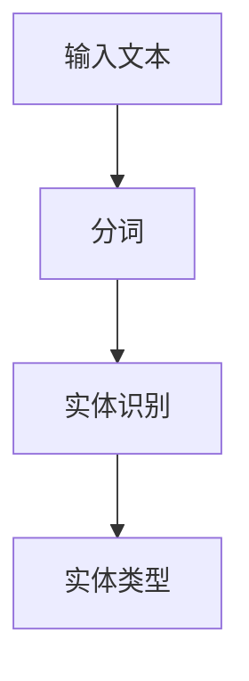
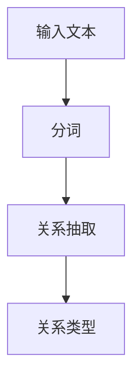
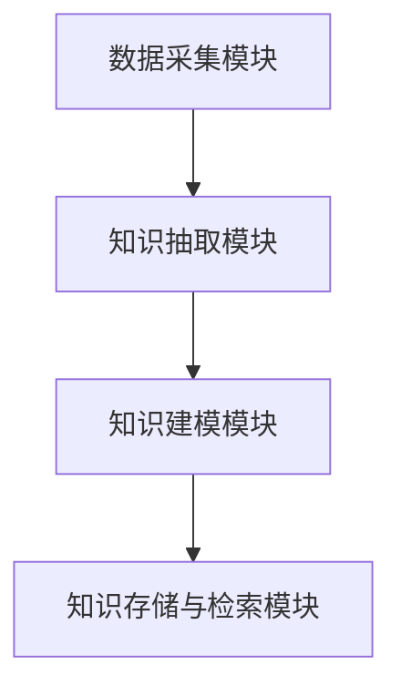
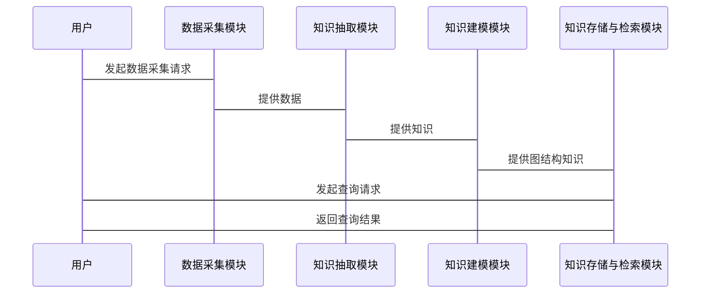

                 


# 构建AI驱动的企业知识图谱：深化领域理解

> 关键词：企业知识图谱, AI驱动, 知识表示, 图数据库, NLP, 实体识别, 知识融合

> 摘要：本文详细探讨了如何构建AI驱动的企业知识图谱，从核心概念、构建流程、算法原理到系统架构，再到项目实战，全面解析了企业知识图谱的构建方法。通过理论与实践相结合的方式，深入分析了知识图谱在企业中的应用价值和实际应用场景，帮助读者理解并掌握构建企业知识图谱的关键技术与方法。

---

# 第一部分: 企业知识图谱的背景与基础

## 第1章: 知识图谱概述

### 1.1 知识图谱的定义与背景

#### 1.1.1 知识图谱的定义
知识图谱是一种以图结构形式表示知识的语义网络，其中节点表示实体或概念，边表示实体之间的关系。知识图谱通过将分散的知识点连接起来，构建一个全局化的知识网络，能够帮助机器理解和推理知识。

#### 1.1.2 知识图谱的发展历程
知识图谱的概念起源于20世纪60年代的知识工程，经历了从专家系统到语义网络，再到现代的知识图谱构建技术的发展。近年来，随着人工智能和大数据技术的快速发展，知识图谱在各个领域的应用越来越广泛。

#### 1.1.3 知识图谱在企业中的应用价值
在企业中，知识图谱可以用于知识管理、智能问答、推荐系统、风险控制等领域，帮助企业更好地管理和利用其知识资产。

---

### 1.2 企业知识图谱的核心概念

#### 1.2.1 知识表示与知识建模
知识表示是将知识以计算机能够理解的形式表示出来，通常包括实体、关系和属性三部分。知识建模则是将知识表示为图结构的过程。

#### 1.2.2 知识图谱的构建流程
知识图谱的构建流程包括数据准备、知识抽取、知识建模、知识融合、知识存储与索引、知识应用等步骤。

#### 1.2.3 知识图谱的存储与查询
知识图谱的存储通常采用图数据库，如Neo4j、OrientDB等。查询语言如SPARQL可以用于从图数据库中获取知识。

---

# 第二部分: 企业知识图谱的核心概念与构建流程

## 第3章: 知识图谱的核心概念与联系

### 3.1 知识图谱的核心要素

#### 3.1.1 实体与概念
实体是指具体存在的事物，如“人”、“公司”、“产品”等。概念则是抽象的类别，如“类别”、“属性”等。

#### 3.1.2 关系与属性
关系描述实体之间的关联，如“属于”、“属于”等。属性描述实体的特征，如“颜色”、“价格”等。

#### 3.1.3 知识图谱的语义网络结构
知识图谱的语义网络结构通过实体和关系的连接，形成一个复杂的网络，能够表示丰富的语义信息。

### 3.2 知识图谱的核心概念原理

#### 3.2.1 实体识别与关系抽取
实体识别是通过NLP技术从文本中提取出实体，关系抽取则是识别出实体之间的关系。

#### 3.2.2 知识融合与冲突处理
知识融合是将多个来源的知识整合到一个知识图谱中，冲突处理则是解决不同来源知识之间的冲突。

#### 3.2.3 知识图谱的可扩展性与灵活性
知识图谱需要具有良好的可扩展性和灵活性，以适应不同领域和不同规模的应用需求。

### 3.3 知识图谱的ER实体关系图

```mermaid
er
  actor: 实体
  relationship: 关系
  attribute: 属性
  actor --> relationship
  relationship --> attribute
```

---

## 第4章: 知识图谱的构建算法与数学模型

### 4.1 知识抽取与表示算法

#### 4.1.1 实体识别算法



实体识别算法通常采用基于规则的NLP技术或深度学习模型，如CRF（条件随机场）和LSTM（长短期记忆网络）。

#### 4.1.2 关系抽取算法



关系抽取算法通常采用基于模式匹配的规则和基于深度学习的模型，如CNN（卷积神经网络）和注意力机制。

### 4.2 知识融合与推理算法

#### 4.2.1 知识融合算法
知识融合算法包括实体对齐、属性对齐和关系对齐。常用算法包括基于相似度的对齐和基于学习的对齐。

#### 4.2.2 知识推理算法
知识推理算法包括基于规则的推理和基于图的推理。常用算法包括RDF（资源描述框架）和SPARQL查询。

---

# 第三部分: 企业知识图谱的系统架构设计

## 第5章: 系统功能设计与实现

### 5.1 系统功能模块设计

#### 5.1.1 数据采集模块
数据采集模块负责从多种数据源采集数据，包括结构化数据和非结构化数据。

#### 5.1.2 知识抽取模块
知识抽取模块负责从数据中提取实体、关系和属性。

#### 5.1.3 知识建模模块
知识建模模块负责将提取的知识构建为图结构。

#### 5.1.4 知识存储与检索模块
知识存储与检索模块负责将图结构的知识存储到图数据库中，并支持高效的查询。

### 5.2 系统架构设计

#### 5.2.1 系统架构图



#### 5.2.2 系统接口设计
系统接口设计包括数据接口、查询接口和应用接口。

#### 5.2.3 系统交互流程



---

## 第6章: 项目实战与案例分析

### 6.1 项目背景与目标

#### 6.1.1 项目背景
本项目旨在构建一个医疗领域的知识图谱，帮助医疗行业更好地管理和利用其知识资产。

#### 6.1.2 项目目标
通过构建医疗知识图谱，实现医疗信息的高效查询、知识推理和智能应用。

### 6.2 项目核心实现

#### 6.2.1 环境安装
安装必要的开发工具和库，如Python、Jupyter Notebook、NLTK、spaCy、Neo4j等。

#### 6.2.2 数据准备
从公开的医疗数据源获取数据，进行清洗和预处理。

#### 6.2.3 核心代码实现

```python
from spacy.lang.zh import Chinese
import spacy

# 初始化中文分词器
nlp = Chinese()

# 定义实体识别函数
def extract_entities(text):
    doc = nlp(text)
    entities = []
    for ent in doc.ents:
        entities.append((ent.text, ent.label_))
    return entities

# 定义关系抽取函数
def extract_relations(text):
    doc = nlp(text)
    relations = []
    for i, token in enumerate(doc):
        if token.dep_ == 'ROOT':
            relations.append((token.text, i))
    return relations
```

#### 6.2.4 代码解读与分析
上述代码示例展示了如何使用spaCy进行实体识别和关系抽取。实体识别函数`extract_entities`将文本中的实体提取出来，关系抽取函数`extract_relations`将文本中的关系提取出来。

#### 6.2.5 案例分析
通过实际案例分析，展示知识图谱在医疗领域的应用效果和价值。

---

## 第7章: 总结与展望

### 7.1 总结
本文详细探讨了如何构建AI驱动的企业知识图谱，从核心概念、构建流程、算法原理到系统架构，再到项目实战，全面解析了企业知识图谱的构建方法。

### 7.2 未来展望
随着人工智能和大数据技术的不断发展，知识图谱将在更多领域得到广泛应用。未来的研究方向包括知识图谱的动态更新、跨领域的知识融合、知识图谱的可视化与人机交互等。

---

# 作者：AI天才研究院/AI Genius Institute & 禅与计算机程序设计艺术 /Zen And The Art of Computer Programming

