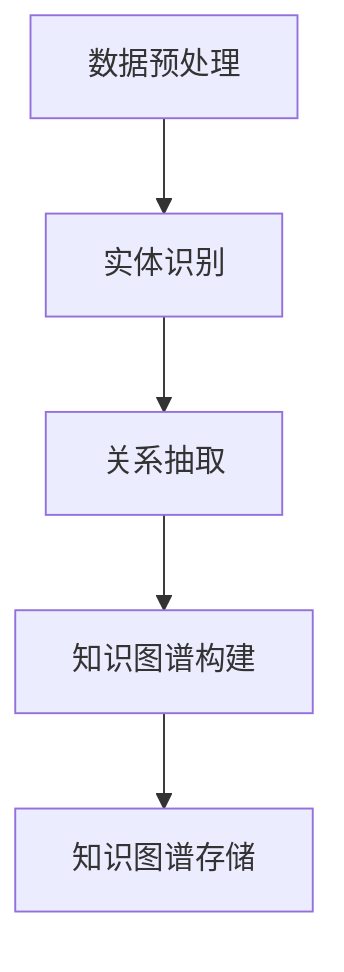
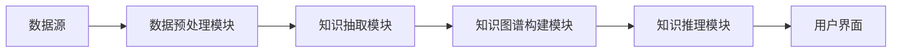

                 


# 构建AI驱动的企业知识管理系统：智能知识图谱

## 关键词：知识图谱, 企业知识管理, AI驱动, 智能系统, 数据管理

## 摘要：  
本文将详细介绍如何利用人工智能技术构建企业知识管理系统的核心组件——智能知识图谱。从背景、核心概念到算法原理、系统架构，再到项目实战，本文将全面解析智能知识图谱的构建过程，为企业知识管理提供新的思路和解决方案。

---

# 第一部分: 背景介绍与核心概念

## 第1章: 企业知识管理的挑战与机遇

### 1.1 企业知识管理的现状与问题
#### 1.1.1 传统知识管理的局限性
传统的知识管理系统往往依赖于文档管理和简单的信息检索，难以应对企业日益复杂的数据和知识需求。知识孤岛和信息碎片化问题严重，导致知识难以有效共享和利用。

#### 1.1.2 知识孤岛与信息碎片化的问题
企业在不同部门和系统中积累了大量数据，但由于缺乏统一的知识表示和管理方式，这些数据难以形成连贯的知识网络，导致知识利用效率低下。

#### 1.1.3 企业知识管理的痛点与需求
企业需要一种能够整合多源异构数据、支持智能检索和推理的知识管理系统，以提升决策效率和创新能力。

### 1.2 AI驱动的知识管理新范式
#### 1.2.1 智能知识图谱的概念与特点
智能知识图谱是一种基于图结构的数据组织方式，通过实体、关系和属性的表示，构建一个可计算的知识网络，支持智能查询、推理和应用。

#### 1.2.2 AI在知识管理中的优势
AI技术（如自然语言处理、机器学习）能够自动抽取、理解和关联知识，显著提升了知识管理的效率和深度。

#### 1.2.3 企业级知识管理的未来趋势
未来的知识管理系统将更加智能化、动态化和个性化，能够实时更新知识图谱，支持复杂场景下的知识推理和决策。

## 第2章: 智能知识图谱的核心概念

### 2.1 知识图谱的定义与组成
知识图谱是一种以图结构形式表示知识的模型，由实体（节点）、关系（边）和属性（标签）组成。其实体可以是人、组织、产品等，关系描述实体之间的联系，属性则是实体的特征描述。

### 2.2 知识图谱与企业知识管理的联系
知识图谱能够将企业中的分散数据整合为统一的知识网络，支持跨部门的知识共享和协作。

### 2.3 智能知识图谱的核心要素
智能知识图谱需要具备以下核心要素：
- **实体识别**：准确识别数据中的实体。
- **关系抽取**：提取实体之间的关系。
- **属性提取**：提取实体的属性信息。
- **知识推理**：基于已有知识进行推理和扩展。

## 第3章: 智能知识图谱的核心要素

### 3.1 实体识别与抽取
#### 3.1.1 实体识别的基本原理
实体识别是通过自然语言处理技术，从文本中提取出具体的实体（如人名、组织名、地名等）。

#### 3.1.2 基于规则的实体识别
使用预定义的规则和模式进行实体识别，适用于结构化数据。

#### 3.1.3 基于深度学习的实体识别
利用神经网络模型（如BERT）进行实体识别，能够处理非结构化文本。

### 3.2 关系抽取与推理
#### 3.2.1 关系抽取的挑战
关系抽取需要从文本中识别出实体之间的关系，如“公司A收购公司B”中的“收购”关系。

#### 3.2.2 基于规则的关系抽取
使用预定义的模式进行关系抽取，适用于特定场景。

#### 3.2.3 基于深度学习的关系推理
利用深度学习模型（如GAT、Transformer）进行关系推理，能够处理复杂的语义关系。

### 3.3 知识图谱的存储与管理
#### 3.3.1 知识图谱的存储方式
知识图谱可以存储在图数据库（如Neo4j）中，支持高效的查询和推理。

#### 3.3.2 知识图谱的查询语言
常用的知识图谱查询语言包括SPARQL和Cypher。

#### 3.3.3 知识图谱的版本控制
通过版本控制工具（如Git）管理知识图谱的变更历史。

---

# 第二部分: 算法原理与数学模型

## 第4章: 知识图谱构建的算法原理

### 4.1 实体识别算法
#### 4.1.1 基于规则的实体识别算法
通过预定义的规则匹配文本中的实体，例如使用正则表达式匹配电子邮件地址。

#### 4.1.2 基于统计的实体识别算法
利用统计模型（如HMM）进行实体识别，基于上下文的概率分布进行预测。

#### 4.1.3 基于深度学习的实体识别算法
使用神经网络模型（如LSTM、BERT）进行实体识别，能够处理复杂的语义信息。

### 4.2 关系抽取算法
#### 4.2.1 基于规则的关系抽取算法
通过预定义的规则匹配文本中的关系，例如“公司A成立于日期B”中的关系。

#### 4.2.2 基于统计的关系抽取算法
利用统计模型（如CRF）进行关系抽取，基于上下文特征进行预测。

#### 4.2.3 基于深度学习的关系抽取算法
使用深度学习模型（如BERT、GAT）进行关系抽取，能够处理复杂的语义关系。

### 4.3 知识图谱构建的流程图


---

## 第5章: 数学模型与公式

### 5.1 实体识别的数学模型
实体识别可以通过条件随机场（CRF）模型进行建模，其目标函数可以表示为：
$$
f(x) = \arg\max_{y} \sum_{i=1}^{n} \lambda_1 y_i + \lambda_2 \text{score}(y_i, y_{i-1})
$$

### 5.2 关系抽取的数学模型
关系抽取可以通过图神经网络（GNN）进行建模，其目标函数可以表示为：
$$
f(x) = \arg\max_{y} \sum_{i=1}^{n} \lambda_1 y_i + \lambda_2 \text{score}(y_i, y_{i-1})
$$

---

# 第三部分: 系统分析与架构设计

## 第6章: 系统分析与架构设计

### 6.1 系统功能设计
#### 6.1.1 数据预处理模块
负责将原始数据进行清洗、标注和结构化处理。

#### 6.1.2 知识抽取模块
负责从结构化和非结构化数据中抽取实体、关系和属性。

#### 6.1.3 知识图谱构建模块
负责将抽取的知识组织成图结构，并进行冲突检测和数据融合。

#### 6.1.4 知识推理模块
负责基于知识图谱进行推理和扩展，支持复杂的查询和应用场景。

### 6.2 系统架构设计


### 6.3 系统交互设计


---

# 第四部分: 项目实战

## 第7章: 项目实战

### 7.1 环境安装与配置
- 安装Python和相关库（如Neo4j、networkx、py2neo）。
- 安装深度学习框架（如TensorFlow、PyTorch）。

### 7.2 核心代码实现
```python
import neo4j
from py2neo import Graph

# 连接知识图谱数据库
graph = Graph("http://localhost:7474", auth=("neo4j", "password"))

# 实体识别与关系抽取代码示例
def extract_entities(text):
    # 假设使用BERT进行实体识别
    return entities

def extract_relations(text):
    # 假设使用GAT进行关系抽取
    return relations

# 构建知识图谱
entities = extract_entities("公司A成立于2020年")
relations = extract_relations("公司A收购公司B")

# 将实体和关系存储到图数据库中
for entity in entities:
    graph.create(node)
for relation in relations:
    graph.create(edge)
```

### 7.3 案例分析与解读
以某企业为例，详细分析如何构建其知识图谱，并展示实际应用中的查询和推理过程。

---

# 第五部分: 最佳实践与总结

## 第8章: 最佳实践与总结

### 8.1 最佳实践
- 数据预处理是关键，确保数据质量和一致性。
- 选择合适的算法和工具，结合企业需求进行定制化开发。
- 定期更新知识图谱，保持其准确性和时效性。

### 8.2 小结
本文详细介绍了AI驱动的企业知识管理系统的核心组件——智能知识图谱的构建过程，从背景、核心概念到算法原理、系统架构，再到项目实战，为读者提供了全面的指导。

### 8.3 注意事项
- 知识图谱的构建需要结合企业的具体需求，避免过度复杂化。
- 数据隐私和安全问题需要高度重视，确保数据合规使用。

### 8.4 拓展阅读
推荐阅读《知识图谱：概念、方法与应用》和《深度学习与知识图谱》等书籍，深入理解知识图谱的构建和应用。

---

# 作者信息

作者：AI天才研究院/AI Genius Institute  
联系邮箱：contact@aicourse.com  
GitHub：https://github.com/aicourse

