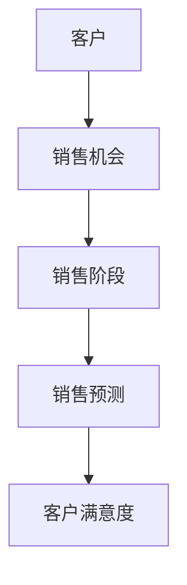
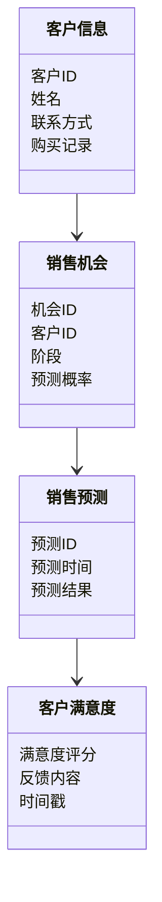
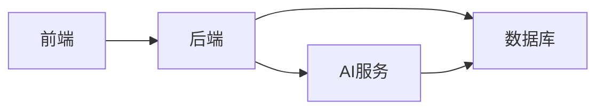
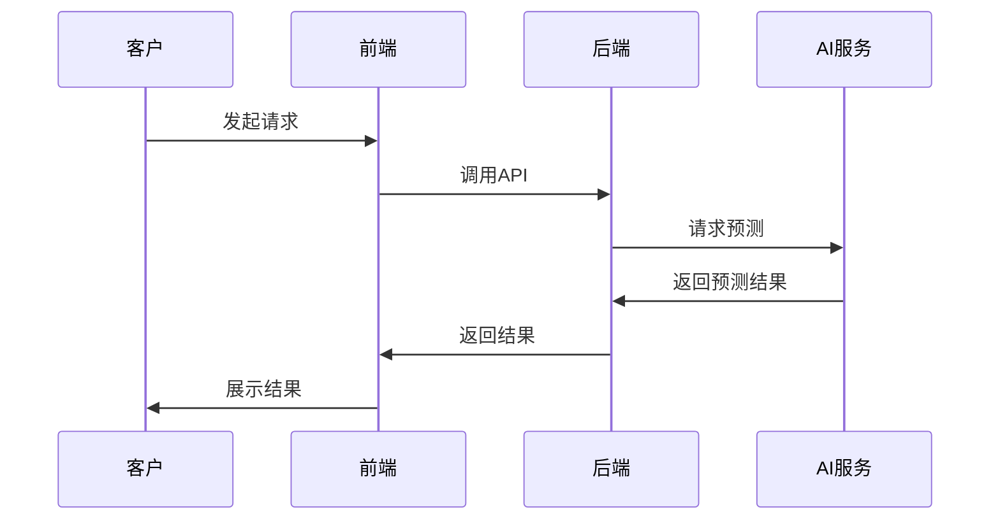

                 


# 构建AI驱动的销售助手：提升转化率与客户满意度

## 关键词：AI驱动、销售助手、转化率、客户满意度、机器学习、自然语言处理、销售预测

## 摘要：本文详细探讨了如何构建AI驱动的销售助手系统，利用机器学习、自然语言处理等技术，提升销售转化率和客户满意度。文章从背景分析、核心概念、算法原理、系统架构到项目实战，全面解析了AI在销售领域的应用，并提供了具体的技术实现方案和实际案例分析。

---

# 第一部分：AI驱动的销售助手背景与核心概念

---

## 第1章：AI驱动的销售助手背景

### 1.1 问题背景

#### 1.1.1 销售效率低下与客户体验问题
在传统销售模式中，销售人员往往需要手动处理大量客户信息、跟进销售机会、分析客户反馈等任务，这不仅效率低下，还容易导致客户体验不佳。例如，销售人员可能因为信息不全或优先级排序不当，错失潜在客户或提供不合适的解决方案。

#### 1.1.2 传统销售工具的局限性
传统的CRM（客户关系管理）系统虽然能够记录客户信息和销售机会，但其功能相对单一，缺乏智能化的预测和推荐能力。销售人员需要手动筛选客户、制定销售策略，这种方式难以在短时间内快速响应客户需求。

#### 1.1.3 AI技术如何解决销售痛点
AI技术的引入，可以通过自动化处理客户数据、预测销售趋势、推荐最佳销售策略等方式，显著提升销售效率和客户满意度。例如，AI可以通过分析客户的聊天记录和行为数据，自动识别客户的需求和潜在问题，从而提供个性化的解决方案。

### 1.2 问题描述

#### 1.2.1 转化率低的原因分析
销售转化率低的原因可能包括：客户对产品缺乏兴趣、销售人员无法有效沟通、销售策略不够精准等。AI可以通过分析客户的行为数据和历史销售数据，帮助销售人员制定更精准的销售策略。

#### 1.2.2 客户满意度低的常见问题
客户满意度低的原因可能包括：销售人员无法及时响应客户需求、提供的解决方案不符合客户期望、客户体验不佳等。AI可以通过自然语言处理技术，分析客户反馈，识别客户痛点，并提供相应的解决方案。

#### 1.2.3 销售流程中的关键环节
销售流程中的关键环节包括客户获取、客户分类、销售预测、客户跟进、销售转化等。AI可以通过自动化处理这些环节，帮助销售人员更高效地完成销售任务。

### 1.3 问题解决

#### 1.3.1 AI驱动销售助手的核心目标
AI驱动销售助手的核心目标是通过智能化的技术手段，提升销售效率和客户满意度。具体包括：自动化处理客户数据、预测销售趋势、推荐最佳销售策略、优化客户沟通体验等。

#### 1.3.2 AI如何提升销售效率与客户体验
AI可以通过以下方式提升销售效率和客户体验：
1. **自动化客户分类**：基于客户的行为数据和历史数据，自动分类客户，帮助销售人员优先关注高潜力客户。
2. **智能推荐解决方案**：通过分析客户的需求和痛点，推荐最合适的解决方案，提升客户满意度。
3. **预测销售趋势**：通过机器学习模型预测销售趋势，帮助销售人员制定更精准的销售计划。
4. **优化客户沟通**：通过自然语言处理技术，分析客户沟通记录，识别客户情绪和需求，优化沟通策略。

#### 1.3.3 数据驱动的销售优化方法
数据驱动的销售优化方法包括：
1. **数据收集**：收集客户行为数据、销售数据、客户反馈数据等。
2. **数据分析**：通过数据分析，识别销售机会、客户痛点和潜在风险。
3. **数据驱动决策**：基于数据分析结果，制定销售策略和行动计划。

### 1.4 边界与外延

#### 1.4.1 AI驱动销售助手的应用场景
AI驱动销售助手的应用场景包括：
1. **B2B销售**：帮助销售人员在B2B场景中更高效地找到潜在客户、制定销售策略。
2. **B2C销售**：通过个性化推荐和智能沟通，提升客户购买体验。
3. **电子商务**：在电商平台中，通过AI推荐和智能客服提升销售转化率。

#### 1.4.2 边界条件与限制
AI驱动销售助手的边界条件与限制包括：
1. **数据隐私**：需要遵守数据隐私法律法规，确保客户数据的安全性。
2. **数据质量**：AI模型的效果依赖于数据质量，数据不足或不准确可能会影响模型的预测能力。
3. **模型泛化能力**：AI模型的泛化能力有限，可能无法覆盖所有销售场景。

#### 1.4.3 外延与未来发展方向
AI驱动销售助手的外延包括：
1. **多渠道销售支持**：支持电话、邮件、社交媒体等多种销售渠道。
2. **实时数据分析**：通过实时数据分析，快速响应客户需求。
3. **跨语言支持**：支持多语言沟通，拓展国际市场。

---

## 第2章：AI驱动销售助手的核心概念与联系

---

### 2.1 核心概念原理

#### 2.1.1 自然语言处理（NLP）在销售中的应用
自然语言处理技术可以用于分析客户的聊天记录、邮件、社交媒体评论等，识别客户情绪、意图和需求。例如，通过分析客户的邮件内容，识别客户对产品的兴趣点和潜在问题。

#### 2.1.2 机器学习在销售预测中的作用
机器学习可以通过历史销售数据和客户数据，训练模型预测未来的销售趋势和客户行为。例如，通过训练一个分类模型，预测客户是否会购买产品。

#### 2.1.3 对话系统在客户交互中的应用
对话系统可以通过自然语言处理技术，与客户进行智能对话，回答客户问题、推荐产品、解决客户问题。例如，智能客服可以通过对话系统快速响应客户查询，提升客户满意度。

### 2.2 核心概念对比

#### 2.2.1 不同AI模型的特征对比
| 模型类型 | 特征 |
|----------|------|
| 传统机器学习模型 | 数据依赖性高，需要特征工程 |
| 深度学习模型 | 数据依赖性较低，自动提取特征 |
| 对话模型 | 支持自然语言交互，适用于实时对话 |

#### 2.2.2 销售助手与传统CRM的区别
| 功能 | 销售助手 | 传统CRM |
|------|----------|----------|
| 数据分析 | 智能分析，自动预测 | 手动分析，记录数据 |
| 客户沟通 | 智能对话，个性化推荐 | 手动沟通，记录反馈 |
| 模型更新 | 自动优化，实时更新 | 手动更新，周期性调整 |

#### 2.2.3 数据驱动与规则驱动的销售策略对比
| 对比维度 | 数据驱动 | 规则驱动 |
|----------|----------|----------|
| 决策依据 | 数据分析结果 | 人工制定的规则 |
| 灵活性 | 高，适应性强 | 低，适应性差 |
| 效率 | 高 | 低 |

### 2.3 ER实体关系图



---

## 第3章：AI驱动销售助手的算法原理

---

### 3.1 算法原理概述

#### 3.1.1 文本匹配算法
文本匹配算法用于将客户查询与预定义的响应进行匹配，找到最相关的答案。例如，使用余弦相似度计算文本之间的相似性。

$$ \text{余弦相似度} = \frac{\vec{A} \cdot \vec{B}}{|\vec{A}| \times |\vec{B}|} $$

#### 3.1.2 情感分析算法
情感分析算法用于识别客户文本中的情感倾向，例如积极、消极或中性。

#### 3.1.3 意图识别算法
意图识别算法用于识别客户文本中的意图，例如“查询产品信息”、“投诉问题”等。

### 3.2 算法实现

#### 3.2.1 文本匹配算法实现
以下是一个基于余弦相似度的文本匹配算法实现：

```python
from sklearn.feature_extraction.text import TfidfVectorizer
from sklearn.metrics.pairwise import cosine_similarity

# 初始化向量器
vectorizer = TfidfVectorizer()
# 训练向量器
vectorizer.fit([text1, text2])
# 转换文本为向量
vec1 = vectorizer.transform([text1]).toarray()
vec2 = vectorizer.transform([text2]).toarray()
# 计算余弦相似度
similarity = cosine_similarity(vec1, vec2)[0][0]
```

#### 3.2.2 情感分析算法实现
以下是一个基于VADER算法的情感分析实现：

```python
from vaderSentiment.vader sentiment import SentimentIntensityAnalyzer

analyzer = SentimentIntensityAnalyzer()
scores = analyzer.polarity_scores(text)
if scores['compound'] >= 0.05:
    print("积极")
elif scores['compound'] <= -0.05:
    print("消极")
else:
    print("中性")
```

---

## 第4章：AI驱动销售助手的系统分析与架构设计

---

### 4.1 问题场景介绍
假设我们正在为一家电子商务公司设计一个AI驱动的销售助手系统，目标是通过AI技术提升销售转化率和客户满意度。

### 4.2 项目介绍
项目名称：AI驱动销售助手系统  
项目目标：提升销售转化率和客户满意度  
项目范围：支持多渠道销售，包括电话、邮件和社交媒体。

### 4.3 系统功能设计

#### 4.3.1 领域模型类图


### 4.4 系统架构设计

#### 4.4.1 系统架构图


#### 4.4.2 接口设计
- **API接口**：提供RESTful API接口，供前端调用。
- **数据接口**：与CRM系统对接，获取客户数据和销售机会。

#### 4.4.3 交互流程图


---

## 第5章：AI驱动销售助手的项目实战

---

### 5.1 环境安装
- **Python**：安装Python 3.8+
- **库依赖**：安装`scikit-learn`、`tensorflow`、`vader-sentiment`

### 5.2 核心代码实现

#### 5.2.1 数据预处理
```python
import pandas as pd

# 读取数据
data = pd.read_csv('sales_data.csv')
# 数据清洗
data.dropna(inplace=True)
# 数据标准化
from sklearn.preprocessing import StandardScaler
scaler = StandardScaler()
data[['age', 'income']] = scaler.fit_transform(data[['age', 'income']])
```

#### 5.2.2 模型训练
```python
from sklearn.model

