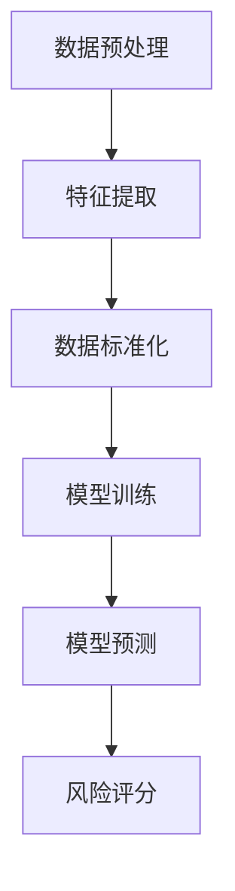

                 


# 构建AI驱动的风控系统：实时监控与风险预警

> 关键词：AI, 风控系统, 实时监控, 风险预警, 机器学习, 数据分析, 系统架构

> 摘要：随着人工智能技术的快速发展，AI驱动的风控系统正在成为金融、互联网等领域的核心工具。本文详细探讨了AI在风控系统中的应用，重点分析了实时监控与风险预警的关键技术与实现方案。通过结合实际案例和系统设计，本文为读者提供了一套完整的AI驱动风控系统构建方法论。

---

## 第一部分: AI驱动的风控系统背景与概念

### # 第1章: AI驱动的风控系统背景与概念

#### 1.1 风控系统的演变
##### 1.1.1 传统风控系统的局限性
传统风控系统依赖于规则引擎和静态数据分析，存在以下问题：
- 数据处理能力有限，难以应对实时性要求高的场景。
- 规则引擎的维护成本高，且难以覆盖复杂的风险场景。
- 风险评估结果不够精准，容易漏判或误判。

##### 1.1.2 AI技术如何改变风控系统
AI技术的引入，使得风控系统具备以下优势：
- 实时数据分析能力，能够快速响应风险事件。
- 自适应学习能力，能够根据最新数据动态调整风险评估模型。
- 多维度特征提取能力，能够捕捉复杂的风险模式。

##### 1.1.3 实时监控与风险预警的重要性
实时监控和风险预警是风控系统的核心功能，能够帮助企业：
- 及时发现潜在风险，避免损失扩大。
- 提高风险应对的效率，降低响应时间。
- 增强业务决策的准确性，提升企业竞争力。

#### 1.2 AI驱动风控系统的定义与特点
##### 1.2.1 核心概念与问题背景
AI驱动的风控系统是一种基于人工智能技术的金融风险控制系统，旨在通过实时数据分析和智能模型预测，实现风险的早期预警和快速响应。

##### 1.2.2 风险预警的数学模型
风险预警的数学模型通常包括以下几类：
1. 时间序列模型（如ARIMA）：用于预测未来风险趋势。
2. 异常检测模型（如Isolation Forest）：用于识别异常交易或行为。
3. 分类模型（如随机森林、逻辑回归）：用于分类风险等级。

##### 1.2.3 系统边界与外延
AI驱动的风控系统的边界包括：
- 数据输入：实时交易数据、用户行为数据、市场数据等。
- 数据输出：风险评分、预警信号、风险报告等。
- 系统外延：与业务系统、用户界面、第三方数据源的交互。

---

## 第二部分: AI驱动的风控系统的核心概念与技术原理

### # 第2章: AI驱动风控系统的数学模型与核心要素

#### 2.1 核心概念与原理
##### 2.1.1 风险评估的数学模型
风险评估的数学模型通常基于以下步骤：
1. 数据预处理：清洗、特征提取、数据增强。
2. 模型训练：选择合适的算法（如逻辑回归、随机森林）进行训练。
3. 模型评估：通过准确率、召回率、F1分数等指标评估模型性能。
4. 模型部署：将模型嵌入到实时监控系统中。

##### 2.1.2 实时监控的算法原理
实时监控的核心算法包括：
1. 时间序列分析：用于预测未来的风险趋势。
2. 异常检测：用于识别异常交易或行为。
3. 实时分类：用于实时判断风险事件的类型。

##### 2.1.3 风险预警的逻辑框架
风险预警的逻辑框架包括以下步骤：
1. 数据采集：实时采集相关数据。
2. 数据处理：清洗、标准化、特征提取。
3. 风险评估：通过模型预测风险等级。
4. 预警触发：当风险超过阈值时，触发预警信号。
5. 响应处理：根据预警信号采取相应的措施。

#### 2.2 核心概念对比表
| 对比维度 | 传统风控系统 | AI驱动风控系统 |
|----------|---------------|-----------------|
| 数据处理能力 | 离线分析为主 | 实时分析为主     |
| 模型复杂度 | 简单规则引擎 | 复杂机器学习模型 |
| 预警效率 | 周期性预警 | 实时预警         |
| 精准度 | 较低 | 较高           |

#### 2.3 实体关系图（ER图）
```mermaid
erd
  title 风险数据实体关系图
  User (用户) {
    用户ID
    用户名称
    用户权限
  }
  Transaction (交易) {
    交易ID
    交易时间
    交易金额
    用户ID
  }
  RiskEvent (风险事件) {
    风险ID
    风险类型
    风险时间
    相关交易ID
  }
  User -> Transaction: 发起交易
  Transaction -> RiskEvent: 引发风险事件
```

---

## 第三部分: AI驱动的风控系统的算法原理

### # 第3章: 算法原理与实现

#### 3.1 常用算法与模型
##### 3.1.1 时间序列分析（ARIMA）
时间序列分析（ARIMA）是一种广泛应用于金融领域的预测模型，其核心步骤包括：
1. 数据预处理：检查数据的平稳性。
2. 模型参数确定：通过AIC准则选择最佳参数。
3. 模型训练与预测：基于历史数据预测未来的风险趋势。

##### 3.1.2 异常检测算法（Isolation Forest）
异常检测算法（Isolation Forest）是一种基于树的异常检测方法，适用于高维数据集。其核心步骤包括：
1. 数据预处理：标准化、降维。
2. 模型训练：构建随机树进行异常检测。
3. 异常识别：通过树结构判断数据点是否为异常。

##### 3.1.3 风险评分模型（Logistic Regression）
风险评分模型（Logistic Regression）是一种经典的分类算法，用于预测风险事件的发生概率。其核心步骤包括：
1. 数据预处理：特征选择、数据清洗。
2. 模型训练：基于训练数据拟合逻辑回归模型。
3. 模型评估：通过ROC曲线评估模型性能。

#### 3.2 算法流程图


#### 3.3 算法实现代码
```python
# 时间序列分析（ARIMA）实现
from statsmodels.tsa.arima_model import ARIMA

# 数据预处理
data = ...  # 输入数据
model = ARIMA(data, order=(5,1,0))
model_fit = model.fit(disp=0)

# 模型预测
forecast = model_fit.forecast(steps=5)
print(forecast)
```

---

## 第四部分: AI驱动的风控系统的系统架构与设计

### # 第4章: 系统架构设计

#### 4.1 系统架构设计
##### 4.1.1 分层架构设计
AI驱动的风控系统通常采用分层架构，包括：
1. 数据层：负责数据的采集、存储和管理。
2. 服务层：负责业务逻辑的处理和模型的调用。
3. 表现层：负责用户界面的展示和交互。

##### 4.1.2 微服务架构设计
微服务架构设计能够提高系统的可扩展性和可维护性，包括：
1. 数据采集服务：负责实时数据的采集和处理。
2. 风险评估服务：负责风险模型的训练和预测。
3. 风险预警服务：负责预警信号的触发和通知。

##### 4.1.3 数据流与服务交互
数据流与服务交互的流程如下：
1. 数据采集服务接收实时数据。
2. 数据处理服务对数据进行清洗和特征提取。
3. 风险评估服务调用模型进行预测。
4. 风险预警服务根据预测结果触发预警信号。

#### 4.2 系统功能设计
##### 4.2.1 数据采集模块
数据采集模块负责从各种数据源（如数据库、API）采集实时数据，并进行初步的清洗和处理。

##### 4.2.2 风险评估模块
风险评估模块负责基于机器学习模型对数据进行风险评估，并生成风险评分。

##### 4.2.3 风险预警模块
风险预警模块负责根据风险评分生成预警信号，并通知相关人员进行处理。

#### 4.3 系统接口设计
##### 4.3.1 数据接口
数据接口负责与数据源进行交互，包括数据的读取和写入。

##### 4.3.2 API接口
API接口负责与其他系统的交互，包括调用外部服务和返回结果。

##### 4.3.3 用户界面
用户界面负责与用户的交互，包括数据的展示和预警信号的反馈。

---

## 第五部分: AI驱动的风控系统的项目实战

### # 第5章: 项目实战与代码实现

#### 5.1 环境搭建与工具安装
##### 5.1.1 Python环境配置
安装Python和必要的库：
```bash
pip install numpy pandas scikit-learn matplotlib statsmodels
```

##### 5.1.2 数据集准备
准备一个包含交易数据和标签的CSV文件。

#### 5.2 核心代码实现
##### 5.2.1 数据预处理
```python
import pandas as pd
import numpy as np

# 读取数据
data = pd.read_csv('transaction_data.csv')

# 数据清洗
data.dropna(inplace=True)

# 特征提取
features = data[['amount', 'time', 'user_id']]
labels = data['is_fraud']
```

##### 5.2.2 模型训练
```python
from sklearn.ensemble import RandomForestClassifier

# 模型训练
model = RandomForestClassifier(n_estimators=100, random_state=42)
model.fit(features, labels)

# 模型预测
predictions = model.predict(features)
```

##### 5.2.3 实时监控
```python
from datetime import datetime

# 实时数据处理
def process_transaction(transaction):
    # 提取特征
    features = transaction[['amount', 'time', 'user_id']]
    # 预测风险
    risk_score = model.predict(features)
    # 触发预警
    if risk_score > 0.5:
        trigger_alarm(transaction)
```

#### 5.3 实际案例分析
##### 5.3.1 案例背景
假设我们有一个在线支付系统，需要实时检测欺诈交易。

##### 5.3.2 数据分析
分析交易数据，发现某些用户在短时间内多次进行小额交易，可能存在欺诈风险。

##### 5.3.3 风险评估
通过模型预测，发现这些交易的风险评分为0.8，触发预警信号。

##### 5.3.4 预警响应
系统自动通知相关部门进行调查，并采取相应的措施。

---

## 第六部分: 总结与展望

### # 第6章: 总结与展望

#### 6.1 最佳实践
- 数据是风控系统的核心，确保数据的准确性和完整性。
- 模型的选择和调优至关重要，需要根据具体场景选择合适的算法。
- 系统的实时性和稳定性是关键，需要进行充分的测试和优化。

#### 6.2 小结
本文详细探讨了AI驱动的风控系统的构建方法，从算法原理到系统架构，从项目实战到实际案例分析，为读者提供了一套完整的解决方案。

#### 6.3 注意事项
- 数据隐私和安全问题需要高度重视。
- 模型的解释性和可维护性需要在设计阶段充分考虑。
- 系统的可扩展性和灵活性是未来发展的关键。

#### 6.4 拓展阅读
- 《机器学习实战》
- 《深入理解时间序列分析》
- 《微服务架构设计模式》

---

作者：AI天才研究院/AI Genius Institute & 禅与计算机程序设计艺术 /Zen And The Art of Computer Programming

