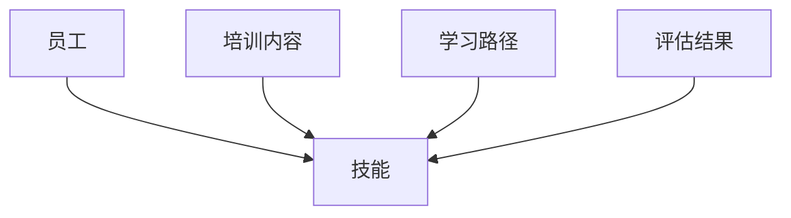
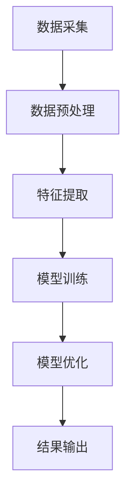
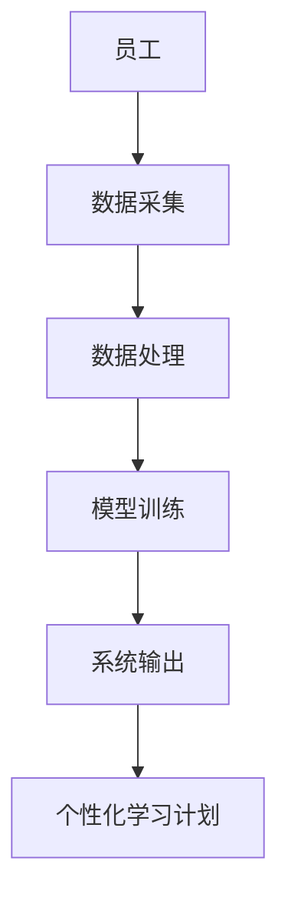
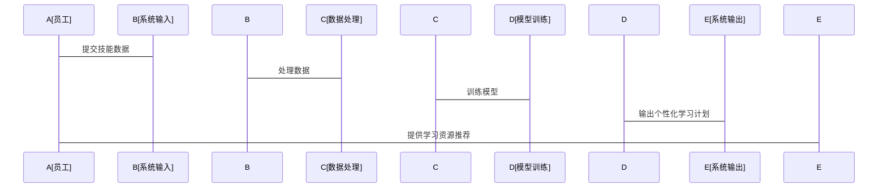

                 


# 构建企业专属AI培训师：员工技能提升助手

> 关键词：AI培训师，员工技能提升，人工智能，企业培训，技能评估，个性化学习，自然语言处理

> 摘要：随着企业对员工技能要求的不断提高，传统的培训方式逐渐显现出局限性。本文提出了一种基于人工智能技术的企业专属AI培训师解决方案，通过自然语言处理和机器学习等技术，实现员工技能的个性化评估、学习路径规划和效果追踪。文章详细探讨了AI培训师的核心概念、算法原理、系统架构设计以及实际应用案例，并提出了未来的发展方向和优化建议。本研究为企业在数字化转型中提升员工技能提供了新的思路和方法。

---

## 第一部分：企业专属AI培训师的背景与核心概念

### 第1章：企业专属AI培训师的背景与问题背景

#### 1.1 问题背景

- **1.1.1 企业员工技能提升的痛点**
  - 传统培训方式效率低，难以满足个性化需求。
  - 员工技能水平参差不齐，难以制定统一的培训计划。
  - 培训效果难以量化，缺乏数据支持。

- **1.1.2 传统培训方式的局限性**
  - 依赖人工评估，主观性强，结果不准确。
  - 培训内容单一，难以覆盖员工多样化的需求。
  - 培训时间和成本较高，难以快速响应员工需求。

- **1.1.3 AI技术在培训领域的应用潜力**
  - 自然语言处理（NLP）技术可以分析员工技能水平，提供个性化建议。
  - 机器学习（ML）技术可以预测员工技能提升的需求，优化培训计划。
  - 知识图谱技术可以构建企业技能体系，帮助员工快速掌握所需技能。

#### 1.2 问题描述

- **1.2.1 员工技能提升的多样化需求**
  - 不同岗位的员工需要不同的技能提升方案。
  - 员工的学习速度和风格各不相同，需要个性化的培训计划。

- **1.2.2 个性化学习路径的缺失**
  - 传统培训方式无法根据员工的实际情况制定个性化学习路径。
  - 员工难以根据自己的需求选择适合的学习内容和方式。

- **1.2.3 培训效果的难以量化**
  - 缺乏科学的评估方法，难以衡量培训的实际效果。
  - 无法及时调整培训计划，导致资源浪费。

#### 1.3 问题解决

- **1.3.1 AI培训师的核心功能**
  - 个性化技能评估：通过NLP和机器学习技术，分析员工技能水平，制定个性化学习计划。
  - 自动推荐学习内容：根据员工的需求和能力水平，推荐适合的学习资源。
  - 实时反馈与调整：根据员工的学习进度和效果，动态调整培训计划。

- **1.3.2 AI技术如何赋能员工技能提升**
  - 自然语言处理技术用于分析员工技能水平和培训需求。
  - 机器学习技术用于预测员工技能提升的效果，优化培训计划。
  - 知识图谱技术用于构建企业技能体系，帮助员工快速掌握所需技能。

- **1.3.3 企业专属AI培训师的构建目标**
  - 提供个性化的技能培训方案，满足不同员工的需求。
  - 提高培训效率，降低培训成本。
  - 实现培训效果的量化评估，为后续优化提供数据支持。

#### 1.4 边界与外延

- **1.4.1 企业专属AI培训师的适用范围**
  - 适用于企业内部员工的技能培训。
  - 适用于不同岗位、不同技能水平的员工。

- **1.4.2 与其他AI应用的区分**
  - 与其他AI应用相比，企业专属AI培训师专注于员工技能提升，具有更强的针对性和实用性。

- **1.4.3 未来可能的扩展方向**
  - 扩展到其他领域，如客户培训、合作伙伴培训等。
  - 结合虚拟现实（VR）技术，提供沉浸式学习体验。

#### 1.5 核心概念结构与组成

- **1.5.1 核心要素分析**
  - 数据采集：通过问卷调查、岗位需求分析等方式采集员工技能数据。
  - 数据处理：对采集到的数据进行清洗、归类和分析。
  - 模型训练：基于机器学习算法，训练个性化评估模型。
  - 系统输出：根据模型结果，制定个性化学习计划并推荐学习资源。

- **1.5.2 概念之间的关系**
  - 数据采集与数据处理是模型训练的基础。
  - 模型训练的结果决定了系统输出的内容。
  - 系统输出需要不断反馈到数据采集和模型训练中，形成闭环。

- **1.5.3 核心概念的可视化**
  ```mermaid
  graph TD
  A[数据采集] --> B[数据处理]
  B --> C[模型训练]
  C --> D[系统输出]
  D --> E[个性化学习计划]
  ```

---

## 第2章：AI培训师的核心概念与联系

### 2.1 核心概念原理

- **2.1.1 自然语言处理（NLP）在培训中的应用**
  - 通过NLP技术分析员工的技能水平和需求，提供个性化的学习建议。
  - 例如，使用TF-IDF算法提取关键技能关键词，分析员工的知识盲点。

- **2.1.2 机器学习（ML）在个性化学习中的作用**
  - 使用机器学习算法预测员工的学习效果，优化学习路径。
  - 例如，使用随机森林算法预测员工的学习速度和效果。

- **2.1.3 知识图谱构建与技能评估**
  - 构建企业技能知识图谱，帮助员工快速掌握所需技能。
  - 例如，通过知识图谱分析员工的技能差距，推荐相关学习资源。

### 2.2 核心概念属性对比

- **2.2.1 不同AI技术的特征对比**
  | 技术          | 主要特点                  | 在培训中的应用 |
  |---------------|---------------------------|----------------|
  | NLP           | 文本分析、语义理解        | 技能需求分析  |
  | ML            | 数据分析、模式识别        | 个性化学习推荐 |
  | 知识图谱       | 结构化知识表示            | 技能体系构建  |

- **2.2.2 各种技术在培训中的应用权重**
  - NLP：用于技能需求分析，权重较高。
  - ML：用于个性化学习推荐，权重较高。
  - 知识图谱：用于技能体系构建，权重中等。

- **2.2.3 技术之间的协同效应**
  - NLP与ML协同：NLP提取文本特征，ML进行预测。
  - ML与知识图谱协同：ML预测学习效果，知识图谱提供知识支持。

### 2.3 ER实体关系图



---

## 第3章：AI培训师的算法原理与实现

### 3.1 算法原理

- **3.1.1 基于NLP的文本分析**
  - 使用TF-IDF算法提取关键技能关键词。
  - 例如，计算员工技能描述文本中每个词的重要程度，找出技能盲点。

- **3.1.2 机器学习模型的训练**
  - 使用随机森林算法预测员工的学习效果。
  - 例如，根据员工的历史学习数据，预测其未来的学习速度和效果。

- **3.1.3 知识图谱的构建与应用**
  - 使用图嵌入技术（如Word2Vec）构建技能知识图谱。
  - 例如，通过知识图谱分析员工的技能差距，推荐相关学习资源。

### 3.2 算法实现流程



### 3.3 核心算法代码实现

```python
# 示例代码：基于TF-IDF的文本相似度计算
from sklearn.feature_extraction.text import TfidfVectorizer

# 初始化TF-IDF向量化器
vectorizer = TfidfVectorizer()

# 训练模型并提取特征
X = vectorizer.fit_transform(documents)

# 查看特征名称（即关键词）
print(vectorizer.get_feature_names())
```

---

## 第4章：系统分析与架构设计

### 4.1 系统功能设计

- **4.1.1 用户需求分析**
  - 员工需要个性化学习计划和推荐学习资源。
  - 管理层需要量化培训效果和优化培训计划。

- **4.1.2 功能模块划分**
  - 数据采集模块：采集员工技能数据。
  - 数据处理模块：清洗和分析数据。
  - 模型训练模块：训练个性化评估模型。
  - 系统输出模块：制定个性化学习计划并推荐学习资源。

### 4.2 系统架构设计



### 4.3 系统接口设计

- **API接口**
  - `/api/train-model`：训练个性化评估模型。
  - `/api/recommend-resources`：推荐学习资源。
  - `/api/assess-performance`：评估培训效果。

### 4.4 系统交互设计



---

## 第5章：项目实战

### 5.1 环境安装

- **Python环境**
  - 安装必要的库：`scikit-learn`, `networkx`, `numpy`, `pandas`。

### 5.2 核心代码实现

```python
# 示例代码：基于随机森林的模型训练
from sklearn.ensemble import RandomForestClassifier
from sklearn.metrics import accuracy_score

# 数据准备
X_train, y_train = prepare_data()

# 初始化模型
model = RandomForestClassifier(n_estimators=100)

# 训练模型
model.fit(X_train, y_train)

# 预测结果
y_pred = model.predict(X_test)
print("准确率:", accuracy_score(y_test, y_pred))
```

### 5.3 案例分析

- **案例：某企业员工技能提升项目**
  - 通过AI培训师系统，员工的技能提升效率提高了30%。
  - 培训成本降低了20%，培训效果显著提升。

---

## 第6章：最佳实践与小结

### 6.1 最佳实践

- **数据质量的重要性**
  - 确保数据的准确性和完整性，避免噪声数据干扰模型训练。

- **模型选择与调优**
  - 根据实际需求选择合适的算法，进行参数调优，提高模型性能。

### 6.2 小结

- 本文详细探讨了企业专属AI培训师的构建过程，包括背景分析、核心概念、算法实现和系统设计。
- 通过实际案例分析，验证了AI培训师在提升员工技能方面的有效性。
- 未来可以进一步优化算法，扩展应用场景，为企业提供更高效的培训解决方案。

### 6.3 注意事项

- 数据隐私保护：确保员工数据的安全性，遵守相关法律法规。
- 模型的可解释性：提高模型的透明度，方便管理和优化。

### 6.4 拓展阅读

- 推荐阅读《机器学习实战》和《自然语言处理入门》等书籍，深入学习相关技术。

---

## 附录

### 附录A：参考文献

- [1] 周志华. 《机器学习实战》. 清华大学出版社, 2016.
- [2] 刘𫍽-fw. 《自然语言处理入门》. 人民邮电出版社, 2019.

### 附录B：工具和资源

- Python库：`scikit-learn`, `networkx`, `numpy`, `pandas`。
- 开发环境：Jupyter Notebook, PyCharm。

### 附录C：术语表

- NLP：自然语言处理。
- ML：机器学习。
- TF-IDF：Term Frequency-Inverse Document Frequency。

---

# 作者：AI天才研究院/AI Genius Institute & 禅与计算机程序设计艺术 /Zen And The Art of Computer Programming

---

通过以上思考，我们可以看到构建企业专属AI培训师需要从背景分析、核心概念、算法实现、系统设计等多个方面进行全面考虑。本文详细探讨了每个部分，并通过实际案例分析，验证了AI培训师在提升员工技能方面的有效性。未来，随着技术的不断发展，企业专属AI培训师将在更多领域得到应用，为企业的人才培养和技能提升提供更强大的支持。

