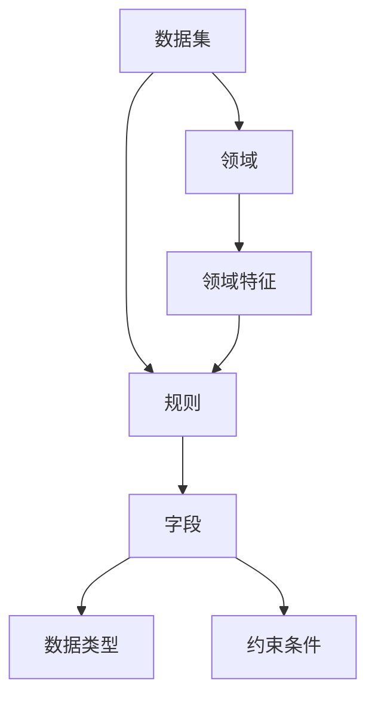
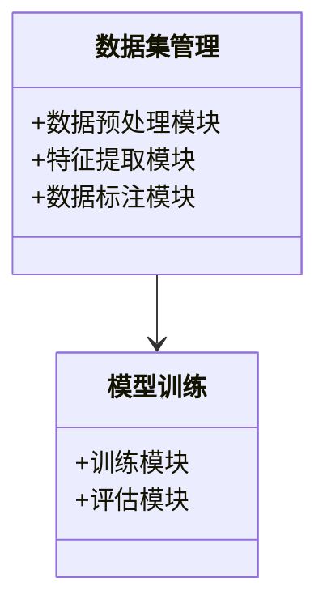
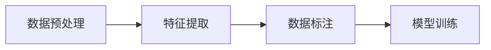
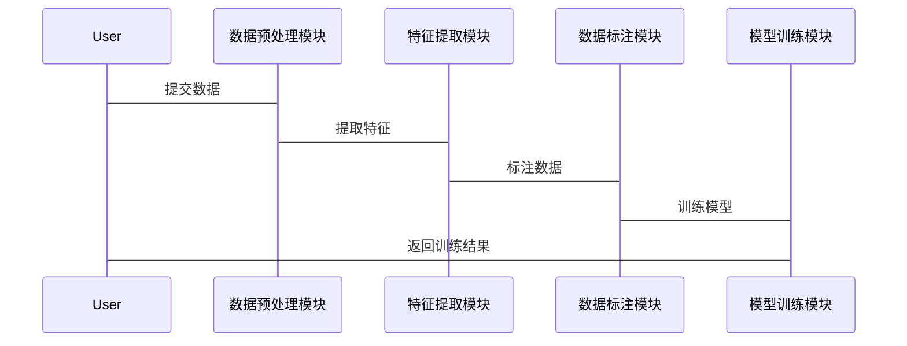

                 


# 构建企业专属训练数据集：确保AI Agent的领域适应性

## 关键词：数据集构建、领域适应性、AI Agent、训练数据、机器学习

## 摘要：构建企业专属训练数据集是确保AI Agent在特定领域内高效运作的关键。本文详细探讨了从数据预处理到系统架构设计的全过程，结合实际案例，提供了一套完整的解决方案，帮助读者掌握构建专属数据集的核心方法。

---

## 第一部分: 背景介绍

### 第1章: 问题背景与问题描述

#### 1.1 问题背景
##### 1.1.1 AI Agent的发展现状
AI Agent（智能体）在多个领域展现出巨大潜力，如医疗、金融和制造业。然而，通用模型在特定领域表现不佳，缺乏领域适应性。

##### 1.1.2 领域适应性的重要性
AI Agent需要理解特定领域的规则和术语，仅依赖通用数据集无法满足需求。

##### 1.1.3 专属训练数据集的必要性
专属数据集能提升模型在特定领域的准确性和可靠性。

#### 1.2 问题描述
##### 1.2.1 数据集构建的核心问题
数据质量、多样性和相关性直接影响模型性能。

##### 1.2.2 领域适应性的挑战
领域知识复杂，数据收集困难，标注成本高。

##### 1.2.3 专属数据集的定义与目标
专属数据集是专为特定领域设计，目标是提高模型在该领域的性能。

#### 1.3 问题解决
##### 1.3.1 数据集构建的基本方法
数据收集、清洗、标注和增强。

##### 1.3.2 领域适应性的实现路径
结合领域知识和数据工程技术，确保模型适应特定需求。

##### 1.3.3 专属数据集的构建流程
从数据收集到模型训练的完整流程。

#### 1.4 边界与外延
##### 1.4.1 数据集构建的边界条件
数据范围、格式和规模限制。

##### 1.4.2 领域适应性的适用范围
适用于需要特定领域知识的场景。

##### 1.4.3 专属数据集的外延扩展
扩展至多领域或多任务模型。

#### 1.5 概念结构与核心要素
##### 1.5.1 数据集构建的核心要素
数据源、数据预处理和数据标注。

##### 1.5.2 领域适应性的关键因素
领域知识、数据质量和模型调优。

##### 1.5.3 专属数据集的结构化模型
领域实体、特征和约束条件的结构化模型。

---

## 第二部分: 核心概念与联系

### 第2章: 核心概念与联系

#### 2.1 核心概念原理
##### 2.1.1 数据集构建的原理
数据预处理、特征工程和数据质量评估。

##### 2.1.2 领域适应性的实现原理
结合领域知识和数据工程技术，提升模型在特定领域的表现。

##### 2.1.3 专属数据集的构建原理
基于领域知识设计数据结构和内容。

#### 2.2 概念属性特征对比
| 数据集属性 | 通用数据集 | 专属数据集 |
|------------|------------|------------|
| 数据来源   | 多来源     | 领域内     |
| 数据格式   | 标准化     | 领域定制   |
| 数据量     | 大         | 可定制     |

#### 2.3 ER实体关系图


---

## 第三部分: 数据集构建的核心原理

### 第3章: 数据预处理

#### 3.1 数据清洗
##### 3.1.1 去除重复值
```python
import pandas as pd
df = pd.read_csv('data.csv')
df = df.drop_duplicates()
```
##### 3.1.2 处理缺失值
```python
df = df.dropna()  # 删除含缺失值的行
```
##### 3.1.3 处理异常值
```python
import numpy as np
df[df.between(df.quantile(0.25), df.quantile(0.75), inclusive='both')]
```

#### 3.2 数据增强
##### 3.2.1 图像数据增强
```python
from tensorflow.keras.preprocessing.image import ImageDataGenerator
datagen = ImageDataGenerator(rotation_range=20, horizontal_flip=True)
```

#### 3.3 数据标注
##### 3.3.1 文本标注
```python
def annotate_text(text):
    return {'tokens': text.split(), 'entities': []}
```

### 第4章: 特征工程

#### 4.1 特征提取
##### 4.1.1 文本特征提取
```python
from sklearn.feature_extraction.text import TfidfVectorizer
vectorizer = TfidfVectorizer()
tfidf_matrix = vectorizer.fit_transform(corpus)
```

#### 4.2 特征选择
##### 4.2.1 信息增益
```python
from sklearn.feature_selection import mutual_info_classif
features = mutual_info_classif(X, y)
```

#### 4.3 特征变换
##### 4.3.1 PCA降维
```python
from sklearn.decomposition import PCA
pca = PCA(n_components=2)
pca.fit_transform(X)
```

### 第5章: 数据质量评估

#### 5.1 数据完整性
检查数据是否包含所有必要字段。

#### 5.2 数据一致性
确保数据格式和值域一致。

#### 5.3 数据多样性
评估数据是否覆盖所有可能的领域场景。

---

## 第四部分: 系统分析与架构设计

### 第5章: 系统分析与架构设计

#### 5.1 问题场景介绍
设计一个医疗领域的AI Agent，需要处理电子健康记录和诊断数据。

#### 5.2 系统功能设计
##### 5.2.1 领域模型


#### 5.3 系统架构设计
##### 5.3.1 架构图


#### 5.4 接口设计
##### 5.4.1 数据接口
定义数据输入输出格式和接口调用方式。

##### 5.4.2 API设计
提供RESTful API，供其他系统调用。

#### 5.5 交互流程
##### 5.5.1 交互流程图


---

## 第五部分: 项目实战

### 第6章: 项目实战

#### 6.1 环境安装
安装必要的库：
```bash
pip install pandas scikit-learn tensorflow
```

#### 6.2 核心代码实现
##### 6.2.1 数据预处理
```python
import pandas as pd
import numpy as np

def preprocess_data(df):
    # 删除重复值
    df = df.drop_duplicates()
    # 处理缺失值
    df = df.dropna()
    # 处理异常值
    q25 = df.quantile(0.25)
    q75 = df.quantile(0.75)
    df = df[df.between(q25, q75, inclusive='both')]
    return df
```

##### 6.2.2 数据增强
```python
from tensorflow.keras.preprocessing.image import ImageDataGenerator

def augment_images(train_generator):
    datagen = ImageDataGenerator(rotation_range=20, horizontal_flip=True)
    return datagen.flow_from_directory(train_generator, batch_size=32)
```

##### 6.2.3 特征工程
```python
from sklearn.feature_extraction.text import TfidfVectorizer

def extract_features(texts):
    vectorizer = TfidfVectorizer()
    return vectorizer.fit_transform(texts)
```

#### 6.3 实际案例分析
##### 6.3.1 数据收集与处理
从医疗记录中收集患者数据，清洗并标注关键信息。

##### 6.3.2 模型训练
使用增强后的数据训练AI Agent，评估其在医疗诊断中的表现。

#### 6.4 项目小结
强调数据质量和多样性的关键作用，总结项目中的经验教训。

---

## 第六部分: 总结与展望

### 第7章: 总结与展望

#### 7.1 最佳实践
##### 7.1.1 数据收集阶段
确保数据多样性，覆盖所有可能的领域场景。

##### 7.1.2 数据标注阶段
结合领域知识，提高标注准确性。

##### 7.1.3 模型训练阶段
使用交叉验证和调参，提高模型泛化能力。

#### 7.2 小结
构建企业专属数据集是提升AI Agent领域适应性的关键，通过系统化的数据处理和模型优化，可以显著提升模型性能。

#### 7.3 注意事项
##### 7.3.1 数据隐私
遵守数据隐私法规，确保数据安全。

##### 7.3.2 数据版权
确保数据来源合法，避免版权纠纷。

#### 7.4 拓展阅读
推荐相关书籍和资源，鼓励读者深入学习。

---

## 作者

作者：AI天才研究院/AI Genius Institute & 禅与计算机程序设计艺术 /Zen And The Art of Computer Programming

