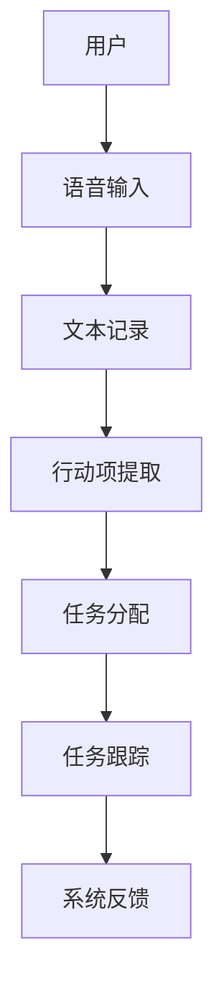
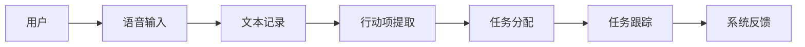

                 


# 构建企业级AI会议助手：会议记录与行动项跟踪

## 关键词：AI会议助手，会议记录，行动项跟踪，自然语言处理，语音识别，任务管理

## 摘要：  
随着企业对高效会议管理和任务跟踪需求的不断增加，AI技术的应用为企业级会议助手提供了新的解决方案。本文将深入探讨如何构建一个基于AI的会议助手，实现会议记录与行动项的智能跟踪。从核心概念到算法原理，再到系统架构设计与项目实战，本文将逐步解析构建这一系统的全过程，为企业提供一个高效、智能的会议管理工具。

---

# 第一部分: 背景与核心概念

## 第1章: 问题背景与需求分析

### 1.1 问题背景  
现代企业中，会议记录和行动项跟踪是管理效率的重要组成部分。然而，传统会议记录方式存在以下痛点：  
1. **效率低下**：手动记录会议内容耗时且容易遗漏关键信息。  
2. **准确性不足**：会议参与者可能对记录内容存在误解，导致后续执行偏差。  
3. **跟踪困难**：行动项的分配、进度跟踪和反馈机制不完善，影响任务执行效果。  

### 1.2 核心目标  
AI会议助手的目标是通过智能化技术，实现以下功能：  
1. **智能记录**：通过语音识别和自然语言处理（NLP）技术，自动记录会议内容。  
2. **行动项提取与跟踪**：识别会议中的行动项，自动生成任务列表，并跟踪任务进度。  
3. **高效反馈**：通过自然语言生成技术，提供会议纪要和任务执行反馈。  

### 1.3 边界与外延  
AI会议助手的功能范围包括：  
- 会议记录与整理。  
- 行动项提取与分配。  
- 任务跟踪与提醒。  
- 数据安全与隐私保护。  

## 第2章: 核心概念与技术原理

### 2.1 核心概念  
1. **语音识别**：通过语音输入生成文本记录。  
2. **自然语言处理（NLP）**：理解会议内容，提取关键信息。  
3. **任务管理**：分配行动项，跟踪任务进度。  

### 2.2 技术原理  
1. **语音识别**：采用深度学习模型（如Transformer）对语音信号进行特征提取和语音转换。  
2. **NLP处理**：利用预训练语言模型（如BERT、GPT）对会议文本进行关键词提取和语义理解。  
3. **任务跟踪**：通过规则引擎或机器学习模型，自动分配任务并跟踪进度。  

### 2.3 核心概念关系图  


---

# 第二部分: 算法原理与实现

## 第3章: 语音识别与NLP算法

### 3.1 语音识别算法  
1. **模型选择**：采用Transformer架构，通过多层自注意力机制提取语音特征。  
2. **训练流程**：  
   a. 输入语音信号，生成对应的文本输出。  
   b. 通过反向传播优化模型参数。  

### 3.2 NLP处理流程  
1. **分词与词性标注**：将会议文本进行分词处理，并标注词性。  
2. **关键词提取**：基于TF-IDF或BERT模型，提取会议中的关键信息。  
3. **语义理解**：利用预训练语言模型，理解会议内容并生成结构化的行动项列表。  

### 3.3 代码实现  
```python
# 语音识别代码示例
import speech_recognition as sr

r = sr.Recognizer()
with sr.AudioFile("meeting_audio.wav") as source:
    audio = r.listen(source)
    text = r.recognize_google(audio, language="zh-CN")
print("会议记录:", text)
```

## 第4章: 任务管理与跟踪算法

### 4.1 任务分配与提醒  
1. **规则引擎**：根据会议内容自动生成任务列表，并分配给相关人员。  
2. **任务跟踪**：通过定时检查任务状态，更新任务进度。  

### 4.2 任务优先级排序  
1. **优先级计算**：基于任务的重要性和截止日期，动态调整任务优先级。  
2. **反馈机制**：通过自然语言生成技术，向用户反馈任务执行情况。  

### 4.3 代码实现  
```python
# 任务跟踪代码示例
import datetime

class Task:
    def __init__(self, description, assignee, deadline):
        self.description = description
        self.assignee = assignee
        self.deadline = deadline
        self.completed = False

def track_task(tasks):
    current_time = datetime.datetime.now()
    for task in tasks:
        if not task.completed and current_time > task.deadline:
            print(f"提醒：{task.description} 已过期，请尽快处理！")
```

---

# 第三部分: 系统分析与架构设计

## 第5章: 系统功能设计

### 5.1 系统功能模块  
1. **语音输入模块**：支持语音输入和实时转录。  
2. **文本处理模块**：实现会议内容的结构化处理。  
3. **任务管理模块**：分配行动项并跟踪任务进度。  

### 5.2 系统架构图  


## 第6章: 系统接口与交互设计

### 6.1 系统接口  
1. **语音识别接口**：提供REST API，接收音频文件并返回文本记录。  
2. **任务管理接口**：提供API用于任务创建、查询和更新。  

### 6.2 交互流程  
1. 用户通过语音输入会议内容。  
2. 系统生成会议记录并提取行动项。  
3. 用户确认任务分配，系统开始跟踪任务进度。  
4. 系统通过邮件或消息通知用户任务状态。  

---

# 第四部分: 项目实战

## 第7章: 项目环境与安装

### 7.1 环境要求  
- Python 3.8+  
- CUDA支持（可选，用于加速计算）  

### 7.2 库的安装  
```bash
pip install speechRecognition tensorflow-transformer spacy
```

## 第8章: 核心代码实现

### 8.1 语音识别实现  
```python
import speech_recognition as sr

def transcribe_audio(audio_path):
    r = sr.Recognizer()
    with sr.AudioFile(audio_path) as source:
        audio = r.listen(source)
        text = r.recognize_google(audio, language="zh-CN")
    return text
```

### 8.2 NLP处理实现  
```python
from transformers import pipeline

nlp = pipeline("text-classification", model="bert-base-cn")
def extract_keywords(text):
    return nlp(text)
```

## 第9章: 实际案例分析

### 9.1 案例背景  
某公司每周例会记录与行动项跟踪。  

### 9.2 实施过程  
1. 通过语音识别记录会议内容。  
2. 提取关键行动项并分配任务。  
3. 跟踪任务进度并提供反馈。  

---

# 第五部分: 最佳实践与总结

## 第10章: 最佳实践

### 10.1 实施建议  
1. 确保语音识别的准确性。  
2. 定期优化NLP模型以提高任务提取的准确率。  

### 10.2 小结  
通过AI技术构建的企业级会议助手，能够显著提升会议管理和任务跟踪的效率，为企业节省时间和资源。

## 第11章: 注意事项与拓展阅读

### 11.1 注意事项  
1. 数据隐私保护。  
2. 系统的可扩展性设计。  

### 11.2 拓展阅读  
- 《深度学习实战》  
- 《自然语言处理入门》  

---

# 作者：AI天才研究院/AI Genius Institute & 禅与计算机程序设计艺术 /Zen And The Art of Computer Programming

