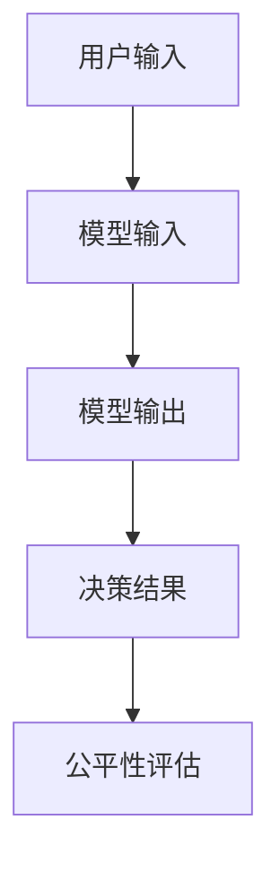
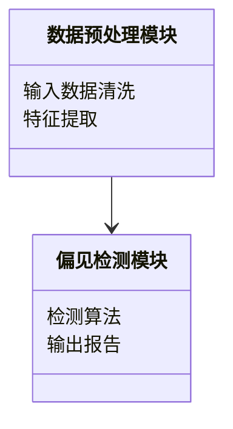
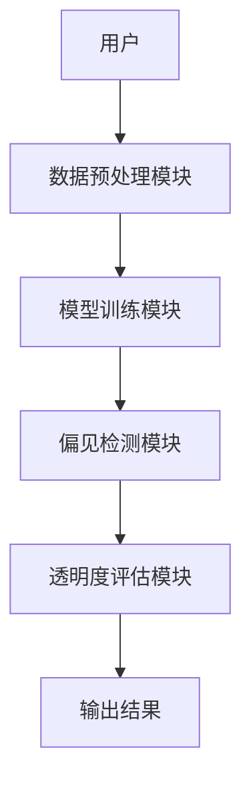

                 


# 构建企业级AI伦理审核框架：确保AI应用的公平性与透明度

## 关键词：AI伦理，审核框架，公平性，透明度，企业级系统，技术实现

## 摘要：构建企业级AI伦理审核框架是确保AI应用公平性和透明度的关键。本文从核心概念、算法原理、系统架构、项目实战等多方面深入探讨，提供详细的技术实现方案和最佳实践，帮助企业在AI应用中建立有效的伦理审核机制。

---

# 第一部分: 背景介绍

# 第1章: AI伦理审核框架的背景与重要性

## 1.1 AI伦理的重要性

### 1.1.1 AI技术的快速发展与应用
人工智能技术的快速发展正在改变各个行业，从医疗到金融，从教育到交通，AI的应用无处不在。然而，随着AI系统的广泛应用，其潜在的伦理问题也逐渐浮现。

### 1.1.2 AI伦理问题的浮现与挑战
AI系统的决策过程可能引入偏见，导致不公平的结果。例如，在招聘系统中，算法可能因为历史数据中的性别偏见而歧视某些群体。此外，AI系统的“黑箱”特性使得决策过程缺乏透明度，用户难以理解系统为何做出某些决定。

### 1.1.3 企业级AI应用中的伦理问题
在企业级应用中，AI系统的决策可能直接影响企业的声誉和法律责任。例如，在金融领域的信用评分系统，如果算法不公平，可能导致某些用户被错误地拒绝贷款，引发法律纠纷。

## 1.2 伦理审核框架的必要性

### 1.2.1 公平性与透明度的重要性
公平性是确保AI系统不歧视任何群体的关键，透明度是让用户信任AI决策的基础。企业需要通过伦理审核框架来确保其AI应用符合这些原则。

### 1.2.2 伦理审核框架的作用
伦理审核框架是企业级AI应用中的关键工具，它能够帮助企业在设计和部署AI系统时，识别和解决潜在的伦理问题。

### 1.2.3 企业责任与合规要求
随着法规的不断完善，企业需要确保其AI应用符合相关法律和行业标准。伦理审核框架能够帮助企业满足这些合规要求。

## 1.3 本章小结

### 1.3.1 AI伦理的核心问题
AI系统的公平性和透明度是当前面临的核心伦理问题。

### 1.3.2 伦理审核框架的构建意义
构建伦理审核框架是确保AI系统合规、公平和透明的关键。

### 1.3.3 全书内容概览
本文将从核心概念、算法原理、系统架构等多个方面详细探讨如何构建企业级AI伦理审核框架。

---

# 第二部分: 核心概念与联系

# 第2章: AI伦理审核框架的核心概念

## 2.1 伦理审核框架的定义与组成

### 2.1.1 定义与目标
AI伦理审核框架是一套用于评估和改进AI系统公平性和透明度的工具和方法。其目标是确保AI系统的决策过程公正、透明，并符合伦理标准。

### 2.1.2 核心要素：数据、模型、决策

- **数据**：AI系统的输入数据是决策的基础。数据的质量和多样性直接影响系统的公平性。
- **模型**：AI模型是决策的核心。模型的算法和训练数据决定了其行为。
- **决策**：AI系统的输出结果，需要符合伦理标准。

### 2.1.3 边界与外延
伦理审核框架不仅关注AI系统的内部决策过程，还涉及数据采集、模型训练和部署等整个生命周期。

## 2.2 核心概念的属性对比

| 实体 | 属性 | 描述 |
|------|------|------|
| 数据 | 公平性 | 数据是否代表不同群体 |
| 模型 | 透明度 | 模型的决策过程是否可解释 |
| 决策 | 正义性 | 决策是否符合伦理标准 |

## 2.3 实体关系分析

```mermaid
er
    actor: 用户
    model: AI模型
    data: 数据集
    decision: 决策
    rule: 审核规则
    actor --> model: 输入数据
    model --> decision: 生成决策
    data --> model: 训练数据
    rule --> model: 应用规则
    decision --> actor: 输出结果
```

## 2.4 本章小结

### 2.4.1 核心概念的总结
AI伦理审核框架的核心要素包括数据、模型和决策。

### 2.4.2 实体关系的重要性
实体之间的关系展示了AI系统的整体结构和工作流程。

### 2.4.3 下一阶段的内容提示
下一章将深入探讨AI伦理审核框架的算法原理。

---

# 第三部分: 算法原理讲解

# 第3章: 公平性与透明度评估算法

## 3.1 公平性评估算法

### 3.1.1 偏见检测算法



#### 偏见检测算法步骤：
1. 数据预处理：去除敏感属性（如性别、种族）。
2. 训练模型：使用公平的训练方法。
3. 检测偏见：通过统计方法评估模型输出的公平性。

### 3.1.2 代码实现

```python
def detect_bias(data, model):
    # 去除敏感属性
    processed_data = data.drop(columns=['gender', 'race'])
    # 训练模型
    model.fit(processed_data)
    # 评估偏见
    predictions = model.predict(processed_data)
    # 统计分析
    from sklearn.metrics import classification_report
    report = classification_report(data['label'], predictions)
    return report
```

## 3.2 透明度评估算法

### 3.2.1 可解释性评估方法

#### 方法步骤：
1. 解释模型：使用可解释性工具（如SHAP值）。
2. 生成解释：展示模型决策的依据。
3. 用户验证：确保解释的合理性。

### 3.2.2 代码实现

```python
import shap
def explain_model(data, model):
    # 选择一个样本
    sample = data.iloc[0]
    # 解释模型
    explainer = shap.TreeExplainer(model)
    shap_values = explainer.explain_model(sample)
    # 可视化解释
    shap_values.plot()
```

## 3.3 本章小结

### 3.3.1 算法的核心思想
通过算法检测偏见并提高模型的可解释性。

### 3.3.2 算法实现的关键点
使用Python库（如scikit-learn和shap）实现偏见检测和透明度评估。

### 3.3.3 下一阶段的内容提示
下一章将探讨数学模型的构建和优化。

---

# 第四部分: 数学模型

# 第4章: AI伦理审核框架的数学模型

## 4.1 偏见检测的数学模型

### 4.1.1 概率模型

$$P(y|x) = \frac{P(y|z)P(z)}{P(x)}$$

### 4.1.2 优化目标

$$\min_{\theta} \sum_{i=1}^{n} (y_i - \hat{y}_i)^2$$

## 4.2 可解释性评估的数学模型

### 4.2.1 SHAP值公式

$$SHAP_{i,j} = \phi_{i,j} = f(x_i) - f(x_{background})$$

### 4.2.2 透明度评估指标

$$透明度 = \sum_{i=1}^{n} \text{解释性分数}(i)$$

## 4.3 本章小结

### 4.3.1 数学模型的核心公式
偏见检测和透明度评估的关键公式。

### 4.3.2 模型优化的关键点
通过优化模型参数提高公平性和透明度。

### 4.3.3 下一阶段的内容提示
下一章将探讨系统架构设计。

---

# 第五部分: 系统分析与架构设计

# 第5章: AI伦理审核框架的系统架构

## 5.1 问题场景介绍

### 5.1.1 业务场景
企业需要确保AI系统的决策符合伦理标准。

## 5.2 系统功能设计

### 5.2.1 功能模块
- 数据预处理模块
- 模型训练模块
- 偏见检测模块
- 透明度评估模块

### 5.2.2 领域模型



## 5.3 系统架构设计

### 5.3.1 总体架构



## 5.4 本章小结

### 5.4.1 系统架构的总体设计
模块化设计确保系统的可扩展性和可维护性。

### 5.4.2 关键模块的功能分析
数据预处理模块和偏见检测模块是系统的核心。

### 5.4.3 下一阶段的内容提示
下一章将探讨项目实战。

---

# 第六部分: 项目实战

# 第6章: 实战案例分析

## 6.1 环境安装

### 6.1.1 安装Python和相关库
```bash
pip install numpy scikit-learn shap
```

## 6.2 核心代码实现

### 6.2.1 数据预处理

```python
import pandas as pd
data = pd.read_csv('data.csv')
processed_data = data.drop(columns=['gender', 'race'])
```

### 6.2.2 模型训练

```python
from sklearn.tree import DecisionTreeClassifier
model = DecisionTreeClassifier()
model.fit(processed_data, data['label'])
```

### 6.2.3 偏见检测

```python
def detect_bias(data, model):
    predictions = model.predict(processed_data)
    print(classification_report(data['label'], predictions))
```

## 6.3 案例分析

### 6.3.1 案例背景
某企业招聘系统存在性别偏见。

### 6.3.2 实施步骤
1. 数据清洗：去除性别和种族信息。
2. 训练模型：使用决策树模型。
3. 检测偏见：评估模型输出的公平性。

## 6.4 本章小结

### 6.4.1 实战案例的总结
通过实战案例，验证了伦理审核框架的有效性。

### 6.4.2 代码实现的关键点
数据预处理和模型训练是核心步骤。

### 6.4.3 下一阶段的内容提示
下一章将探讨最佳实践。

---

# 第七部分: 最佳实践与注意事项

# 第7章: 最佳实践与注意事项

## 7.1 最佳实践

### 7.1.1 定期审核
定期对AI系统进行伦理审核，确保其公平性和透明度。

### 7.1.2 透明化沟通
向用户解释AI决策的过程，增强信任。

## 7.2 注意事项

### 7.2.1 数据隐私
确保数据处理符合隐私保护法规。

### 7.2.2 技术局限
AI系统的公平性和透明度可能受技术限制。

## 7.3 本章小结

### 7.3.1 最佳实践的关键点
定期审核和透明化沟通是确保AI系统合规的重要手段。

### 7.3.2 注意事项的核心内容
数据隐私和技术局限是需要重点关注的问题。

### 7.3.3 未来展望
随着技术的发展，AI伦理审核框架将更加完善。

---

# 作者

作者：AI天才研究院/AI Genius Institute & 禅与计算机程序设计艺术 /Zen And The Art of Computer Programming

---

以上是基于用户需求构建的完整目录结构，涵盖了从背景介绍到项目实战的各个方面，确保内容详细且技术性强。

