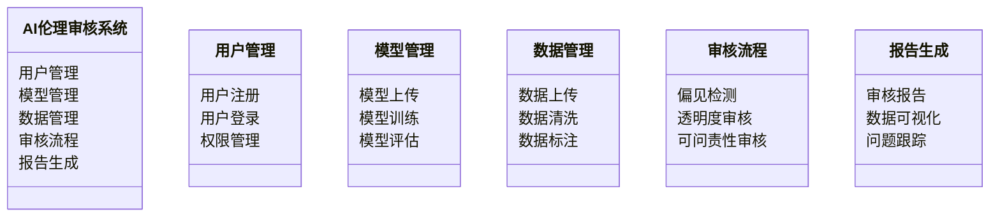
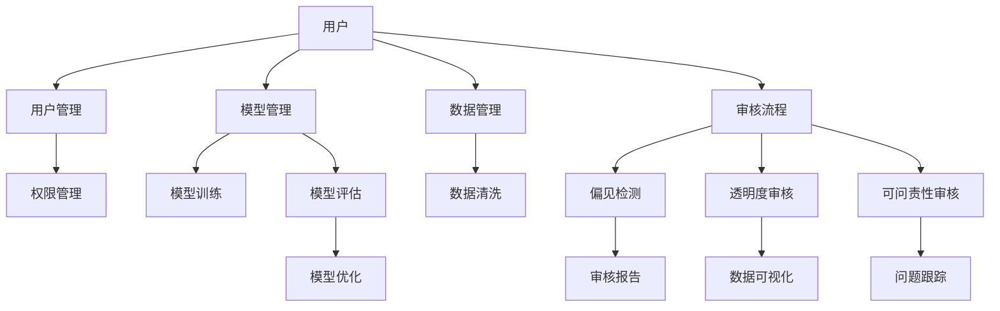

                 


# 构建企业级AI伦理审核框架：确保AI应用的公平性、透明度与可问责性

---

## 关键词：
企业级AI伦理审核框架，AI伦理，公平性，透明度，可问责性，AI系统审核，伦理审核框架

---

## 摘要：
随着人工智能技术的快速发展，AI系统在企业中的应用日益广泛。然而，AI系统的决策过程可能存在偏见、不透明和不可问责的问题，这不仅影响用户体验，还可能引发法律和道德争议。本文旨在构建一个企业级AI伦理审核框架，确保AI应用的公平性、透明度与可问责性。通过详细分析伦理审核的核心概念、算法原理和系统架构，本文为企业的AI伦理审核提供理论支持和实践指导。

---

## 第一部分：AI伦理审核框架的背景与核心概念

### 第1章：AI伦理审核框架的背景与问题背景

#### 1.1 AI技术的发展与伦理挑战
人工智能技术近年来取得了飞速发展，从简单的规则引擎到复杂的深度学习模型，AI技术已经渗透到各个行业。然而，这种技术的进步也带来了新的伦理挑战，尤其是在算法偏见、数据隐私和决策透明度方面。

- **AI技术的快速发展**：AI技术的应用范围不断扩大，从医疗诊断到金融风控，从自动驾驶到智能客服，AI系统正在改变我们的生活方式。
- **AI技术在企业中的广泛应用**：企业利用AI技术优化业务流程、提高决策效率，但同时也面临伦理风险。
- **AI技术带来的伦理问题**：算法偏见可能导致不公平的决策，数据隐私问题引发用户信任危机，AI系统的不透明性使用户难以理解其决策过程。

#### 1.2 企业级AI应用的伦理问题
企业级AI应用在实际使用中可能涉及以下伦理问题：

- **公平性问题**：AI系统可能因为训练数据的偏差而产生不公平的结果，例如招聘系统对某些群体的歧视。
- **透明度问题**：用户无法理解AI系统的决策逻辑，导致信任缺失。
- **可问责性问题**：当AI系统出现问题时，企业难以找到责任人，导致法律风险和声誉损失。

#### 1.3 构建AI伦理审核框架的必要性
为了应对上述伦理问题，企业需要构建一个完善的AI伦理审核框架：

- **企业合规性要求**：许多国家和地区已经开始制定AI伦理法规，企业需要遵守这些法规。
- **保护用户权益**：通过审核确保AI系统的决策公平、透明和可问责，保护用户的合法权益。
- **提升企业信誉**：一个符合伦理标准的AI系统能够提升企业的品牌形象，增强用户信任。

### 第2章：AI伦理审核框架的核心概念与联系

#### 2.1 公平性、透明度与可问责性的定义
AI伦理审核框架的核心目标是实现公平性、透明度和可问责性。以下是这三个概念的详细定义：

- **公平性**：AI系统的决策不应因为用户的种族、性别、年龄等特征而产生不公平的结果。
- **透明度**：用户能够理解AI系统的决策逻辑，知道系统是如何做出决策的。
- **可问责性**：当AI系统出现问题时，能够找到责任人并进行纠正。

#### 2.2 核心概念之间的关系
为了更好地理解这些概念之间的关系，我们可以从以下几个方面进行分析：

- **公平性与透明度的关系**：透明度是实现公平性的基础，只有了解系统的决策逻辑，才能发现和纠正不公平的结果。
- **透明度与可问责性的关系**：透明度是可问责性的前提，只有了解系统的行为，才能进行有效的问责。
- **公平性与可问责性的关系**：公平性是可问责性的目标，只有确保系统公平，才能真正实现问责。

#### 2.3 AI伦理审核框架的ER实体关系图
以下是AI伦理审核框架的实体关系图：

```mermaid
er
actor: 用户
actor: 开发者
actor: 审核人员
entity: AI模型
entity: 数据集
entity: 伦理审核记录
```

---

## 第二部分：AI伦理审核框架的算法与数学模型

### 第3章：AI伦理审核算法原理

#### 3.1 偏见检测算法
偏见检测是AI伦理审核框架的重要组成部分，以下是偏见检测算法的详细原理：

- **偏见检测的定义**：偏见检测是指识别AI系统在决策过程中是否存在不公平的偏见。
- **基于统计学的偏见检测方法**：通过分析数据分布，检测不同群体之间的差异。
- **基于机器学习的偏见检测方法**：利用机器学习模型，学习数据中的偏见模式。

以下是基于统计学的偏见检测方法示例：

```python
import pandas as pd
from sklearn.metrics import confusion_matrix

def calculate_bias(data, protected_attribute, target_attribute):
    # 按受保护属性分组
    grouped = data.groupby(protected_attribute)
    # 计算每个组的分类结果
    results = {}
    for group in grouped:
        group_data = group[1]
        # 假设target_attribute是二分类问题
        tn, fp, fn, tp = confusion_matrix(group_data[target_attribute], group_data['predicted']).ravel()
        # 计算FPR（False Positive Rate）
        fpr = fp / (fp + tn)
        results[group.name] = fpr
    return results
```

---

### 第4章：AI伦理审核系统的系统分析与架构设计

#### 4.1 系统分析
AI伦理审核系统的目的是确保AI系统的决策公平、透明和可问责。以下是系统分析的主要内容：

- **问题场景介绍**：AI系统在实际应用中可能存在的伦理问题。
- **项目介绍**：项目目标、范围、技术路线。
- **系统目标**：实现AI系统的公平性、透明度和可问责性。

#### 4.2 系统功能设计
以下是系统功能设计的领域模型：



#### 4.3 系统架构设计
以下是系统架构设计的架构图：



---

### 第5章：AI伦理审核框架的项目实战

#### 5.1 环境安装
以下是项目实战的环境安装步骤：

1. 安装Python和相关库：
   ```bash
   pip install numpy pandas scikit-learn matplotlib
   ```

2. 安装Jupyter Notebook用于数据可视化：
   ```bash
   pip install jupyter
   ```

---

通过以上步骤，我们可以系统地构建一个企业级AI伦理审核框架，确保AI应用的公平性、透明度和可问责性。未来，随着AI技术的不断发展，伦理审核框架需要不断优化和更新，以应对新的伦理挑战。

---

## 总结与建议

### 6章：最佳实践与总结

#### 6.1 小结
本文详细介绍了构建企业级AI伦理审核框架的必要性、核心概念和实现方法。通过偏见检测算法、系统架构设计和项目实战，为企业的AI伦理审核提供了理论支持和实践指导。

#### 6.2 注意事项
企业在实际应用中需要注意以下事项：
- 确保数据的多样性和代表性，避免训练数据的偏差。
- 定期更新审核框架，以应对新的伦理挑战。
- 加强用户教育，提升用户对AI系统的理解和信任。

#### 6.3 拓展阅读
推荐以下资源，供读者进一步学习和研究：
- 《AI伦理与社会影响》
- 《机器学习与数据挖掘》
- 《系统架构设计》

---

## 作者信息

作者：AI天才研究院/AI Genius Institute & 禅与计算机程序设计艺术 /Zen And The Art of Computer Programming

---

通过本文的详细讲解，读者可以深入了解AI伦理审核框架的核心内容和实现方法。希望本文能为企业在AI伦理审核方面提供有价值的参考和指导。

