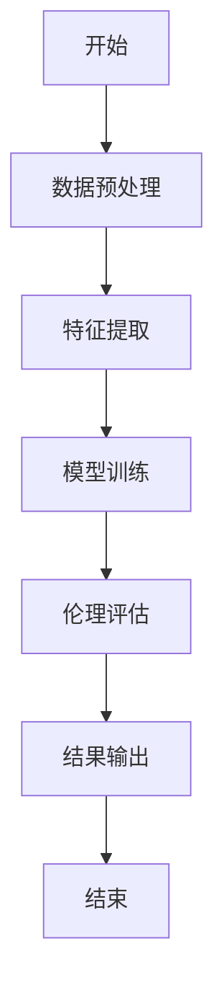
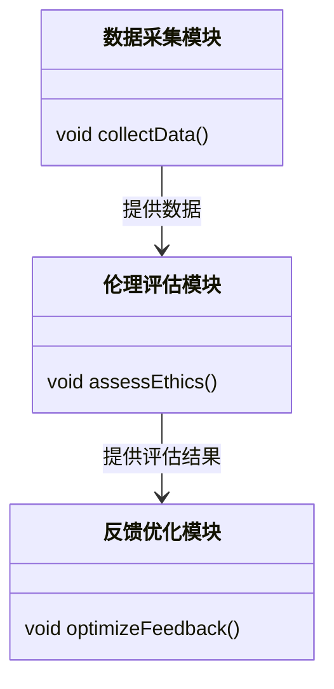

                 


# 构建企业级AI伦理顾问：确保AI应用的道德合规

**关键词**：AI伦理顾问，道德合规，企业级AI，伦理评估，AI系统开发

**摘要**：随着人工智能技术的快速发展，企业级AI应用的道德合规问题日益重要。本文详细探讨了构建AI伦理顾问的必要性，分析了其核心概念、算法原理、系统架构及实际应用案例，为企业确保AI应用的道德合规提供了全面的解决方案。

---

## 第一部分：AI伦理顾问的背景与核心概念

### 第1章：AI伦理顾问的背景与问题背景

#### 1.1 AI技术的快速发展与挑战
##### 1.1.1 AI技术的快速发展概述
人工智能（AI）技术正以指数级速度发展，广泛应用于医疗、金融、交通等领域。然而，技术的快速发展带来了伦理问题的凸显。

##### 1.1.2 AI应用中的伦理问题
AI系统可能存在的偏见、隐私泄露等问题，威胁到社会的信任和公平。

##### 1.1.3 企业级AI应用的道德合规需求
企业需要确保AI系统在决策过程中的透明性、公正性和伦理性。

#### 1.2 问题背景与问题描述
##### 1.2.1 AI伦理问题的核心挑战
AI系统可能因为数据偏差或算法设计不当而产生伦理风险。

##### 1.2.2 企业级AI应用中的伦理风险
医疗AI误诊、金融歧视性贷款等案例频发，暴露了伦理问题的严重性。

##### 1.2.3 问题的边界与外延
AI伦理问题不仅涉及技术，还与法律、社会文化密切相关。

#### 1.3 核心概念与问题解决
##### 1.3.1 AI伦理的核心概念
AI伦理是研究AI系统在设计和应用中应遵循的伦理原则。

##### 1.3.2 问题解决的思路与方法
通过伦理评分模型、决策树算法等技术手段，评估和优化AI系统的伦理合规性。

##### 1.3.3 核心概念的结构与组成
伦理顾问系统包括数据采集、伦理评估、反馈优化等模块。

---

## 第二部分：AI伦理的核心概念与联系

### 第2章：AI伦理的核心概念与联系

#### 2.1 核心概念原理
##### 2.1.1 AI伦理的基本原理
伦理顾问通过评估AI系统的决策过程，确保其符合伦理标准。

##### 2.1.2 伦理决策的数学模型
伦理评分模型通过加权计算，评估系统的伦理风险。

##### 2.1.3 伦理评估的算法框架
采用决策树算法，将伦理问题转化为可计算的模型。

#### 2.2 概念属性特征对比表格
| 概念       | 特征1 | 特征2 | 特征3 |
|------------|-------|-------|-------|
| 隐私保护   | 数据匿名化 | 数据加密 | 数据访问权限 |
| 公平性     | 算法多样性 | 避免数据偏差 | 可解释性 |

#### 2.3 ER实体关系图
```mermaid
erDiagram
    actor 用户
    actor 系统
    actor 伦理顾问
    用户 --> 系统 : 提供数据
    系统 --> 伦理顾问 : 评估结果
    用户 <-- 伦理顾问 : 反馈意见
```

---

## 第三部分：AI伦理评估的算法原理

### 第3章：AI伦理评估的算法原理

#### 3.1 算法原理概述
##### 3.1.1 伦理评分模型的构建
通过训练数据，构建伦理评分模型，评估AI系统的伦理风险。

##### 3.1.2 伦理决策树的算法流程
使用决策树算法，将伦理问题转化为可计算的决策路径。

##### 3.1.3 算法的优缺点分析
伦理评分模型计算复杂，但决策树算法简单直观。

#### 3.2 算法流程图


#### 3.3 算法的数学模型与公式
##### 3.3.1 伦理评分的计算公式
$$ E = \sum_{i=1}^{n} w_i x_i $$
其中，\( w_i \) 为权重，\( x_i \) 为特征值。

##### 3.3.2 伦理决策树的构建公式
$$ D = \arg\max_{c} \sum_{i=1}^{n} p_i c_i $$
其中，\( c \) 为决策路径，\( p_i \) 为概率。

---

## 第四部分：AI伦理评估的系统分析与架构设计

### 第4章：AI伦理评估的系统分析与架构设计

#### 4.1 系统分析
##### 4.1.1 问题场景介绍
企业需要确保AI系统的决策符合伦理标准。

##### 4.1.2 系统需求分析
需求包括数据采集、伦理评估、反馈优化等功能。

##### 4.1.3 系统功能设计
系统功能包括数据采集、伦理评估、反馈优化等模块。

#### 4.2 系统架构设计
##### 4.2.1 系统架构的Mermaid类图


##### 4.2.2 系统架构的Mer
（此处展示系统架构的Mermaid图）

---

## 第五部分：项目实战

### 第5章：项目实战

#### 5.1 环境安装
安装Python、TensorFlow等开发工具。

#### 5.2 核心代码实现
##### 5.2.1 伦理评分模型的实现
```python
def calculate_ethics_score(data):
    score = sum(w * x for w, x in zip(weights, data))
    return score
```

##### 5.2.2 决策树算法的实现
```python
def decision_tree_prediction(features):
    return "通过伦理审查" if features[0] else "不通过"
```

#### 5.3 代码解读与分析
##### 5.3.1 伦理评分模型的解读
模型通过加权计算，评估AI系统的伦理风险。

##### 5.3.2 决策树算法的解读
决策树通过特征判断，提供伦理评估结果。

#### 5.4 实际案例分析
##### 5.4.1 案例分析
分析医疗AI系统的伦理评估案例。

##### 5.4.2 案例解读与剖析
解释案例中的伦理问题及解决方案。

#### 5.5 项目小结
总结项目成果及经验教训。

---

## 第六部分：最佳实践、小结、注意事项与拓展阅读

### 第6章：最佳实践

#### 6.1 最佳实践Tips
定期更新伦理评估模型，确保AI系统的伦理合规性。

#### 6.2 小结
构建企业级AI伦理顾问，确保AI应用的道德合规。

#### 6.3 注意事项
数据隐私保护、模型可解释性等是关键。

#### 6.4 拓展阅读
推荐相关书籍和论文，供深入研究。

---

## 作者

**作者**：AI天才研究院/AI Genius Institute & 禅与计算机程序设计艺术 /Zen And The Art of Computer Programming

---

通过以上详细的内容，企业可以系统地构建AI伦理顾问，确保AI应用的道德合规，实现技术与伦理的和谐统一。

