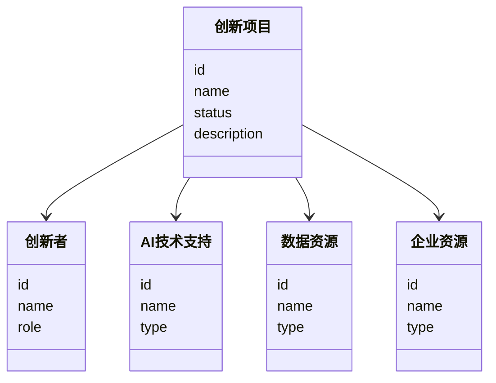

                 


# 构建企业级AI创新孵化器：从创意到商业化

## 关键词：
企业级AI创新孵化器、AI技术、创新模式、算法原理、系统架构、项目实战

## 摘要：
本文详细探讨了如何构建企业级AI创新孵化器，从创意到商业化的完整流程。首先介绍了AI创新孵化器的背景、定义和目标，分析了创新与AI技术的关系。接着深入讲解了AI创新孵化器的核心要素与算法原理，包括对比学习算法的实现和应用。然后通过系统架构设计，展示了孵化器系统的功能模块和实现方式。最后，通过项目实战和最佳实践，总结了构建企业级AI创新孵化器的关键点和注意事项。

---

## 第1章: AI创新孵化器的背景与定义

### 1.1 AI创新孵化器的背景

#### 1.1.1 人工智能技术的快速发展
近年来，人工智能（AI）技术发展迅速，广泛应用于各个领域，为企业创新提供了强大的技术支撑。AI技术的进步不仅推动了技术创新，还为企业孵化器提供了新的思路。

#### 1.1.2 企业创新需求的增加
随着市场竞争的加剧，企业对创新的需求不断增加。企业需要通过创新来保持竞争优势，而AI技术为企业创新提供了新的工具和方法。

#### 1.1.3 AI技术对企业创新的推动作用
AI技术可以通过数据分析、模式识别、自动化等方式，帮助企业发现新的市场机会、优化产品设计、提高研发效率，从而推动企业的创新进程。

---

### 1.2 AI创新孵化器的定义与目标

#### 1.2.1 创新孵化器的定义
创新孵化器是一种为企业提供支持和资源的机构，旨在帮助创新项目从创意阶段到商业化阶段的顺利过渡。AI创新孵化器则是专门针对人工智能技术的创新项目提供支持的孵化器。

#### 1.2.2 AI创新孵化器的核心目标
- 提供技术支持，帮助企业将AI技术应用于创新项目。
- 提供数据支持，帮助企业进行数据分析和模型训练。
- 提供人才支持，帮助企业吸引和培养AI人才。
- 提供资金支持，帮助创新项目获得必要的资金。
- 提供企业资源支持，帮助企业建立合作关系。

#### 1.2.3 企业级AI创新孵化器的特点
- 高度定制化：根据企业的具体需求，提供个性化的支持。
- 强大的技术支撑：依托企业的技术资源，提供先进的AI工具和技术。
- 丰富的资源网络：整合企业内外资源，构建创新生态。

---

### 1.3 企业级AI创新孵化器与企业发展的关系

#### 1.3.1 企业级孵化器的作用
企业级AI创新孵化器不仅是企业内部的创新支持机构，还可以作为企业与其他创新主体（如 startups、高校、研究机构）合作的桥梁。

#### 1.3.2 企业级孵化器与企业创新的关系
企业级孵化器通过提供技术支持、资源支持和管理支持，帮助企业实现创新项目的快速落地和商业化。同时，孵化器还可以帮助企业发现新的市场机会，提升企业的整体竞争力。

#### 1.3.3 企业级孵化器的生态构建
企业级AI创新孵化器需要构建一个多赢的生态体系，包括技术创新、资源协同、人才流动和资本运作等方面，从而实现创新资源的高效配置和价值共创。

---

## 第2章: AI创新孵化器的核心概念与联系

### 2.1 创新与AI的关系

#### 2.1.1 创新在AI技术中的应用
AI技术本身是一种创新，同时也可以作为工具支持其他领域的创新。例如，AI可以用于产品设计、市场预测、流程优化等方面，从而推动企业的创新活动。

#### 2.1.2 AI技术对创新的促进作用
AI技术可以帮助企业快速迭代、降低创新成本、提高创新效率。通过AI技术的应用，企业可以更好地捕捉市场机会，发现新的商业模式。

#### 2.1.3 创新与AI技术的融合
创新与AI技术的融合不仅可以提高创新效率，还可以创造出新的创新模式。例如，通过AI技术的辅助，企业可以实现更加智能化的创新管理。

---

### 2.2 AI创新孵化器的核心要素

#### 2.2.1 技术支持
企业级AI创新孵化器需要提供强大的技术支持，包括AI算法、数据处理、模型训练等。

#### 2.2.2 数据支持
数据是AI创新的核心资源，企业级孵化器需要提供高质量的数据支持，包括数据采集、数据清洗、数据标注等。

#### 2.2.3 人才支持
AI创新需要专业人才的支持，企业级孵化器需要提供人才招聘、培训、激励等服务，以吸引和留住优秀的AI人才。

#### 2.2.4 资金支持
创新项目往往需要大量的资金支持，企业级孵化器可以通过内部资金、风险投资、政府补贴等多种方式为企业提供资金支持。

#### 2.2.5 企业资源支持
企业级孵化器可以利用企业的资源，包括品牌、渠道、客户等，帮助创新项目快速进入市场。

---

### 2.3 AI创新孵化器的实体关系图


从上图可以看出，创新者通过创新项目与AI技术支持相结合，利用数据资源和企业资源，最终实现商业化的目标。

---

## 第3章: AI创新孵化器的算法原理

### 3.1 创新孵化器的算法选择

#### 3.1.1 机器学习算法
机器学习算法是AI创新的重要工具，包括监督学习、无监督学习、强化学习等。

#### 3.1.2 自然语言处理算法
自然语言处理（NLP）算法可以用于文本分析、情感分析、机器翻译等任务，支持创新项目的文本处理需求。

#### 3.1.3 图算法
图算法可以用于知识图谱构建、路径规划等任务，支持创新项目的知识管理需求。

---

### 3.2 对比学习算法

#### 3.2.1 对比学习的定义
对比学习是一种通过比较不同数据点之间的相似性或差异性来学习特征表示的方法。

#### 3.2.2 对比学习的流程


从上图可以看出，对比学习的流程包括数据输入、特征提取、对比学习和结果输出四个步骤。

#### 3.2.3 对比学习的代码实现

```python
import torch
def contrastive_loss(x, y, temperature=0.5):
    x = x 
    y = y 
    # 计算余弦相似度
    similarity = (x * y).sum(dim=-1) / (torch.norm(x) * torch.norm(y))
    # 计算损失
    loss = -torch.mean(torch.log(similarity))
    return loss
```

---

### 3.3 对比学习的Python代码实现

```python
import torch
def contrastive_loss(x, y, temperature=0.5):
    x = x 
    y = y 
    # 计算余弦相似度
    similarity = (x * y).sum(dim=-1) / (torch.norm(x) * torch.norm(y))
    # 计算损失
    loss = -torch.mean(torch.log(similarity))
    return loss
```

---

## 第4章: 系统分析与架构设计方案

### 4.1 问题场景介绍

#### 4.1.1 项目介绍
本章将从系统架构设计的角度，详细介绍企业级AI创新孵化器的构建过程。

#### 4.1.2 系统功能设计
系统功能设计包括创新项目管理、AI技术支持、数据管理、资源管理等功能模块。

#### 4.1.3 系统架构设计
系统架构设计采用分层架构，包括数据层、服务层、应用层等。

---

### 4.2 系统架构设计

#### 4.2.1 领域模型类图



---

### 4.3 系统架构图


---

## 第5章: 项目实战

### 5.1 环境安装

#### 5.1.1 安装Python
安装Python 3.8或更高版本。

#### 5.1.2 安装必要的库
安装PyTorch、numpy、scikit-learn等库。

```bash
pip install torch numpy scikit-learn
```

---

### 5.2 核心代码实现

#### 5.2.1 对比学习的实现

```python
import torch
def contrastive_loss(x, y, temperature=0.5):
    x = x 
    y = y 
    # 计算余弦相似度
    similarity = (x * y).sum(dim=-1) / (torch.norm(x) * torch.norm(y))
    # 计算损失
    loss = -torch.mean(torch.log(similarity))
    return loss
```

---

### 5.3 案例分析

#### 5.3.1 案例背景
某企业希望利用AI技术优化其产品设计流程。

#### 5.3.2 实施步骤
1. 收集产品设计数据。
2. 使用对比学习算法进行特征提取。
3. 分析结果并优化设计。

---

## 第6章: 最佳实践

### 6.1 小结
企业级AI创新孵化器的构建需要结合企业的具体需求，充分利用AI技术的优势，通过技术创新、资源整合和生态构建，推动创新项目的商业化。

### 6.2 注意事项
- 确保数据质量，避免数据偏差。
- 注重团队协作，提高效率。
- 定期评估和优化系统架构。

### 6.3 拓展阅读
- 《企业级AI创新孵化器的设计与实现》
- 《对比学习算法在创新项目中的应用》

---

## 作者：AI天才研究院/AI Genius Institute & 禅与计算机程序设计艺术 /Zen And The Art of Computer Programming

