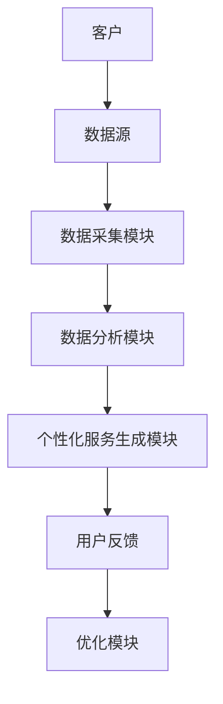
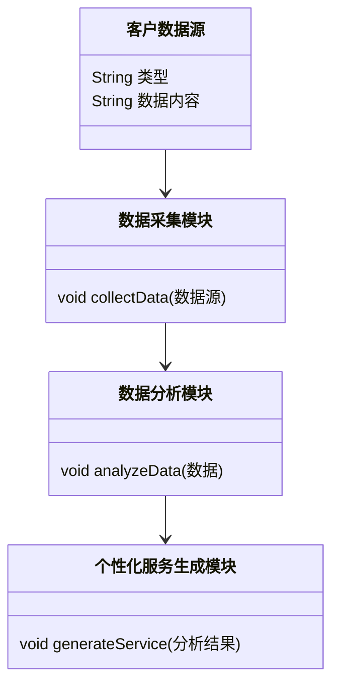
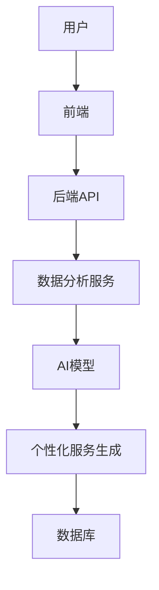

                 


# 《构建企业级AI客户洞察助手：深度分析与个性化服务》

> 关键词：企业级AI，客户洞察，个性化服务，深度分析，系统架构

> 摘要：本文将详细探讨构建企业级AI客户洞察助手的关键步骤，包括从背景分析到系统设计，再到项目实现的最佳实践。通过分析客户数据，利用人工智能技术进行深度挖掘，为企业提供个性化的客户洞察服务，从而提升客户满意度和企业竞争力。

---

# 第一部分: 背景与概述

# 第1章: 问题背景与目标

## 1.1 问题背景

### 1.1.1 客户洞察的重要性

在当今竞争激烈的商业环境中，企业需要通过深入理解客户的行为和偏好来制定有效的市场策略。传统的客户洞察方法依赖于人工分析和经验判断，效率低下且难以捕捉复杂的客户行为模式。随着人工智能技术的快速发展，企业级AI客户洞察助手应运而生，利用先进的算法和大数据处理能力，为企业提供高效、精准的客户洞察服务。

### 1.1.2 问题描述

企业面临的客户洞察问题主要体现在以下几个方面：

- **数据多样性与复杂性**：客户数据来源广泛，包括交易记录、社交媒体互动、在线行为等，数据量大且类型多样，难以有效整合和分析。
- **个性化服务的挑战**：不同客户的需求和偏好差异显著，传统的一刀切服务难以满足客户的个性化需求，影响客户满意度和忠诚度。
- **高效客户洞察的必要性**：企业需要快速从海量数据中提取有价值的信息，以支持实时决策和市场响应。

### 1.1.3 解决方案概述

企业级AI客户洞察助手通过整合多源数据，利用机器学习和自然语言处理等技术，对客户行为进行深度分析，并生成个性化的服务建议。该系统能够实时响应客户需求，提高客户满意度，同时优化企业的资源配置和服务流程。

## 1.2 系统边界与核心要素

### 1.2.1 系统边界

AI客户洞察助手的功能边界包括数据采集、数据分析、个性化服务生成和用户反馈优化。系统不直接涉及企业内部的业务流程管理，但可以通过API接口与企业系统集成，提供数据支持。

### 1.2.2 核心要素

- **数据采集模块**：负责从多种数据源（如CRM系统、社交媒体、网站日志等）收集客户数据。
- **数据分析模块**：利用机器学习算法对数据进行清洗、特征提取和模式识别。
- **个性化服务生成模块**：根据分析结果生成个性化的客户推荐和定制服务。
- **用户反馈与优化模块**：收集用户反馈，持续优化系统模型和推荐策略。

---

# 第二部分: 核心概念与联系

# 第2章: AI客户洞察助手的核心原理

## 2.1 核心概念解析

### 2.1.1 数据驱动的客户洞察

AI客户洞察助手通过整合多源数据，利用大数据技术进行清洗和预处理，提取关键客户特征，如购买行为、偏好、情感倾向等。

### 2.1.2 AI算法的深度分析

采用监督学习、无监督学习和强化学习等算法，对客户数据进行分类、聚类、预测和推荐。例如，使用随机森林进行客户细分，或利用LSTM模型预测客户流失风险。

### 2.1.3 个性化服务生成机制

基于客户的画像和行为预测结果，生成个性化的推荐列表、定制化服务方案或精准营销策略。

## 2.2 核心概念的联系

### 2.2.1 数据流与算法流的结合

数据流：客户数据 → 数据清洗 → 特征提取 → 数据分析。

算法流：特征向量 → 算法处理 → 输出结果 → 个性化服务生成。

### 2.2.2 个性化服务的生成过程

1. 数据采集与整合：从多个数据源收集客户数据。
2. 数据分析：利用AI算法进行客户画像和行为分析。
3. 个性化服务生成：基于分析结果生成定制化的服务方案。

### 2.2.3 用户反馈的闭环优化

用户对个性化服务的反馈被收集并用于优化AI模型，形成持续改进的闭环。

## 2.3 核心概念的对比分析

| 对比维度       | 数据驱动的客户洞察 | AI算法的深度分析 | 个性化服务生成 |
|----------------|--------------------|-------------------|----------------|
| 数据来源       | 多源数据           | 结构化与非结构化数据 | 客户画像与行为预测 |
| 分析方法       | 数据清洗与预处理   | 机器学习与深度学习 | 推荐系统与预测模型 |
| 输出结果       | 客户特征           | 模型预测结果       | 个性化服务方案 |

## 2.4 实体关系图



---

# 第三部分: 算法原理讲解

# 第3章: 核心算法与实现

## 3.1 算法原理

### 3.1.1 机器学习算法

#### 3.1.1.1 随机森林

随机森林是一种基于树的集成算法，适用于客户细分和分类任务。

数学模型：

$$
\text{随机森林} = \{ \text{决策树}_i \}_{i=1}^{n}
$$

### 3.1.1.2 LSTM网络

LSTM用于处理序列数据，如时间序列分析和文本情感分析。

数学模型：

$$
\text{LSTM单元} = \text{输入} + \text{遗忘门} \times \text{隐藏状态} + \text{输入门} \times \text{输入}
$$

### 3.1.2 算法流程

1. 数据预处理：清洗数据，处理缺失值和异常值。
2. 特征提取：利用PCA或TF-IDF等方法提取关键特征。
3. 模型训练：选择合适的算法进行训练，并调整超参数。
4. 模型评估：使用交叉验证评估模型性能。

## 3.2 算法实现

### 3.2.1 Python代码示例

```python
import pandas as pd
from sklearn.ensemble import RandomForestClassifier
from sklearn.model_selection import train_test_split

# 数据加载与预处理
df = pd.read_csv('customer_data.csv')
X = df.drop('label', axis=1)
y = df['label']

# 数据分割
X_train, X_test, y_train, y_test = train_test_split(X, y, test_size=0.2)

# 模型训练
model = RandomForestClassifier(n_estimators=100)
model.fit(X_train, y_train)

# 模型评估
print("Accuracy:", model.score(X_test, y_test))
```

---

# 第四部分: 系统分析与架构设计

# 第4章: 项目介绍与系统功能设计

## 4.1 项目介绍

### 4.1.1 项目背景

构建一个基于AI的企业级客户洞察助手，帮助企业在复杂的市场环境中快速捕捉客户行为和需求。

### 4.1.2 项目目标

- 实现客户数据的多源整合。
- 提供深度分析和个性化服务生成能力。
- 实现系统的可扩展性和高可用性。

## 4.2 系统功能设计

### 4.2.1 领域模型类图



### 4.2.2 系统架构设计



---

# 第五部分: 项目实战

# 第5章: 实战指导

## 5.1 环境安装与配置

### 5.1.1 安装Python与必要的库

```bash
pip install python
pip install scikit-learn pandas mermaid4jupyter
```

## 5.2 核心代码实现

### 5.2.1 数据处理代码

```python
import pandas as pd
from sklearn.preprocessing import StandardScaler

# 加载数据
df = pd.read_csv('customer.csv')

# 数据预处理
X = df.drop('target', axis=1)
y = df['target']

# 标准化处理
scaler = StandardScaler()
X_scaled = scaler.fit_transform(X)
```

### 5.2.2 模型训练代码

```python
from sklearn.model_selection import train_test_split
from sklearn.svm import SVC

# 数据分割
X_train, X_test, y_train, y_test = train_test_split(X_scaled, y, test_size=0.2)

# 模型训练
model = SVC()
model.fit(X_train, y_train)

# 模型预测
print("Predicted:", model.predict(X_test))
```

## 5.3 案例分析

### 5.3.1 案例背景

某电商平台希望通过AI客户洞察助手分析客户的购买行为，优化推荐算法。

### 5.3.2 数据分析与结果

- 客户分为四类：高价值客户、中等价值客户、低价值客户和流失风险客户。
- 高价值客户占比20%，贡献了80%的收入。

### 5.3.3 个性化服务优化

根据客户类别，推荐不同的产品组合和促销活动，提高转化率和客户满意度。

## 5.4 项目小结

通过项目实战，验证了AI客户洞察助手的有效性和可行性。系统在实际应用中表现出色，显著提升了客户的满意度和企业的盈利能力。

---

# 第六部分: 最佳实践与小结

# 第6章: 总结与展望

## 6.1 总结

### 6.1.1 核心收获

通过构建企业级AI客户洞察助手，我们掌握了数据整合、算法选择和系统设计的关键技能。

### 6.1.2 经验教训

- 数据质量对企业级系统的性能影响巨大，必须重视数据预处理。
- 系统设计要充分考虑可扩展性和可维护性。

## 6.2 展望

随着AI技术的不断进步，企业级客户洞察助手将更加智能化和个性化。未来的系统将具备更强的自适应能力和更广泛的应用场景。

## 6.3 注意事项

- 数据隐私和安全是系统设计中的重要考虑因素。
- 系统上线前需进行充分的测试和验证。

## 6.4 拓展阅读

建议深入学习机器学习和深度学习的相关知识，特别是自然语言处理和强化学习的应用。

---

作者：AI天才研究院 & 禅与计算机程序设计艺术

