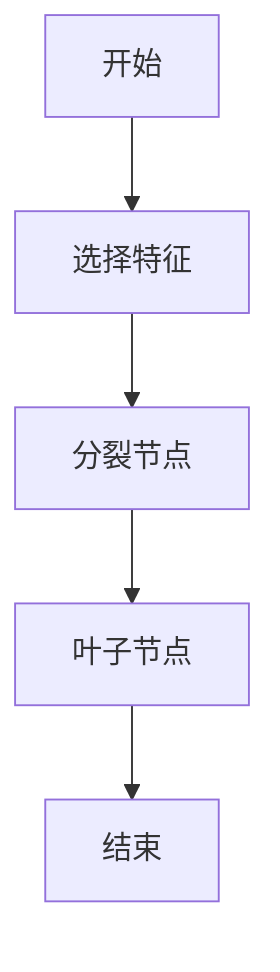
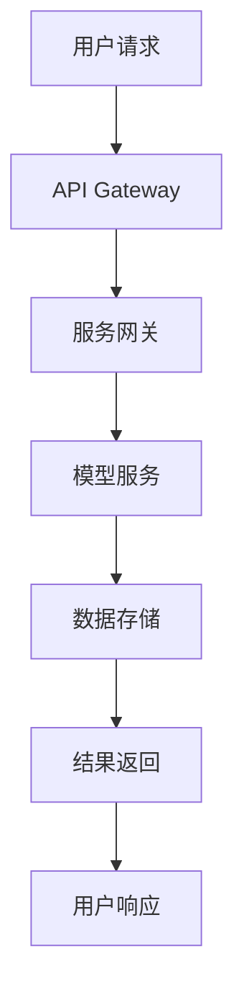
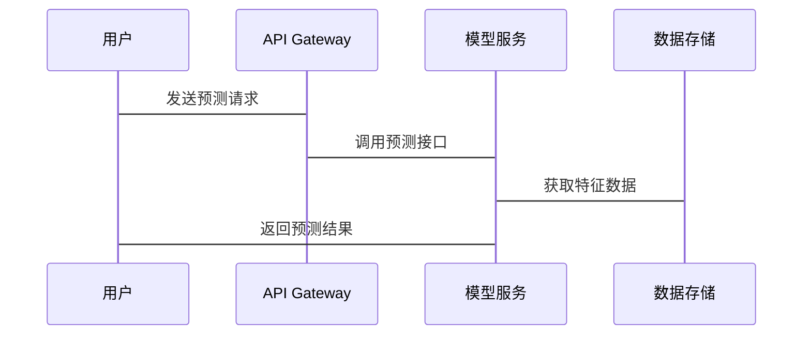

                 


# 构建企业级AI客户生命周期管理助手

## 关键词：企业级AI，客户生命周期管理，机器学习，数据处理，系统架构

## 摘要：随着企业对客户管理需求的不断增长，利用AI技术优化客户生命周期管理成为趋势。本文将详细探讨如何构建一个基于AI的企业级客户生命周期管理助手，涵盖从核心概念到系统架构的设计，再到项目实战的全过程。

---

# 第1章: 企业级客户生命周期管理与AI的结合

## 1.1 客户生命周期管理的概念

### 1.1.1 客户生命周期的定义与阶段划分

客户生命周期指的是客户与企业之间的关系从建立到终止的整个过程。通常分为五个阶段：获取、激活、培养、保留和流失。每个阶段都有不同的客户行为和需求，企业需要在不同阶段采取相应的策略。

### 1.1.2 企业级客户管理的核心目标

企业级客户管理的目标是通过数据驱动的洞察，优化客户体验，提高客户满意度和忠诚度，最终实现业务增长。这需要整合多渠道数据，实时分析客户行为，并根据分析结果采取行动。

### 1.1.3 AI在客户生命周期管理中的作用

AI技术能够通过机器学习算法分析客户的复杂行为模式，预测客户流失风险，识别高价值客户，并推荐个性化的服务策略。这使得企业能够更高效地管理客户关系，提升客户生命周期价值。

## 1.2 问题背景与挑战

### 1.2.1 客户管理的传统模式与局限性

传统客户管理依赖人工操作，难以处理海量数据，且缺乏实时性和个性化。这种方法在数据爆炸的时代显得力不从心，无法满足企业对精准客户管理的需求。

### 1.2.2 数据爆炸对企业客户管理的影响

随着数字化转型的推进，企业每天产生的客户数据量巨大，包括交易数据、行为数据、社交数据等。如何有效处理和利用这些数据，成为企业客户管理的核心挑战。

### 1.2.3 AI技术如何解决客户管理中的痛点

AI能够快速处理大量数据，提取有价值的信息，并通过预测模型帮助企业在客户生命周期的各个阶段做出决策。例如，通过自然语言处理（NLP）分析客户反馈，识别情感倾向，帮助企业及时调整服务策略。

## 1.3 问题描述与解决方案

### 1.3.1 客户生命周期管理中的典型问题

企业在客户管理中常常面临以下问题：
1. 如何准确预测客户流失风险？
2. 如何实现客户分群和个性化服务？
3. 如何高效处理多源异构数据？
4. 如何保证客户数据的安全性和隐私性？

### 1.3.2 基于AI的客户管理解决方案

构建一个基于AI的企业级客户生命周期管理助手，整合多渠道数据，利用机器学习算法进行客户行为分析和预测，提供个性化的客户管理策略。具体包括：
- 数据采集与整合
- 客户分群与画像
- 客户行为预测
- 自动化客户服务

### 1.3.3 解决方案的边界与外延

该解决方案主要用于企业级客户管理，边界包括数据采集、模型训练和结果应用，外延则延伸至客户交互和业务优化。

## 1.4 核心概念与联系

### 1.4.1 客户生命周期模型的构建

客户生命周期模型将客户划分为不同阶段，每个阶段对应不同的管理策略。例如，新客户需要进行欢迎和激活，成熟客户需要维护和提升，流失客户需要召回。

### 1.4.2 数据处理流程与AI算法的关系

数据处理是AI算法的基础，算法的结果反过来指导数据处理的优化。例如，通过聚类分析客户行为模式，优化数据分群策略。

### 1.4.3 业务场景与技术实现的结合

业务场景如客户流失预测需要具体的技术实现，例如使用逻辑回归模型，结合客户的历史交易数据和行为数据，预测客户流失的概率。

---

# 第2章: 客户生命周期管理助手的核心算法与数学模型

## 2.1 客户行为预测算法

### 2.1.1 线性回归模型

线性回归适用于连续型目标变量的预测。例如，预测客户的消费金额。

$$ y = \beta_0 + \beta_1x_1 + \beta_2x_2 + \epsilon $$

其中，$y$ 是目标变量，$x_1, x_2$ 是特征变量，$\beta_0, \beta_1, \beta_2$ 是回归系数，$\epsilon$ 是误差项。

### 2.1.2 逻辑回归模型

逻辑回归适用于二分类问题，例如预测客户是否会流失。

$$ P(y=1|x) = \frac{e^{\beta_0 + \beta_1x}}{1 + e^{\beta_0 + \beta_1x}} $$

其中，$P(y=1|x)$ 是客户流失的概率，$x$ 是特征向量，$\beta_0, \beta_1$ 是模型参数。

### 2.1.3 决策树算法

决策树是一种直观的分类和回归方法，适用于客户分群和行为预测。



### 2.1.4 随机森林与XGBoost算法

随机森林是一种基于决策树的集成学习方法，通过组合多个决策树的结果来提高预测准确率。

XGBoost是一种梯度提升算法，通过迭代优化模型，提升预测性能。

## 2.2 算法实现与优化

### 2.2.1 算法调优策略

- 特征选择：使用特征重要性评估，剔除无关特征。
- 参数优化：使用网格搜索或随机搜索，找到最优模型参数。
- 过拟合控制：使用交叉验证和正则化方法。

### 2.2.2 模型评估与验证

- 分类指标：准确率、召回率、F1分数。
- 回归指标：均方误差（MSE）、R平方值。

---

# 第3章: 系统架构与设计

## 3.1 系统功能模块划分

### 3.1.1 数据采集模块

负责从CRM系统、社交媒体、网站等渠道采集客户数据。

### 3.1.2 数据处理模块

对采集到的数据进行清洗、转换和特征工程，为模型训练提供高质量的数据。

### 3.1.3 模型训练模块

基于处理后的数据，训练机器学习模型，并保存最优模型。

### 3.1.4 服务部署模块

将训练好的模型部署为API服务，供其他系统调用。

## 3.2 系统架构图



## 3.3 系统接口设计

### 3.3.1 RESTful API设计

使用RESTful API风格，提供以下接口：
- POST /api/train：触发模型训练。
- GET /api/predict：获取客户预测结果。

### 3.3.2 微服务架构接口

采用微服务架构，各模块之间通过RPC或HTTP调用。

## 3.4 系统交互流程



---

# 第4章: 项目实战

## 4.1 环境搭建

### 4.1.1 安装Python和必要的库

```bash
pip install numpy pandas scikit-learn flask
```

### 4.1.2 数据集准备

使用CSV格式的数据集，包含客户ID、交易金额、购买频率等特征。

## 4.2 核心实现

### 4.2.1 数据预处理

```python
import pandas as pd
from sklearn.model_selection import train_test_split
from sklearn.preprocessing import StandardScaler

# 读取数据
data = pd.read_csv('customer.csv')

# 划分特征和目标
X = data.drop('churn', axis=1)
y = data['churn']

# 划分训练集和测试集
X_train, X_test, y_train, y_test = train_test_split(X, y, test_size=0.2)

# 特征标准化
scaler = StandardScaler()
X_train_scaled = scaler.fit_transform(X_train)
X_test_scaled = scaler.transform(X_test)
```

### 4.2.2 模型训练

```python
from sklearn.ensemble import RandomForestClassifier
from sklearn.metrics import accuracy_score

# 初始化模型
model = RandomForestClassifier(n_estimators=100, max_depth=4, random_state=42)

# 训练模型
model.fit(X_train_scaled, y_train)

# 预测测试集
y_pred = model.predict(X_test_scaled)

# 计算准确率
print(f'Accuracy: {accuracy_score(y_test, y_pred)}')
```

## 4.3 系统部署

### 4.3.1 部署为Flask服务

```python
from flask import Flask, request, jsonify

app = Flask(__name__)
model = RandomForestClassifier(n_estimators=100, max_depth=4, random_state=42)
model.fit(X_train_scaled, y_train)

@app.route('/predict', methods=['POST'])
def predict():
    data = request.json
    X_new = scaler.transform([data['features']])
    prediction = model.predict(X_new)
    return jsonify({'prediction': int(prediction[0])})

if __name__ == '__main__':
    app.run(debug=True)
```

## 4.4 实际案例分析

通过实际数据集验证模型的预测能力，分析模型在客户流失预测中的表现，并根据结果优化模型参数和数据处理流程。

---

# 第5章: 最佳实践与注意事项

## 5.1 最佳实践

### 5.1.1 数据质量管理

确保数据的准确性和完整性，避免数据偏差影响模型性能。

### 5.1.2 模型迭代

定期更新模型，跟踪模型性能变化，及时调整模型参数。

### 5.1.3 安全与隐私

严格遵守数据隐私法规，确保客户数据的安全性和隐私性。

## 5.2 小结

通过构建企业级AI客户生命周期管理助手，企业能够实现客户关系的智能化管理，提高客户满意度和忠诚度，从而提升整体业务表现。

## 5.3 注意事项

- 数据处理时要注意数据类型和格式的统一。
- 模型训练时要避免过拟合，使用交叉验证。
- 系统部署时要考虑性能和扩展性。

## 5.4 拓展阅读

推荐阅读《机器学习实战》、《深入理解机器学习》等书籍，进一步学习AI在客户管理中的应用。

---

# 作者

作者：AI天才研究院/AI Genius Institute  
禅与计算机程序设计艺术 /Zen And The Art of Computer Programming

