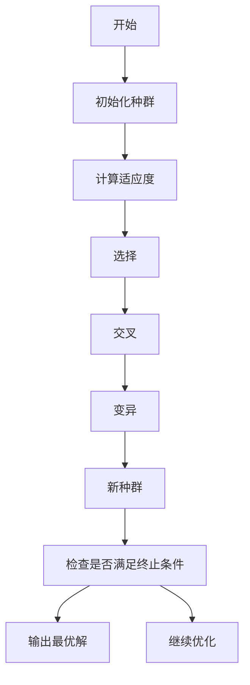
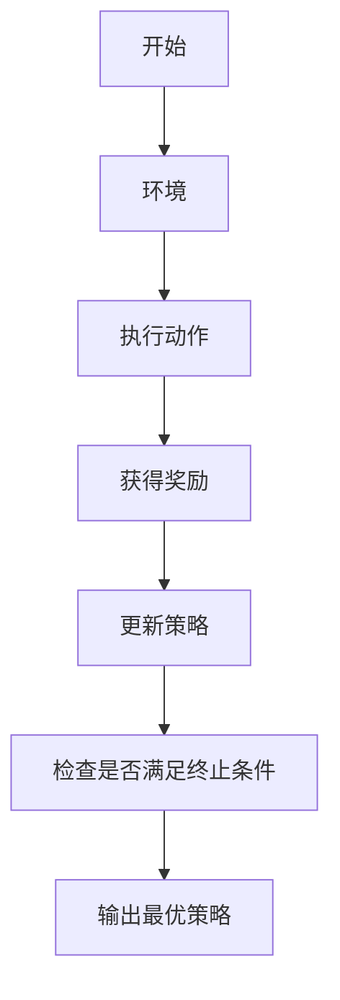
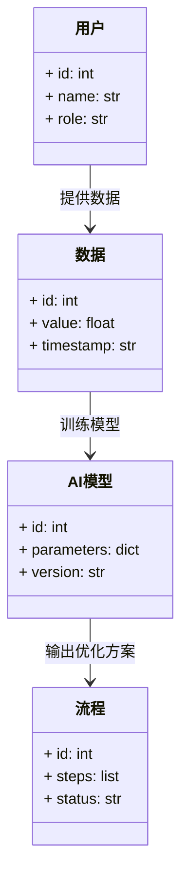
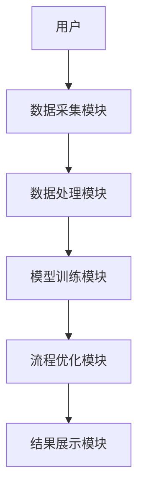
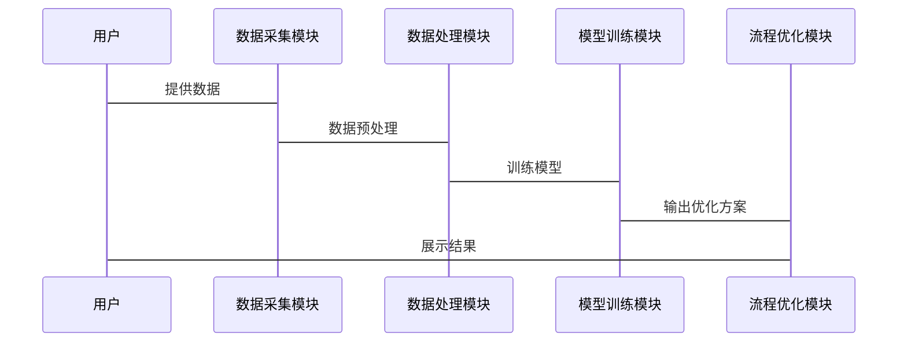

                 


# 构建企业级AI工作流程优化助手：提升运营效率

> 关键词：企业级AI，工作流程优化，AI助手，运营效率，流程自动化，机器学习算法，系统架构设计

> 摘要：企业级AI工作流程优化助手通过结合人工智能技术与企业流程管理，能够显著提升企业运营效率。本文从背景、核心概念、算法原理、系统架构、项目实战到最佳实践，全面解析如何构建这样一个高效的AI辅助系统，帮助企业实现工作流程的智能化优化。

---

# 第一部分: 企业级AI工作流程优化助手的背景与核心概念

## 第1章: AI工作流程优化助手的背景与问题背景

### 1.1 企业级工作流程优化的背景

#### 1.1.1 传统企业工作流程的痛点
现代企业在运营过程中，常常面临以下痛点：
- **流程复杂性**：企业内部流程通常涉及多个部门和系统，导致效率低下。
- **人工干预过多**：传统流程优化依赖于人工分析和调整，耗时且成本高昂。
- **数据孤岛**：各部门之间的数据难以有效整合，影响决策的准确性。
- **灵活性不足**：面对市场变化，传统流程难以快速调整。

#### 1.1.2 AI技术在企业流程优化中的作用
人工智能技术的引入，为企业流程优化带来了新的可能性：
- **自动化分析**：AI能够快速分析大量数据，发现潜在问题。
- **智能决策**：基于数据和模型，AI可以推荐最优的流程调整方案。
- **实时反馈**：AI系统能够实时监控流程运行情况，并提供动态优化建议。

#### 1.1.3 企业级AI工作流程优化助手的目标与意义
- **目标**：通过AI技术，实现企业工作流程的自动化优化，降低运营成本，提高效率。
- **意义**：AI工作流程优化助手能够帮助企业快速响应市场变化，提升竞争力。

### 1.2 问题背景与问题描述

#### 1.2.1 传统工作流程优化的难点
- **缺乏数据支持**：传统优化方法依赖经验，难以量化。
- **效率低下**：人工优化过程耗时长，且容易出错。
- **难以动态调整**：传统方法难以应对快速变化的业务需求。

#### 1.2.2 企业运营效率提升的核心问题
- **如何高效整合企业资源**：实现资源的最优分配。
- **如何快速响应市场变化**：确保流程灵活性。
- **如何降低运营成本**：通过自动化优化减少人工干预。

#### 1.2.3 AI技术如何解决工作流程优化问题
- **数据驱动决策**：AI能够通过分析历史数据，识别瓶颈。
- **自动化优化**：AI算法可以自动调整流程参数，寻找最优解。
- **动态适应性**：AI系统能够实时监控流程运行，动态优化。

### 1.3 问题解决与边界定义

#### 1.3.1 AI优化助手的核心解决方案
- **数据采集与分析**：通过AI技术采集和分析企业流程数据。
- **模型训练与优化**：基于数据训练AI模型，提出优化建议。
- **实时监控与反馈**：持续监控流程运行，提供动态优化方案。

#### 1.3.2 边界与外延：AI优化的适用范围
- **适用范围**：适用于需要优化的业务流程，如生产、销售、客服等。
- **边界**：不涉及企业核心业务逻辑的改变，仅优化流程执行效率。

#### 1.3.3 核心要素与组成
- **流程数据**：流程中的各项操作数据。
- **AI模型**：用于优化的机器学习模型。
- **优化算法**：如遗传算法、强化学习等。
- **反馈机制**：实时监控和调整的机制。

## 第2章: AI工作流程优化助手的核心概念与原理

### 2.1 核心概念原理

#### 2.1.1 优化算法的基本原理
优化算法是AI工作流程优化的核心，常见的优化算法包括：
- **遗传算法**：模拟自然选择过程，通过迭代优化。
- **模拟退火**：通过随机搜索找到全局最优解。
- **强化学习**：通过试错学习最优策略。

#### 2.1.2 数据驱动的流程优化方法
数据是优化的基础，通过数据采集、分析和建模，找到优化方向。

#### 2.1.3 AI模型在流程优化中的应用
AI模型（如强化学习模型）可以通过经验不断优化流程，实现动态调整。

### 2.2 核心概念对比与ER实体关系图

#### 2.2.1 AI优化算法的对比分析
| 算法类型    | 优点                     | 缺点                     |
|-------------|--------------------------|--------------------------|
| 遗传算法    | 全局搜索能力强           | 收敛速度较慢             |
| 模拟退火    | 能够找到全局最优解       | 参数设置敏感             |
| 强化学习    | 适用于动态环境           | 需要大量数据和计算资源   |

#### 2.2.2 数据流与流程流的实体关系图
```mermaid
er
actor: 用户
process: 工作流程
data: 数据
model: AI模型
```

### 2.3 核心概念的数学模型与公式

#### 2.3.1 优化目标函数
$$ f(x) = \text{目标函数} $$

#### 2.3.2 约束条件
$$ g(x) \leq 0 $$

#### 2.3.3 模型训练公式
$$ y = f(x; \theta) $$

---

# 第二部分: AI工作流程优化助手的算法原理

## 第3章: AI工作流程优化助手的算法原理

### 3.1 常用优化算法原理

#### 3.1.1 遗传算法


#### 3.1.2 强化学习


#### 3.1.3 算法实现
以下是一个遗传算法的Python实现示例：
```python
import random

def fitness(x):
    return -x**2 + 4*x

def mutate(x):
    return x + random.gauss(0, 1)

def evolve(population_size, generations):
    population = [random.uniform(0, 4) for _ in range(population_size)]
    for _ in range(generations):
        population = [mutate(x) for x in population]
        population = sorted(population, key=lambda x: -fitness(x))
        population = population[:population_size]
    return max(population, key=lambda x: fitness(x))
```

---

# 第三部分: AI工作流程优化助手的系统架构设计

## 第4章: 系统架构与设计

### 4.1 问题场景介绍

#### 4.1.1 项目背景
以某制造企业为例，优化其生产流程。

### 4.2 系统功能设计

#### 4.2.1 领域模型


### 4.3 系统架构设计

#### 4.3.1 系统架构图


#### 4.3.2 系统交互设计


### 4.4 系统接口设计

#### 4.4.1 API接口设计
- **数据接口**：提供数据采集和存储的API。
- **模型接口**：提供模型训练和预测的API。
- **优化接口**：提供流程优化建议的API。

---

# 第四部分: AI工作流程优化助手的项目实战

## 第5章: 项目实战与实现

### 5.1 环境安装与配置

#### 5.1.1 安装依赖
```bash
pip install numpy matplotlib
```

### 5.2 系统核心实现

#### 5.2.1 数据采集模块
```python
import pandas as pd

def collect_data():
    data = pd.read_csv('data.csv')
    return data
```

#### 5.2.2 数据处理模块
```python
import numpy as np

def preprocess(data):
    # 数据清洗与特征工程
    return processed_data
```

#### 5.2.3 模型训练模块
```python
from sklearn.model import Model

def train_model(data):
    model = Model()
    model.fit(data)
    return model
```

#### 5.2.4 流程优化模块
```python
def optimize_process(model, process_steps):
    optimized_steps = model.predict(process_steps)
    return optimized_steps
```

### 5.3 实际案例分析与解读

#### 5.3.1 制造业生产流程优化
以某制造企业的生产流程为例，通过AI优化助手，将生产周期从10天优化到5天。

### 5.4 项目小结

#### 5.4.1 项目总结
- 成功实现了AI优化助手的核心功能。
- 提高了企业的生产效率。

---

# 第五部分: AI工作流程优化助手的最佳实践

## 第6章: 最佳实践与总结

### 6.1 小结与总结

#### 6.1.1 核心内容总结
- AI工作流程优化助手通过数据驱动和算法优化，显著提升企业效率。

### 6.2 注意事项与建议

#### 6.2.1 项目实施注意事项
- 数据质量至关重要。
- 确保模型的可解释性。

### 6.3 未来发展方向

#### 6.3.1 拓展阅读
- 探索更多AI优化算法。
- 研究分布式优化方法。

---

# 作者

作者：AI天才研究院/AI Genius Institute & 禅与计算机程序设计艺术/Zen And The Art of Computer Programming

