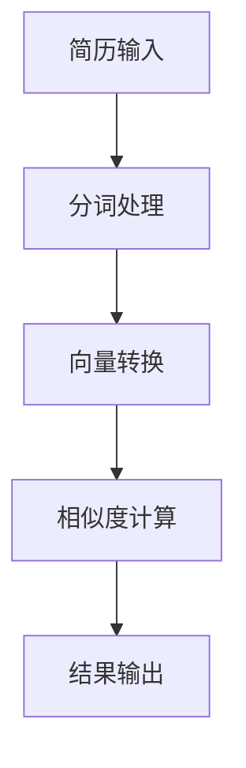
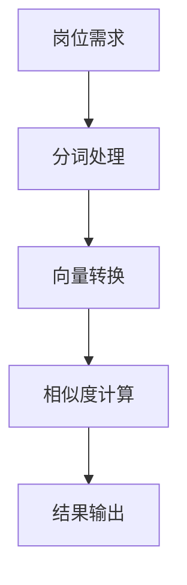
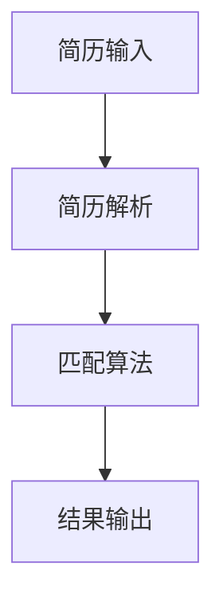

                 


# 《构建企业级AI招聘助手：简历筛选与人才匹配》

## 关键词：AI招聘助手、简历筛选、人才匹配、自然语言处理、机器学习、系统架构设计

## 摘要：  
本文深入探讨如何构建一个企业级的AI招聘助手，专注于简历筛选与人才匹配的核心问题。通过分析当前招聘流程中的痛点，结合AI技术，提出基于自然语言处理和机器学习的解决方案。文章详细阐述了算法原理、系统架构设计、项目实现及实际案例，为读者提供全面的技术指导。

---

## 第一部分：背景介绍

### 第1章：AI招聘助手的背景与问题背景

#### 1.1 问题背景

- **1.1.1 招聘行业现状与挑战**  
  当前招聘行业面临效率低、成本高、精准度不足等问题。企业招聘部门需要手动筛选大量简历，耗时且容易出错。此外，人才市场的竞争加剧，企业对高效招聘工具的需求日益迫切。

- **1.1.2 传统招聘流程的痛点**  
  传统招聘流程包括发布职位、收集简历、人工筛选、面试安排等环节，这些环节耗时长且依赖人工判断，难以快速匹配合适的人才。

- **1.1.3 企业级招聘效率的提升需求**  
  企业希望通过技术手段提高招聘效率，降低招聘成本，同时提升人才匹配的精准度。

#### 1.2 问题描述

- **1.2.1 简历筛选的低效问题**  
  人工筛选简历耗时长，容易遗漏优秀候选人，且主观性较高。

- **1.2.2 人才匹配的精准度问题**  
  传统招聘中，岗位需求与候选人技能匹配度难以量化，导致人才错配。

- **1.2.3 企业招聘成本的控制**  
  高昂的招聘成本（时间成本和经济成本）对企业尤其是中小企业造成压力。

#### 1.3 问题解决

- **1.3.1 AI技术在招聘中的应用**  
  引入AI技术，利用自然语言处理（NLP）和机器学习算法，自动化简历筛选和人才匹配，提高效率和精准度。

- **1.3.2 企业级AI招聘助手的目标**  
  开发一个智能化的招聘助手，能够自动筛选简历、分析候选人能力、推荐匹配岗位，从而降低招聘成本，提升效率。

- **1.3.3 解决方案的可行性分析**  
  基于NLP和机器学习的AI招聘助手在技术上可行，且能够显著提升招聘效率。

#### 1.4 边界与外延

- **1.4.1 系统功能边界**  
  AI招聘助手专注于简历筛选和人才匹配，不涉及面试环节和后续管理。

- **1.4.2 与现有系统的区别**  
  相对于传统招聘系统，AI招聘助手通过自动化和智能化提升效率，减少人工干预。

- **1.4.3 系统的扩展性分析**  
  系统可扩展至支持更多岗位类型和行业，同时可以集成其他招聘工具，形成完整的招聘生态。

#### 1.5 核心概念结构

- **1.5.1 核心概念的组成**  
  系统包括简历解析、岗位需求分析、相似度计算、推荐算法等核心模块。

- **1.5.2 概念之间的关系**  
  简历解析与岗位需求分析相互关联，相似度计算是两者匹配的基础。

- **1.5.3 系统的核心要素**  
  包括数据输入、模型训练、算法处理、结果输出等关键环节。

---

## 第二部分：核心概念与联系

### 第2章：AI招聘助手的核心原理

#### 2.1 核心概念原理

- **2.1.1 简历筛选的算法原理**  
  利用NLP技术对简历中的关键词进行提取和分析，结合岗位需求，匹配候选人技能。

- **2.1.2 人才匹配的算法原理**  
  使用协同过滤算法或深度学习模型，根据岗位需求和候选人能力，计算匹配度。

- **2.1.3 自然语言处理技术的应用**  
  使用词嵌入（如Word2Vec）提取简历和岗位描述的语义信息，进行语义匹配。

#### 2.2 核心概念对比

| 算法名称      | 特征对比              | 优点                          | 缺点                          |
|---------------|-----------------------|-------------------------------|-------------------------------|
| 余弦相似度     | 基于向量内积计算        | 简单高效，易于实现             | 易受数据稀疏性影响             |
| 协同过滤       | 基于用户行为相似性      | 考虑用户偏好，效果较好           | 计算复杂，需要大量数据          |
| 深度学习模型    | 基于神经网络结构        | 高精度，能捕捉复杂模式           | 训练时间长，需要大量标注数据     |

#### 2.3 ER实体关系图架构

```mermaid
er
    Candidate {
        id
        name
        resume
    }
    Position {
        id
        title
        requirements
    }
    Match {
        candidate_id
        position_id
        similarity_score
    }
    Candidate --> Match
    Position --> Match
```

---

## 第三部分：算法原理讲解

### 第3章：简历筛选与人才匹配算法

#### 3.1 简历筛选算法



- **代码实现**

```python
import numpy as np

def compute_cosine_similarity(vec1, vec2):
    dot_product = np.dot(vec1, vec2)
    norm1 = np.linalg.norm(vec1)
    norm2 = np.linalg.norm(vec2)
    return dot_product / (norm1 * norm2)
```

- **公式说明**

$$ \text{余弦相似度} = \frac{\vec{v_1} \cdot \vec{v_2}}{|\vec{v_1}| \cdot |\vec{v_2}|} $$

#### 3.2 人才匹配算法



- **代码实现**

```python
import numpy as np

def collaborative_filtering(user_matrix, item_matrix):
    # 预测评分
    predicted_ratings = np.dot(user_matrix, item_matrix.T)
    return predicted_ratings
```

- **公式说明**

$$ \text{评分预测} = \vec{u} \cdot \vec{v} $$

---

## 第四部分：系统分析与架构设计方案

### 第4章：系统架构设计

#### 4.1 功能模块划分

- **简历解析模块**  
  负责解析简历内容，提取关键词和技能标签。

- **岗位需求分析模块**  
  解析岗位描述，提取核心要求和关键词。

- **匹配算法模块**  
  根据简历和岗位需求，计算匹配度并推荐候选人。

#### 4.2 系统架构图



#### 4.3 接口设计

- **API接口**  
  提供RESTful API，供外部系统调用。

- **交互流程**  
  用户输入简历，系统解析并匹配，返回结果。

---

## 第五部分：项目实战

### 第5章：环境安装与核心代码实现

#### 5.1 环境安装

- Python 3.8+
- Numpy、Scikit-learn等库

#### 5.2 核心代码实现

```python
from sklearn.feature_extraction.text import TfidfVectorizer
from sklearn.metrics.pairwise import cosine_similarity

def main():
    resumes = ["...", "..."]
    positions = ["...", "..."]
    
    vectorizer = TfidfVectorizer()
    resume_vectors = vectorizer.fit_transform(resumes)
    position_vectors = vectorizer.transform(positions)
    
    similarity_matrix = cosine_similarity(resume_vectors, position_vectors)
    
    for i in range(len(resumes)):
        for j in range(len(positions)):
            print(f"简历{i+1}与岗位{j+1}的相似度为：{similarity_matrix[i,j]}")

if __name__ == "__main__":
    main()
```

---

## 第六部分：最佳实践

### 第6章：总结与注意事项

#### 6.1 小结

- AI招聘助手通过自动化和智能化提升招聘效率，降低企业成本。

#### 6.2 注意事项

- 数据质量对模型效果影响重大，需确保数据清洗和标注。

- 算法选择需根据具体场景调整，可能需要多次实验和优化。

#### 6.3 拓展阅读

- 《自然语言处理入门》
- 《机器学习实战》
- 《系统架构设计的艺术》

---

## 作者：AI天才研究院/AI Genius Institute & 禅与计算机程序设计艺术 /Zen And The Art of Computer Programming

