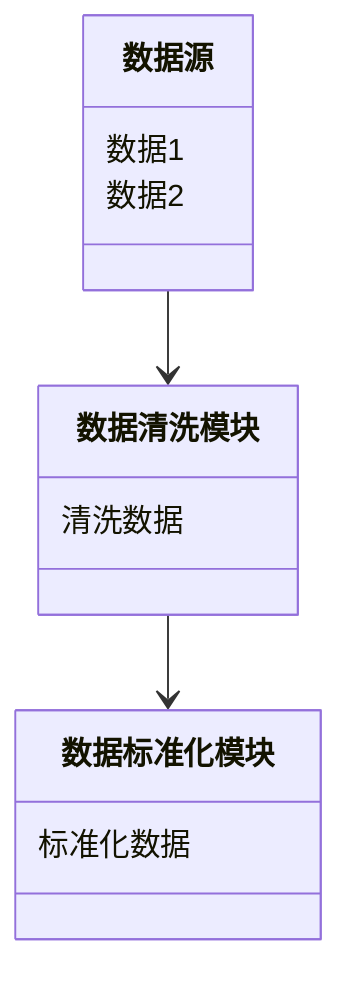
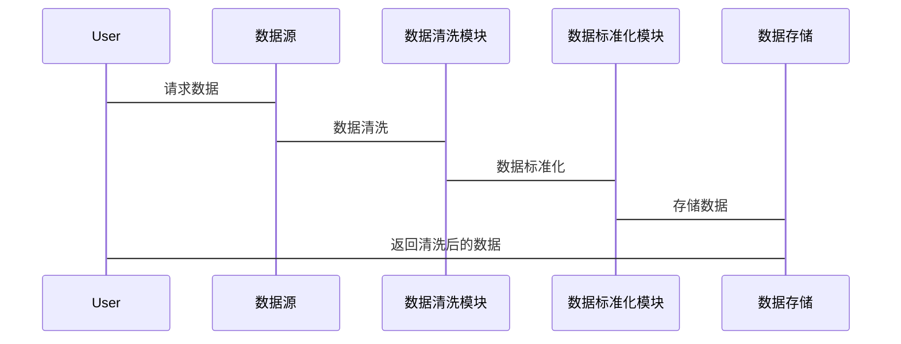

                 


```markdown
# 构建企业级AI数据治理助手：确保数据质量与一致性

> 关键词：数据治理，AI，数据清洗，数据标准化，数据质量管理，数据一致性，数据血缘分析

> 摘要：本文详细探讨了如何构建企业级AI数据治理助手，确保数据质量与一致性。从数据治理的基本概念到AI技术的应用，从算法原理到系统架构设计，再到项目实战，全面解析了构建高效数据治理工具的方法。通过实际案例分析和最佳实践分享，为读者提供了一套完整的解决方案。

---

## 第一部分: 数据治理背景与核心概念

### 第1章: 数据治理概述

#### 1.1 数据治理的基本概念
##### 1.1.1 数据治理的定义
数据治理是指通过制定政策、标准和流程，对数据的全生命周期进行管理，以确保数据的准确性、完整性、一致性和安全性。它是企业有效利用数据的关键基础。

##### 1.1.2 数据治理的核心目标
数据治理的核心目标包括：
1. 确保数据质量：数据的准确性、完整性、及时性。
2. 维护数据一致性：消除数据孤岛，统一数据标准。
3. 提高数据可用性：使数据易于访问和分析。
4. 保障数据安全：防止数据泄露和未经授权的访问。

##### 1.1.3 数据治理的范围与边界
数据治理的范围涵盖数据的创建、存储、处理、分析、共享和销毁的全生命周期。其边界包括：
- 数据源：结构化和非结构化数据。
- 数据存储：数据库、数据仓库等。
- 数据处理：清洗、转换、分析。
- 数据共享：数据集成、数据交换。

#### 1.2 数据治理的重要性
##### 1.2.1 数据质量对企业的影响
- 数据质量直接影响企业决策的准确性。
- 低质量数据会导致分析结果偏差，影响企业战略。

##### 1.2.2 数据一致性对企业运营的意义
- 数据一致性确保跨部门数据的统一性，避免信息孤岛。
- 一致性数据支持高效的业务流程和决策。

##### 1.2.3 数据治理在数字化转型中的作用
- 数据治理是企业数字化转型的核心基础。
- 通过数据治理，企业可以更好地利用数据资产，提升竞争力。

### 第2章: 企业级数据治理的挑战

#### 2.1 企业数据治理的主要问题
##### 2.1.1 数据孤岛现象
- 数据分散在不同的系统中，缺乏统一标准。
- 数据孤岛导致信息不一致，增加管理成本。

##### 2.1.2 数据不一致性的表现
- 同一数据在不同系统中存在不同版本。
- 数据格式、命名规范不统一，导致数据混乱。

##### 2.1.3 数据安全与隐私保护
- 数据泄露风险增加，尤其是敏感数据。
- 随着数据量的增加，隐私保护的难度加大。

#### 2.2 数据治理的复杂性
##### 2.2.1 多部门协作的难点
- 数据治理涉及多个部门，协作困难。
- 缺乏统一的治理策略，导致效率低下。

##### 2.2.2 数据标准的制定与执行
- 数据标准的制定需要跨部门协作，耗时耗力。
- 标准执行过程中，部门间可能存在利益冲突。

##### 2.2.3 数据生命周期的管理
- 数据从生成到销毁的全生命周期管理复杂。
- 数据备份、归档、销毁等环节需要严格控制。

### 第3章: AI在数据治理中的应用

#### 3.1 AI技术如何提升数据治理效率
##### 3.1.1 自动化数据清洗与标准化
- AI算法自动识别和处理数据中的错误、重复和不一致。
- 通过机器学习模型实现数据的自动标准化。

##### 3.1.2 基于AI的异常检测
- 利用AI算法检测数据中的异常值和异常模式。
- 异常检测帮助识别数据中的潜在问题。

##### 3.1.3 数据关联性分析与血缘追踪
- AI技术用于分析数据之间的关联性。
- 数据血缘分析帮助理解数据的来源和流动路径。

#### 3.2 数据治理中的AI算法概述
##### 3.2.1 常见的数据治理算法
- 数据清洗算法：如基于聚类的异常检测。
- 数据标准化算法：如基于规则的自动标准化。
- 数据关联性分析算法：如图神经网络。

##### 3.2.2 AI算法的优势
- 高效性：AI算法能够快速处理大量数据。
- 准确性：通过机器学习模型提高数据处理的准确性。

---

## 第二部分: 数据治理的核心概念与联系

### 第4章: 核心概念与联系

#### 4.1 数据清洗与标准化
##### 4.1.1 数据清洗的原理
- 数据清洗是指识别和处理数据中的错误、重复和不一致。
- 常用方法包括删除重复数据、填充缺失值、处理异常值。

##### 4.1.2 数据标准化的步骤
- 数据标准化是将数据转换为统一的格式和标准。
- 步骤包括：数据清洗、数据转换、数据验证。

##### 4.1.3 数据清洗与标准化的对比
| 对比维度 | 数据清洗 | 数据标准化 |
|----------|----------|------------|
| 目标     | 去除错误 | 统一格式     |
| 方法     | 删除、填充 | 转换、编码    |
| 工具     | 数据清洗工具 | ETL工具     |

##### 4.1.4 数据清洗与标准化的流程图
```mermaid
graph TD
    A[原始数据] -> B[数据清洗]
    B -> C[数据标准化]
    C -> D[清洗后的数据]
```

#### 4.2 数据质量管理
##### 4.2.1 数据质量的核心维度
- 准确性：数据是否正确。
- 完整性：数据是否完整。
- 一致性：数据是否统一。
- 及时性：数据是否及时。

##### 4.2.2 数据质量管理的流程
```mermaid
graph TD
    A[数据输入] -> B[数据检查]
    B -> C[数据清洗]
    C -> D[数据验证]
    D -> E[数据存储]
```

#### 4.3 数据血缘分析
##### 4.3.1 数据血缘分析的目的
- 理解数据的来源和流动路径。
- 帮助数据溯源和审计。

##### 4.3.2 数据血缘分析的流程
```mermaid
graph TD
    A[数据源] -> B[数据处理]
    B -> C[数据存储]
    C -> D[数据应用]
```

---

## 第三部分: 数据治理算法原理

### 第5章: 数据清洗与标准化算法

#### 5.1 数据清洗算法
##### 5.1.1 基于聚类的异常检测
```mermaid
graph TD
    A[原始数据] -> B[聚类分析]
    B -> C[异常检测]
    C -> D[清洗后的数据]
```

##### 5.1.2 数据清洗的数学模型
- 聚类算法：K-means
  $$ \text{目标函数} = \sum_{i=1}^{k} \sum_{j=1}^{n_i} (x_{ij} - c_j)^2 $$
- 异常检测算法：Isolation Forest

#### 5.2 数据标准化算法
##### 5.2.1 基于规则的标准化
```mermaid
graph TD
    A[原始数据] -> B[规则匹配]
    B -> C[数据转换]
    C -> D[标准化数据]
```

##### 5.2.2 数据标准化的数学模型
- 标准化公式：
  $$ z = \frac{x - \mu}{\sigma} $$
  其中，$\mu$ 是均值，$\sigma$ 是标准差。

---

## 第四部分: 系统分析与架构设计

### 第6章: 系统分析与架构设计

#### 6.1 问题场景介绍
- 数据来源多样，格式不统一。
- 数据质量问题影响分析结果。
- 数据共享困难，存在信息孤岛。

#### 6.2 系统功能设计
##### 6.2.1 领域模型


##### 6.2.2 系统架构设计
```mermaid
graph TD
    A[数据源] -> B[数据清洗模块]
    B -> C[数据标准化模块]
    C -> D[数据存储]
    D --> E[数据应用]
```

##### 6.2.3 接口设计
- 数据输入接口：接收原始数据。
- 数据清洗接口：调用清洗模块。
- 数据标准化接口：调用标准化模块。

##### 6.2.4 交互设计


---

## 第五部分: 项目实战

### 第7章: 项目实战

#### 7.1 环境安装
- 安装Python和相关库（如pandas、scikit-learn）。

#### 7.2 核心代码实现
##### 7.2.1 数据清洗代码
```python
import pandas as pd

def data_cleaning(data):
    # 删除重复数据
    data = data.drop_duplicates()
    # 填充缺失值
    data['age'].fillna(data['age'].mean(), inplace=True)
    return data
```

##### 7.2.2 数据标准化代码
```python
from sklearn.preprocessing import StandardScaler

def data_normalization(data):
    scaler = StandardScaler()
    data_normalized = scaler.fit_transform(data)
    return data_normalized
```

#### 7.3 案例分析
##### 7.3.1 数据清洗案例
- 数据来源：某公司销售数据。
- 数据清洗步骤：删除重复数据，填充缺失值。

##### 7.3.2 数据标准化案例
- 数据标准化：将销售数据标准化，便于后续分析。

#### 7.4 项目总结
- 通过项目实战，掌握了数据清洗和标准化的具体实现。
- 理解了数据治理工具的实际应用价值。

---

## 第六部分: 最佳实践

### 第8章: 最佳实践

#### 8.1 小结
- 数据治理是企业数字化转型的关键基础。
- AI技术在数据治理中的应用前景广阔。

#### 8.2 注意事项
- 数据治理需要跨部门协作，注意沟通与协调。
- 数据安全与隐私保护是数据治理的重要组成部分。

#### 8.3 拓展阅读
- 推荐阅读《数据治理：方法与实践》。
- 关注数据治理领域的最新技术动态。

---

## 作者

作者：AI天才研究院/AI Genius Institute & 禅与计算机程序设计艺术 /Zen And The Art of Computer Programming

---

通过以上结构化的内容，您可以逐步展开每一部分，详细阐述每个章节的内容，确保文章逻辑清晰、结构紧凑，同时涵盖数据治理的各个方面。希望这篇文章能够为您提供构建企业级AI数据治理助手的完整思路和实现方法。
```

