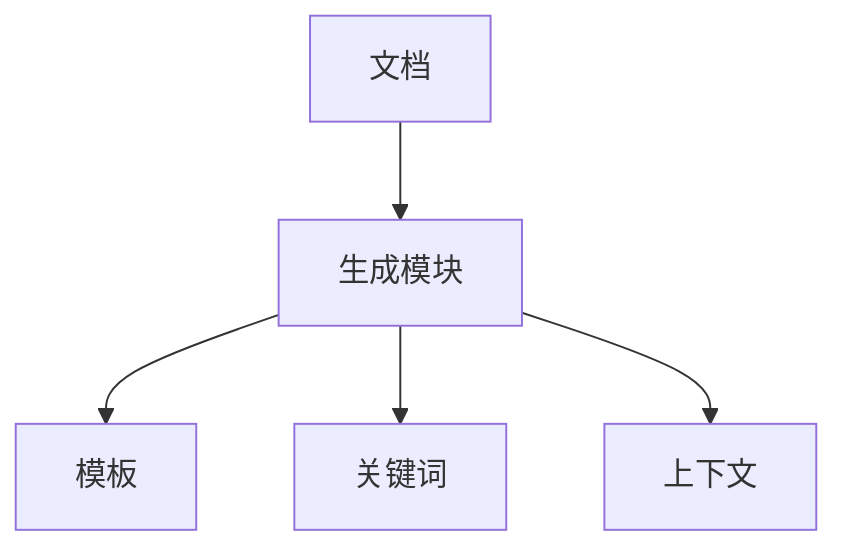
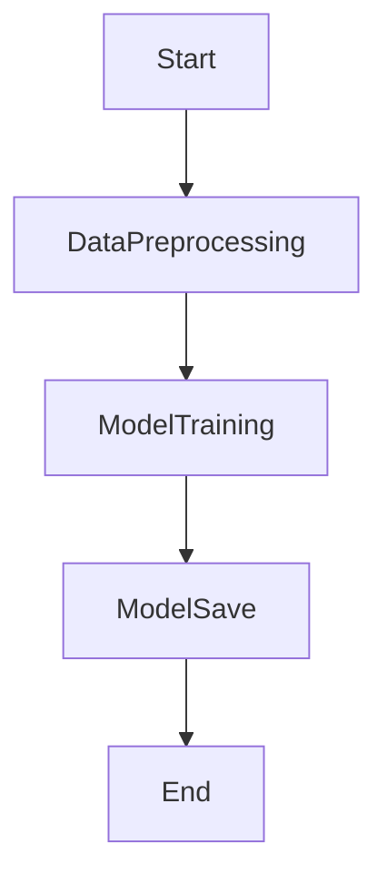
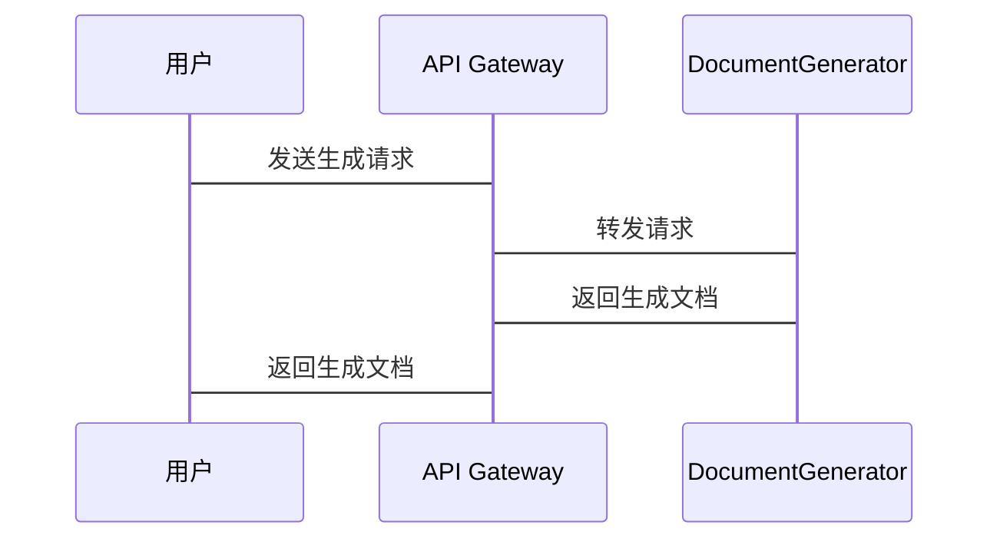

                 


# 构建企业级AI文档助手：自动生成报告与提案

> 关键词：企业级AI文档助手、自然语言处理、大语言模型、文档生成、系统架构设计、项目实战

> 摘要：本文将详细介绍如何构建一个企业级AI文档助手，实现自动生成报告与提案的功能。从问题背景到核心概念，从算法原理到系统架构设计，再到项目实战与最佳实践，本文将为您提供全面的解决方案。通过本文，您将了解如何利用自然语言处理和大语言模型技术，构建一个高效、智能的文档生成系统。

---

# 第一部分：背景介绍与核心概念

## 第1章：问题背景与问题描述

### 1.1 问题背景
#### 1.1.1 企业文档处理的痛点
现代企业每天需要处理大量文档，包括报告、提案、邮件等。这些文档的生成往往需要大量的人力和时间，尤其是在撰写标准模板、保持格式一致性以及快速生成高质量内容方面，传统方式效率低下。

#### 1.1.2 传统文档生成方式的局限性
- 人工编写效率低，重复性工作耗时。
- 内容格式不统一，难以规范化管理。
- 需要专业知识支持，非专业人员难以完成复杂文档。

#### 1.1.3 AI技术在文档生成中的潜力
AI技术，特别是自然语言处理（NLP）和大语言模型（LLM），能够自动化生成高质量文档，显著提高企业效率，降低成本。

### 1.2 问题描述
#### 1.2.1 文档生成的需求分析
- 快速生成标准化文档。
- 支持多种文档类型（报告、提案、邮件等）。
- 提供模板定制功能，满足不同部门需求。

#### 1.2.2 企业级文档生成的目标
- 实现文档自动生成，减少人工干预。
- 提供智能化建议，提升文档质量。
- 支持团队协作，确保文档一致性和规范性。

#### 1.2.3 当前技术的差距与挑战
- 模型训练数据不足，导致生成内容不够准确。
- 模型推理速度慢，难以满足实时生成需求。
- 文档格式与企业模板的兼容性问题。

## 第2章：核心概念与问题解决

### 2.1 核心概念
#### 2.1.1 自然语言处理（NLP）
NLP是研究如何让计算机理解和生成人类语言的学科。在文档生成中，NLP用于文本的理解和生成。

#### 2.1.2 大语言模型（LLM）
大语言模型是一种基于深度学习的NLP模型，具有强大的文本生成能力。常用的模型包括GPT、BERT等。

#### 2.1.3 文档生成任务的分类
- 基于模板的生成：根据模板生成固定内容。
- 基于关键词的生成：根据关键词生成自由文本。
- 基于上下文的生成：根据上下文生成连贯文本。

### 2.2 问题解决
#### 2.2.1 AI文档助手的定义
AI文档助手是一种基于NLP技术的工具，能够根据用户提供的信息自动生成文档。

#### 2.2.2 企业级AI文档助手的特点
- 高可用性：支持高并发访问。
- 高准确性：生成内容符合企业标准。
- 易用性：提供友好的用户界面。

#### 2.2.3 解决方案的架构与实现
解决方案包括数据采集、模型训练、用户交互和文档生成四个模块，通过协同工作实现文档自动生成。

---

# 第二部分：核心概念与联系

## 第3章：核心概念原理

### 3.1 自然语言处理原理
#### 3.1.1 词法分析
词法分析将文本分割成单词或符号，并赋予其词性。例如，将“Hello world”分割成“Hello”（名词）和“world”（名词）。

#### 3.1.2 句法分析
句法分析研究句子的结构，确定词语之间的关系。例如，解析“猫抓老鼠”为“猫”是主语，“抓”是谓语，“老鼠”是宾语。

#### 3.1.3 语义理解
语义理解旨在理解文本的含义。例如，理解“猫抓老鼠”表示猫在抓老鼠的动作。

### 3.2 大语言模型原理
#### 3.2.1 模型训练
大语言模型通过监督学习训练，使用大量文本数据进行预训练。

#### 3.2.2 模型推理
推理阶段，模型根据输入生成输出。例如，输入“请写一份年度报告”，模型生成内容。

#### 3.2.3 模型调优
根据具体任务调整模型参数，优化生成效果。

## 第4章：核心概念属性对比

### 4.1 NLP与LLM的对比
| 特性        | NLP                     | LLM                     |
|-------------|-------------------------|-------------------------|
| 技术特点     | 基于规则或浅层学习       | 基于深度学习，参数众多   |
| 应用场景     | 词性标注、句法分析       | 文本生成、问答系统       |
| 优缺点       | 优点：简单易实现；缺点：能力有限 | 优点：能力强；缺点：计算资源需求高 |

### 4.2 实体关系图


---

# 第三部分：算法原理讲解

## 第5章：算法原理与流程图

### 5.1 算法原理
#### 5.1.1 模型训练流程
1. 数据预处理：清洗、分词、标注。
2. 模型初始化：设定参数。
3. 模型训练：输入数据，更新参数。
4. 模型保存：保存训练好的模型。

#### 5.1.2 文档生成流程
1. 用户输入需求。
2. 模型解析需求。
3. 模型生成内容。
4. 输出生成内容。

#### 5.1.3 模型优化流程
1. 参数微调：根据具体任务调整模型。
2. 增加训练数据：提升模型泛化能力。
3. 优化生成策略：改进生成效果。

### 5.2 算法流程图


## 第6章：数学模型与公式

### 6.1 损失函数
损失函数衡量模型输出与真实值的差异。常用的损失函数包括交叉熵损失：
$$
\text{损失} = -\sum y_i \log p(y_i)
$$

### 6.2 优化器
优化器用于更新模型参数，常用的是Adam优化器：
$$
\theta_{t+1} = \theta_t - \eta \frac{\partial L}{\partial \theta_t}
$$

---

# 第四部分：系统分析与架构设计

## 第7章：系统分析

### 7.1 问题场景介绍
系统需要支持多用户同时使用，生成多种类型的文档，满足企业的多样化需求。

### 7.2 项目介绍
本项目旨在构建一个企业级AI文档助手，实现文档的自动生成。

## 第8章：系统功能设计

### 8.1 领域模型
```mermaid
classDiagram
    class 文档生成系统 {
        +输入：用户需求
        +输出：生成文档
        -模板库：多种模板
        -模型：大语言模型
    }
    文档生成系统 --> 用户：接收需求
    文档生成系统 --> 模板库：选择模板
    文档生成系统 --> 模型：生成内容
    文档生成系统 --> 用户：输出文档
```

### 8.2 系统架构设计
```mermaid
graph TD
    User --> API Gateway
    API Gateway --> DocumentGenerator
    DocumentGenerator --> TemplateDatabase
    DocumentGenerator --> ModelService
    ModelService --> AIModel
    AIModel --> Output
```

### 8.3 系统接口设计
- 用户接口：HTTP API。
- 模型接口：RESTful API。

### 8.4 系统交互


---

# 第五部分：项目实战

## 第9章：环境安装与配置

### 9.1 安装Python
```bash
python --version
pip install --upgrade pip
```

### 9.2 安装依赖
```bash
pip install transformers
pip install torch
```

## 第10章：核心代码实现

### 10.1 模型加载
```python
from transformers import AutoTokenizer, AutoModelForCausalLM
tokenizer = AutoTokenizer.from_pretrained('gpt2')
model = AutoModelForCausalLM.from_pretrained('gpt2')
```

### 10.2 文档生成
```python
def generate_document(prompt):
    inputs = tokenizer.encode(prompt, return_tensors='pt')
    outputs = model.generate(inputs, max_length=500, do_sample=True)
    return tokenizer.decode(outputs[0], skip_special_tokens=True)
```

## 第11章：代码解读与分析

### 11.1 代码功能解读
- `tokenizer`：将输入文本转换为模型可接受的格式。
- `model`：生成文本内容。

### 11.2 实际案例分析
输入“请写一份年度报告”，模型生成内容。

## 第12章：项目小结

### 12.1 成功经验
- 选择了合适的模型和框架。
- 优化了生成策略，提升了生成质量。

### 12.2 经验教训
- 训练数据不足，生成内容不够准确。
- 模型推理速度慢，需要优化。

---

# 第六部分：最佳实践

## 第13章：最佳实践

### 13.1 小结
- 选择合适的模型和框架。
- 确保数据质量和多样性。
- 定期优化模型和系统。

### 13.2 注意事项
- 数据隐私和安全。
- 系统性能优化。

### 13.3 拓展阅读
- 《深度学习》
- 《自然语言处理实战》

---

作者：AI天才研究院 & 禅与计算机程序设计艺术

