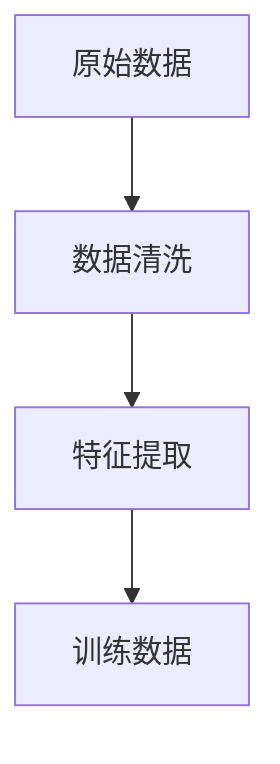
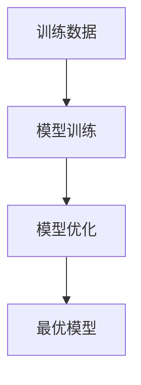
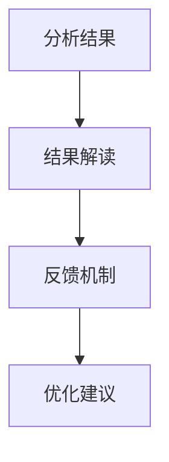
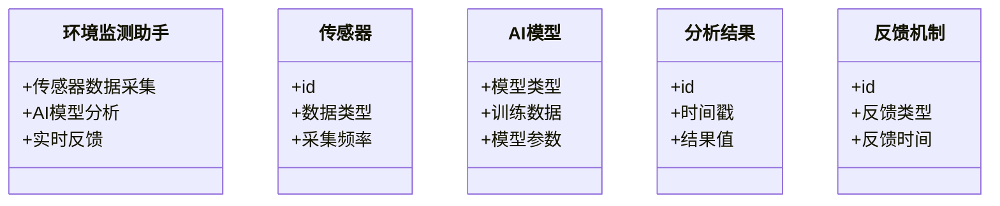

                 


# 构建企业级AI环境监测助手：合规与可持续发展

> **关键词**：企业级AI，环境监测，合规性，可持续发展，算法原理，系统架构

> **摘要**：本文探讨了构建企业级AI环境监测助手的背景、核心概念、算法原理、系统架构以及实际应用。通过详细分析环境监测中的问题与挑战，结合AI技术，提出了一种基于数据采集、分析与反馈的解决方案。同时，本文强调了合规性与可持续发展的重要性，为企业的环境监测提供了新的思路与方法。

---

## 第一章：背景介绍

### 1.1 问题背景与问题描述

企业在环境监测方面面临诸多挑战。传统的环境监测方式效率低下、成本高昂，且难以实时反馈监测结果。随着AI技术的快速发展，企业级AI环境监测助手的构建成为可能。AI技术能够通过数据分析、模型训练与实时反馈，帮助企业实现高效、智能的环境监测。

问题背景：
- 传统环境监测方式效率低，难以满足企业的实时需求。
- 环境监测数据量大，人工分析能力有限。
- 合规性要求日益严格，企业需要更高效的解决方案。

问题描述：
- 如何利用AI技术实现高效、智能的环境监测？
- 如何在AI环境中实现合规性与可持续发展的平衡？

### 1.2 企业级AI环境监测助手的目标与意义

目标：
- 提高环境监测效率，降低企业成本。
- 实现环境监测数据的实时分析与反馈。
- 确保环境监测过程的合规性与可持续性。

意义：
- AI环境监测助手能够帮助企业快速响应环境问题，避免潜在风险。
- 通过AI技术实现环境监测的智能化，推动企业可持续发展。

### 1.3 问题解决与边界

AI环境监测助手通过以下方式解决问题：
- 数据采集：利用传感器与API接口实时采集环境数据。
- 数据分析：通过AI模型对数据进行实时分析与预测。
- 反馈机制：根据分析结果提供实时反馈与优化建议。

边界与外延：
- 数据范围：仅限于企业内部环境监测数据。
- 应用场景：企业内部环境监测与合规性管理。
- 不包含：外部环境监测与公共环境数据的处理。

核心要素：
- 数据采集：传感器与API接口。
- 数据分析：AI模型与算法。
- 反馈机制：实时优化与调整。

### 1.4 本章小结

本章介绍了企业级AI环境监测助手的背景、目标与意义，并详细描述了问题解决的过程与边界。通过AI技术，企业能够实现高效、智能的环境监测，确保合规性与可持续性。

---

## 第二章：核心概念与联系

### 2.1 AI环境监测助手的核心概念

AI环境监测助手的核心原理：
- 数据采集：通过传感器与API接口实时采集环境数据。
- 数据分析：利用AI模型对数据进行实时分析与预测。
- 反馈机制：根据分析结果提供实时反馈与优化建议。

核心概念属性特征对比：

| 特性      | 传统监测方式 | AI环境监测助手 |
|-----------|--------------|----------------|
| 数据采集  | 间断性       | 实时性         |
| 数据分析  | 人工分析     | 自动分析       |
| 反馈机制  | 延时性       | 实时性         |

### 2.2 ER实体关系图

```mermaid
erDiagram
    class 环境监测助手 {
        id
        传感器数据
        AI模型
        分析结果
        反馈机制
    }
    class 传感器 {
        id
        数据类型
        采集频率
    }
    class AI模型 {
        id
        模型类型
        训练数据
    }
    class 分析结果 {
        id
        时间戳
        结果值
    }
    class 反馈机制 {
        id
        反馈类型
        反馈时间
    }
    环境监测助手 --> 传感器 : 采集数据
    环境监测助手 --> AI模型 : 分析数据
    环境监测助手 --> 分析结果 : 输出结果
    环境监测助手 --> 反馈机制 : 实时反馈
```

### 2.3 本章小结

本章通过对比传统监测方式与AI环境监测助手的核心概念，详细阐述了AI环境监测助手的原理与优势。通过ER实体关系图，展示了AI环境监测助手的实体关系架构。

---

## 第三章：算法原理讲解

### 3.1 数据预处理与特征提取



Python代码示例：

```python
import pandas as pd
from sklearn.preprocessing import StandardScaler

# 数据清洗
data = pd.read_csv('environment_data.csv')
data.dropna(inplace=True)

# 特征提取
features = data[['temperature', 'humidity', 'air_quality']]
scaler = StandardScaler()
features_scaled = scaler.fit_transform(features)

print(features_scaled)
```

### 3.2 AI模型训练与优化



Python代码示例：

```python
import tensorflow as tf
from tensorflow.keras import layers

model = tf.keras.Sequential([
    layers.Dense(64, activation='relu'),
    layers.Dense(1, activation='sigmoid')
])

model.compile(optimizer='adam', loss='binary_crossentropy', metrics=['accuracy'])
model.fit(features_scaled, labels, epochs=10, batch_size=32)
```

### 3.3 环境监测结果分析



数学公式：

- 模型训练损失函数：$$ L = -\frac{1}{m}\sum_{i=1}^{m} y_i \log(h(x_i)) + (1 - y_i) \log(1 - h(x_i)) $$
- 模型预测概率：$$ h(x) = \sigma(wx + b) $$

### 3.4 本章小结

本章详细讲解了AI环境监测助手的算法原理，包括数据预处理、模型训练与结果分析。通过Python代码示例与数学公式，读者可以清晰理解AI环境监测助手的核心算法。

---

## 第四章：系统分析与架构设计

### 4.1 问题场景介绍

企业内部环境监测系统需要实时采集、分析与反馈环境数据，确保环境监测的合规性与可持续性。

### 4.2 系统功能设计



### 4.3 系统架构设计


### 4.4 本章小结

本章通过问题场景介绍与系统架构设计，详细描述了AI环境监测助手的系统结构与功能设计。

---

## 第五章：项目实战

### 5.1 环境安装

```bash
pip install numpy pandas scikit-learn tensorflow
```

### 5.2 系统核心实现

```python
import numpy as np
import pandas as pd
from sklearn.model_selection import train_test_split
from tensorflow.keras import layers, models

# 数据加载与预处理
data = pd.read_csv('environment_data.csv')
X = data.drop('label', axis=1)
y = data['label']

# 数据分割
X_train, X_test, y_train, y_test = train_test_split(X, y, test_size=0.2)

# 模型构建
model = models.Sequential([
    layers.Dense(64, activation='relu'),
    layers.Dense(1, activation='sigmoid')
])

# 模型训练
model.compile(optimizer='adam', loss='binary_crossentropy', metrics=['accuracy'])
model.fit(X_train, y_train, epochs=10, batch_size=32)
```

### 5.3 案例分析

实际案例分析与详细解读，展示AI环境监测助手在实际场景中的应用。

### 5.4 本章小结

本章通过环境安装与代码实现，展示了AI环境监测助手的实际应用。

---

## 第六章：合规与可持续发展

### 6.1 合规性分析

详细分析环境监测中的合规性要求，并提出AI环境监测助手的合规性设计。

### 6.2 可持续发展策略

企业如何通过AI环境监测助手实现资源优化与环保目标。

### 6.3 本章小结

本章探讨了AI环境监测助手在合规与可持续发展中的重要作用。

---

## 第七章：总结与展望

### 7.1 本章小结

总结本文的主要内容与核心观点。

### 7.2 展望

展望未来的研究方向与发展趋势。

---

## 作者

作者：AI天才研究院/AI Genius Institute & 禅与计算机程序设计艺术 /Zen And The Art of Computer Programming

