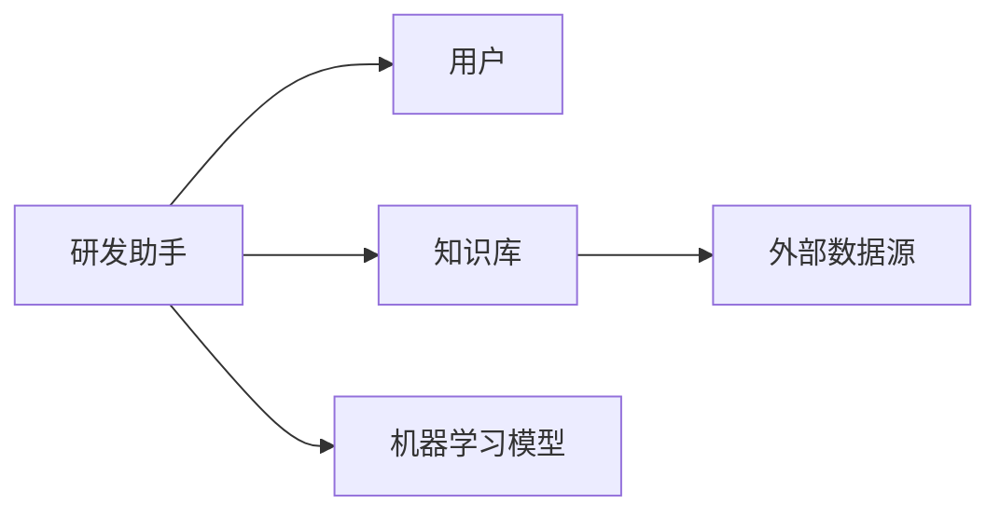
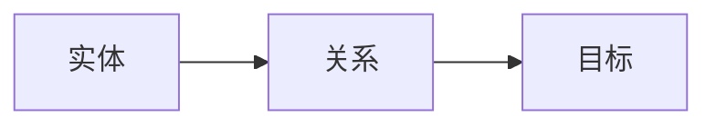

                 


# 构建企业级AI研发助手：加速创新与专利申请

> **关键词**: 企业级AI研发助手, 专利申请, 自然语言处理, 知识图谱, 机器学习模型

> **摘要**: 本文详细探讨了如何构建一个高效的企业级AI研发助手，利用自然语言处理和机器学习技术加速创新与专利申请过程。通过系统架构设计、核心技术实现和项目实战案例，展示了如何利用AI技术提升研发效率和知识管理水平。

---

# 正文

## 第一部分: 企业级AI研发助手的背景与核心概念

### 第1章: 问题背景与需求分析

#### 1.1 问题背景

企业在研发过程中面临诸多挑战，包括研发效率低下、知识管理不足和创新灵感获取困难。传统研发模式依赖人工经验，难以应对快速变化的技术环境。AI技术的引入为解决这些问题提供了新的可能性。

#### 1.2 问题描述

- **研发效率低下**: 研发团队需要处理大量数据和文献，效率受限。
- **知识管理不足**: 知识分散，难以高效共享和复用。
- **创新灵感获取困难**: 创新依赖个体经验，难以系统化。

#### 1.3 问题解决

AI研发助手通过自然语言处理、知识图谱和机器学习等技术，帮助研发团队高效检索、分析和应用知识，提升创新效率。

#### 1.4 概念结构与核心要素

- **核心概念**: AI研发助手通过整合内外部知识资源，利用NLP和机器学习技术，为研发团队提供实时的知识支持和创新建议。
- **实体关系图**: 通过Mermaid图表展示研发助手与用户、知识库、外部数据源之间的关系。



---

## 第二部分: 企业级AI研发助手的核心技术

### 第2章: 自然语言处理技术

#### 2.1 自然语言处理原理

- **语言模型基础**: 介绍如BERT、GPT等预训练语言模型的工作原理。
- **Transformer架构**: 解释其在NLP中的应用，如编码器和解码器结构。
- **预训练与微调**: 讨论如何通过大规模数据预训练，然后针对具体任务进行微调。

#### 2.2 知识图谱构建

- **知识抽取**: 从文本中提取实体和关系。
- **知识融合**: 处理和合并来自不同数据源的知识。
- **知识表示**: 使用图结构表示知识，便于后续分析和推理。



---

### 第3章: 机器学习模型

#### 3.1 机器学习基础

- **监督学习**: 如分类和回归任务。
- **无监督学习**: 如聚类和主题建模。
- **强化学习**: 在复杂环境中进行决策优化。

#### 3.2 深度学习模型

- **CNN与RNN**: 用于文本序列处理和图像识别。
- **BERT与GPT**: 预训练语言模型的应用。
- **模型调优**: 通过超参数优化提升模型性能。

---

### 第4章: 知识图谱与语义理解

#### 4.1 知识图谱构建流程

- **数据清洗**: 去除噪声数据。
- **实体识别**: 识别文本中的实体。
- **关系抽取**: 提取实体之间的关系。

#### 4.2 语义理解技术

- **文本相似度计算**: 使用余弦相似度或BERT模型。
- **文本摘要**: 生成简洁的文本摘要。
- **文本分类**: 将文本分为不同类别。

---

## 第三部分: 企业级AI研发助手的系统架构

### 第5章: 系统功能设计

#### 5.1 功能模块划分

- **专利检索模块**: 检索相关专利信息。
- **创新建议模块**: 提供基于知识图谱的创新建议。
- **知识管理模块**: 管理内部和外部知识资源。

#### 5.2 功能实现流程

- **用户需求分析**: 理解用户的研发需求。
- **模块交互设计**: 设计模块之间的交互流程。

---

## 第四部分: 项目实战

### 第6章: 项目实战与代码实现

#### 6.1 环境搭建

- 安装必要的Python库，如TensorFlow、PyTorch和Numpy。

#### 6.2 核心功能实现

- **专利分析模块**: 使用NLP技术分析专利文档。
- **创新建议模块**: 基于知识图谱生成建议。

#### 6.3 代码示例

```python
import tensorflow as tf
from tensorflow.keras import layers

# 定义模型
model = tf.keras.Sequential()
model.add(layers.Embedding(input_dim=10000, output_dim=100))
model.add(layers.LSTM(64))
model.add(layers.Dense(1, activation='sigmoid'))
model.compile(optimizer='adam', loss='binary_crossentropy', metrics=['accuracy'])
```

---

## 第五部分: 最佳实践与优化

### 第7章: 最佳实践与注意事项

#### 7.1 数据质量管理

- 确保数据的准确性和完整性。

#### 7.2 模型优化

- 定期更新模型，提升性能。

#### 7.3 系统安全

- 保护知识产权和数据安全。

---

## 小结

通过构建企业级AI研发助手，企业可以显著提升研发效率和创新能力。结合自然语言处理、知识图谱和机器学习技术，AI研发助手为企业提供了强大的知识管理和创新支持工具。

---

## 作者

**作者**: AI天才研究院/AI Genius Institute & 禅与计算机程序设计艺术 /Zen And The Art of Computer Programming

---

这篇文章详细阐述了构建企业级AI研发助手的关键技术、系统设计和实际应用，为企业的创新与专利申请提供了有力的支持。

