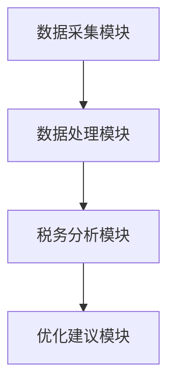

                 


# 《构建企业级AI税务顾问：优化税收策略》

## 关键词：企业级AI税务顾问、税收优化策略、人工智能、税务系统设计、优化模型

## 摘要：本文详细探讨了构建企业级AI税务顾问系统的各个方面，从背景和核心概念到算法原理、系统架构、项目实战及最佳实践，为企业在利用AI优化税收策略方面提供了全面的指导和解决方案。

---

## 第一部分: 企业级AI税务顾问的背景与核心概念

### 第1章: 企业税务优化的背景与挑战

#### 1.1 税务优化的背景与重要性
- **1.1.1 税务优化的基本概念**  
  税务优化是指通过合法手段减少税负，提高企业利润的过程。它是企业财务管理中的重要组成部分，直接影响企业的经济效益。

- **1.1.2 企业税务优化的目标与意义**  
  企业的目标是最大化利润，而税务优化是实现这一目标的重要途径。通过合理规划税务，企业可以降低税负，优化现金流，增强竞争力。

- **1.1.3 税务优化的常见挑战**  
  税务法规复杂多变，企业需要应对不同税种、税率的变化，同时还要避免税务风险。此外，传统税务管理效率低下，难以适应快速变化的商业环境。

#### 1.2 AI技术在税务领域的应用现状
- **1.2.1 AI在税务领域的应用领域**  
  AI技术在税务领域的应用包括税务申报自动化、税务风险评估、税务规划、税务审计等。

- **1.2.2 当前AI税务应用的主要技术**  
  当前主要技术包括自然语言处理（NLP）、机器学习（ML）、深度学习（DL）等。这些技术可以帮助企业快速分析税务数据，识别潜在的税务机会和风险。

- **1.2.3 AI税务应用的局限性与改进方向**  
  当前AI在税务领域的应用仍存在数据不足、模型解释性差等问题。未来需要进一步优化数据质量和模型的可解释性。

#### 1.3 企业级AI税务顾问的定义与目标
- **1.3.1 企业级AI税务顾问的定义**  
  企业级AI税务顾问是一种基于人工智能的系统，能够为企业提供个性化的税务规划、申报和优化服务。

- **1.3.2 企业级AI税务顾问的核心目标**  
  核心目标是通过AI技术，帮助企业实现税务优化，降低税负，提高财务管理效率。

- **1.3.3 企业级AI税务顾问的边界与外延**  
  企业级AI税务顾问不仅关注税务优化，还涉及企业内部数据的整合、税务法规的解读等。

---

### 第2章: AI税务顾问的核心概念与联系

#### 2.1 核心概念原理
- **2.1.1 税务数据的特征与处理**  
  税务数据具有多样性、复杂性和敏感性。处理税务数据时，需要考虑数据的完整性和准确性。

- **2.1.2 AI模型在税务分析中的作用**  
  AI模型可以通过数据分析和预测，帮助企业识别税务风险，优化税务策略。

- **2.1.3 税务优化的数学模型**  
  税务优化可以通过线性规划、遗传算法等数学模型来实现。这些模型能够帮助企业找到最优的税务规划方案。

#### 2.2 核心概念属性特征对比
- **2.2.1 税务数据与传统数据的对比**  
  税务数据具有法律约束性和时效性，而传统数据可能更关注业务操作的实时性。

- **2.2.2 AI模型与传统模型的对比**  
  AI模型具有更强的自适应性和学习能力，能够处理复杂的数据关系。传统模型则更注重规则的执行。

- **2.2.3 税务优化与传统优化的对比**  
  税务优化需要考虑法律和法规的变化，而传统优化可能更关注业务流程的优化。

#### 2.3 ER实体关系图架构
```mermaid
erDiagram
    customer[客户] {
        id : integer
        name : string
        tax_id : string
    }
    transaction[交易] {
        id : integer
        amount : float
        date : date
    }
    tax_rule[税务规则] {
        id : integer
        rule_name : string
        description : string
    }
    customer --> transaction : 发生的交易
    transaction --> tax_rule : 受影响的规则
```

---

### 第3章: AI税务优化的算法原理

#### 3.1 优化模型的数学基础
- **3.1.1 线性规划模型**  
  线性规划是一种优化技术，用于在约束条件下最大化或最小化目标函数。例如，企业可以通过线性规划模型优化税务支出。

- **3.1.2 非线性规划模型**  
  非线性规划模型适用于目标函数或约束条件为非线性的情况。例如，当税率为累进税率时，可以使用非线性规划模型进行优化。

- **3.1.3 遗传算法与模拟退火**  
  遗传算法和模拟退火是一种全局优化算法，适用于复杂问题的求解。例如，企业可以在多种税务策略中选择最优解。

---

## 第二部分: 企业级AI税务顾问的系统架构与实现

### 第4章: 企业级AI税务顾问的系统架构

#### 4.1 问题场景介绍
- **4.1.1 税务数据的采集与处理**  
  系统需要从企业内部和外部获取税务相关数据，如销售数据、发票信息、税务法规等。

- **4.1.2 税务规则的解析与应用**  
  系统需要解析复杂的税务法规，并将其转化为可执行的规则。

#### 4.2 项目介绍
- **4.2.1 项目目标**  
  构建一个基于AI的企业级税务顾问系统，能够为企业提供个性化的税务优化服务。

- **4.2.2 项目范围**  
  包括税务数据的采集、处理、分析和优化建议的生成。

#### 4.3 系统功能设计
- **4.3.1 系统功能模块**  
  包括数据采集模块、数据处理模块、税务分析模块和优化建议模块。

- **4.3.2 系统功能流程**  
  系统通过数据采集模块获取数据，经过处理模块清洗数据，然后通过分析模块生成优化建议，最后将建议返回给用户。

#### 4.4 系统架构设计


---

### 第5章: 企业级AI税务顾问的实现

#### 5.1 环境安装与配置
- **5.1.1 系统环境要求**  
  需要安装Python、TensorFlow、Scikit-learn等工具。

- **5.1.2 数据库配置**  
  使用MySQL或MongoDB存储税务数据。

#### 5.2 核心代码实现
- **5.2.1 数据处理代码**  
  ```python
  import pandas as pd

  # 读取数据
  df = pd.read_csv('tax_data.csv')
  # 数据清洗
  df.dropna(inplace=True)
  ```

- **5.2.2 税务分析代码**  
  ```python
  from sklearn.linear_model import LinearRegression

  model = LinearRegression()
  model.fit(X, y)
  ```

- **5.2.3 优化建议代码**  
  ```python
  def generate_recommendations(data):
      # 生成优化建议
      pass
  ```

#### 5.3 案例分析与详细解读
- **5.3.1 案例背景**  
  以某企业为例，分析其税务数据，找出优化空间。

- **5.3.2 案例分析过程**  
  使用AI模型分析企业的税务数据，生成优化建议。

- **5.3.3 案例结果与解读**  
  解读模型生成的优化建议，并评估其效果。

---

## 第三部分: 企业级AI税务顾问的最佳实践

### 第6章: 项目经验总结与最佳实践

#### 6.1 项目经验总结
- **6.1.1 项目成果**  
  成功构建了一个企业级AI税务顾问系统，帮助企业降低了税负。

- **6.1.2 项目过程中的挑战**  
  数据获取困难、模型优化复杂等。

#### 6.2 最佳实践
- **6.2.1 数据质量管理**  
  确保数据的完整性和准确性是项目成功的关键。

- **6.2.2 模型优化与调参**  
  通过交叉验证等方法优化模型性能。

#### 6.3 小结
- 企业级AI税务顾问的建设需要结合企业的实际情况，合理选择技术方案，注重数据质量和模型优化。

---

## 作者：AI天才研究院/AI Genius Institute & 禅与计算机程序设计艺术 /Zen And The Art of Computer Programming

