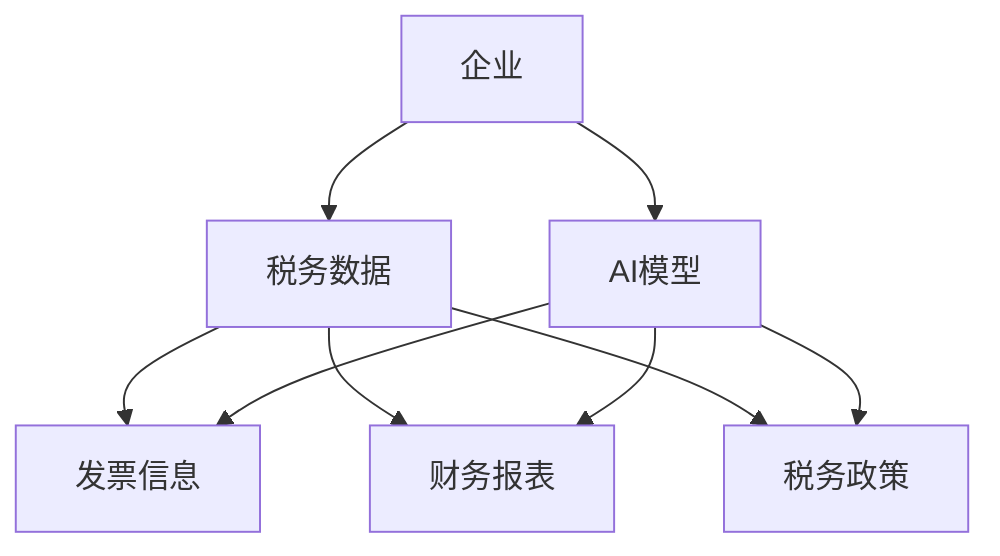
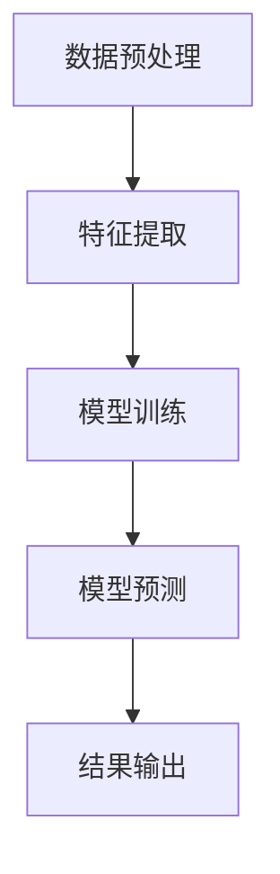
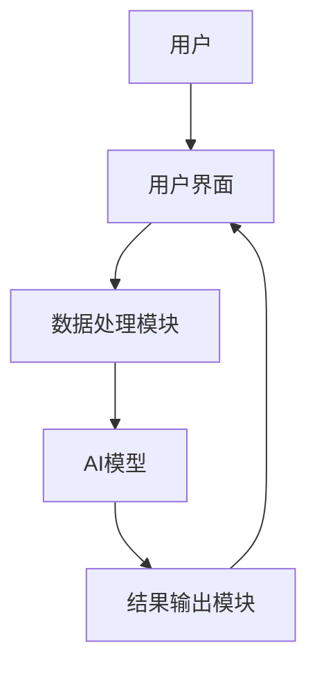
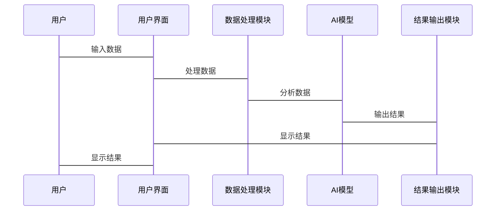

                 


# 构建企业级AI税务顾问：优化税收策略与合规

> 关键词：企业级AI税务顾问，税收优化，税务合规，AI大模型，系统架构设计

> 摘要：本文将详细探讨如何构建一个企业级AI税务顾问系统，通过AI技术优化企业的税收策略，并确保税务合规。文章从背景介绍、核心概念、算法原理、系统架构设计到项目实战，全面解析构建该系统的过程和方法，为读者提供从理论到实践的深度指导。

---

## 第1章：背景介绍

### 1.1 问题背景

#### 1.1.1 传统税务管理的痛点
传统的税务管理依赖人工操作，存在效率低、易出错、合规性难以保障等问题。企业需要面对复杂的税务政策、繁多的申报要求以及多变的税收环境，这些都增加了税务管理的难度。此外，传统方法难以实时响应税收政策的变化，导致企业可能错过税收优化的最佳时机。

#### 1.1.2 AI技术在税务领域的应用潜力
人工智能技术的快速发展为税务管理带来了新的可能性。AI能够快速处理大量税务数据，识别潜在的税收优化机会，并提供个性化的税务建议。通过自然语言处理（NLP）技术，AI可以自动解析复杂的税务政策，帮助企业更好地理解和应用相关政策。

#### 1.1.3 企业级AI税务顾问的定义与目标
企业级AI税务顾问是一种基于AI技术的企业级系统，旨在通过自动化和智能化的方式优化企业的税收策略，并确保税务合规。其目标是帮助企业降低税务风险、提高税务管理效率，并在合法合规的前提下实现税收最小化。

### 1.2 问题描述

#### 1.2.1 税务合规的复杂性
税务合规涉及多个税种、不同的税收政策以及复杂的计算逻辑。企业需要应对不同地区的税收法规，这使得税务合规变得复杂且容易出错。

#### 1.2.2 税收优化的挑战
企业在追求税收最小化的同时，必须确保所有操作符合法律法规。传统的税务优化方法依赖于经验丰富的税务专家，但这种方法效率低、成本高，且难以应对税收政策的快速变化。

#### 1.2.3 企业税务管理的数字化转型需求
随着数字化转型的推进，企业需要更加高效和智能的税务管理工具。AI技术的引入可以显著提高税务管理的效率和准确性，同时降低管理成本。

### 1.3 问题解决

#### 1.3.1 AI技术如何优化税收策略
AI技术可以通过分析历史税务数据和市场趋势，预测税收变化，帮助企业制定最优的税收策略。AI还可以实时监控税收政策的变化，为企业提供及时的建议。

#### 1.3.2 AI在税务合规中的应用
AI可以通过自然语言处理技术解析复杂的税务政策，帮助企业确保所有税务操作符合法规要求。同时，AI还可以自动识别潜在的税务风险，帮助企业在早期发现问题并进行调整。

#### 1.3.3 企业级AI税务顾问的核心功能
- **智能数据处理**：自动解析和处理税务相关数据，如发票、财务报表等。
- **政策解读与合规检查**：实时解读最新的税收政策，检查企业的税务操作是否合规。
- **税收优化建议**：根据企业的具体情况，提供个性化的税收优化建议。
- **风险预警**：识别潜在的税务风险，并提供应对策略。

### 1.4 边界与外延

#### 1.4.1 企业级AI税务顾问的适用范围
企业级AI税务顾问主要适用于大型企业，尤其是跨国企业。这类企业通常面临复杂的税务环境和多样化的税收政策，需要高效的税务管理工具来支持其运营。

#### 1.4.2 与其他税务工具的区别
传统税务工具通常专注于单一功能，如税务申报或发票管理。而企业级AI税务顾问是一个综合性的系统，能够整合多种税务功能，并通过AI技术提供智能化的税务管理。

#### 1.4.3 系统边界与功能范围
企业级AI税务顾问的边界包括企业内部的税务数据、外部的税收政策数据库以及企业的业务系统（如ERP）。其功能范围涵盖数据处理、政策解读、税收优化建议、风险预警等。

### 1.5 概念结构与核心要素

#### 1.5.1 系统架构的核心要素
- **数据源**：包括企业内部的财务数据和外部的税收政策数据。
- **AI模型**：用于数据处理、政策解读和税收优化建议。
- **用户界面**：供企业用户进行操作和查询。
- **输出结果**：包括优化建议、合规检查结果和风险预警。

#### 1.5.2 功能模块的相互关系
- 数据源为AI模型提供输入数据。
- AI模型根据输入数据生成优化建议和合规检查结果。
- 用户通过用户界面与系统交互，并查看输出结果。

#### 1.5.3 核心概念的系统化表达
企业级AI税务顾问通过整合AI技术、税务数据和税收政策，为企业提供智能化的税务管理解决方案。其核心在于利用AI的分析能力和数据处理能力，优化企业的税收策略并确保合规。

---

## 第2章：核心概念与联系

### 2.1 AI大模型的原理

#### 2.1.1 大模型的基本原理
AI大模型通常基于深度学习技术，通过多层神经网络结构来学习数据中的特征和模式。大模型可以从大量的税务数据中学习，生成与税务相关的知识和建议。

#### 2.1.2 大模型在税务领域的应用
在税务领域，大模型可以用于政策解读、风险评估和税收优化。例如，模型可以分析企业的历史税务数据，识别潜在的税收优化机会。

#### 2.1.3 大模型与企业级AI税务顾问的关系
企业级AI税务顾问可以集成大模型，利用其强大的分析能力来优化税收策略。大模型为企业级系统提供了智能化的核心功能。

### 2.2 核心概念对比表

| 对比维度         | 传统税务工具          | 企业级AI税务顾问       |
|------------------|-----------------------|------------------------|
| 功能范围         | 单一功能（如申报）    | 综合功能（数据处理、优化建议） |
| 技术基础         | 人工处理、简单算法    | AI技术、深度学习       |
| 处理效率         | 低效、耗时           | 高效、实时             |
| 适应性           | 固定、难以调整        | 灵活、可自适应          |

### 2.3 ER实体关系图



---

## 第3章：算法

### 3.1 算法原理讲解

#### 3.1.1 机器学习算法
机器学习算法可以用于分类、回归和聚类等任务。例如，可以使用回归算法预测企业的税负率，或者使用聚类算法将企业分为不同的税收类别。

#### 3.1.2 自然语言处理（NLP）
NLP技术可以用于解析复杂的税务政策文档。例如，使用分词和实体识别技术提取政策中的关键信息。

#### 3.1.3 强化学习
强化学习可以用于动态优化税收策略。例如，模型可以在不同的税收政策下，选择最优的税收策略。

#### 3.1.4 算法流程图


#### 3.1.5 算法代码示例
```python
# 简单线性回归模型
import pandas as pd
from sklearn.linear_model import LinearRegression

# 数据加载
data = pd.read_csv('tax_data.csv')

# 特征和目标
X = data[['revenue', 'expenses']]
y = data['tax_liability']

# 模型训练
model = LinearRegression()
model.fit(X, y)

# 预测
predictions = model.predict(X)
print('预测值:', predictions)
```

#### 3.1.6 数学模型与公式
- 线性回归模型：$$ y = \beta_0 + \beta_1 x + \epsilon $$
- 优化目标：$$ \min \sum (y_i - \hat{y}_i)^2 $$

---

## 第4章：系统分析与架构设计

### 4.1 系统功能设计

#### 4.1.1 领域模型类图


#### 4.1.2 系统架构设计图


#### 4.1.3 接口设计
- 用户界面提供API接口，供企业用户进行数据输入和查询。
- AI模型提供API接口，供其他模块调用。

#### 4.1.4 交互流程图


---

## 第5章：项目实战

### 5.1 环境安装

#### 5.1.1 安装Python
```bash
python --version
pip install --upgrade pip
```

#### 5.1.2 安装依赖
```bash
pip install pandas scikit-learn
```

### 5.2 核心代码实现

#### 5.2.1 数据加载与预处理
```python
import pandas as pd
data = pd.read_csv('tax_data.csv')
data.dropna(inplace=True)
```

#### 5.2.2 特征提取与模型训练
```python
from sklearn.linear_model import LinearRegression
model = LinearRegression()
model.fit(X_train, y_train)
```

#### 5.2.3 模型预测与结果输出
```python
predictions = model.predict(X_test)
print('预测值:', predictions)
```

### 5.3 代码解读与分析

#### 5.3.1 数据预处理
- 删除缺失值
- 标准化特征

#### 5.3.2 模型训练
- 使用线性回归模型
- 交叉验证优化

#### 5.3.3 模型评估
- 均方误差（MSE）
- 决定系数（R²）

### 5.4 实际案例分析

#### 5.4.1 案例背景
某企业过去三年的税务数据，包括收入、支出和实际税负。

#### 5.4.2 数据分析
使用线性回归模型预测未来的税负。

#### 5.4.3 结果解读
预测结果显示，未来的税负可能增加，建议企业调整税务策略。

### 5.5 项目小结

---

## 第6章：总结与展望

### 6.1 总结
企业级AI税务顾问通过整合AI技术，优化企业的税收策略并确保合规。本文详细介绍了系统的构建过程，包括背景、算法、架构和实战。

### 6.2 展望
未来，随着AI技术的不断发展，企业级AI税务顾问将更加智能化和个性化。AI模型将更加精准，系统功能将更加丰富。

---

## 作者：AI天才研究院/AI Genius Institute & 禅与计算机程序设计艺术 /Zen And The Art of Computer Programming

---

通过以上内容，您可以逐步构建一个企业级AI税务顾问系统，利用AI技术优化税收策略并确保合规。

