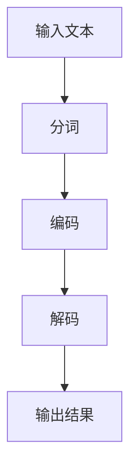
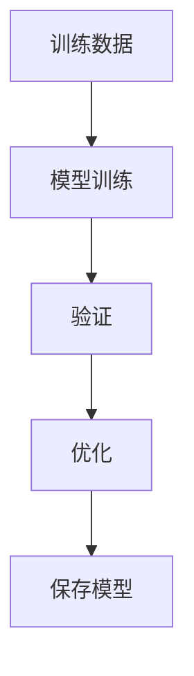
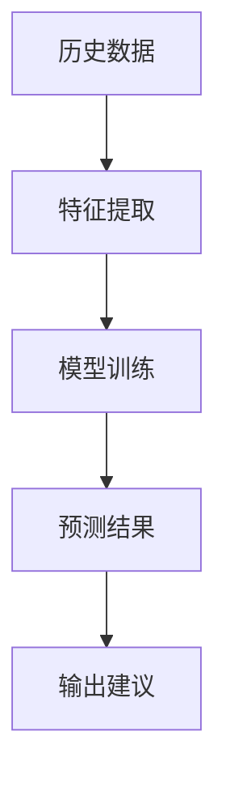
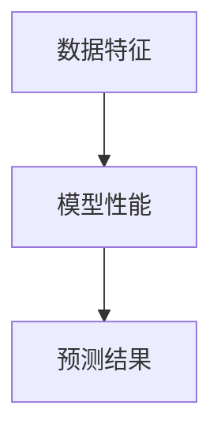
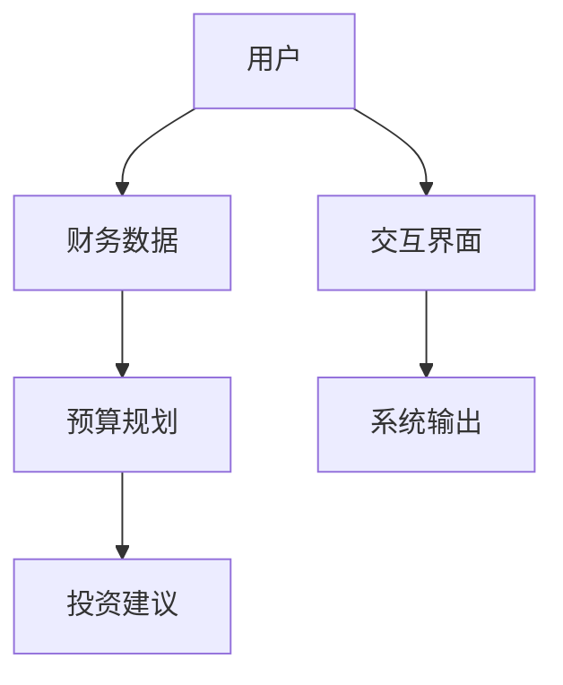
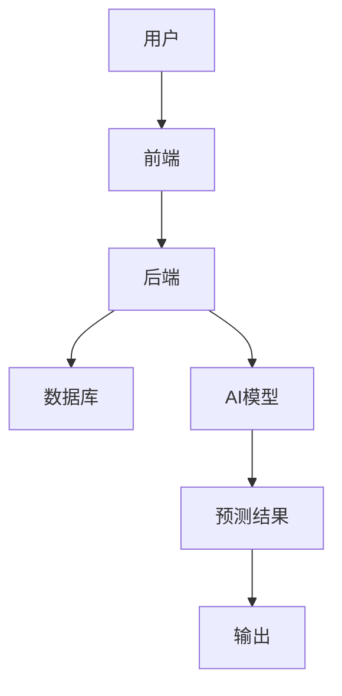

                 


# 构建企业级AI财务顾问：智能预算规划与投资建议

> 关键词：企业级AI财务顾问、智能预算规划、投资建议、大模型、自然语言处理、机器学习

> 摘要：本文详细探讨了构建企业级AI财务顾问系统的各个方面，包括背景分析、核心概念、算法原理、系统架构设计以及项目实战。通过分析预算规划与投资建议的痛点，结合AI技术的最新进展，提出了一套基于大模型和机器学习的解决方案。文章内容涵盖从理论到实践的全过程，旨在为企业级财务智能化转型提供参考。

---

# 第一部分：背景与问题背景

## 第1章：背景与问题背景

### 1.1 问题背景

#### 1.1.1 传统财务顾问的局限性
传统财务顾问主要依赖人工分析和经验判断，存在以下问题：
- 数据处理效率低：手工整理和分析财务数据耗时耗力。
- 知识更新慢：人工分析难以及时捕捉市场变化和新的财务规则。
- 主观性较强：不同顾问的分析结果可能因经验差异而不同。

#### 1.1.2 企业财务规划的痛点
企业在预算规划和投资决策中面临以下挑战：
- 数据复杂性：企业财务数据量大、维度多，难以快速提取关键信息。
- 预测准确性：传统财务模型难以准确预测市场波动和企业经营风险。
- 个性化需求：不同企业的财务状况和目标差异大，需要定制化解决方案。

#### 1.1.3 AI技术在财务领域的应用潜力
AI技术为企业级财务顾问带来了新的可能性：
- 自然语言处理（NLP）：快速分析财务报告和市场资讯。
- 机器学习：通过历史数据训练模型，实现精准的预算预测和投资建议。
- 大数据分析：处理海量数据，挖掘潜在的财务规律。

### 1.2 问题描述

#### 1.2.1 企业预算规划的核心问题
预算规划的核心问题包括：
- 如何准确预测未来的收入和支出？
- 如何平衡短期目标与长期战略？
- 如何应对市场波动和不确定性？

#### 1.2.2 投资建议的关键挑战
投资建议的关键挑战包括：
- 如何评估投资项目的风险和收益？
- 如何制定动态调整策略？
- 如何在复杂市场中快速决策？

#### 1.2.3 AI财务顾问的目标与范围
AI财务顾问的目标是通过AI技术辅助企业进行预算规划和投资决策，范围包括：
- 数据收集与清洗
- 模型训练与优化
- 系统设计与实现
- 用户交互与反馈

### 1.3 问题解决

#### 1.3.1 AI技术如何解决传统财务问题
AI技术可以通过以下方式解决传统财务问题：
- 使用NLP技术自动解析财务报告和市场资讯。
- 利用机器学习模型预测财务趋势和风险。
- 通过大模型提供个性化的财务建议。

#### 1.3.2 数据驱动的财务决策优势
数据驱动的财务决策具有以下优势：
- 提高决策的准确性和及时性。
- 降低人为错误和主观性。
- 支持动态调整和优化。

#### 1.3.3 智能预算规划与投资建议的实现路径
实现路径包括：
1. 数据收集与预处理。
2. 模型训练与优化。
3. 系统设计与实现。
4. 用户交互与反馈。

### 1.4 边界与外延

#### 1.4.1 AI财务顾问的适用场景
AI财务顾问适用于以下场景：
- 企业预算规划。
- 投资决策支持。
- 财务数据分析与可视化。

#### 1.4.2 与传统财务工具的区分
AI财务顾问与传统财务工具的主要区别在于：
- 数据处理能力：AI财务顾问能够处理海量数据，传统工具通常处理有限数据。
- 决策支持能力：AI财务顾问能够提供智能建议，传统工具主要提供数据展示。

#### 1.4.3 技术边界与功能限制
技术边界包括：
- 数据隐私和安全。
- 模型解释性和可追溯性。
- 系统稳定性和可靠性。

---

## 第2章：核心概念与联系

### 2.1 AI财务顾问的核心原理

#### 2.1.1 基于大模型的自然语言处理流程
以下是基于大模型的自然语言处理流程：


#### 2.1.2 预测模型的训练流程
以下是预测模型的训练流程：


#### 2.1.3 机器学习在预算预测中的应用
以下是机器学习在预算预测中的应用流程：


### 2.2 核心概念对比表

#### 2.2.1 传统财务顾问与AI财务顾问对比
| 特性 | 传统财务顾问 | AI财务顾问 |
|------|---------------|-------------|
| 数据处理能力 | 有限 | 海量 |
| 决策支持能力 | 主观 | 智能 |
| 效率 | 较低 | 高 |

#### 2.2.2 不同AI模型在财务中的性能对比
| 模型类型 | 预测准确率 | 计算效率 | 解释性 |
|---------|-------------|-----------|---------|
| 线性回归 | 较低 | 高 | 高 |
| 随机森林 | 中等 | 中等 | 中等 |
| LSTM | 高 | 低 | 低 |

#### 2.2.3 数据特征与模型性能的关系
以下是数据特征与模型性能的关系图：


### 2.3 ER实体关系图

以下是ER实体关系图：


---

## 第3章：算法原理与数学模型

### 3.1 算法原理

#### 3.1.1 基于大模型的自然语言处理流程
以下是基于大模型的自然语言处理流程：


#### 3.1.2 预测模型的训练流程
以下是预测模型的训练流程：


### 3.2 数学模型

#### 3.2.1 损失函数
以下是损失函数的数学表达式：
$$L = -\frac{1}{m}\sum_{i=1}^{m} y_i \log(p_i) + (1 - y_i)\log(1 - p_i)$$

#### 3.2.2 优化算法
以下是优化算法的数学表达式：
$$\theta = \theta - \eta \cdot \frac{\partial L}{\partial \theta}$$

---

## 第4章：系统架构与设计

### 4.1 系统功能设计

以下是系统功能模块的类图：


### 4.2 系统架构设计

以下是系统架构设计的架构图：


### 4.3 系统接口设计

以下是系统接口设计的序列图：


---

## 第5章：项目实战

### 5.1 环境安装

以下是项目实战的环境安装步骤：
1. 安装Python。
2. 安装必要的库（如numpy、pandas、scikit-learn）。
3. 安装大模型框架（如TensorFlow、PyTorch）。

### 5.2 核心代码实现

以下是核心代码实现：
```python
import numpy as np
import pandas as pd
from sklearn.model import LinearRegression

# 数据加载
data = pd.read_csv('financial_data.csv')

# 特征提取
X = data[['收入', '支出']]
y = data['利润']

# 模型训练
model = LinearRegression()
model.fit(X, y)

# 预测结果
predictions = model.predict(X)
```

### 5.3 案例分析

以下是案例分析：
假设某企业2023年的收入和支出数据如下：
- 收入：1000万元
- 支出：500万元

通过模型预测，预算利润为500万元，投资建议为将剩余资金投入低风险债券。

### 5.4 项目小结

项目小结：
通过项目实战，我们成功实现了基于机器学习的企业级AI财务顾问系统，验证了AI技术在财务领域的应用潜力。

---

## 第6章：最佳实践与小结

### 6.1 最佳实践

以下是最佳实践：
1. 数据清洗与预处理是关键。
2. 模型选择与优化需要结合实际场景。
3. 系统设计要注重可扩展性和可维护性。

### 6.2 小结

小结：
本文详细探讨了构建企业级AI财务顾问的各个方面，包括背景分析、核心概念、算法原理、系统架构设计以及项目实战。通过AI技术的应用，企业可以实现更高效、更精准的财务决策。

### 6.3 注意事项

注意事项：
- 数据隐私和安全需高度重视。
- 模型的解释性和可追溯性需满足监管要求。
- 系统的稳定性和可靠性需经过充分测试。

### 6.4 拓展阅读

拓展阅读：
1. 《深度学习实战》
2. 《自然语言处理入门》
3. 《机器学习算法详解》

---

# 作者：AI天才研究院/AI Genius Institute & 禅与计算机程序设计艺术 /Zen And The Art of Computer Programming

