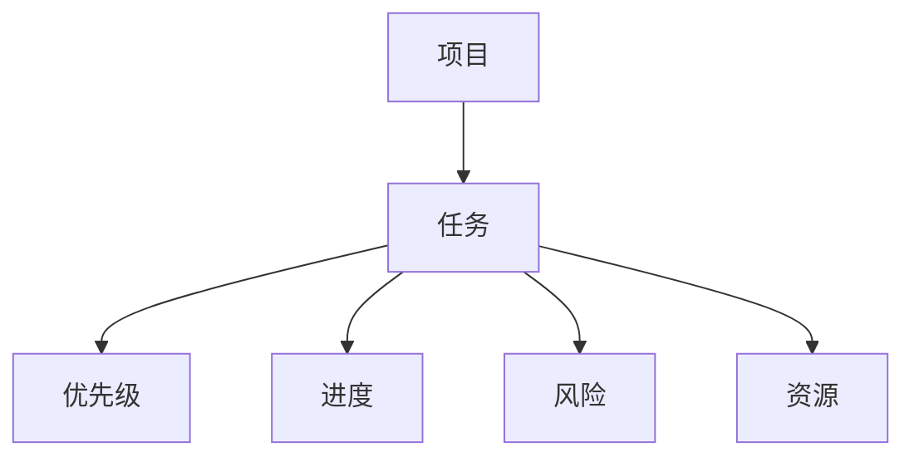
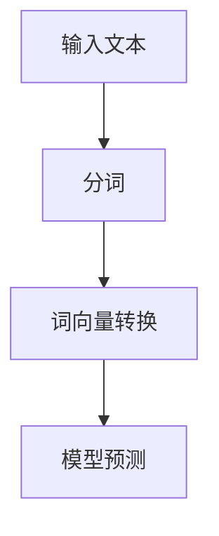
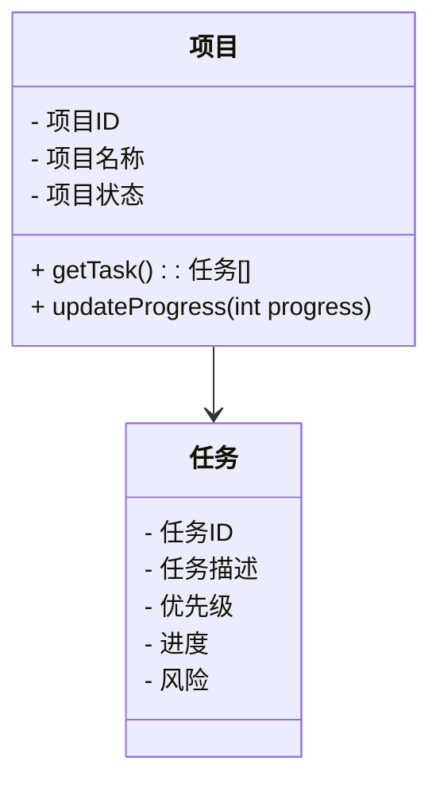
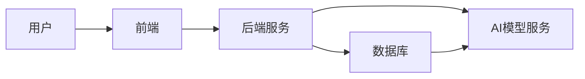
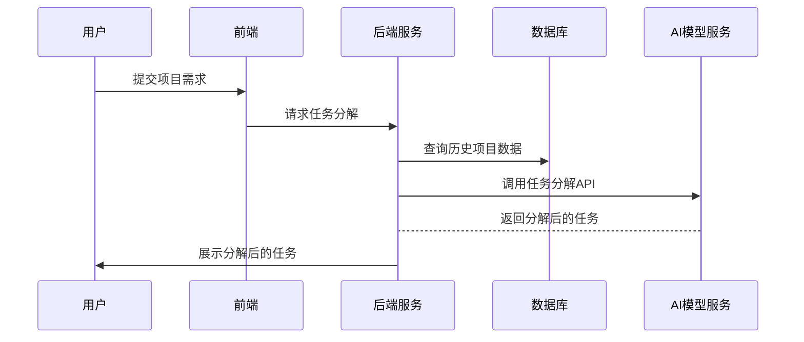

                 


# 构建企业级AI驱动的项目管理助手

## 关键词：企业级AI、项目管理、项目管理助手、自然语言处理、机器学习、系统架构、项目实战

## 摘要

随着企业数字化转型的不断推进，项目管理的复杂性和效率问题日益凸显。传统的项目管理方法和工具逐渐暴露出效率低下、资源浪费和难以应对复杂性等局限性。为了应对这些挑战，人工智能（AI）技术的引入为项目管理带来了新的可能性。本篇文章将详细探讨如何构建一个企业级的AI驱动的项目管理助手，从背景分析到系统设计，再到项目实战，全面解析其实现方法和应用价值。通过本文的阅读，读者将能够理解如何利用AI技术提升项目管理的效率和准确性，为企业带来显著的竞争优势。

---

## 第一部分：企业级AI驱动的项目管理助手概述

### 第1章：项目管理的现状与挑战

#### 1.1 传统项目管理的局限性

传统项目管理依赖于人工操作和固定流程，存在以下主要问题：

- **信息孤岛**：不同部门之间数据分散，难以实现高效协同。
- **效率低下**：手动记录和跟踪任务进度耗时且容易出错。
- **资源浪费**：资源分配不均可能导致项目延期或成本超支。
- **缺乏预测性**：无法准确预测项目风险和进度偏差。

#### 1.2 AI驱动的项目管理优势

AI技术的引入为项目管理带来了革命性的变化，其优势主要体现在以下几个方面：

- **自动化处理**：AI能够自动识别任务优先级、分解任务并预测进度。
- **数据驱动决策**：通过分析历史数据，AI能够提供更精准的风险评估和资源分配建议。
- **实时反馈**：AI助手可以实时监控项目进展，及时发现潜在问题并提出解决方案。

#### 1.3 企业级AI驱动项目管理助手的目标与意义

企业级AI驱动的项目管理助手旨在通过智能化工具优化项目管理流程，提升效率、降低风险并实现资源的最优配置。其意义在于：

- 提高项目执行效率，缩短项目周期。
- 减少人为错误，提升决策准确性。
- 降低管理成本，释放人力资源。

---

## 第二部分：企业级AI驱动的项目管理助手核心概念

### 第2章：企业级AI驱动项目管理助手的概念与核心功能

#### 2.1 企业级AI驱动项目管理助手的定义

企业级AI驱动的项目管理助手是一种基于人工智能技术的智能化工具，旨在通过自动化和数据驱动的方式优化企业项目管理流程。它能够帮助项目经理和团队成员更高效地完成任务分解、进度跟踪、风险评估和资源分配等工作。

#### 2.2 核心功能模块

- **任务分解与优先级排序**：通过NLP和机器学习算法，AI助手能够将复杂任务分解为可执行的小任务，并根据优先级进行排序。
- **进度预测与风险评估**：基于历史数据和当前进度，AI助手能够预测项目完成时间，并识别潜在风险。
- **资源分配与团队协作**：AI助手能够根据任务需求和团队成员的能力，自动分配资源并促进团队协作。

#### 2.3 功能模块之间的关系

通过ER实体关系图可以看出，项目、任务、优先级、进度、风险和资源之间存在密切的关联关系。



---

## 第三部分：AI驱动项目管理助手的算法原理

### 第3章：自然语言处理与机器学习基础

#### 3.1 自然语言处理（NLP）基础

- **核心任务与技术**：NLP技术包括文本分类、实体识别、文本摘要等，这些技术在项目管理中的文本处理需求中起着关键作用。
- **项目管理中的文本处理需求**：例如，通过NLP技术自动提取项目需求文档中的关键信息，帮助任务分解和优先级排序。

#### 3.2 机器学习与监督学习

- **基本概念与技术**：监督学习是一种通过训练数据学习映射关系的机器学习方法，常用于分类、回归等任务。
- **项目进度预测的数学模型**：基于监督学习的回归模型，可以通过输入项目特征预测项目完成时间。

#### 3.3 算法流程图



#### 3.4 算法实现代码示例

```python
import numpy as np
from sklearn.feature_extraction.text import TfidfVectorizer
from sklearn.linear_model import Ridge

# 示例数据：项目需求文档
texts = ["开发一个用户友好的Web应用程序", "设计一个高效的数据库结构"]
labels = [1, 2]

# 特征提取
vectorizer = TfidfVectorizer()
X = vectorizer.fit_transform(texts)

# 训练模型
model = Ridge(alpha=0.1)
model.fit(X, labels)

# 预测
new_text = "开发一个移动应用程序"
new_X = vectorizer.transform([new_text])
predicted_label = model.predict(new_X)
print(predicted_label)
```

---

## 第四部分：系统分析与架构设计

### 第4章：系统分析与架构设计方案

#### 4.1 项目场景介绍

以一个中型企业的软件开发项目为例，项目管理团队需要高效地分解任务、跟踪进度、评估风险并分配资源。

#### 4.2 系统功能设计

- **领域模型**：通过Mermaid类图展示项目管理中的核心实体及其关系。



- **系统架构设计**：基于微服务架构，采用分布式系统设计，包括前端、后端服务、数据库和AI模型服务。



- **系统交互序列图**：展示用户与系统之间的交互流程。



---

## 第五部分：项目实战

### 第5章：项目实战

#### 5.1 环境安装

安装所需的开发环境和工具：

- Python 3.8+
- Jupyter Notebook
- Scikit-learn
- NLTK
- Mermaid CLI

#### 5.2 系统核心实现

实现任务分解和进度预测的核心功能：

```python
import nltk
from sklearn.feature_extraction.text import TfidfVectorizer
from sklearn.naive_bayes import MultinomialNB

# 示例数据：任务描述
texts = ["开发用户界面", "设计数据库结构", "编写业务逻辑"]
labels = [1, 2, 3]

# 特征提取
vectorizer = TfidfVectorizer()
X = vectorizer.fit_transform(texts)

# 训练模型
model = MultinomialNB(alpha=0.1)
model.fit(X, labels)

# 预测新任务的优先级
new_text = "实现API接口"
new_X = vectorizer.transform([new_text])
predicted_priority = model.predict(new_X)
print(predicted_priority)
```

#### 5.3 代码应用解读与分析

- **任务分解**：通过NLP技术将项目需求分解为具体任务。
- **进度预测**：基于历史数据和当前进度，预测项目完成时间。

#### 5.4 实际案例分析

以一个实际项目为例，分析AI助手在任务分解和进度预测中的应用。

---

## 第六部分：总结与展望

### 第6章：总结与展望

#### 6.1 本章小结

企业级AI驱动的项目管理助手通过智能化工具优化项目管理流程，显著提升了效率和准确性。其核心功能包括任务分解、进度预测、风险评估和资源分配。

#### 6.2 最佳实践 tips

- **数据质量**：确保输入数据的准确性和完整性。
- **模型优化**：定期更新模型，提高预测精度。
- **团队协作**：AI助手应与团队成员无缝协作，提升整体效率。

#### 6.3 未来展望

随着AI技术的不断进步，企业级项目管理助手将更加智能化和个性化，未来可能集成更多的高级功能，如自适应学习和动态风险应对。

---

## 作者信息

作者：AI天才研究院（AI Genius Institute） & 禅与计算机程序设计艺术（Zen And The Art of Computer Programming）

---

通过以上内容，我们详细探讨了如何构建企业级AI驱动的项目管理助手，从背景分析到系统设计，再到项目实战，全面解析了其实现方法和应用价值。希望本文能为企业在数字化转型中的项目管理提供新的思路和实践指导。

