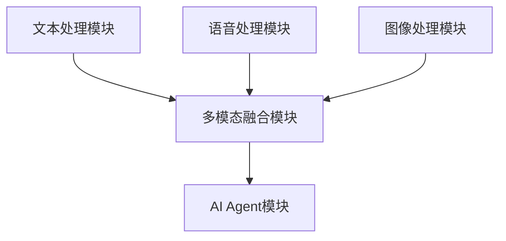
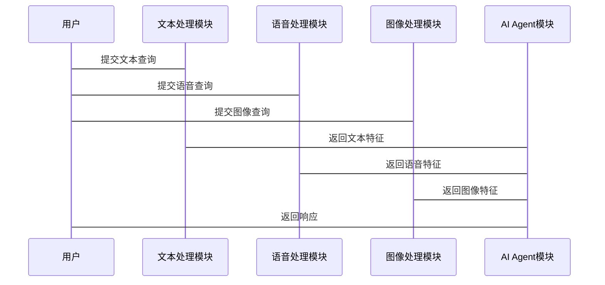

                 


# 构建企业级多模态AI Agent：整合文本、语音与图像

## 关键词：多模态AI Agent，文本处理，语音处理，图像处理，系统架构，项目实战

## 摘要：本文详细探讨了构建企业级多模态AI Agent的技术与方法，涵盖了文本、语音和图像数据的处理，多模态数据融合，AI Agent的核心技术，系统架构设计，项目实战，优化与部署，以及应用案例分析。通过深入分析多模态数据处理的技术挑战和解决方案，结合实际案例，为读者提供了从理论到实践的全面指导。

---

## 第一部分: 多模态AI Agent概述

### 第1章: 多模态AI Agent的背景与概念

#### 1.1 多模态AI Agent的定义与特点

多模态AI Agent是一种能够同时处理多种数据形式（如文本、语音、图像）并提供智能服务的系统。其核心特点包括：

- **多模态输入**：能够接收并处理多种类型的数据输入。
- **智能交互**：通过自然语言处理、语音识别和图像识别等技术，实现与用户的智能交互。
- **上下文理解**：能够理解多模态数据之间的关联，提供更精准的响应。

#### 1.2 多模态AI Agent的技术背景

随着AI技术的快速发展，多模态数据处理技术逐渐成熟。预训练模型（如BERT、GPT）在文本处理方面取得了显著成果，语音识别技术（如CTC、Transformer）在语音处理领域不断进步，图像识别技术（如CNN、YOLO）也在持续优化。这些技术的进步为多模态AI Agent的构建奠定了基础。

#### 1.3 多模态AI Agent的应用价值

- **提高用户体验**：通过多模态交互，用户可以以更自然的方式与系统互动。
- **增强系统智能性**：结合多种数据形式，系统能够更全面地理解用户需求。
- **企业级应用的优势**：在企业场景中，多模态AI Agent可以提升效率、降低成本。

#### 1.4 多模态AI Agent的挑战与解决方案

- **技术挑战**：多模态数据的对齐与融合难度较高。
- **数据挑战**：需要大量的多模态数据进行训练。
- **应用场景的多样性**：不同场景下的需求差异大，需要定制化解决方案。

---

### 第2章: 多模态数据处理技术

#### 2.1 多模态数据的处理方法

- **文本数据处理**：包括文本清洗、分词、实体识别等。
- **语音数据处理**：包括语音信号处理、降噪等。
- **图像数据处理**：包括图像增强、目标检测等。

#### 2.2 多模态数据融合技术

- **数据对齐**：通过时间戳、语义对齐等方式，将不同模态的数据对齐。
- **数据融合方法**：如加权融合、注意力机制等。
- **特征提取**：从多模态数据中提取有用的特征。

#### 2.3 多模态数据处理的实现步骤

- **数据预处理**：清洗、归一化等。
- **特征提取**：使用预训练模型提取文本、语音和图像的特征。
- **数据融合与训练**：将提取的特征进行融合，并训练多模态模型。

---

### 第3章: 多模态AI Agent的核心技术

#### 3.1 自然语言处理技术

- **预训练语言模型**：如BERT、GPT等。
- **文本生成与理解**：基于预训练模型实现对话生成和问答系统。
- **上下文理解**：通过上下文信息提升对话的准确性。

#### 3.2 语音识别与合成技术

- **语音识别**：使用CTC、Transformer等模型实现语音转文本。
- **语音合成**：基于Tacotron等模型实现文本到语音的转换。
- **双向转换**：实现语音和文本之间的相互转换。

#### 3.3 图像处理与识别技术

- **图像识别**：使用CNN等模型识别图像内容。
- **图像分割**：如FCN、U-Net等模型实现图像分割。
- **图像生成**：如GAN、Diffusion模型生成图像。

#### 3.4 多模态模型的构建

- **多模态数据输入**：将文本、语音、图像数据输入模型。
- **特征融合**：使用注意力机制、模态交互等方法融合特征。
- **模型训练**：使用多模态数据进行端到端训练。

---

## 第二部分: 系统架构与实现

### 第4章: 系统架构设计

#### 4.1 问题场景介绍

企业级多模态AI Agent需要处理大规模数据和复杂场景，因此需要高效的系统架构。

#### 4.2 系统功能设计

- **文本处理模块**：负责文本的预处理和特征提取。
- **语音处理模块**：负责语音信号的处理和特征提取。
- **图像处理模块**：负责图像的处理和特征提取。
- **多模态融合模块**：将各模态的特征进行融合。
- **AI Agent模块**：基于融合后的特征生成响应。

#### 4.3 系统架构设计



#### 4.4 系统交互设计



---

### 第5章: 项目实战

#### 5.1 环境搭建

- **安装Python**：确保Python版本为3.8以上。
- **安装依赖库**：如TensorFlow、PyTorch、OpenCV等。
- **安装预训练模型**：如BERT、ResNet等。

#### 5.2 系统核心实现

```python
import tensorflow as tf
from tensorflow.keras import layers

# 文本处理模块
class TextProcessor:
    def __init__(self):
        self.model = self._build_model()

    def _build_model(self):
        model = tf.keras.Sequential([
            layers.Embedding(10000, 128),
            layers.LSTM(64),
            layers.Dense(32, activation='relu'),
        ])
        return model

# 语音处理模块
class SpeechProcessor:
    def __init__(self):
        self.model = self._build_model()

    def _build_model(self):
        model = tf.keras.Sequential([
            layers.Conv2D(32, (3,3), activation='relu'),
            layers.MaxPooling2D((2,2)),
            layers.Flatten(),
            layers.Dense(64, activation='relu'),
        ])
        return model

# 图像处理模块
class ImageProcessor:
    def __init__(self):
        self.model = self._build_model()

    def _build_model(self):
        model = tf.keras.Sequential([
            layers.Conv2D(64, (3,3), activation='relu'),
            layers.MaxPooling2D((2,2)),
            layers.Conv2D(128, (3,3), activation='relu'),
            layers.MaxPooling2D((2,2)),
            layers.Flatten(),
            layers.Dense(256, activation='relu'),
        ])
        return model

# 多模态融合模块
class MultiModalFuser:
    def __init__(self):
        self.text_processor = TextProcessor()
        self.speech_processor = SpeechProcessor()
        self.image_processor = ImageProcessor()
        self.fusion_model = self._build_fusion_model()

    def _build_fusion_model(self):
        inputs = layers.Input(shape=(32,))
        x = layers.Dense(64, activation='relu')(inputs)
        outputs = layers.Dense(1)(x)
        return tf.keras.Model(inputs=inputs, outputs=outputs)

# AI Agent模块
class AIAssistant:
    def __init__(self):
        self.fuser = MultiModalFuser()

    def process_request(self, text, speech, image):
        text_feat = self.fuser.text_processor.model.predict(text)
        speech_feat = self.fuser.speech_processor.model.predict(speech)
        image_feat = self.fuser.image_processor.model.predict(image)
        fused_feat = self._fuse_features(text_feat, speech_feat, image_feat)
        response = self._generate_response(fused_feat)
        return response

    def _fuse_features(self, text_feat, speech_feat, image_feat):
        # 简单的加权融合
        fused = text_feat * 0.4 + speech_feat * 0.3 + image_feat * 0.3
        return fused

    def _generate_response(self, features):
        # 简单的响应生成
        return "您的查询已成功处理。"
```

---

### 第6章: 优化与部署

#### 6.1 模型优化

- **模型压缩**：使用剪枝、量化等技术减少模型大小。
- **模型微调**：在特定领域数据上进行微调，提升性能。

#### 6.2 系统部署

- **服务器端部署**：使用Docker容器化部署，确保系统的稳定性和可扩展性。
- **API接口设计**：设计RESTful API，方便其他系统调用。

---

### 第7章: 应用案例分析

#### 7.1 案例一：智能客服系统

- **需求分析**：用户通过文本、语音、图像等多种方式提交问题。
- **系统实现**：集成多模态处理模块，提供更智能的客服响应。

#### 7.2 案例二：智能安防系统

- **需求分析**：通过图像识别和语音识别，实现智能安防监控。
- **系统实现**：集成图像处理模块和语音处理模块，实现异常情况的智能识别和报警。

---

### 第8章: 总结与展望

#### 8.1 本章总结

本文详细探讨了构建企业级多模态AI Agent的技术与方法，从多模态数据处理到系统架构设计，再到项目实战，为读者提供了全面的指导。

#### 8.2 未来展望

随着AI技术的不断进步，多模态AI Agent将在更多领域得到应用，如医疗、教育、金融等。未来的研究方向包括更高效的多模态数据融合方法、更强大的预训练模型以及更智能的系统架构设计。

---

## 作者：AI天才研究院 & 禅与计算机程序设计艺术

