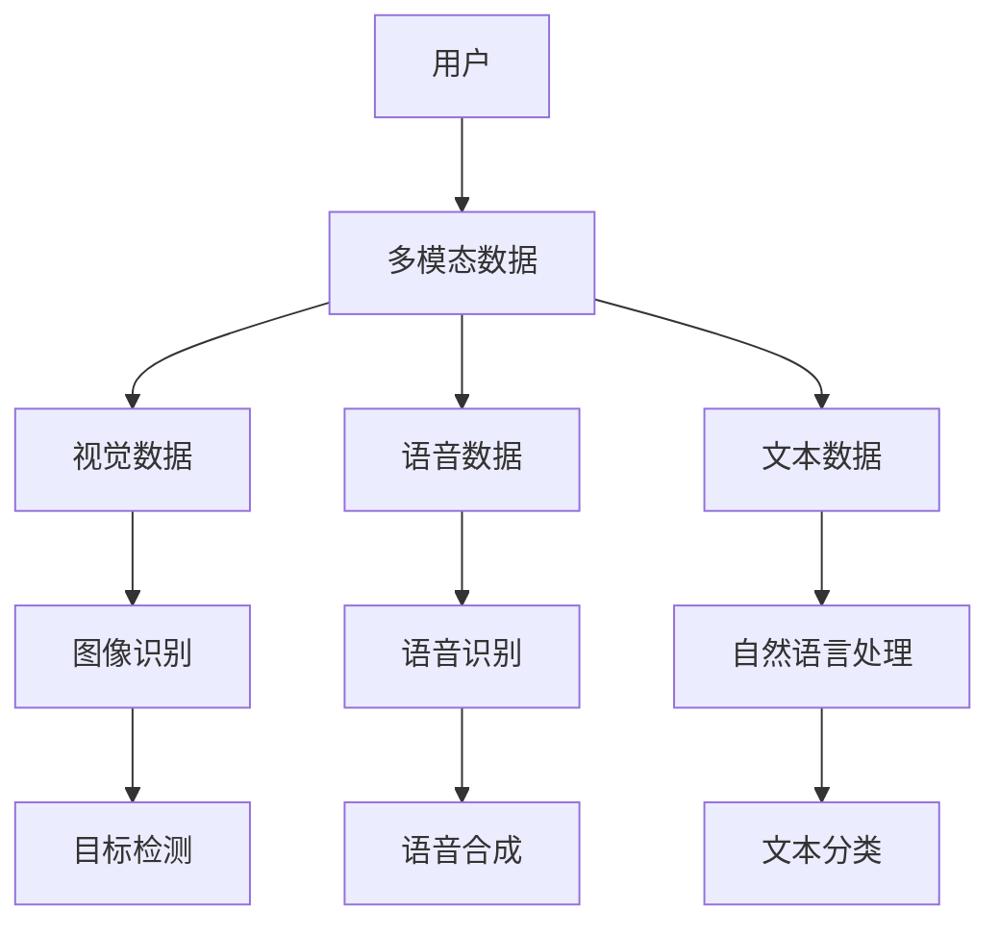
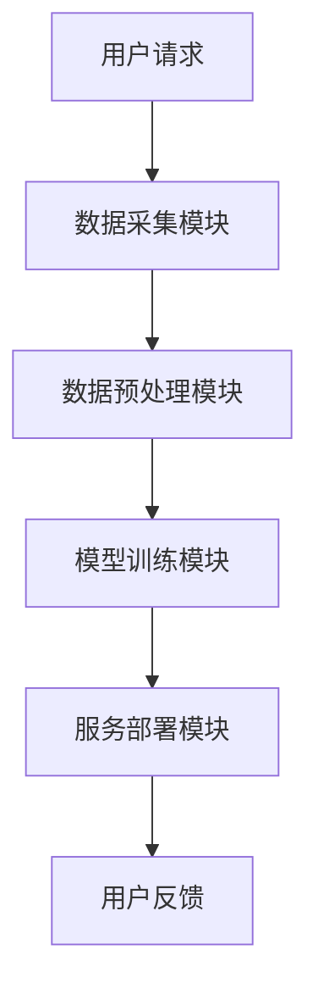
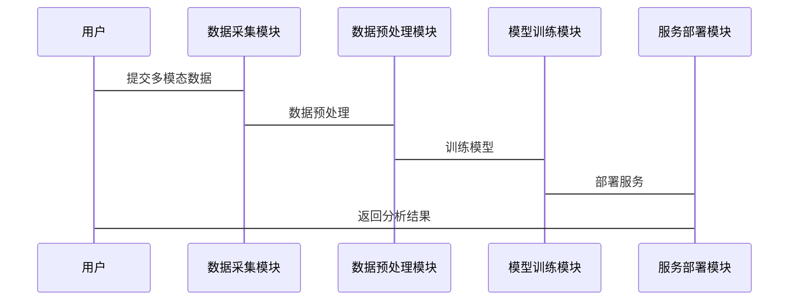

                 


# 《构建企业级多模态AI平台：整合视觉、语音与文本的综合分析系统》

---

**关键词**：企业级AI平台、多模态数据、视觉、语音、文本分析、深度学习、自然语言处理

---

**摘要**：本文详细探讨了构建企业级多模态AI平台的各个方面，包括整合视觉、语音和文本数据的综合分析系统。文章从问题背景、核心概念、算法原理、系统架构设计到项目实战，全面分析了构建多模态AI平台的挑战与解决方案。通过理论与实践结合，为读者提供了从基础到实战的详细指南。

---

## 目录大纲

### 第一部分：背景与概述

#### 第1章：问题背景与目标

##### 1.1 多模态AI平台的背景
- 1.1.1 传统AI的局限性
- 1.1.2 多模态数据的兴起
- 1.1.3 企业级AI平台的需求

##### 1.2 问题描述与目标
- 1.2.1 多模态数据整合的挑战
- 1.2.2 企业级AI平台的核心目标
- 1.2.3 边界与外延

##### 1.3 核心概念与组成
- 1.3.1 多模态数据的定义
- 1.3.2 AI平台的功能模块
- 1.3.3 核心要素与关系

#### 第2章：多模态AI平台的核心概念与联系

##### 2.1 核心概念原理
- 2.1.1 多模态数据融合
- 2.1.2 模型训练与推理
- 2.1.3 平台架构设计

##### 2.2 核心概念特征对比
- 2.2.1 数据类型对比
- 2.2.2 模型性能对比
- 2.2.3 平台功能对比

##### 2.3 ER实体关系图


### 第二部分：算法原理与实现

#### 第3章：多模态数据融合算法

##### 3.1 数据融合方法
- 3.1.1 晚融合（Late Fusion）
- 3.1.2 早融合（Early Fusion）
- 3.1.3 深度融合（Deep Fusion）

##### 3.2 算法流程
- 3.2.1 数据预处理
- 3.2.2 模型训练
- 3.2.3 推理与结果融合

##### 3.3 代码实现
```python
def multimodal_fusion(image, audio, text):
    # 图像处理
    processed_image = image_processor(image)
    # 语音处理
    processed_audio = audio_processor(audio)
    # 文本处理
    processed_text = text_processor(text)
    # 融合处理
    fused_data = fusion_model(processed_image, processed_audio, processed_text)
    return fused_data
```

#### 第4章：模型训练与优化

##### 4.1 模型选择与训练
- 4.1.1 模型选择策略
- 4.1.2 数据增强技术
- 4.1.3 模型训练流程

##### 4.2 模型优化方法
- 4.2.1 参数调整
- 4.2.2 正则化技术
- 4.2.3 集成学习

##### 4.3 模型评估与调优
- 4.3.1 评估指标
- 4.3.2 调参技巧
- 4.3.3 模型优化案例

### 第三部分：系统分析与架构设计

#### 第5章：系统架构设计

##### 5.1 项目场景介绍
- 5.1.1 企业级AI平台的应用场景
- 5.1.2 多模态数据的典型应用场景

##### 5.2 系统功能设计
- 5.2.1 数据采集模块
- 5.2.2 数据处理模块
- 5.2.3 模型训练模块
- 5.2.4 服务部署模块

##### 5.3 系统架构设计


##### 5.4 系统接口设计
- 5.4.1 API接口定义
- 5.4.2 接口调用流程
- 5.4.3 接口安全设计

##### 5.5 系统交互设计


### 第四部分：项目实战

#### 第6章：环境安装与核心代码实现

##### 6.1 环境安装
- 6.1.1 安装Python与相关库
- 6.1.2 安装深度学习框架（如TensorFlow、PyTorch）
- 6.1.3 安装图像处理库（如OpenCV、 PIL）
- 6.1.4 安装语音处理库（如SpeechRecognition、 librosa）
- 6.1.5 安装NLP处理库（如NLTK、spaCy）

##### 6.2 核心代码实现
```python
import tensorflow as tf
from tensorflow.keras import layers

def build_multimodal_model():
    # 视觉分支
    input_image = layers.Input(shape=(224, 224, 3))
    x = layers.Conv2D(32, (3, 3), activation='relu')(input_image)
    x = layers.MaxPooling2D((2, 2))(x)
    x = layers.Conv2D(64, (3, 3), activation='relu')(x)
    x = layers.MaxPooling2D((2, 2))(x)
    x = layers.Flatten()(x)
    x = layers.Dense(256, activation='relu')(x)
    
    # 语音分支
    input_audio = layers.Input(shape=(1024,))
    y = layers.Dense(64, activation='relu')(input_audio)
    
    # 文本分支
    input_text = layers.Input(shape=(128,))
    z = layers.Dense(64, activation='relu')(input_text)
    
    # 融合层
    merged = layers.Concatenate()([x, y, z])
    merged = layers.Dense(128, activation='relu')(merged)
    output = layers.Dense(1, activation='sigmoid')(merged)
    
    model = tf.keras.Model(inputs=[input_image, input_audio, input_text], outputs=output)
    return model
```

##### 6.3 案例分析与结果解读
- 6.3.1 数据准备与预处理
- 6.3.2 模型训练与评估
- 6.3.3 实际案例分析

### 第五部分：最佳实践与总结

#### 第7章：最佳实践与总结

##### 7.1 最佳实践
- 7.1.1 数据质量管理
- 7.1.2 模型优化技巧
- 7.1.3 系统部署与维护

##### 7.2 小结
- 7.2.1 全文总结
- 7.2.2 未来发展趋势

##### 7.3 注意事项
- 7.3.1 数据隐私与安全
- 7.3.2 系统性能优化
- 7.3.3 技术选型建议

##### 7.4 拓展阅读
- 7.4.1 推荐书籍与论文
- 7.4.2 相关技术社区与资源

---

**作者**：AI天才研究院 / AI Genius Institute & 禅与计算机程序设计艺术 / Zen And The Art of Computer Programming

---

通过以上目录大纲，文章内容将从背景知识、核心概念、算法原理、系统架构设计到项目实战，逐步展开，全面深入地探讨构建企业级多模态AI平台的各个方面，确保读者能够从理论到实践，全面掌握构建此类系统的知识和技能。

