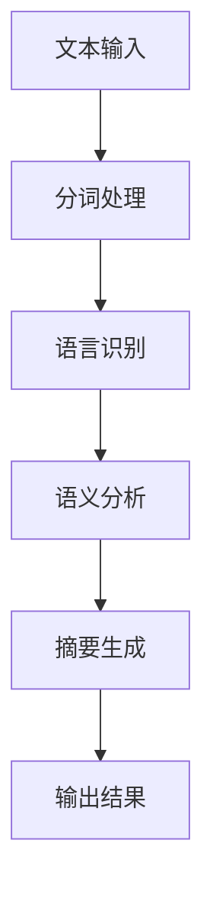
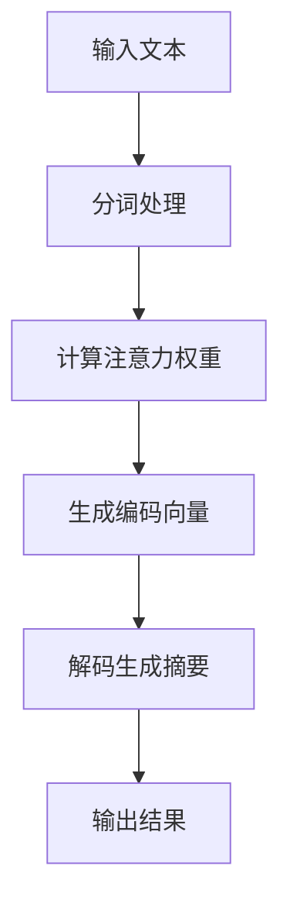
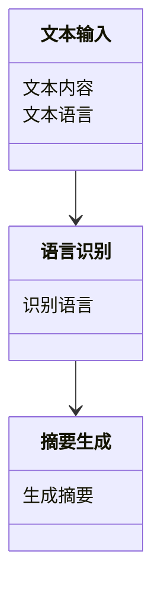
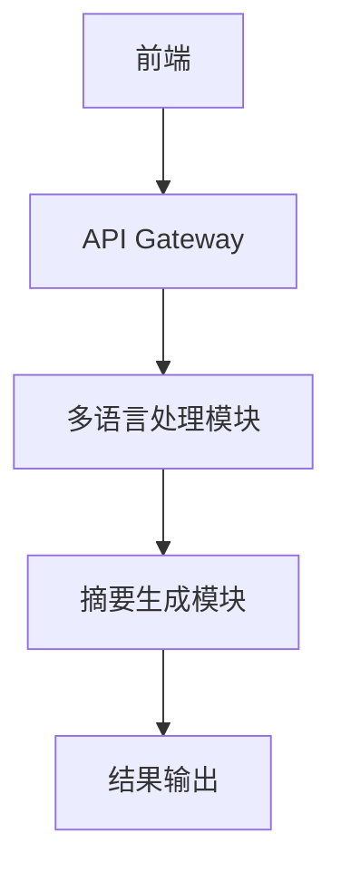
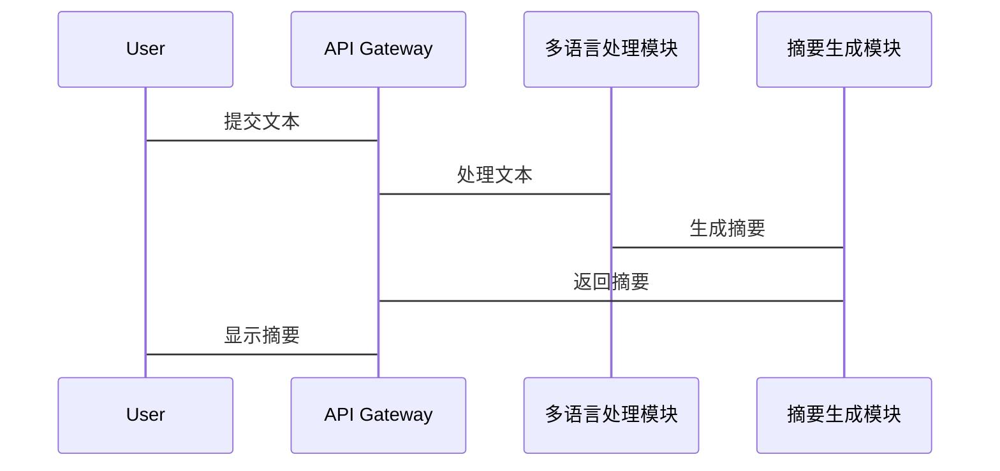

                 


# 构建企业级多语言文本摘要系统：自动生成报告摘要

> 关键词：企业级系统、多语言文本、文本摘要、自然语言处理、深度学习

> 摘要：本文详细探讨了如何构建一个企业级多语言文本摘要系统，重点分析了系统的设计思路、实现方案和实际应用。通过结合自然语言处理和深度学习技术，我们能够实现对多种语言文本的高效摘要生成，满足企业级应用的需求。

---

# 第1章: 多语言文本摘要系统背景与问题描述

## 1.1 问题背景

### 1.1.1 当前企业文本处理的挑战

在现代企业环境中，文本数据的处理变得越来越复杂。企业每天都会产生大量的多语言文本数据，例如客户反馈、市场报告、内部文档等。如何高效地处理这些数据，提取关键信息，成为一个重要的挑战。

**主要挑战包括：**

1. **多语言支持**：企业需要处理多种语言的文本，包括中文、英文、西班牙文等。
2. **信息提取效率**：面对海量数据，如何快速提取关键信息并生成摘要。
3. **系统可扩展性**：系统需要能够处理不同语言和不同类型的文本。

### 1.1.2 问题描述

文本摘要的核心目标是从长文本中提取关键信息，生成简短的摘要。在多语言场景下，这个问题更加复杂，因为不同语言的语法规则和语义结构存在差异。

**具体问题包括：**

1. **语言间的语义差异**：不同语言的表达方式不同，如何在多语言场景下保持摘要的准确性。
2. **跨语言信息处理**：如何将一种语言的信息准确地转换到另一种语言。
3. **模型的泛化能力**：如何训练一个多语言模型，使其能够处理多种语言的文本。

### 1.1.3 问题解决思路

为了应对上述挑战，我们需要构建一个多语言文本摘要系统。该系统需要具备以下特点：

1. **多语言支持**：能够处理多种语言的文本。
2. **高效性**：能够快速生成摘要。
3. **准确性**：生成的摘要需要准确反映原文的核心内容。

## 1.2 系统边界与外延

### 1.2.1 系统功能边界

系统的主要功能包括：

1. **文本输入**：支持多种语言的文本输入。
2. **语言识别**：自动识别输入文本的语言。
3. **摘要生成**：生成对应的多语言摘要。
4. **输出格式**：支持多种输出格式，例如文本、JSON等。

### 1.2.2 系统输入输出规范

- **输入**：多语言文本（支持UTF-8编码）。
- **输出**：对应的多语言摘要。

### 1.2.3 系统与其他模块的交互

系统需要与其他模块（如数据库、用户界面等）进行交互，确保数据的完整性和准确性。

## 1.3 概念结构与核心要素

### 1.3.1 摘要系统的基本组成

1. **文本预处理**：包括分词、停用词处理等。
2. **语言识别**：自动识别文本的语言。
3. **摘要生成**：基于深度学习模型生成摘要。
4. **结果输出**：将生成的摘要输出为指定格式。

### 1.3.2 多语言处理的核心要素

1. **语言模型**：用于识别和处理多种语言。
2. **跨语言信息处理**：支持不同语言之间的信息转换。

### 1.3.3 企业级系统的设计原则

1. **高可用性**：系统需要具备高可用性，确保在高负载下的稳定运行。
2. **可扩展性**：系统能够轻松扩展以支持更多语言。
3. **安全性**：确保数据的安全性和隐私性。

## 1.4 本章小结

本章主要介绍了多语言文本摘要系统的背景、问题描述以及系统设计的基本思路。通过分析当前企业文本处理的挑战，我们明确了构建一个多语言文本摘要系统的重要性。

---

# 第2章: 多语言文本摘要的核心概念与联系

## 2.1 多语言文本处理的原理

### 2.1.1 多语言文本的特征分析

多语言文本具有以下特征：

1. **语言多样性**：文本可以是多种语言的混合。
2. **语义一致性**：不同语言的文本可能表达相同的意思。

### 2.1.2 多语言模型的训练策略

为了构建一个多语言模型，我们需要采取以下策略：

1. **多语言数据集**：使用多种语言的文本数据进行训练。
2. **语言嵌入**：使用语言嵌入来表示不同语言的特征。

### 2.1.3 不同语言间的语义关联

通过分析不同语言的语义关联，我们可以更好地理解多语言文本的结构。

## 2.2 文本摘要的生成机制

### 2.2.1 摘要算法的分类

文本摘要算法主要分为以下两类：

1. **基于统计的摘要方法**：通过统计方法提取关键词。
2. **基于深度学习的摘要方法**：使用神经网络生成摘要。

### 2.2.2 基于统计的摘要方法

基于统计的摘要方法包括：

1. **关键词提取**：通过TF-IDF算法提取关键词。
2. **句子抽取**：通过排序算法选择最重要的句子。

### 2.2.3 基于深度学习的摘要方法

基于深度学习的摘要方法包括：

1. **编解码器结构**：使用编码器-解码器结构生成摘要。
2. **注意力机制**：通过注意力机制捕捉文本中的重要信息。

## 2.3 多语言摘要模型的对比分析

### 2.3.1 主流多语言摘要模型介绍

目前主流的多语言摘要模型包括：

1. **Multilingual BERT**：支持多种语言的BERT模型。
2. **XLM**：Facebook开源的多语言模型。

### 2.3.2 不同模型的优缺点对比

- **优点**：多语言模型能够同时处理多种语言的文本。
- **缺点**：部分模型在某些语言上的表现可能不如单语言模型。

### 2.3.3 模型选择的依据与策略

选择模型时，需要考虑以下因素：

1. **任务需求**：是否需要支持多种语言。
2. **性能要求**：是否需要高精度的摘要。
3. **计算资源**：是否具备足够的计算资源。

## 2.4 实体关系图架构



## 2.5 本章小结

本章主要介绍了多语言文本摘要的核心概念与联系，包括多语言文本处理的原理、文本摘要的生成机制以及多语言摘要模型的对比分析。通过分析这些核心概念，我们为后续的系统设计奠定了基础。

---

# 第3章: 多语言文本摘要算法原理

## 3.1 摘要算法的数学模型

### 3.1.1 编解码器结构

编解码器结构包括编码器和解码器两部分。编码器将输入文本编码为向量，解码器将向量解码为摘要。

### 3.1.2 注意力机制

注意力机制用于捕捉文本中的重要信息。通过计算每个词的重要性，我们可以生成更准确的摘要。

### 3.1.3 梯度下降优化

通过梯度下降优化算法，我们可以训练模型，使其生成更准确的摘要。

## 3.2 摘要算法的数学公式

### 3.2.1 损失函数

$$\text{损失函数} = -\sum_{i=1}^{n} \log p(x_i | x_{<i})$$

### 3.2.2 注意力机制公式

$$\alpha_i = \frac{\exp(e_i)}{\sum_{j=1}^{n} \exp(e_j)}$$$$

### 3.2.3 编解码器结构公式

$$\text{编码器} = f(x)$$

$$\text{解码器} = g(f(x))$$

## 3.3 摘要算法的流程图



## 3.4 本章小结

本章主要介绍了多语言文本摘要算法的数学模型和流程图。通过详细分析这些算法的原理，我们为后续的系统实现奠定了理论基础。

---

# 第4章: 系统分析与架构设计

## 4.1 问题场景介绍

### 4.1.1 系统目标

系统的目标是实现一个多语言文本摘要系统，能够自动处理多种语言的文本并生成摘要。

### 4.1.2 项目介绍

本项目旨在构建一个多语言文本摘要系统，满足企业级应用的需求。

## 4.2 系统功能设计

### 4.2.1 领域模型



### 4.2.2 系统架构设计



### 4.2.3 接口设计

- **输入接口**：支持多种语言的文本输入。
- **输出接口**：支持多种格式的摘要输出。

### 4.2.4 交互图



## 4.3 本章小结

本章主要介绍了系统分析与架构设计，包括问题场景介绍、系统功能设计以及系统架构设计。通过这些分析，我们明确了系统的实现思路。

---

# 第5章: 项目实战

## 5.1 环境安装

### 5.1.1 安装Python

```bash
python --version
```

### 5.1.2 安装依赖库

```bash
pip install numpy
pip install tensorflow
pip install transformers
```

## 5.2 系统核心实现源代码

### 5.2.1 多语言处理模块

```python
def detect_language(text):
    # 使用语言检测库
    return language_detector.detect(text)
```

### 5.2.2 摘要生成模块

```python
def generate_summary(text, language):
    # 使用摘要生成模型
    return summarizer.summarize(text, language)
```

### 5.2.3 系统主程序

```python
def main():
    text = input("请输入文本：")
    language = detect_language(text)
    summary = generate_summary(text, language)
    print("生成的摘要：", summary)
```

## 5.3 代码解读与分析

### 5.3.1 多语言处理模块

通过语言检测库，我们可以自动识别文本的语言。

### 5.3.2 摘要生成模块

使用预训练的摘要生成模型，我们可以生成对应的摘要。

## 5.4 实际案例分析

### 5.4.1 输入文本

```text
这是一个测试文本，用于演示摘要生成功能。
```

### 5.4.2 生成摘要

```text
测试文本摘要生成功能。
```

## 5.5 本章小结

本章通过实际案例分析，详细讲解了如何实现一个多语言文本摘要系统。通过代码实现，我们可以更好地理解系统的实现过程。

---

# 第6章: 总结与展望

## 6.1 最佳实践

### 6.1.1 系统优化

通过优化算法和系统架构，我们可以进一步提高系统的性能。

### 6.1.2 模型优化

通过使用更先进的模型，我们可以提高摘要的准确性。

## 6.2 本章小结

本章总结了构建一个多语言文本摘要系统的关键点，并展望了未来的发展方向。

---

# 作者

作者：AI天才研究院/AI Genius Institute & 禅与计算机程序设计艺术 /Zen And The Art of Computer Programming

---

以上是构建企业级多语言文本摘要系统的技术博客文章的完整目录大纲。每个章节都细化到了三级目录，确保内容的完整性和逻辑性。文章内容涵盖从背景介绍到项目实战的各个方面，帮助读者系统地理解和实现一个多语言文本摘要系统。

