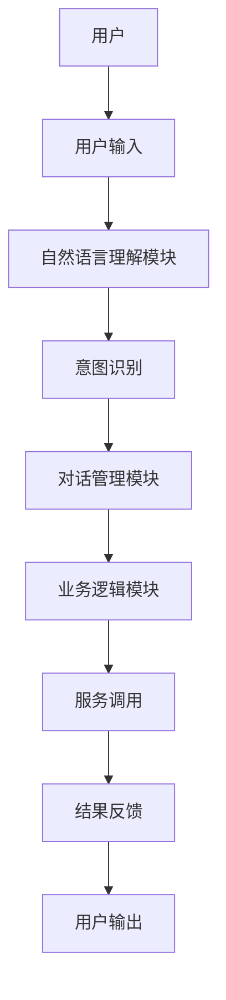
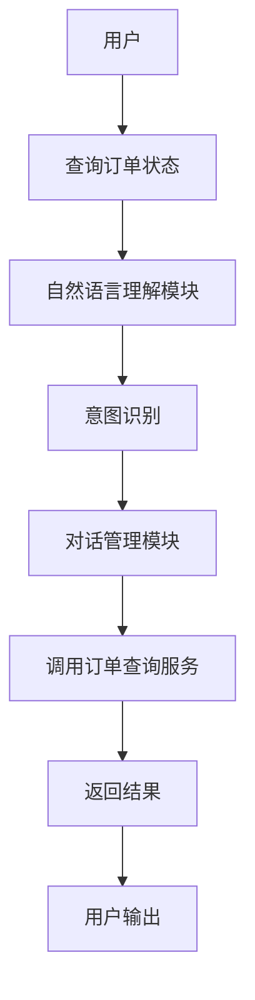

                 


# 构建企业级对话式AI助手：跨系统业务流程自动化与协调

## 关键词：
- 企业级对话式AI助手
- 业务流程自动化
- 跨系统集成
- 自然语言处理
- 对話状态管理

## 摘要：
本文深入探讨了构建企业级对话式AI助手的核心技术与实践方法，重点关注跨系统业务流程的自动化与协调。通过系统化的分析和详细的技术讲解，阐述了从基础概念到实现落地的完整过程，包括对话式AI助手的架构设计、自然语言处理技术、跨系统集成机制以及业务流程自动化的方法。同时，本文还提供了实际的项目案例和系统架构设计，帮助读者全面理解如何在企业环境中实现高效的对话式AI助手。

---

# 第一部分：对话式AI助手的背景与挑战

## 第1章：对话式AI助手的基本概念

### 1.1 对话式AI助手的定义与特点

对话式AI助手是一种基于自然语言处理（NLP）技术的智能系统，能够通过文本或语音与用户进行交互，理解用户的需求并提供相应的服务或信息。与传统的基于规则的对话系统不同，现代对话式AI助手通常结合了深度学习技术，能够处理复杂的语义理解和多轮对话。

#### 1.1.1 对话式AI助手的定义

对话式AI助手是一种智能化的交互系统，通过自然语言处理技术实现与用户的自然对话，能够理解用户的意图并提供相应的反馈或执行操作。它通常集成在企业级应用中，用于客户支持、信息查询、任务执行等多种场景。

#### 1.1.2 对话式AI助手的核心特点

- **智能性**：基于深度学习模型，能够理解复杂的语义和上下文。
- **多轮对话**：支持连续的多轮交互，保持对话的连贯性。
- **跨系统集成**：能够与企业现有的信息系统（如CRM、ERP）无缝集成，调用相关服务。
- **可扩展性**：支持多种交互方式，包括文本、语音和图形界面。

#### 1.1.3 对话式AI助手与传统对话系统的主要区别

传统对话系统通常基于规则引擎，只能处理预定义的场景和意图。而对话式AI助手通过机器学习模型，能够自适应地理解和生成对话内容，具有更强的灵活性和可扩展性。

---

## 第2章：对话式AI助手的技术基础

### 2.1 自然语言处理（NLP）技术

自然语言处理是对话式AI助手的核心技术之一，涵盖了文本理解、语义分析和生成等多个方面。

#### 2.1.1 文本预处理

文本预处理是NLP任务的基础步骤，包括分词、去除停用词、词干提取等。

#### 2.1.2 词袋模型（Bag-of-Words, BoW）

词袋模型是一种简单的文本表示方法，将文本表示为单词的集合，不考虑单词的顺序。

$$
\text{BoW} = \{w_1: c_1, w_2: c_2, \ldots, w_n: c_n\}
$$

其中，$w_i$ 是单词，$c_i$ 是单词的出现次数。

#### 2.1.3 词嵌入（Word Embedding）

词嵌入是一种将单词映射到低维向量空间的技术，常用的模型包括Word2Vec、GloVe和FastText。

---

## 第3章：企业级对话式AI助手的挑战

### 3.1 跨系统集成的复杂性

企业级系统通常由多个异构系统组成，包括CRM、ERP、知识库等。对话式AI助手需要能够与这些系统进行无缝集成，调用相应的服务。

### 3.2 业务流程自动化的需求

企业级对话式AI助手需要能够理解复杂的业务流程，并通过对话的方式指导用户完成任务。这需要对业务流程有深入的理解，并能够动态调整流程。

### 3.3 对話状态管理的挑战

在多轮对话中，系统需要维护对话的状态，包括用户的历史输入、当前意图等。这需要高效的对话状态管理机制。

---

# 第二部分：对话式AI助手的核心技术

## 第4章：对话式AI助手的架构设计

### 4.1 对话式AI助手的系统架构

对话式AI助手的系统架构通常包括以下几个部分：

- **用户界面**：文本输入框或语音输入。
- **自然语言理解模块**：解析用户的输入，生成意图。
- **对话管理模块**：维护对话状态，生成回复。
- **业务逻辑模块**：根据对话内容，调用相应的业务服务。
- **反馈机制**：将结果返回给用户，并根据反馈优化对话流程。

### 4.2 对话式AI助手的流程图

以下是对话式AI助手的系统架构图：



---

## 第5章：自然语言处理技术的实现

### 5.1 意图识别

意图识别是对话式AI助手的核心任务之一，目标是根据用户的输入确定其意图。

#### 5.1.1 意图识别的流程

1. 文本预处理：分词、去除停用词等。
2. 特征提取：提取文本的特征向量。
3. 模型训练：使用机器学习或深度学习模型训练意图分类器。
4. 意图预测：根据输入文本预测意图。

### 5.2 对話状态管理

对话状态管理是多轮对话中维护对话上下文的关键技术。

#### 5.2.1 对話状态表示

对话状态可以用以下形式表示：

$$
\text{State} = \{ s_1: v_1, s_2: v_2, \ldots, s_n: v_n \}
$$

其中，$s_i$ 是状态变量，$v_i$ 是当前的值。

---

# 第三部分：对话式AI助手的实现与应用

## 第6章：对话式AI助手的实现

### 6.1 环境搭建

对话式AI助手的实现需要以下环境：

- **编程语言**：Python
- **深度学习框架**：TensorFlow或PyTorch
- **NLP库**：spaCy、NLTK
- **对话管理框架**：Rasa或Dialogflow

### 6.2 核心功能实现

#### 6.2.1 意图识别的实现

使用预训练的BERT模型进行意图识别：

$$
\text{Input} = \text{BERT}(x)
$$

$$
\text{Output} = \text{分类器}(\text{Input})
$$

---

## 第7章：跨系统业务流程自动化

### 7.1 跨系统集成的实现

对话式AI助手需要与企业现有的系统进行集成，通常通过API调用实现。

#### 7.1.1 API接口设计

以下是API接口的设计示例：

```python
classSystemService:
    def get_customer_info(customer_id):
        # 获取客户信息
        pass

    def update_order_status(order_id, status):
        # 更新订单状态
        pass
```

### 7.2 业务流程自动化

业务流程自动化需要对话式AI助手能够理解用户的意图，并调用相应的业务服务。

#### 7.2.1 业务流程示例

以下是业务流程的Mermaid图：



---

## 第8章：对话式AI助手的优化与扩展

### 8.1 对話优化策略

对话式AI助手的优化需要从以下几个方面入手：

1. **模型优化**：优化深度学习模型的性能。
2. **对话管理优化**：改进对话管理算法，提高对话的流畅性。
3. **用户反馈优化**：根据用户反馈不断优化对话策略。

### 8.2 系统扩展

对话式AI助手的系统扩展需要考虑以下几点：

1. **多语言支持**：支持多种语言的对话。
2. **多渠道支持**：支持文本、语音等多种交互方式。
3. **可扩展性设计**：系统架构设计要具有可扩展性，方便后续功能的添加。

---

## 第9章：对话式AI助手的未来发展趋势

### 9.1 技术趋势

1. **多模态对话**：结合视觉、听觉等多种模态的信息，提供更丰富的对话体验。
2. **增强学习**：通过增强学习进一步优化对话策略。
3. **可解释性AI**：提高对话式AI助手的可解释性，让用户更好地理解系统的行为。

### 9.2 应用场景扩展

1. **智能客服**：提供更智能的客户支持服务。
2. **智能助手**：帮助用户完成各种任务。
3. **教育领域**：在教育领域提供个性化的学习指导。

---

## 作者信息

作者：AI天才研究院/AI Genius Institute & 禅与计算机程序设计艺术 /Zen And The Art of Computer Programming

---

以上是《构建企业级对话式AI助手：跨系统业务流程自动化与协调》的技术博客文章的完整内容，涵盖了从背景介绍到实现与应用的各个方面，详细讲解了对话式AI助手的核心技术与实践方法。希望本文能够为读者提供有价值的参考和启发。

