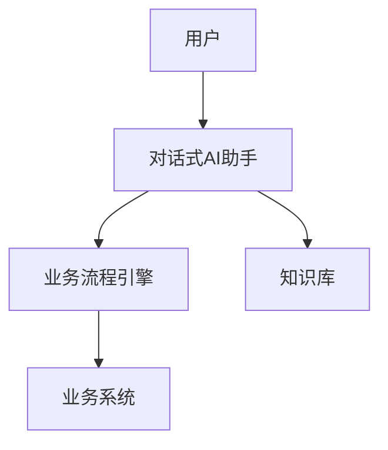
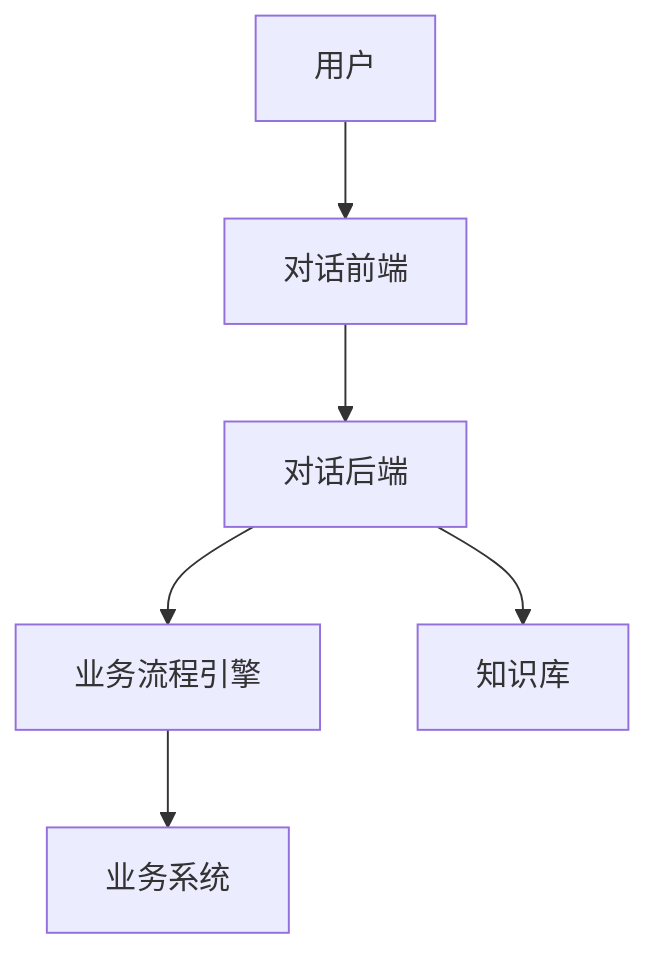

                 


# 构建企业级对话式AI助手：跨部门业务流程自动化

## 关键词：企业级对话式AI助手、跨部门业务流程自动化、自然语言处理、系统架构设计、Python代码实现

## 摘要：  
本文详细探讨了构建企业级对话式AI助手的跨部门业务流程自动化的技术实现。首先介绍了问题背景和核心概念，然后深入讲解了对话式AI助手的算法原理和数学模型，接着分析了系统的架构设计，最后通过实际项目案例展示了如何实现跨部门业务流程自动化。本文旨在为企业技术团队提供从理论到实践的全面指导，帮助他们构建高效、智能的企业级对话式AI助手。

---

## 第一部分: 背景介绍

### 第1章: 问题背景与描述

#### 1.1 问题背景
##### 1.1.1 企业级对话式AI助手的定义  
企业级对话式AI助手是一种基于自然语言处理（NLP）技术的智能系统，能够通过对话形式为企业员工和客户提供高效的信息检索、任务处理和决策支持。它通常集成在企业的CRM、ERP或其他业务系统中，作为统一的交互界面。

##### 1.1.2 传统业务流程中的痛点  
传统的业务流程通常依赖于多个分散的系统和人工操作，存在以下问题：  
1. **效率低下**：跨部门协作流程复杂，审批和信息传递耗时。  
2. **信息孤岛**：各部门之间的数据难以共享，导致重复录入和错误。  
3. **用户体验差**：员工和客户需要在多个系统间切换，操作繁琐。  
4. **缺乏智能化**：传统流程缺乏实时反馈和优化能力。  

##### 1.1.3 对话式AI在企业中的价值  
对话式AI助手能够通过自然语言处理技术，将复杂的业务流程简化为自然的对话交互，显著提升企业效率和用户体验。它能够支持以下场景：  
1. **信息查询**：快速检索企业内部知识库和外部数据。  
2. **任务处理**：自动执行审批、订单处理等业务流程。  
3. **决策支持**：基于历史数据和实时信息提供智能建议。  

##### 1.1.4 边界与外延  
对话式AI助手的边界主要集中在其功能范围和接口设计上：  
- **边界**：专注于提供对话交互和流程自动化，不涉及具体业务系统的底层实现。  
- **外延**：可以通过API与企业现有系统（如CRM、ERP）集成，扩展其功能。  

##### 1.1.5 概念结构与核心要素  
对话式AI助手的核心要素包括：  
1. **自然语言处理引擎**：负责理解和生成自然语言。  
2. **业务流程引擎**：负责定义和执行跨部门流程。  
3. **知识库**：存储企业相关信息和规则。  
4. **用户界面**：提供对话交互的入口（如网页、移动端应用）。  

---

### 第2章: 核心概念与联系

#### 2.1 对话式AI助手的核心概念  
对话式AI助手基于以下技术实现：  
- **自然语言处理（NLP）**：理解用户的输入并生成有意义的回复。  
- **机器学习（ML）**：通过训练数据优化对话模型。  
- **规则引擎**：定义业务流程的逻辑和条件。  

#### 2.2 跨部门业务流程自动化的原理  
跨部门业务流程自动化的核心是将传统的人工流程转化为自动化的数字化流程。这包括：  
1. **流程识别**：识别需要自动化的业务流程。  
2. **流程建模**：使用BPMN（业务流程模型和notation）等工具定义流程。  
3. **流程执行**：通过系统调用API或消息队列实现流程自动化。  

#### 2.3 对话式AI与跨部门业务流程的关系  
对话式AI助手通过自然语言对话触发和监控跨部门业务流程，实现以下功能：  
1. **流程启动**：用户通过对话触发某个业务流程。  
2. **状态查询**：用户可以实时查询流程的执行状态。  
3. **异常处理**：对话式AI助手能够识别流程中的异常并提供解决方案。  

#### 2.4 核心概念对比表  
以下是对话式AI与传统业务流程的对比：  

| 对比维度         | 对话式AI助手                   | 传统业务流程               |
|------------------|--------------------------------|----------------------------|
| 交互方式         | 基于自然语言对话               | 基于表格、表单或系统操作     |
| 响应速度         | 实时响应                       | 需人工或系统处理，耗时较长   |
| 可扩展性         | 支持快速添加新流程             | 扩展复杂，需重新设计流程     |
| 用户体验         | 更直观、便捷                   | 易用性差，用户负担重         |

#### 2.5 实体关系图  
以下是对话式AI助手与跨部门业务流程的实体关系图：  



---

### 第3章: 对话式AI助手的算法原理

#### 3.1 对话式AI的算法框架  
对话式AI助手的算法框架通常包括以下步骤：  

1. **输入处理**：接收用户的自然语言输入。  
2. **意图识别**：通过NLP技术识别用户的意图。  
3. **槽位填充**：提取对话中的关键信息（如时间、地点等）。  
4. **响应生成**：基于意图和槽位信息生成回复。  
5. **输出反馈**：将回复返回给用户，并记录对话历史。  

#### 3.2 跨部门业务流程自动化的算法实现  
跨部门业务流程自动化的算法实现包括以下步骤：  

1. **流程识别**：通过关键词和规则匹配识别需要自动化的流程。  
2. **流程建模**：使用BPMN建模工具定义流程结构。  
3. **流程执行**：通过系统调用API或消息队列执行流程。  
4. **状态监控**：实时监控流程执行状态并记录日志。  

#### 3.3 对话式AI助手的数学模型  
对话式AI助手的数学模型通常基于概率论和优化算法。以下是一个简单的对话模型数学表达式：  

$$ P(y|x) = \frac{P(x|y)P(y)}{P(x)} $$  

其中，$x$ 表示输入，$y$ 表示输出，$P(y|x)$ 表示在输入 $x$ 下输出 $y$ 的概率。  

---

## 第四部分: 系统分析与架构设计

### 第4章: 系统分析与架构设计

#### 4.1 问题场景介绍  
本文设计的对话式AI助手主要用于企业内部的跨部门协作，例如请假审批、会议安排、订单处理等场景。  

#### 4.2 系统功能设计  
系统功能设计包括以下模块：  

- **用户模块**：管理用户权限和角色。  
- **对话模块**：处理用户输入和生成回复。  
- **流程模块**：定义和执行跨部门流程。  
- **知识库模块**：存储企业知识和规则。  

#### 4.3 系统架构设计  
以下是系统的架构设计图：  



---

## 第五部分: 项目实战

### 第5章: 项目实战

#### 5.1 环境安装  
以下是项目所需的环境和工具：  
- **Python**：3.8+  
- **框架**：Flask（Web框架）、RabbitMQ（消息队列）  
- **工具**：Jieba（中文分词）、spaCy（NLP处理）  

#### 5.2 系统核心代码实现  
以下是对话式AI助手的核心代码实现：  

```python
from flask import Flask, request, jsonify
from jieba import tokenize

app = Flask(__name__)

@app.route('/api/chat', methods=['POST'])
def chat():
    data = request.json
    message = data['message']
    # 分词处理
    tokens = tokenize(message)
    # 意图识别
    intent = '请假申请'  # 简单实现，实际应使用更复杂的模型
    # 槽位填充
    slots = {'name': '张三', 'date': '明天'}
    # 生成回复
    response = f"好的，已为您提交{intent}，请稍等处理。"
    return jsonify({'response': response})

if __name__ == '__main__':
    app.run(debug=True)
```

#### 5.3 案例分析与详细解读  
以请假流程为例，用户与对话式AI助手的交互流程如下：  
1. **用户输入**：我想请假一天。  
2. **意图识别**：请假申请。  
3. **槽位填充**：提取用户姓名和日期。  
4. **流程执行**：调用请假审批流程。  
5. **状态反馈**：通知用户审批结果。  

---

## 第六部分: 总结与展望

### 第6章: 总结与展望

#### 6.1 最佳实践 tips  
- 在设计对话式AI助手时，应优先考虑用户体验，确保对话流程简单直观。  
- 跨部门业务流程的自动化应基于企业现有的系统架构，避免重复造轮子。  

#### 6.2 小结  
本文详细介绍了构建企业级对话式AI助手的跨部门业务流程自动化的技术实现。从背景介绍到项目实战，全面覆盖了核心概念、算法原理和系统设计。  

#### 6.3 注意事项  
- 对话式AI助手的训练数据应多样化，以提高模型的泛化能力。  
- 在实际应用中，需注意数据安全和隐私保护。  

#### 6.4 拓展阅读  
- [《自然语言处理入门》](https://link)  
- [《业务流程管理》](https://link)  

---

## 作者：AI天才研究院/AI Genius Institute & 禅与计算机程序设计艺术 /Zen And The Art of Computer Programming

