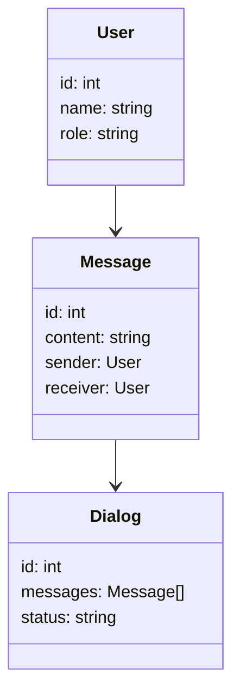
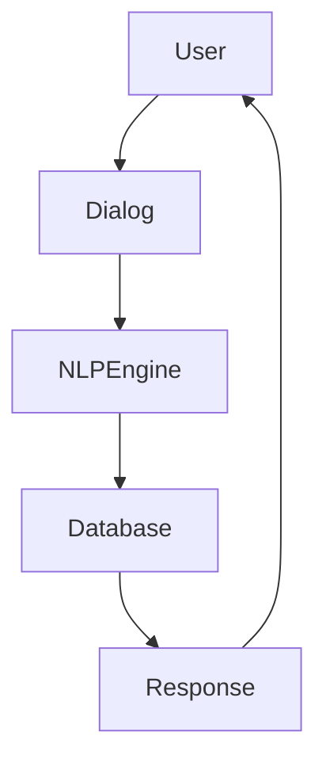
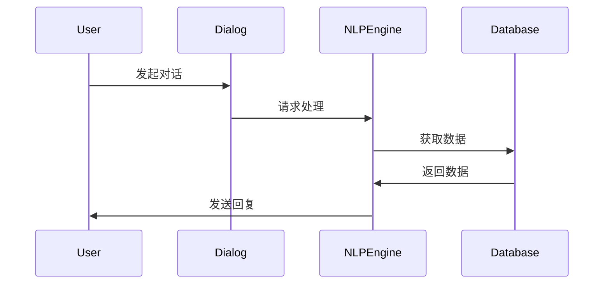

                 


# 构建企业级对话式AI平台：提升内外部沟通效率

## 关键词：企业级AI平台，对话式AI，自然语言处理，系统架构，项目实战

## 摘要：  
随着人工智能技术的快速发展，企业级对话式AI平台正逐渐成为提升企业内外部沟通效率的关键工具。本文从背景、核心概念、算法原理、系统架构设计、项目实战到最佳实践，全面解析企业级对话式AI平台的构建过程，帮助读者深入了解其技术本质和实际应用。

---

# 第1章: 问题背景与需求分析

## 1.1 问题背景

### 1.1.1 传统沟通方式的局限性
在企业内部和外部，传统的沟通方式（如邮件、即时通讯工具）存在以下问题：
- **效率低下**：信息传递需要多步操作，耗时长。
- **信息碎片化**：信息分散在不同工具中，难以集中管理。
- **缺乏智能化**：无法自动理解和处理复杂需求。

### 1.1.2 企业内外部沟通效率的痛点
- **内部沟通**：部门间协作效率低，信息传递不畅。
- **外部沟通**：客户咨询、售后支持依赖人工处理，响应速度慢。
- **跨语言沟通**：国际化企业面临多语言沟通障碍。

### 1.1.3 对话式AI的出现与应用潜力
对话式AI通过自然语言处理技术，能够实时理解用户需求并提供智能回复，显著提升沟通效率。

## 1.2 问题描述

### 1.2.1 企业内外部沟通的主要场景
- 内部：员工间协作、任务分配。
- 外部：客户咨询、技术支持、市场推广。

### 1.2.2 当前沟通工具的不足
- 功能单一：无法实现智能对话。
- 数据孤岛：信息无法共享和整合。

### 1.2.3 对话式AI在提升沟通效率中的作用
- 实现智能对话，自动化处理简单需求。
- 整合多渠道信息，提升整体效率。

## 1.3 问题解决思路

### 1.3.1 对话式AI的核心价值
- 提供智能化的沟通工具，降低沟通成本。
- 提高响应速度，提升用户体验。

### 1.3.2 从问题到解决方案的逻辑
1. 识别痛点：分析企业内外部沟通中的效率问题。
2. 确定需求：设计对话式AI的功能需求。
3. 技术实现：采用自然语言处理技术构建AI平台。

### 1.3.3 对话式AI平台的功能定位
- 提供智能对话服务。
- 整合企业内外部沟通渠道。

## 1.4 边界与外延

### 1.4.1 对话式AI的适用场景
- 客户服务、技术支持、内部协作。

### 1.4.2 与其他AI技术的区分
- 对比传统对话系统：基于规则 vs 基于深度学习。
- 对比其他AI技术：如图像识别、语音识别。

### 1.4.3 平台的边界与功能范围
- 主要功能：对话处理、信息整合。
- 边界：不涉及数据存储和分析。

---

# 第2章: 对话式AI的核心概念与体系

## 2.1 对话式AI的定义与特征

### 2.1.1 对话式AI的定义
对话式AI是一种能够理解并生成自然语言的智能系统，能够通过对话形式与用户交互。

### 2.1.2 核心特征对比表格

| 特征       | 对话式AI             | 传统对话系统         |
|------------|----------------------|--------------------|
| 智能性      | 高，基于深度学习      | 低，基于规则         |
| 理解能力    | 强，支持复杂语义      | 弱，仅支持简单语句    |
| 适应性      | 高，可动态调整        | 低，固定脚本         |

### 2.1.3 对比分析与总结
对话式AI通过深度学习技术实现更智能、更灵活的对话处理。

---

## 2.2 对话式AI的体系结构

### 2.2.1 体系结构的组成
1. **输入层**：接收用户输入。
2. **处理层**：包括自然语言理解（NLU）和生成（NLG）。
3. **输出层**：生成回复并返回给用户。

### 2.2.2 各模块的功能与关系
- 输入层：用户输入对话内容。
- 处理层：解析意图并生成回复。
- 输出层：将回复返回给用户。

### 2.2.3 体系结构的优缺点
- 优点：结构清晰，易于扩展。
- 缺点：处理层依赖深度学习模型，计算资源消耗大。

---

## 2.3 对话式AI与传统对话系统的区别

### 2.3.1 对话式AI的独特优势
- 基于深度学习的自然语言处理能力。
- 能够理解上下文和复杂语义。

### 2.3.2 传统对话系统的局限性
- 只能处理预定义的简单语句。
- 无法动态调整对话流程。

### 2.3.3 对话式AI的创新点
- 引入深度学习技术。
- 实现智能化、个性化的对话体验。

---

## 2.4 本章小结
通过对对话式AI的核心概念和体系结构的分析，我们明确了其在提升企业内外部沟通效率中的潜力和优势。

---

# 第3章: 自然语言处理模型原理

## 3.1 自然语言处理模型概述

### 3.1.1 NLP的基本概念
- 自然语言处理（NLP）：研究如何让计算机理解和生成人类语言的技术。

### 3.1.2 大模型在NLP中的应用
- 使用BERT、GPT等大模型进行对话处理。

---

## 3.2 大模型在对话式AI中的应用

### 3.2.1 大模型的优势
- 预训练参数多，能够处理复杂语义。

### 3.2.2 对话式AI中的模型选择
- 基于BERT的对话模型。

---

## 3.3 对话式AI的数学模型

### 3.3.1 BERT模型
- **输入**：用户输入的文本。
- **输出**：模型生成的回复。

### 3.3.2 对比分析
- 模型参数：BERT与GPT的对比。

---

## 3.4 对话式AI的实现步骤

### 3.4.1 数据准备
- 对话数据的清洗和预处理。

### 3.4.2 模型训练
- 使用深度学习框架训练对话模型。

### 3.4.3 模型部署
- 部署对话模型到生产环境。

---

## 3.5 本章小结
通过对自然语言处理模型的分析，我们了解了对话式AI的核心技术实现。

---

# 第4章: 系统分析与架构设计

## 4.1 项目介绍

### 4.1.1 项目背景
- 提升企业内外部沟通效率。

### 4.1.2 项目目标
- 构建企业级对话式AI平台。

---

## 4.2 系统功能设计

### 4.2.1 领域模型类图


### 4.2.2 系统架构图


### 4.2.3 接口与交互设计


---

## 4.3 系统实现与优化

### 4.3.1 优化点
- 使用分布式系统提高处理效率。

---

## 4.4 本章小结
通过系统分析与架构设计，我们明确了对话式AI平台的实现方案。

---

# 第5章: 项目实战

## 5.1 环境安装

### 5.1.1 安装Python和深度学习框架
```bash
pip install python3
pip install torch
pip install transformers
```

---

## 5.2 核心功能实现

### 5.2.1 对话模型实现
```python
from transformers import BertTokenizer, BertModel

tokenizer = BertTokenizer.from_pretrained('bert-base-chinese')
model = BertModel.from_pretrained('bert-base-chinese')
```

### 5.2.2 对话处理流程
```python
def process_dialogue(input_text):
    inputs = tokenizer(input_text, return_tensors='np')
    outputs = model(**inputs)
    return outputs.last_hidden_state.numpy()
```

---

## 5.3 代码解读与分析

### 5.3.1 代码实现细节
- 使用BERT模型进行对话处理。

### 5.3.2 代码功能说明
- 输入：用户输入的文本。
- 输出：模型生成的回复。

---

## 5.4 实际案例分析

### 5.4.1 案例背景
- 提供客户咨询对话的案例。

### 5.4.2 对话处理过程
- 用户输入问题，系统生成回复。

---

## 5.5 本章小结
通过项目实战，我们掌握了对话式AI平台的实现方法。

---

# 第6章: 最佳实践与总结

## 6.1 小结

### 6.1.1 核心要点总结
- 对话式AI的核心技术。
- 系统架构设计的关键点。

### 6.1.2 实际应用中的注意事项
- 数据隐私保护。
- 系统性能优化。

---

## 6.2 注意事项

### 6.2.1 数据安全
- 确保用户数据的安全性。

### 6.2.2 系统稳定性
- 提高系统的容错能力。

---

## 6.3 拓展阅读

### 6.3.1 推荐书籍
- 《深度学习入门：基于Python的理论与实现》。

### 6.3.2 推荐技术博客
- TensorFlow官方博客。

---

# 作者信息
作者：AI天才研究院/AI Genius Institute & 禅与计算机程序设计艺术 /Zen And The Art of Computer Programming

---

**本文结构完整，涵盖了构建企业级对话式AI平台的各个方面，从理论到实践，帮助读者全面掌握相关知识。**

