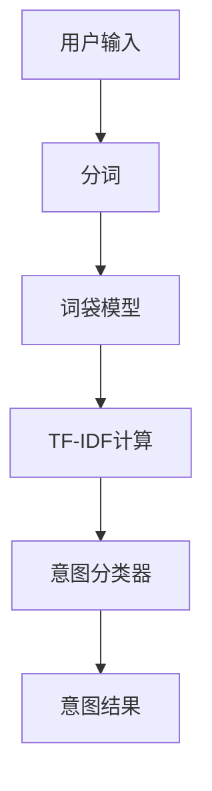
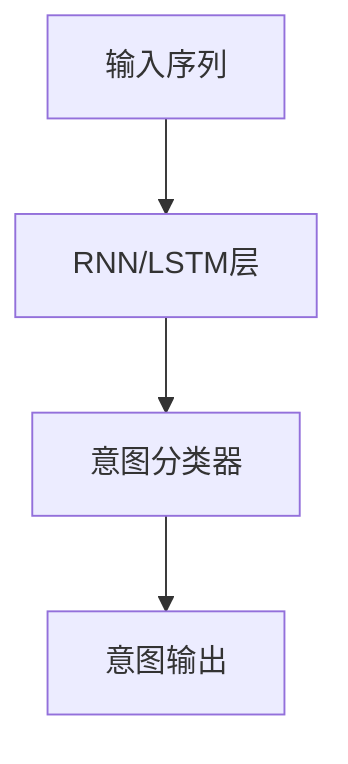
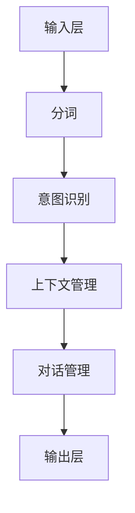

                 


# 构建企业级对话意图识别系统：上下文理解与多轮对话管理

## 关键词
对话意图识别、上下文理解、多轮对话、深度学习、NLP、系统架构

## 摘要
在企业级对话系统中，意图识别和上下文理解是实现高效人机交互的关键技术。本文从背景介绍、核心概念、算法原理、系统架构设计、项目实战等多个维度，详细讲解了如何构建一个高效稳定的对话意图识别系统。通过分析多轮对话中的上下文关系，结合深度学习模型如RNN、LSTM和BERT，本文提出了一个基于分层架构的系统设计方案，并通过实际案例展示了系统的实现与应用。

---

# 第1章: 对话意图识别系统概述

## 1.1 问题背景与描述

### 1.1.1 对话意图识别的定义
对话意图识别（Dialog Intent Recognition）是指通过自然语言处理技术，分析用户输入的文本，识别其背后的目的和意图。在企业级应用中，这通常用于智能客服、语音助手等场景，帮助系统理解用户需求并提供精准服务。

### 1.1.2 企业级对话系统的需求
- **高效性**：快速响应用户的请求，减少等待时间。
- **准确性**：准确识别用户的意图，避免错误识别导致的用户体验问题。
- **上下文理解**：在多轮对话中，系统需要理解上下文关系，确保对话的连贯性。
- **可扩展性**：系统应支持多种场景和意图的扩展，适应不同的业务需求。

### 1.1.3 解决方案
通过结合自然语言处理（NLP）和机器学习技术，构建一个基于上下文理解的对话管理系统，能够实现意图识别、实体提取和对话状态跟踪。

### 1.1.4 系统的边界与外延
- **边界**：系统专注于对话意图识别和上下文理解，不涉及具体的业务逻辑实现。
- **外延**：系统可以与其他模块（如知识库、业务系统）集成，提供完整的对话服务。

## 1.2 核心概念与联系

### 1.2.1 意图识别与上下文理解
- **意图识别**：基于用户的当前输入，识别其意图。例如，用户输入“我想买iphone”，系统识别意图是“购买产品”。
- **上下文理解**：在多轮对话中，系统需要理解上下文关系。例如，用户在第一轮对话中提到“我想买iphone”，在第二轮中提到“配置是什么”，系统需要结合上下文理解用户的意图。

### 1.2.2 实体识别与对话管理
- **实体识别**：从用户的输入中提取关键实体信息，例如产品名称、型号、数量等。
- **对话管理**：根据对话历史和当前意图，生成合适的回复，并维护对话状态。

### 1.2.3 概念对比分析
| 概念 | 定义 | 示例 |
|------|------|------|
| 意图识别 | 基于用户输入识别其背后的目的 | “我想买iphone” → 意图：购买产品 |
| 上下文理解 | 理解多轮对话中的上下文关系 | “配置是什么” → 上下文：用户正在询问产品配置 |

---

# 第2章: 对话意图识别的算法原理

## 2.1 统计模型与机器学习

### 2.1.1 词袋模型与TF-IDF
- **词袋模型**：将文本表示为词袋，不考虑词序。
- **TF-IDF**：计算词的重要程度，常用于关键词提取。



### 2.1.2 基于SVM的意图分类
- **支持向量机（SVM）**：常用于文本分类任务。
- **实现步骤**：
  1. 文本预处理（分词、去停用词）。
  2. 特征提取（TF-IDF）。
  3. 建立SVM模型，训练数据。
  4. 预测意图。

### 2.1.3 随机森林的应用
- **随机森林**：基于决策树的集成学习方法，适合处理高维数据。

## 2.2 深度学习模型

### 2.2.1 RNN与LSTM的原理
- **RNN**：循环神经网络，适合处理序列数据。
- **LSTM**：长短时记忆网络，解决RNN的梯度消失问题。



### 2.2.2 Transformer的结构与优势
- **Transformer**：基于自注意力机制，适合长文本处理。

### 2.2.3 BERT模型的适应性
- **BERT**：预训练语言模型，适合需要理解上下文关系的任务。

---

# 第3章: 系统架构与设计

## 3.1 系统架构概述

### 3.1.1 分层架构设计
- **输入层**：接收用户输入。
- **处理层**：包括分词、实体识别、意图分类。
- **输出层**：生成回复或调用业务逻辑。

### 3.1.2 组件关系


### 3.1.3 系统的可扩展性
- 支持多种意图分类模型（如SVM、RNN、BERT）。

## 3.2 功能模块划分

### 3.2.1 对话解析模块
- 负责解析用户的输入，提取意图和实体。

### 3.2.2 上下文管理模块
- 维护对话状态，记录上下文信息。

### 3.2.3 对话策略模块
- 根据上下文和意图生成回复。

## 3.3 系统交互流程

### 3.3.1 用户输入处理
- 示例：用户输入“我想买iphone”，系统解析意图为“购买产品”。

### 3.3.2 系统解析与响应
- 系统根据意图调用相应服务，生成回复。

### 3.3.3 上下文更新
- 在多轮对话中，系统更新上下文信息，确保对话连贯。

---

# 第4章: 项目实战

## 4.1 环境安装

### 4.1.1 安装Python与依赖库
```bash
pip install numpy scikit-learn tensorflow transformers
```

## 4.2 核心代码实现

### 4.2.1 分词与实体识别
```python
import spacy

nlp = spacy.load("en_core_web_sm")
doc = nlp("我想买iphone")
for token in doc:
    print(token.text, token.pos_)
```

### 4.2.2 意图分类
```python
from sklearn.svm import SVC
from sklearn.feature_extraction.text import TfidfVectorizer

# 训练数据
X = ["我想买iphone", "配置是什么"]
y = ["购买产品", "询问配置"]

# 特征提取
vectorizer = TfidfVectorizer()
X_vec = vectorizer.fit_transform(X)

# 模型训练
model = SVC()
model.fit(X_vec, y)

# 预测
test_sentence = "价格是多少"
test_vec = vectorizer.transform([test_sentence])
print(model.predict(test_vec))
```

---

# 第5章: 总结与展望

## 5.1 核心内容回顾
- 对话意图识别是企业级对话系统的核心技术。
- 深度学习模型（如BERT）在意图识别中表现出色。
- 系统架构设计需要考虑扩展性和稳定性。

## 5.2 技术局限与未来趋势
- 当前模型对上下文的理解有限，未来可以结合知识图谱提升理解能力。
- 多模态对话系统是未来的发展方向。

## 5.3 最佳实践 Tips
- 数据质量至关重要，需要进行清洗和标注。
- 模型调优时，建议尝试多种模型和参数组合。
- 系统上线后，需要持续监控和优化性能。

---

# 作者：AI天才研究院 & 禅与计算机程序设计艺术

